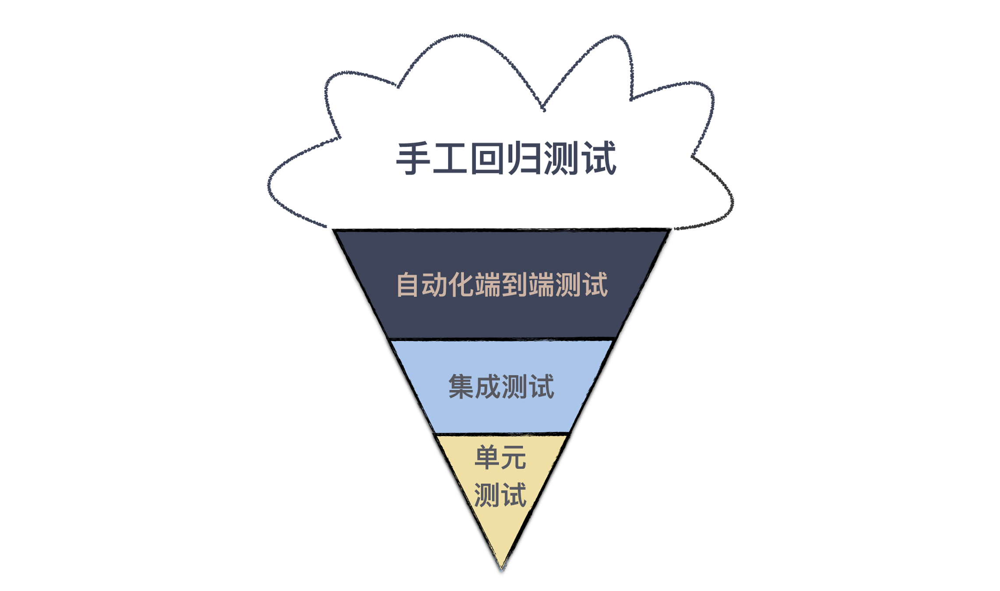
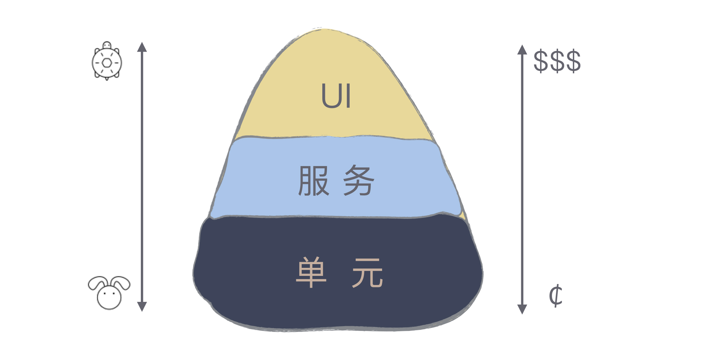

---
date: "2019-06-23"
---  
      
# 12 | 测试也是程序员的事吗？
你好，我是郑晔。

在“任务分解”这个模块，我准备从一个让我真正深刻理解了任务分解的主题开始，这个主题就是“测试”。

这是一个让程序员又爱有恨的主题，爱测试，因为它能让项目的质量有保证；恨测试，因为测试不好写。而实际上，很多人之所以写不好测试，主要是因为他不懂任务分解。

在上一个模块，我们提到了一些最佳实践，但都是从“以终为始”这个角度进行讲解的。这次，我准备换个讲法，用五讲的篇幅，完整地讲一下“开发者测试”，让你和我一起，重新认识这个你可能忽视的主题。

准备好了吗？我们先从让很多人疑惑的话题开始：程序员该写测试吗？

## 谁要做测试？

你是一个程序员，你当然知道为什么要测试，因为是我们开发的软件，我们得尽可能地保证它是对的，毕竟最基本的职业素养是要有的。

但测试工作应该谁来做，这是一个很有趣的话题。很多人凭直觉想到的答案是，测试不就该是测试人员的事吗，这还用问？

**测试人员应该做测试，这是没错的，但是测试只是测试人员的事吗？**

事实上，作为程序员，你多半已经做了很多测试工作。比如，在提交代码之前，你肯定会把代码跑一遍，保证提交的基本功能是正确的，这就是最基本的测试。但通常，你并不把它当成测试，所以，你的直觉里面，测试是测试人员的事。

<!-- [[[read_end]]] -->

但我依然要强调，测试应该是程序员工作的一部分，为什么这么说呢？

我们不妨想想，测试人员能测的是什么？没错，他们只能站在系统外部做功能特性的测试。而一个软件是由它内部诸多模块组成的，测试人员只从外部保障正确性，所能达到的效果是有限的。

打个比方，你做一台机器，每个零部件都不保证正确性，却要让最后的结果正确，这实在是一个可笑的要求，但这却真实地发生在软件开发的过程中。

在软件开发中有一个重要的概念：[软件变更成本，它会随着时间和开发阶段逐步增加。](http://www.agilemodeling.com/essays/costOfChange.htm)也就是说我们要尽可能早地发现问题，修正问题，这样所消耗掉的成本才是最低的。

上一个模块讲“以终为始”，就是在强调尽早发现问题。能从需求上解决的问题，就不要到开发阶段。同样，在开发阶段能解决的问题，就不要留到测试阶段。

你可以想一下，是你在代码中发现错误改代码容易，还是测试了报了 bug，你再定位找问题方便。

更理想的情况是，质量保证是贯穿在软件开发全过程中，从需求开始的每一个环节，都将“测试”纳入考量，每个角色交付自己的工作成果时，都多问一句，你怎么保证交付物的质量。

需求人员要确定验收标准，开发人员则要交出自己的开发者测试。这是一个来自于精益原则的重要思想：内建质量（Build Quality In）。

**所以，对于每个程序员来说，只有在开发阶段把代码和测试都写好，才有资格说，自己交付的是高质量的代码。**

## 自动化测试

不同于传统测试人员只通过手工的方式进行验证，程序员这个群体做测试有个天然的优势：会写代码，这个优势可以让我们把测试自动化。

早期测试代码，最简单的方式是另外写一个程序入口，我初入职场的时候，也曾经这么做过，毕竟这是一种符合直觉的做法。不过，既然程序员有写测试的需求，如此反复出现的东西，就会有更好的自动化方案。于是开始测试框架出现了。

最早的测试框架起源是 Smalltalk。这是一门早期的面向对象程序设计语言，它有很多拥趸，很多今天流行的编程概念就来自于 Smalltalk，测试框架便是其中之一。

真正让测试框架广泛流行起来，要归功于 Kent Beck 和 Erich Gamma。Kent Beck 是极限编程的创始人，在软件工程领域大名鼎鼎，而 Erich Gamma 则是著名的《设计模式》一书的作者，很多人熟悉的 Visual Studio Code 也有他的重大贡献。

有一次，二人一起从苏黎世飞往亚特兰大参加 OOPLSA（Object-Oriented Programming, Systems, Languages \& Applications）大会，在航班上两个人结对编程写出了JUnit。从这个名字你便不难看出，它的目标是打造一个单元测试框架。

顺便说一下，如果你知道 Kent Beck 是个狂热的 Smalltalk 粉丝，写过 SUnit 测试框架，就不难理解这两个人为什么能在一次航班上就完成这样的力作。

JUnit 之后，测试框架的概念逐渐开始流行起来。如今的“程序世界”，测试框架已经成为行业标配，每个程序设计语言都有自己的测试框架，甚至不止一种，一些语言甚至把它放到了标准库里，行业里也用 XUnit 统称这些测试框架。

**这种测试框架最大的价值，是把自动化测试作为一种最佳实践引入到开发过程中，使得测试动作可以通过标准化的手段固定下来。**

## 测试模型：蛋卷与金字塔

在前面的讨论里，我们把测试分为人工测试和自动化测试。即便我们只关注自动化测试，也可以按照不同的层次进行划分：将测试分成关注最小程序模块的单元测试、将多个模块组合在一起的集成测试，将整个系统组合在一起的系统测试。

有人喜欢把验收测试也放到这个分类里。为了简化讨论，我们暂时忽略验收测试。

随之而来的一个问题是，我们应该写多少不同层次的测试呢？理论上固然是越多越好了，但实际上，做任何事都是有成本的，所以，人们必须有所取舍。根据不同测试的配比，也就有了不同的测试模型。

有一种直觉的做法是，既然越高层的测试覆盖面越广，那就多写高层测试，比如系统测试。

当然，有些情景高层的测试不容易覆盖到的，所以，还要有一些底层的测试，比如单元测试。在这种情况下，底层的测试只是作为高层测试的补充，而主力就是高层测试。这样就会形成下面这样一种测试模型：冰淇淋蛋卷。

听说过冰淇淋蛋卷测试模型的人并不多，它是一种费时费力的模型，要准备高层测试实在是太麻烦了。

之所以要在这里提及它，是因为虽然这个概念很多人没听说过，但是有不少团队的测试实际采用的就是这样一种模型，这也是很多团队觉得测试很麻烦却不明就里的原因。

接下来，要说说另一种测试模型，也是行业里的最佳实践：测试金字塔。

Mike Cohn 在自己的著作[《Succeeding with Agile》](http://book.douban.com/subject/5334585/)提出了测试金字塔，但大多数人都是通过 [Martin Fowler 的文章](http://martinfowler.com/bliki/TestPyramid.html)知道的这个概念。

从图中我们不难看出，它几乎是冰淇淋蛋卷的反转，测试金字塔的重点就是越底层的测试应该写得越多。

想要理解测试金字塔成为行业最佳实践的缘由，我们需要理解不同层次测试的差异。**越是底层的测试，牵扯到相关内容越少，而高层测试则涉及面更广。**

比如单元测试，它的关注点只有一个单元，而没有其它任何东西。所以，只要一个单元写好了，测试就是可以通过的；而集成测试则要把好几个单元组装到一起才能测试，测试通过的前提条件是，所有这些单元都写好了，这个周期就明显比单元测试要长；系统测试则要把整个系统的各个模块都连在一起，各种数据都准备好，才可能通过。

这个模块的主题是“任务分解”，我必须强调一点：**小事反馈周期短，而大事反馈周期长。**小事容易做好，而大事难度则大得多。所以，以这个标准来看，底层的测试才更容易写好。

另外，因为涉及到的模块过多，任何一个模块做了调整，都有可能破坏高层测试，所以，高层测试通常是相对比较脆弱的。

此外，在实际的工作中，有些高层测试会牵扯到外部系统，这样一来，复杂度又在不断地提升。

人们会本能地都会倾向于少做复杂的东西，所以，人们肯定不会倾向于多写高层测试，其结果必然是，高层测试的测试量不会太多，测试覆盖率无论如何都上不来。而且，一旦测试失败，因为牵扯的内容太多，定位起来也是非常麻烦的。

而反过来，将底层测试定义为测试主体，因为牵扯的内容少，更容易写，才有可能让团队得到更多的测试，而且一旦出现问题，也会更容易发现。

**所以，虽然冰淇淋蛋卷更符合直觉，但测试金字塔才是行业的最佳实践。**

## 当测试金字塔遇到持续集成

测试金字塔是一个重要实践的基础，它就是持续集成。当测试数量达到一定规模，测试运行的时间就会很长，我们可能无法在本地环境一次性运行所有测试。一般我们会选择在本地运行所有单元测试和集成测试，而把系统测试放在持续集成服务器上执行。

这个时候，底层测试的数量就成了关键，按照测试金字塔模型，底层测试数量会很多，测试可以覆盖主要的场景；而按照冰淇淋蛋卷模型，底层测试的数量则有限。

作为提交代码的防护网，测试数量多寡决定着得到反馈的早晚。所以，金字塔模型与持续集成天然就有着很好的配合。

需要特别注意的是，**不是用单元测试框架写的测试就是单元测试。**很多人用单元测试框架写的是集成测试或是系统测试。单元测试框架只是一个自动化测试的工具而已，并不是用来定义测试类型的。

在实际工作中，区分不同测试有很多种做法，比如，将不同的测试放到不同的目录下，或是给不同类型的测试一个统一的命名规范。

区分不同类型测试主要目的，主要是在不同的场景下，运行不同类型的测试。就像前面提到的做法是，在本地运行单元测试和集成测试，在持续集成服务器上运行系统测试。

## 总结时刻

测试是软件开发重要的组成部分，测试应该是软件开发团队中所有人的事，而不仅仅是测试人员的事。因为软件变更成本会随着时间和开发阶段逐步增加，能在早期解决的问题，就不要将它延后至下一个阶段。

在测试问题上，程序员有着天生的优势，会写代码，于是，程序员拥有了一个突出的强项，自动化测试。写测试应该是程序员工作完成的重要组成部分。

随着人们对于测试理解的加深，各种各样的测试都出现了，也开始有了测试的分类：单元测试、集成测试、系统测试等等。越在底层测试，成本越低，执行越快；越在高层测试，成本越高，执行越慢。

人的时间和精力是有限的，所以，人们开始思考不同的测试如何组合。在这个方面的最佳实践称之为测试金字塔，它强调的重点是，越底层的测试应该写得越多。只有按照测试金字塔的方式写测试，持续集成才能更好地发挥作用。

如果今天的内容你只能记住一件事，那请记住：**多写单元测试。**

最后，我想请你分享一下，你的团队在写测试上遇到哪些困难呢？欢迎在留言区写下你的想法。

感谢阅读，如果你觉得这篇文章对你有帮助的话，也欢迎把它分享给你的朋友。