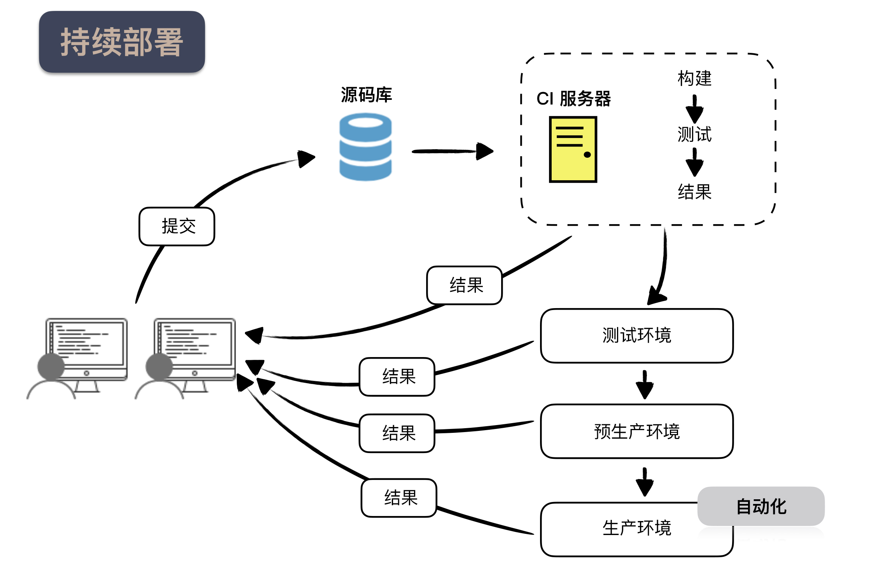
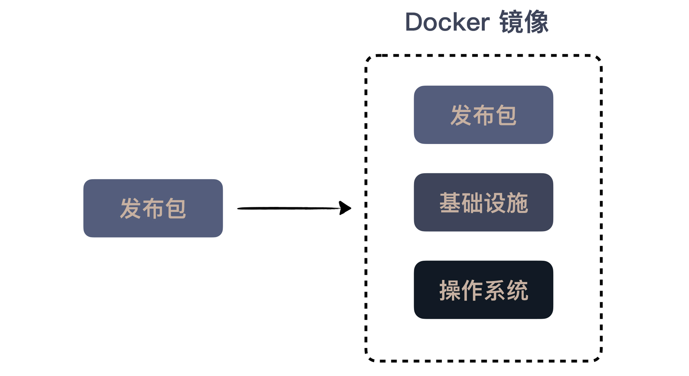

---
date: "2019-06-23"
---  
      
# 32 | 持续交付：有持续集成就够了吗？
你好，我是郑晔。

在前面两讲，我给你讲了开发过程的自动化，将我们的程序打成发布包；然后讲了部署过程的自动化，通过各种工具将发布包部署起来。

有了这些基础，我们就可以考虑在每次开发完之后，将程序打包部署到环境中。开发完就自动打包，然后自动部署，听起来很像持续集成是不是？

关于持续集成，我在专栏里已经讲过两次，分别讨论了“[为什么要做持续集成](http://time.geekbang.org/column/article/75977)”和“[怎么做好持续集成](http://time.geekbang.org/column/article/83461)”。但持续集成的讨论只停留在开发环节。

有了前面两讲的准备，我们就可以把这个过程再进一步延伸。聪明的你或许已经听出来了，这次我要讲的主题是持续交付。

## 持续交付

让持续交付这个概念广为人知的是一本书，Jez Humble 和 Dave Farley 的《[持续交付](http://book.douban.com/subject/6862062/)》（Continuous Delivery）。

前面讲持续集成的发展历史时，我提到了 CruiseControl，它是持续集成服务器的鼻祖。因为持续集成的不断发展，2007年，我的老东家 ThoughtWorks 公司有意以 CruiseControl 为基础，提供企业级服务，于是成立了一个团队，打造一个更好的持续集成服务器，Jez Humble 就是在这个团队中工作的。

同样在这个团队工作的还有一个人，乔梁，他是《持续交付》这本书的中文版译者，而且在这本书出版近十年后，他自己写了《[持续交付 2.0](http://book.douban.com/subject/30419555/)》，把自己多年来关于持续交付的新理解整理了进去。

<!-- [[[read_end]]] -->

那么，什么叫更好的持续集成服务器呢？当时我的理解很浅薄，只是希望它有更好的界面，更快的构建速度，而 Jez Humble 他们对于这个产品的构想远远超过了我当时的想象，他们将生产环境也纳入了考量。

什么是持续交付？简言之，它就是一种让软件随时处于可以部署到生产环境的能力。从一个打好的发布包到部署到生产环境可用，这中间还差了什么呢？那就是验证发布包，部署到环境中。

验证发布包，你或许会想，这不是测试的事吗？这不是已经在持续集成阶段完成的吗？不尽然。在持续集成阶段验证的包，往往缺少了环境的支持。

因为持续集成的环境往往是单机的，主要强调功能验证，而一些与生产环境相关的测试往往是欠缺的。所以，这里就引出了持续交付中一个需要关注的点：环境。

一般来说，在构建持续交付的基础设施时，会有下面几个不同的环境。

* 持续集成环境，持续集成是持续交付的前提，这个过程主要是执行基本的检查，打出一个可以发布的包。

* 测试环境（Test），这个环境往往是单机的，主要负责功能验证，这里运行的测试基本上都是验收测试级别的，而一般把单元测试和集成测试等执行比较快的测试放到持续集成环境中执行。

* 预生产环境（Staging），这个环境通常与生产环境配置是相同的，比如，负载均衡，集群之类的都要有，只是机器数量上会少一些，主要负责验证部署环境，比如，可以用来发现由多机并发带来的一些问题。

* 生产环境（Production），这就是真实的线上环境了。

你也看出来了，每个环境的作用是有差异的，所以，通常不会将所有的验证放在一起执行，而是要分阶段的去执行，一个阶段不通过，是不能进入下一阶段的，这种按照不同阶段组织构建的方式，称之为构建流水线（Build Pipeline）。

一旦通过了各种验证，就会到构建流水线的最后一个阶段，生产发布。通常来说，生产发布这个过程不是自动化的。我们说，持续交付的关注点在于，让软件具备随时可以发布的能力，但并不等于它要立刻上线，所以，最后这一下，还要由人来决定，到底是不是要上线。

如果把由人决定的是否上线变成自动化的，就成了另外一个实践：持续部署。但通常人们都会比较谨慎，最后这一下还是由人拍板比较稳妥，所以，持续交付是现在的主流。

至此，我们讨论了持续交付的第一个方面，验证发布包。接下来，我们再来看看另外一个重要部分：部署。

## DevOps

早期人们做部署都是自己编写 Shell 脚本完成的，但在上一讲中，我提到的一些工具，比如：Chef、Puppet、Ansible 等等，大幅度地简化了部署脚本的编写。这些工具在业界的兴起与一个概念息息相关：DevOps。

DevOps 是一种软件交付的理念和方法，目的是增强软件的可靠性。从名字便不难发现，DevOps 是将开发（Development）和运维（Operations）组合在了一起。

在传统的 IT 公司中，开发和运维往往是井水不犯河水的两个职位，甚至是两个不同的部门，由此带来了很多问题，比如，开发人员修改了配置，但没有通知运维，造成了新代码不能运行。

DevOps 提倡的就是将二者融合起来，打破壁垒。2009年，Flickr 做了一个分享《[每天部署10次](http://www.slideshare.net/jallspaw/10-deploys-per-day-dev-and-ops-cooperation-at-flickr)》，整个行业受到了极大的冲击，从此 DevOps 运动风起云涌。DevOps 给这个行业带来的理念冲击是很大的，想要做好 DevOps，需要在文化、流程和工具等诸多方面不断改善。

但对我们程序员的日常工作来说，最直接的影响是体现在各种工具上。Chef、Puppet、Ansible 这些工具基本上都是在那之后，兴起或广为人知的。

在上一讲中，我给你讲了这些配置管理工具在运维体系中的角色，它们相当于提供了一个框架。但对于行业来说，这些工具给行业带来了部署的规范。

从前写 Shell 的方式，那就是各村有各村的高招。你在 A 公司学会的东西，到 B 公司是没法用的，甚至在很多人的印象中，部署这件事就应该属于某个特定的场景，换台机器脚本都要重新写过。这种形势就如同 Spring 出现之前，几乎所有的公司都在写自己的框架一样。

Spring 的出现打破这一切，让你的 Java 技能从归属于一个公司变成了行业通用。同样，运维体系中这些配置工具也起到了这样的作用。它们甚至带来了一个新的理念：基础设施即代码（Infrastructure as code），将计算机的管理与配置变成了代码。

一旦成了代码，就可以到处运行，可以版本管理，那种强烈依赖于“英雄”的机器配置工作终于可以平民化了。这在从前是想都不敢想的事。

这些工具采用的都是声明式接口，从 Shell 那种描述怎么做，到描述做什么，抽象程度上了一个台阶，让开发者或系统管理员从琐碎的细节中脱身，把更多的注意力用于思考应该把机器配置成什么样子。

如果这些配置管理工具还需要有一台具体的机器去部署，放在持续交付中，也只能扮演一个部署环境的次要角色，那 Docker 的出现则彻底地改变最终交付物。

我在上一讲说过，Docker 相当于是一台机器。Docker 非常好的一点是，它是一台可以用代码描述的机器，在 Docker 配置文件中描述的就是我们预期中那台机器的样子，然后，生成镜像，部署到具体的机器上。

既然是要描述机器的样子，我们就可以在 Docker 的配置文件中使用前面提到的配置工具，如此一来，我们的配置工作就简单了。那既然我们在讨论持续交付，还可以通过配置工具将我们的发布包也部署到最终的镜像中。这样一来，最终生成的镜像就是包含了我们自己应用的镜像。

你或许已经知道我要说什么了，结合着这些工具，我们的生成产物就由一个发布包变成了一个 Docker 镜像。

Docker 在开发中扮演的角色，是一个构建在我们应用与具体机器之间的中间层。对应用而言，它就是机器，但对机器而言，它只是一个可以部署的镜像，统一了各种应用千奇百怪的部署差异，让部署本身变得更简单了。

到这里，我给你介绍了持续交付中最基础的东西，让你有了一个基本的框架理解持续交付。当然，如果你关注这个领域，就会发现，它早已超出了一个实践的层面，有更多组织、文化的内容。

Jez Humble 写《持续交付》时就已经想到如此完整的一个体系，受限于当时的环境，书中介绍的自动化还比较宽泛，不像今天有更加完善的工具支撑。

只可惜，虽然当时他对持续交付的理解已经到达如此高度，他所在的团队也做出了一个颇具先锋气质的持续交付工具，但是受限于产品推广策略，这个工具并没有成为主流，即便后来开源了。（如果你想了解一下[这个工具](http://www.gocd.org)，可以点击链接去查看）

## 总结时刻

总结一下今天的内容。我们延续了前两讲的内容，在准备好发布包和部署的基础设施之后，我们顺着持续集成的思路，将部署过程也加了进来，这就是持续交付。

持续交付，是一种让软件随时处于可以部署到生产环境的能力。让软件具备部署到生产环境的能力，这里面有两个关键点：验证发布包和部署。

验证发布包，不仅是功能上的验证，还包括与环境结合在一起的验证。所以，通常会用几个不同的环境验证，每一个环境都是一个单独的阶段，一个阶段不通过，是不能进入下一阶段的，这种按照不同阶段组织构建的方式，称之为构建流水线（Build Pipeline）。

与部署相关的一个重要概念是 DevOps，也就是将开发和运维结合起来。DevOps 包含了很多方面，对程序员最直接的影响是各种工具的发展，这些工具推动着另一个理念的发展：基础设施即代码（Infrastructure as code） 。有赖于这些工具的发展，今天定义交付，就不再是一个发布包，而是一个可以部署的镜像。

如果今天的内容你只能记住一件事，那请记住：**将部署纳入开发的考量。**

最后，我想请你分享一下，你对持续交付的理解是什么样的呢？欢迎在留言区写下你的想法。

感谢阅读，如果你觉得这篇文章对你有帮助的话，也欢迎把它分享给你的朋友。