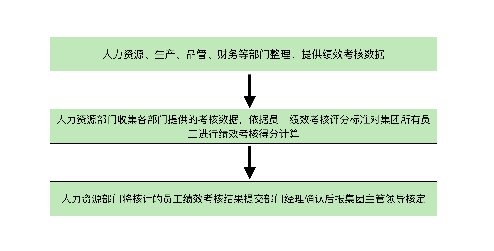
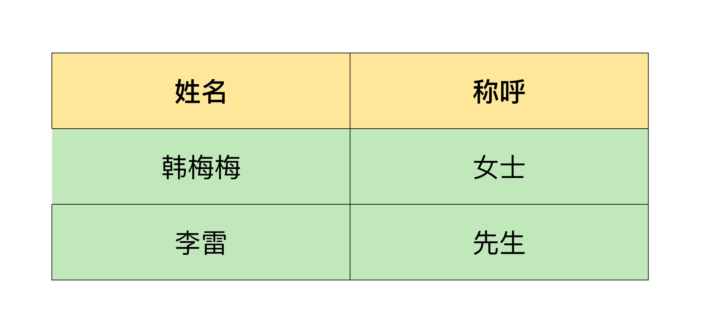
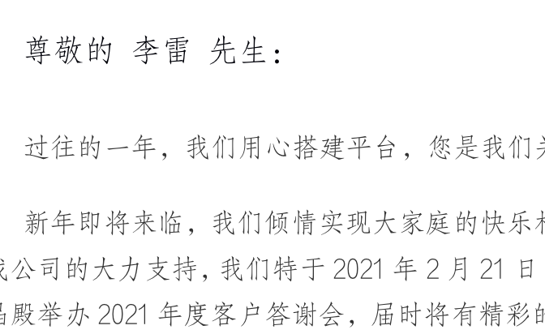

---
date: "2019-06-23"
---  
      
# 02｜善用Python扩展库：如何批量合并多个文档？
你好，我是尹会生。

在日常工作中，我们打交道最多的文件就要数Word和Excel了。我们经常面临这么一种场景：需要将Excel的内容合并到Word中。你可以想一想，完成这个需求，需要手动进行几个步骤的操作呢？很显然，有4步。

* 首先，要手动打开Excel、Word文件；
* 接着，复制一个单元格的文字到Word指定位置；
* 然后，如果有多个单元格，就需要重复复制多次；
* 最后，保存Word文件，并关闭Excel和Word文件。

如果只有两个文件，这几步手动操作一定不成问题，不会耗费太多的时间。但是如果文件特别多，哪怕只有十几个，手动操作就相当耗费时间了，而且一不小心还容易出错。幸运的是，现在我们可以通过Python来实现批量文件合并功能，你只需要执行一个Python程序就能搞定所有文件的合并操作。

所以今天这节课，我们先从比较简单的内容讲起：用Python自动合并两个Word文件。然后再进阶，学习如何合并Word和其他类型的文件。一步一步来，相信你会掌握得既牢固又扎实。

## 手工操作和用Python操作的区别

首先我们要知道，为什么在合并文件的时候用Python更高效。我用一个例子来给你讲解手工操作和用Python操作的区别。比如下面这一段文字：

<!-- [[[read_end]]] -->

> 简易流**程**——集团原则在每年**1****～****5**月、**7****～****11**月生产工作任务较重或**考核时间较紧**的情况下运用。

在Word文件中，不但有文字内容，还有加粗、红色等格式，而且这些特殊的格式和文字内容是混合在一起的。

但如果用Python来读取Word文件，这段文字会被分为纯文字、段落、字体、字号以及表格等更具体的部分，而且每一个部分都对应着Python的变量和函数。

这样一来，你就可以根据自己的需求，只提取某一具体部分的内容。比如说，你看到哪一段文字的字体很好看，就可以直接读取之后套用到新的文字段落就行，非常便捷。

不过，用Python读取文件时，你需要记住很多个Python变量和函数。当然了，针对这一点，你也不用担心，这些变量和函数在Python的Word扩展库[官方文档](https://python-docx.readthedocs.io/en/latest/)可以查看。所以如果你需要某个功能，但是不知道应该用什么变量和函数名称时，可以在官方文档中找到它的名字和描述信息。

总之，用Python读取文件的方式是非常有助于提高工作效率的。所以接下来我们用Python处理Word文件时，就需要通过刚才介绍的变量和函数来替代手动操作。

接下来，我先带你学习怎样用Python合并多个Word文件，然后再讲怎么把Word文件与纯文本、图片和Excel进行合并。

## 如何合并多个Word文件，只保留文字内容？

先从合并两个Word文件说起。假设你现在有两个Word文件，需要进行文件中的文字合并操作。两个文件的内容分别是:

文件一（内容包含字体、字号、颜色等额外信息）：

**1.简易流程**——集团原则在每年**1****～****5**月、**7****～****11**月生产工作任务较重或**考核时间较紧**的情况下运用。

文件二（内容文字出现在表格中）：



我把两个文件的信息总结如下：

* 第一个文件中，字体使用了黑体和宋体字，此外还有红色字体和加粗等格式。现在我需要只提取其中的文字内容，不带任何格式。
* 第二个文件中，文字被放在了一张表格里。现在我需要用Python把表格中的文字提取出来，合并成一个新的文件。

我先把核心代码给你贴出来，然后再给你详细讲解具体的操作方法。

首先，我们可以使用一段Python代码提取Word文件里的内容，然后合并成一个文件。

```
    import docx
    def merge_without_format(docx_files: list):
        '''
        只获取内容进行合并
        '''
        # 遍历每个文件
        for docx_file in sorted(docx_files):
            another_doc = Document(docx_file)
            # 获取每个文件的所有“段落”
            paras = another_doc.paragraphs
            # 获取所有段落的文字内容
            # paras_content = [para.text for para in paras]
            for para in paras:
                # 为新的word文件创建一个新段落
                newpar = doc.add_paragraph('')
                # 将提取的内容写入新的文本段落中
                newpar.add_run(para.text)
    
        # 所有文件合并完成后在指定路径进行保存
        doc.save(Path(word_files_path, 'new.docx'))
            
    
    # 调用函数
    merge_without_format(files)
    

```

在这段代码中你可以看到，我使用了一个Python的扩展库，它叫做python-docx，这也是我想重点给你讲解的一个扩展库。

python-docx是Python专门用来编辑Word文档的库，我在实现Word文档自动化操作的工作中经常会用到它。使用它的好处就是不必自己研究docx文件类型的底层实现细节，你可以像操作.txt文本一样直接打开、修改和保存关闭文件。可以说，python-docx扩展库降低了用户使用Python的复杂度。

我再举个例子展示一下具体的操作过程。例如python-docx库支持函数Document，它实现了Word文件的打开功能，底层也做了很多对Word格式的处理工作，让你可以直接使用paragraphs变量就能读取一整段Word文件。

Document函数格式如下：

```
    Document(docx_file)
    

```

还有，函数save也是python-docx扩展库提供的word文件保存函数。同样的，save函数在底层也做了很多对docx格式兼容的操作。像下面的代码一样，你就可以直接给这个函数传递一个文件路径，然后进行保存。是不是降低了编写代码的难度呢\?

```
    doc.save(Path(word_files_path, 'new.docx'))
    

```

通过我举的例子，你就能更直观地感受到Python扩展库的方便之处了。接下来我们再回到刚才那两个文件的合并，合并之后的结果如下：

```
    1.简易流程——集团原则在每年1-5月、7-11月生产工作任务较重或考核时间较紧的情况下运用。
    人力资源、生产、品管、财务等部门整理、提供绩效考核数据。
    人力资源部门收集各部门提供的考核数据，依据员工绩效考核评分标准对集团所有员工进行绩效考核得分计算。
    人力资源部门将核计的员工绩效考核结果提交部门经理确认后报集团主管领导核定。
    

```

现在你已经掌握了两个Word文件的合并方法了。但如果我想让这段程序适用于三个、四个，甚至更多个Word文件的合并，那该怎么操作呢\?

一个好消息就是，上面的代码我们不需要做任何修改，就可以合并多个Word文件。因为我使用了一个叫做**函数**的功能。**函数有时候也被称作过程、方法**，****它的作用是将那些需要反复使用的代码组合在一起****。

之前我们使用过函数，这些函数是Python自带的，或是扩展库提供的。这些函数我们可以直接拿来使用，使用函数在计算机术语中被称作函数调用。通过函数我们可以实现程序的模块化，多次使用可以多次调用，从而减少代码的重复性。但如果你需要自己编写函数怎么办呢\?

你可以将重复的代码功能写在自己定义的函数中，在需要使用的地方调用就可以了。这种自己编写的函数就被称作自定义函数。自定义函数和Python自带的函数一样，也可以实现减少代码重复性的作用。

关于自定义函数，你需要熟悉它们的相关语法，主要是函数名、函数定义和调用方法。通常编写一个函数要为函数并起一个名字，这个名字叫做函数名。当你需要使用函数的功能时，可以使用函数名加“\(\)”的方式来使用它，而且使用一个函数一般被称作调用函数。

我把函数定义和函数调用的写法单独拿出来给你看下，定义函数的格式是def后面跟着函数名称，调用函数是函数名称后面跟着一个"\(\)" ，这是它的语法格式：

```
    # 定义一个函数
    def 函数名(参数列表):
        函数体
    # 调用一个函数
    函数名(参数)
    

```

知道了自定义函数的语法，接下来我们就可以在程序中使用自定义函数了。

举个简单的例子。像我在合并Word文件的程序中，第2行的merge\_without\_format就是我定义的一个函数，第24行merge\_without\_format\(files\) 就是对函数进行调用，files叫做函数的参数。通过函数参数，可以在调用函数的时候为函数指定要操作的对象。

相信你不难发现，使用函数以后，不但可以提高代码的重复利用率，还能提高代码的可读性。

那这段程序是怎样处理多个文件合并的呢\? 我在调用函数merge\_without\_format时，使用了files变量作为参数，而files变量包含了大量的文件。因为是多个文件合并，所以在函数中我使用了一个小技巧，就是你熟悉的for循环语句，for循环语句能够遍历files变量的值，这样就可以将files指向的全部Word文件逐一进行文件内容的提取，进行两两合并，从而实现任意多个Word文件的合并操作。

通过对多个word合并，我希望你能学会怎么提取Word中的文字内容，如果你需要编写大量重复的代码，可以将它们写成自己定义的函数。

## 怎样合并不同类型的文件？

通过上面的例子，我们实现了Word文件之间的合并。在工作中，我们经常需要处理Word和Txt文件、图片、Excel这些类型合并的情况，又该如何操作呢？接下来，我就一个一个来讲一讲。

### 将纯文本和Word文件合并

如果是为了支持信息丰富，我们Word和Txt合并之后保存到新的Word中，会出现Txt里的字体字号和原有文件不统一的问题，我们可以使用python-docx扩展库为Txt文件中的文字增加格式。

如果合并前Word文件是仿宋字体，而且有下划线和红色字体，我们将Txt合并之后如何进行字体、样式和颜色的统一呢？我们可以使用下面这段代码。

```
    def add_content_mode1(content):
        '''
        增加内容
        '''
        para = doc.add_paragraph().add_run(content)
        # 设置字体格式
        para.font.name = '仿宋'
        # 设置下划线
        para.font.underline = True
        # 设置颜色
        para.font.color.rgb = RGBColor(255,128,128)  
    

```

首先，我定义了一个叫做add\_content\_mode1的函数。考虑到Word合并Txt是否会有多个Txt进行合并操作，所以我使用自定义函数功能。

当你需要对多个Txt进行合并，就调用函数依次对它们进行处理，这样你就不用编写重复的代码了，这也是我在编写代码时进行提效的一个小技巧。

接下来，我们将每个新合并的txt内容作为一个新的段落合并到原有的文字中，这个功能使用python-docx的add\_paragraph函数就可以增加了一个新的段落。

最后，把这一段所有文字设置成和原有的Word统一的字体、下划线和颜色，保证新的段落在格式上的统一。

在具体操作的时候，我还要提醒你，Word文件支持的格式丰富程度远远高于Txt文件，所以当这两种格式丰富程度不一致的文件进行合并时，要么向下兼容，去掉Txt不支持的格式；要么向上兼容，对Txt进行格式再调整。否则容易出现合并之后仍需要手动调整格式的问题，影响工作效率。

### 将图片和Word文件合并

我们再来看一下第2种情况，怎么把图片和Word文件进行合并呢\?

想一下，我们经常见到的图片格式就有.jpg、.png、.gif等，由于这些格式应用范围广，格式没有被商业软件加密，所以python-docx库的add\_picture函数就能实现把图片插入Word的功能。代码如下：

```
    from docx import Document
    from docx import shared
    
    doc = Document()
    # 按英寸设置宽度,添加图片
    doc.add_picture('test.jpg', width=shared.Inches(1)) 
    

```

那有没有被商业保护、不能直接支持的格式呢？比如Pohotshop自带的.ps格式，我们如果将.ps格式插入Word文档，.ps格式不能被add\_picture所支持，就只能以附件的形式添加到Word文件中，作为附件添加的文件无法直接展示图片的内容，和add\_picture相比不够直观。

所以如果不需要进行内容的加密等商业目的的时候，建议使用通用和公开格式，这些格式对编程语言的兼容性更好。

总的来说，python-docx的功能非常强大，除了将文本和图片合并到Word文件中，还可以和第一节课我们学过的xlrd扩展库相配合，将Excel和Word进行合并。

### 将Excel和Word文件合并

为了让你更好地理解如何进行Word和Excel文件的合并，我用一个利用Excel和Word批量制作邀请函的例子来给你讲解。

我在Word中保存了邀请函的标准公文格式，但是其中的被邀请人、性别（先生、女士）以及发出邀请的时间，分别用“\<姓名>”“\<性别>”“\<时间>”替代。邀请函格式如下：

**尊敬的 \<姓名> \<性别>：**

**… 邀请函内容 …**

**\<今天日期>**

我在Excel的每一行中写了被邀请人的姓名、性别信息。格式如下：



现在，我们需要将Excel和Word进行合并操作，为每个被邀请人自动生成一个Word格式的邀请函。

虽然Word中自带的邮件功能可以批量制作邀请函，但是在灵活性还是较差的。比如我要在邀请函制作完成的时候自动添加制作时间等功能，就无法通过Word自带的邮件功能实现。接下来我就用Python来生成邀请函，代码如下：

```
    def generat_invitation():
        '''
        生成邀请函文件
        '''
        doc = Document(invitation)
        # 取出每一段
        for para in doc.paragraphs:
            for key, value in replace_content.items():
                if key in para.text:
                    # 逐个关键字进行替换
                    para.text = para.text.replace(key, value)
    
        file_name = PurePath(invitation_path).with_name(replace_content['<姓名>']).with_suffix('.docx')
        doc.save(file_name)
    

```

对于这个问题，我是这样思考的。如果手动操作，我需要：

* 先将Excel中的每一行中的姓名、性别填入Word文件中；
* 再将当前日期填入到Word文件中；
* 最后再按照姓名另存为一个文件。

但如果使用Python来实现呢？就会非常简单。首先在整个过程中，Word文档是被反复使用到的，所以对Word文档进行修改的这个动作，我会将它写入到循环语句当中。

接着，我需要一个循环语句来处理Excel里的每一行循环，因为我们需要把Excel的每一行读取出来，然后替换“\<姓名>”“\<性别>”。

最后我们要解决的就是替换问题了。python-docx功能非常强大，它自带了替换函数–replace函数，能够将"\<姓名>“”\<性别>"替换成Excel真实的用户和性别。

我再用代码解释一下。对应上面的代码：

* 第7行的for循环实现了遍历每个段落功能，para变量就是表示每个段落的变量。
* 第8行我们将excel提前处理为python的基础类型–字典（链接）， for循环实现了姓名、性别的遍历。
* 第11行实现了内容的替换功能。
* 第12行我将姓名作为文件名称，将.docx作为扩展名指定为新的文件名称，通过第13行的save函数进行了邀请函的保存。

你看，多次读取Word文件的循环、多次按行读取Excel文件的循环、替换的函数都有了，那我们就可以实现自动化生成邀请函的功能了。

最终每张邀请函实现的效果如下图：



如你所见，我们在对不同类型文件进行合并时，要考虑不同的问题：

1.  对于支持格式丰富不同的文件时要考虑格式的兼容性；
2.  对于图片、音乐、视频和Word合并时要考虑是否是受到word支持的通用格式；
3.  对于像Excel格式于Word合并时能实现更复杂的功能，代码的复杂程度也会随之提高，一般需要先分析功能，再进行代码编写。

## 小结

通过上面对Word文件的批量处理，我为你总结了Word和各种类型合并增效的几个通用法则。

* 首先，尽量选择Word兼容的格式,这些格式往往也是python-docx库能直接支持的类型。
* 第二，善于将手工操作转换为Python程序实现。如果无法直接转换为Python程序，可以尝试将手工操作继续细化拆分。
* 第三，反复在程序中出现的代码可以编写为函数功能，函数可以让你的程序更健壮，较短的代码数量也减少了出现Bug的机率。

## 思考题

在最后我也想留一个问题给你思考，如果邀请函的格式从Word文件改为图片，你将会如何去解决呢\?

如果你觉得这节课有用，能解决你的办公效率问题，欢迎你点击“请朋友读”，分享给你的朋友或同事。

编辑小提示：专栏的完整代码位置是https://github.com/wilsonyin123/python\_productivity，可点击链接下载查看。或者通过网盘链接提取后下载，链接是: <https://pan.baidu.com/s/1UvEKDCGnU6yb0a7gHLSE4Q?pwd=5wf1，提取码:> 5wf1。