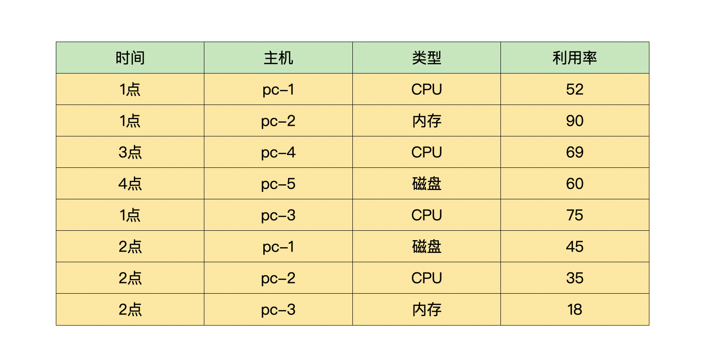
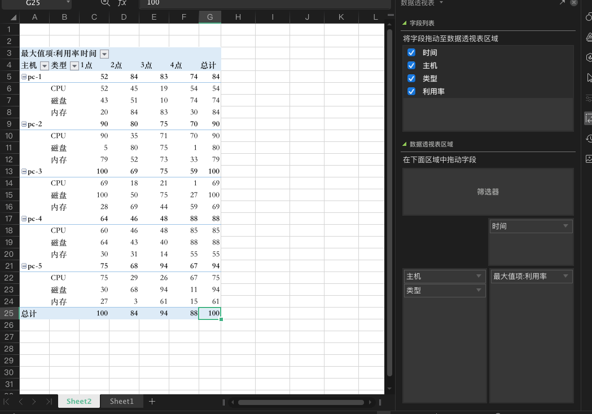
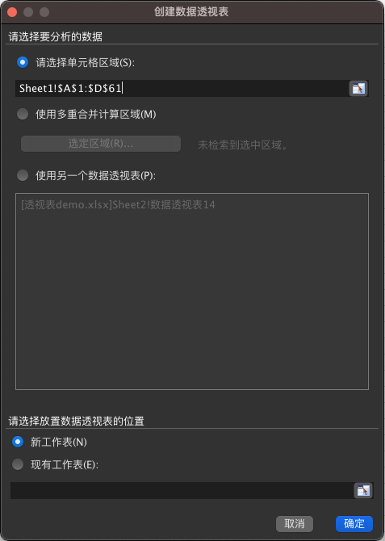
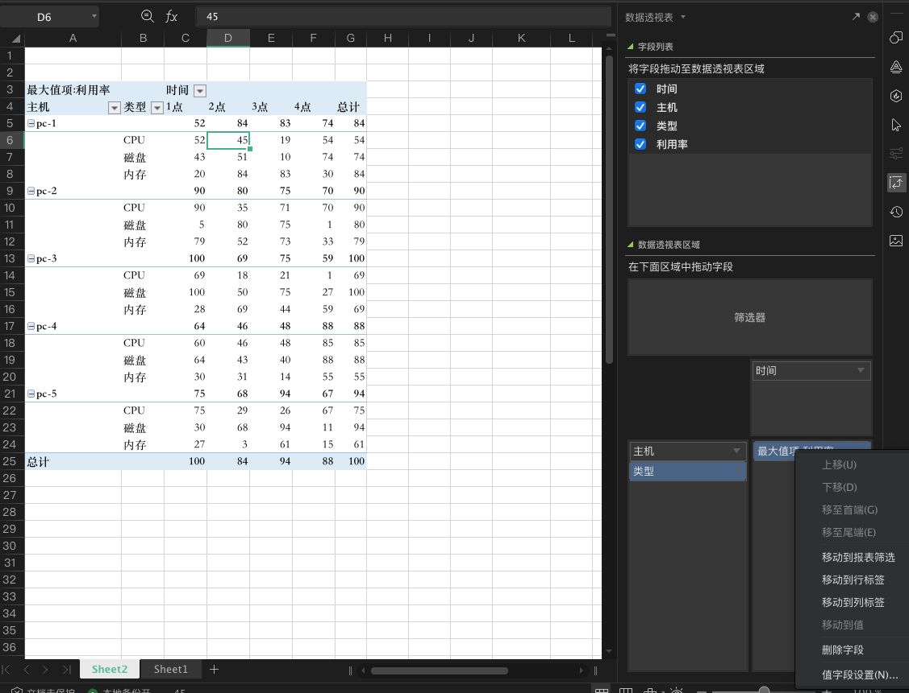
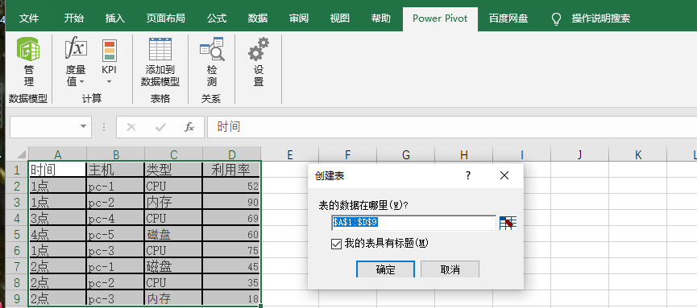
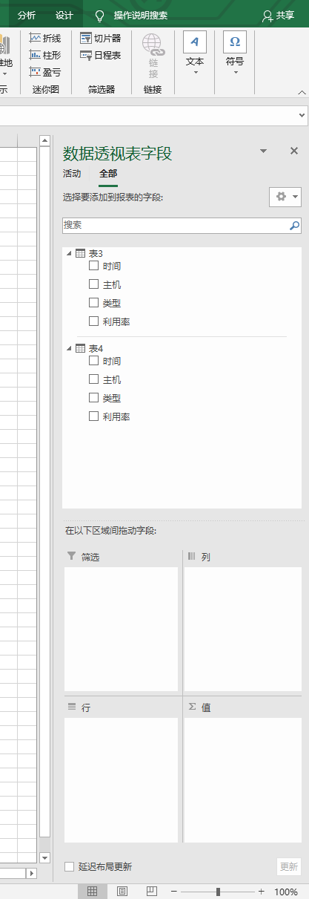

---
date: "2019-06-23"
---  
      
# 23｜怎么用数据透视表更直观地展示汇报成果？
你好， 我是尹会生。

从这节课开始，我们将进入课程的最后一个模块“输出模块”的学习了。在这一模块中，我们要把“控制、存储等模块”的数据，以更加智能化的方式展现到你的面前。比如用图表、图形代替数字进行工作成果汇报；利用压缩包、PDF把工作成果定时发送邮件等。这些都是你在输出模块能够学习到的自动化办公技巧。

通过对这些技巧的掌握，能够为你的工作成果输出带来更高效的处理方式，也能让你把工作成果输出这件事做得更出色。

那今天这节课，我想和你聊一聊怎样把你的工作成果更好地向领导汇报的问题。

你在工作中肯定遇到过这样的情况：精心处理了好几天的数据，需要把数据汇报给你的领导时，往往不知道采用什么样的格式更合适。比如只提交了整理过的原始数据，很容易被领导误认为工作只完成了半成品。而提交了最终结果时，领导又可能会提出合理的疑问，比如如果按月汇总、按某项汇总会得到哪些不同的结果等问题。这个时候，你就不得不再进行一次统计结果汇报。

那么今天这节课，我就要给你介绍一款Excel中的插件，叫做“Power Pivot”，这个插件可以根据需要随时调整数据处理结果。而你可以利用“Power Pivot”生成自己需要的数据模型，还能基于模型生成更灵活的、可随时调整的数据透视表。

<!-- [[[read_end]]] -->

等下次再遇到需要随时调整数据汇总结果的时候，你就可以直接拖拽想要的列，按月、按年、或按照任意你想要的字段进行数据聚合了。

不过在讲解之前，考虑到你可能初次使用数据透视表，我想先为你介绍一下如何将数据转换为数据透视表的操作步骤，这样你才能更好的理解数据透视表展示的表格和数据之间的对应关系。在掌握了数据透视表的操作基础之上，我再教你怎样使用“Power Pivot”插件来生成支持多表和自定义排序的数据透视表。

## 利用数据透视表进行灵活的数据分析

数据透视表能用来做什么呢？一句话来描述它，数据透视表是一种能够随意对数据明细表进行分类汇总，并能随时调整汇总结果的交互式报表。

可能这样描述它，你仍然觉得不够直观，还不能对数据透视表的作用有具体的感知。那么我就用一个Excel文件，来给你演示一下怎么把数据表生成数据透视表，并进行数据的统计和分析。

为了让你对数据透视表有个直观的印象，我先把原始的数据表和制作成透视表的表格一起提供给你，原始的数据表记录了5台计算机硬件负载情况的明细数据，透视表按照每台计算机每种硬件在每小时的最大利用率进行展示。两张表格内容如下：

同时，我也把生成数据透视表后的截图，给你放在下方，供你参考：

数据表中包含了1点-4点，一共5台计算机的CPU、内存、磁盘利用率，如果把数据交给你，你能从中分析出哪些有趣的结果呢？

那么我在这里用数据透视表提供两种将数据组合起来有意义的结果，它们是每台电脑每小时各种资源利用率的最大值，以及每台电脑每天资源利用率的平均值。

当然你还能用数据组合出更多有用且有趣的结果。那接下来我们就看看怎样把明细数据转换为数据透视表、怎样组合行和列，才能得到我刚才提到的两个有意义的结果。

### 使用数据透视表实现数据统计

使用Excel的数据透视表来实现数据统计，有三个简单的步骤，分别是数据预处理、生成透视表和调整透视表结果。让我们逐个来学习一下它们吧！

**首先是数据预处理**，它是输出数据的基础。数据预处理的目标就是把每一类数据放在单独的一列，因为数据透视表只能支持这种格式的数据，这样才能输出有意义的透视结果。另外，你可以使用第13讲的“Power Query”对表格进行调整，也可以使用咱们学习过的Python对Excel的数据内容进行调整。

我给你举一个调整好格式的例子，帮你理解数据透视表能支持的数据明细的格式。比如刚才的计算机利用率的表格，假设“pc-1”这台计算机的利用率明细表中包含“CPU”、“磁盘”和“内存”的利用率数据，如果你需要使用数据透视表，则必须为它建立“类型和利用率”两个列，并把“类型和利用率”作为表头。

与此同时，在类型列中把“CPU、内存、磁盘”作为数据，在利用率中分别写入每种类型不同时间各自对应的利用率，而不能把“CPU、内存、磁盘”作为三列，把利用率作为每一列的数据。

如果你还是无法理解需要把数据处理成什么样的格式，才能让数据透视表正常工作，那我再给你提供一个既简便又不会出错的方法：把第一列指定为时间，而其他的列，每一列存放一个类型的数据。把需要透视的数据，按照时间递增依次填入到Excel中。

这种数据有一个专有的名称，叫做**时序数据**。数据预处理完成后，如果你的透视表不需要时间字段，可以将时间这一列的数据再删掉。

**接下来是生成透视表**。数据准备好之后，下一步就是在新的工作表中插入数据透视表了。插入数据透视表的命令在“插入”菜单栏的“表格”命令组，你只要找到“数据透视表”按钮，点击后就会打开创建数据透视表的菜单了。

在这一步骤，有两个选项你需要格外关注一下。

* 一个是“选择要分析的数据”选项，Excel会自动为你选择当前表中的所有数据，如果数据表中的数据都是你要分析的内容，那你可以不做修改。如果你只希望将表格部分数据制作成数据透视表，可以根据自己的需要选取数据明细表中的具体数据范围。
* 另一个是“请选择放置数据透视表的位置”选项，我们可以把透视表放在“新工作表”中。可以保持原始数据不被破坏外，便于你再次利用原始数据做其他的数据处理。

这两个选项一般保持默认即可。同时，我也把创建透视表的截图放在下方，供你参考。

**最后是调整透视表结果**。创建好默认的数据透视表之后，你会发现它的内容是空的，这时只需要把“报表的字段”**拖动到透视表区域**就行了。同样的，我先给你看一下截图，帮你更直观地感知数据透视表的操作。

在截图的左侧是透视表的结果，而右侧就是透视表的控制区域，你需要根据自己的分析需求，把字段拖入到右下角的“透视表区域”，包括“行、列、值”三个方框。例如我希望得到每台电脑的CPU、内存、磁盘在每小时和每天最大利用率，就可以把“主机、类型”字段拖入“列”，把“时间”字段拖入“行”，把“利用率”字段拖入“值”。

此外，你还要注意，“值”中的字段默认计算方式是“求和”，如果你像我一样，在这里需要最大值，就可以用鼠标点击“值字段设置”，把“求和”改为最大值即可。当然，你也可以根据自己的需求，设置为其他的。

这就是利用数据透视表进行数据统计的完整做法。你看，是不是很简单。总结来说，你可以利用数据透视表自由组合数据，得到你想要的统计结果，它的结果也会实时显示在左侧的Excel表中。而且它的最大优势就是你可以随时调整结果，当你需要结果能够行列互换时，直接拖动“透视表区域”的字段就能实现新的数据透视表了。它能解决你工作中大部分常用的数据分析和展示场景。

不过当你遇到数据在多张数据表中，或者数据量更大（超过百万行）时，你就需要使用“Power Pivot”插件来扩展数据透视表，从而实现多表的数据统计了。

## 使用Power Pivot插件扩展数据透视表，实现多表统计

数据透视表的英文叫做“Pivot Table”，把它和“Power Pivot”的名字进行对比，相信你就看得出来，“Power Pivot”插件是数据透视表的增强版本。为了方便你的阅读，在接下来的讲述中，我把它简写为“PP”。

“PP”插件主要扩展了数据透视表在处理数据的维度、数据的容量限制和自定义汇总的公式这三方面的功能。在一般的办公场景下，默认汇总的公式是能够满足日常需求的，因此我要重点给你讲一下“PP”在维度和容量方面能够支持哪些特性。

* 在维度上，它在单张数据表的维度上增加了数据表维度，即：能支持多张表格进行数据透视。
* 容量上，从默认的100万行数据透视表的默认大小，扩展到能够支持上亿行的数据。

那么接下来，我就带你看看怎样使用“PP”来加载多张表的数据，来实现扩展的数据透视功能。

### 使用PowerPivot加载多张数据表

加载多张表需要使用“PP”插件，因此我们需要在生成数据透视表之前，先打开“PP”插件的窗口，再把多张表加载到“PP”插件中，最后再生成由“PP”插件制作的数据透视表。

**首先，我们先看看怎么打开“PP”插件。**“PP”在Office2009以后，已经成为Excel的默认插件，在Office最新的Office 365版本中，更是作为独立的菜单栏使用，因此你可以在菜单栏找到“PP”插件的选项卡。

为了演示“PP”对多张数据表的操作，我把当前的数据表再复制一份出来，形成两张一样的数据表，这样就可以测试它的多表加载功能了。

“PP”加载多张表的方式是使用“添加到数据模型”按钮。点击按钮后会弹出“创建表”窗口。这个窗口可以选择两张表中的其中一张，先作为数据模型。如图所示：

图片中“创建表”窗口会默认把当前表全部选中，点击“确定”后，会弹出“PP”的工作窗口。在这一窗口下，你可以对数据进行筛选和处理。

**接下来我再导入另一个工作表****。****导入更多表的操作方法和导入当前工作表是相同的。**这样，在“PP”工作窗口的左下角，就会出现两张要进行数据透视的表格。需要说明的是，“PP”还能支持从其他数据源导入数据，例如可以从数据库或“Access”导入数据，和Excel中的数据一起进行数据统计。

**最后，生成由“PP”制作的数据透视表。你在“PP”窗口的任意一张表点击“数据透视表”按钮之后**，就可以创建新的数据透视表了。这时你会发现，数据透视表字段的右上方出现了两张表，你可以把这两张表按照需求拖入到右下方的行、列和值，从而实现多表的数据统计。我把截图放在下方供你参考。

通过使用“PP”，你可以把多个数据源作为数据透视表的源数据，进行数据的混合输出。而且它没有Excel默认的只能处理10万条数据的限制，能够让你在工作中对较大的数据模型进行处理。

以上就是如何使用“PP”扩展默认的数据透视表，实现多表数据透视以及更大容量的数据透视表插件。

另外，我也为你推荐一款Python中能够实现数据透视表的库，叫做“Pandas”（也叫“潘大师”），它也有着和Excel数据透视表功能相同、原理相同的函数“pivot\_table\(\)”函数。但是“pivot\_table\(\)”函数是通过参数“index、column、values、aggfunc”四个参数来指定行、列、数据和数据处理函数，所以你只能看到结果，无法直观看到中间过程。

Pandas更适用于你已经掌握数据透视表的原理，并根据参数能在头脑中形成数据透视表的基本样式后，通过编程实现数据透视表，因为Pandas比Excel更复杂，因此Pandas更适用于长期且多次将数据明细处理为数据透视表的场景使用，Excel更适合数据短期使用，形成的透视表也无法以同样的模式应用到另一份数据的场景。相较于办公自动化的场景，Excel比Pandas更适用于数据的快速、灵活输出工作。

## 小结

最后，让我来为你总结一下今天的主要内容。今天这一讲我主要围绕着怎么灵活输出统计结果的问题，为你讲解了Excel中的数据透视表，以及它的增强插件“Power Pivot”。

通过数据透视表展示你的工作结果，既能实时修改，又能实时展示。虽然它操作简单，但是功能还是非常强大的。像是你对工作中，自动化处理的大量数据结果，如果采用邮件的附件形式发送给领导和同事的话，那么数据透视表就是直观的。而且，当面对工作需求变化快的情况，使用数据透视表还能够帮你快速改变数据统计逻辑，快速响应新的工作统计需求。

## 思考题

最后，我再来为你留一道思考题，如果你需要使用数据透视表分析一个学校中的10个班级的学生平均成绩，每个班级学生的成绩包括语文、数学、外语。你要怎么设计Excel表格，才能通过数据透视表进行数据分析呢？

欢迎把你的思考和想法放在留言区，我们一起交流讨论。如果这节课学习的数据透视表对你的工作有帮助，也欢迎你把课程推荐给你的朋友或同事，一起做职场中的效率人。