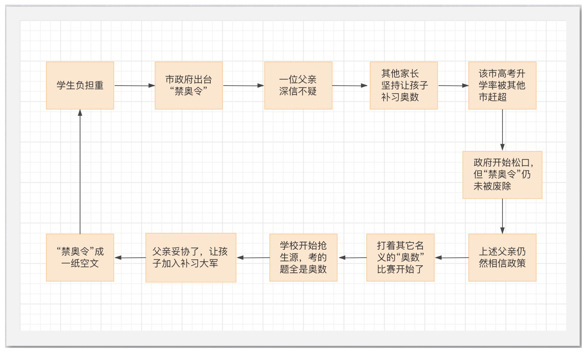

---
date: "2019-06-23"
---  
      
# 07｜生动叙事：如何让读者紧跟你的节奏？
你好，我是涵柏。今天是方法篇的第四讲，我们聊一聊叙事。

著名文学家闻一多提出过诗歌“三美”的主张，即**建筑美、音乐美和绘画美**。我在和其他写作者交流的时候，也会常常提及。我认为文章和诗歌一样，同样有这“三美”。

在我们前面讲如何搭建文章结构的时候，其实它的核心要旨就是“建筑美”。对应一篇文章来说，就是在文章结构上要起承转合，匀称均齐。

今天这节课我们要学习的内容就是“音乐美”。所谓音乐美，是指从听觉方面表现出来的美，虽然一篇文章不像诗歌那样讲究平仄、押韵，但它的节奏还是要体现出一种音乐的美感，读起来流畅而不拗口，而且能吸引着读者往下读。

那文章的这种节奏是怎么来的呢？其实是通过**叙事**来完成的。这个怎么理解呢？请你结合自己曾经有过的写作经验，仔细想想。

我们平日里写作，其实就是把文字和场景系统有效地组织起来。这个组织的过程中，一定是按照一定的顺序，带有目的性地谋篇布局，使用不同的句式，小心翼翼地引导读者的反应。在这个引导的过程中，我们叙事的语气、口吻将决定读者的体验。

**这个叙事的语气、口吻，表现在写作上，就是我们常说的，你的文章要有叙事感。**

所以这节课，我们来聊聊叙事感。具体我会分两个部分来讲，第一个部分是叙事的节奏，第二个部分是叙事的策略。每个部分下面都会有一些技巧和你分享。闲话少叙，我们开始吧。

<!-- [[[read_end]]] -->

## 叙事节奏：速度感、力量感和变化感

你想象一下，此时的你正在听一首旋律，你被这个旋律打动了。那打动你的因素是什么呢？我想一首好听的曲子，它一定有独特的速度感，有快有慢；一定有种力量感，有重有轻；一定还有种变化感，在某个音符处突然变调，打破原有的节奏。

其实，**叙事节奏也是一样的，它也包括速度感、力量感和变化感。**你肯定会觉得抽象，我们先来找一段名篇感受下。恰逢北京金秋，我们就选一段郁达夫先生所作的名篇《故都的秋》，来感受下这种音乐的美感吧。

> 不逢北国之秋，已将近十余年了。在南方每年到了秋天，总要想起陶然亭的芦花，钓鱼台的柳影，西山的虫唱，玉泉的夜月，潭柘寺的钟声。在北平即使不出门去吧，就是在皇城人海之中，租人家一椽破屋来住着，早晨起来，泡一碗浓茶，向院子一坐，你也能看得到很高很高的碧绿的天色，听得到青天下驯鸽的飞声。

我们就以这段为例来分析下，叙事的节奏中包含的速度感、力量感和变化感分别是什么。

### 速度感

所谓速度感，就是作者采用的句式往往是以短句组成，这些短句能够用最少的字数传递相当多的消息，能够特别有效地带领读者通过这些短句来理解复杂的环境。更有意思的是，它可以帮助写作者制造一种意象或者动作的连贯感，让读者感到有很多意象或者动作是同时连续发生的。

比如在上面这段话中，秋天是一个复杂的环境，包含的意象有很多，但怎么表达呢？郁达夫采用了短句，“总要想起陶然亭的芦花，钓鱼台的柳影，西山的虫唱，玉泉的夜月，潭柘寺的钟声”。

那什么时候需要这种速度感呢？就是我们的材料过于静态、平淡的时候，它们往往会放慢我们的写作节奏。这时，你就要提速了。

提速的方式，除了像郁达夫那样，直接通过“什么的什么”这种结构来呈现之外，还有就是用动词，把内容联系起来。

比如，我们设想这样一个场景，你的老家在几十年的发展中，由于经济越来越发达，你看到的景象是：高楼大厦，热闹的人流，门口的脏水和再也看不到的鱼。

你发现没，这些景象都是静态的，那怎么让它变得有节奏起来呢？

你可以这样写：过去四十年，我的老家已变成一副陌生的模样，周边的高楼从无到有，村民进城又返乡，屋前的河水由清变浊，河口的鲢鱼回了又去。

简单的句式，通过几个动词，增添了句子的活力，清楚、快速地把读者带入到场景当中去。这里我再次强调一下：**速度感是通过短句、简单句式来实现的。相反，如果你写的句式过于复杂，它就会拖慢你的表达。**

### 力量感

接着我们来说力量感。你回想一下，从小到大哪种修辞手法常被认为能够给文章带来力量感。没错，排比，我们说使用排比这种修辞手法可以增强气势。从某个程度上来说，排比其实是通过“**重复**”来增强文章的力量感。

在上面那段话中，郁达夫虽然没有使用排比，但他却用“重复”增强了语句的力量感，比如“你也能看得到很高很高的碧绿的天色”。

除此之外，还有另一种增强力量感的方式，就是**调换句子的语序**。你想想，在表达中，为了增强表达的力量感，你会怎样？

我们通常会把关键的词语放在开头或者结尾，而不是让它埋没在句子的中间。这种技巧，在写作中的运用十分普遍，但对初学者而言，却容易被忽略。

我举个例子，你感受下。

“曲折，是对中国刑诉法诞生过程的一个恰当描述。”显然，“曲折”包含着我对刑诉法诞生过程的一个判断，同时也是提醒读者，我下面要写这个曲折的过程了。

如果这个关键词放在中间，力量感瞬间就没有了。你感受下这种句式，“很多人用曲折来描述中国刑诉法诞生的过程”。

那说到这，还有一些注意事项我要告诉你。或许你已经发现了，有时候我们为了增强力量感，使用“重复”这种手法的时候，其实减少了速度感。两者之间是矛盾的，所以我们在使用的时候，有两点需要注意。

第一，如果你确定这段内容确实重要，必须要让读者感受到你要表达的这种情感，**牺牲速度是被允许的**。

我举个例子，比如在一些大城市，由于“控制人口”政策的影响，很多人不得不离开，但是还是有些人在抗争，希望留在这里生活。如果，你想描述这个群体留下来的渴望，那么增强这种力量感就十分必要了。

我会这样写：他们不要政府提供福利，也不要政府给出什么赔偿，更不要政府包车送他们回去。过去，他们做了无数次决定离开这里，现在，也做了同样多次的决定留在这里。他们就想待在这里，因为他们的家早已和城市园区融为一体，他们哪儿也去不了。

这样的表述虽然降低了叙事的速度感，但也显然让你体会到了被描述对象留下来的决心。

第二，要从上下文来考虑，如果它们一直都是快节奏，**在你犹豫是不是要放慢速度、增强力量感的时候，我会倾向于慢下来**，因为它实际上产生了另一种效果，那就是变化感。

### 变化感

接着，我们就讲讲变化感。变化感在书面表达中，最主要体现在两个方面。

**第一，句式上的变化。**这个好理解，就是在写作过程中，注重长短句的结合。你可以再次看郁达夫的这段话，这种句式上的变化体现得很明显。

> 早晨起来，泡一碗浓茶，向院子一坐，你也能看得到很高很高的碧绿的天色，听得到青天下驯鸽的飞声。

**第二，句型上的变化。**不知道你是不是和我有一样的感觉，就是小时候做语文作业的时候，老觉得改句型很无聊，明明是一个意思，非要让我们改成把字句、被字句、倒装句等等，后来我自己从事有关写作的工作后，我才慢慢理解了这种训练的意义。

一般来说，在一篇文章中，我们最常见的句型是“主谓宾”结构，但有时候我们要表达的内容比较复杂或者需要做解释的时候，我会更倾向于使用一些更长、更复杂的句型，有时候也要换成被动或者倒装句，一个主要目的就是增加文章的变化感。

我举个例子，是杨继斌写的[《富士康“八连跳”自杀之谜》](http://www.infzm.com/content/44878)，这篇文章的某个段落是这样写的：

> 死亡掠过的富士康园区，生活仍在精确地继续着。在距离卢新跳楼处不远的大道上，人一样高的车轮轰然碾过。银行、咖啡馆、食堂、商店对大雨中匆匆而过的青年们张着大门。在生产电脑主板的车间里，白色工作帽下一双双眼睛秀丽明澈，他们像往日一样快速在主板上插进电阻、线圈。等到17点30分下班，刷卡机依例给每个人一个纽扣大小的笑脸标记。

为什么我要把这段拿出来分析，你可以仔细想想这段话。

首先，这里的第一句话就是整段内容的总结，它表明死亡阴影笼罩下，生活还要继续。后面的内容就是把这个总结铺开。再看第三句句型，“银行、咖啡馆、食堂、商店对大雨中匆匆而过的青年们张着大门”。按照一般的写法，这句话可能会写成，“青年们匆匆而过开着的银行、咖啡馆、食堂和商店”，但是结合这句话的下一句，也是用人来做主语，这样的话段落就缺乏了句型上的变化，容易让人觉得枯燥。

到这里，有关叙事节奏的技巧，我都分享给你了。接下来，我们进入到第二个部分，叙事策略。

## 叙事策略：多线叙事和环形叙事

想必你也知道，叙事的策略有很多，但**叙事的原则就一个，一定要有递进的关系。**在我的写作生涯中，常会注意到这样一个现象：就是有些文章的段落，它不是递进关系，而是并列关系，也就是说，我随意调换每个段落的顺序，并不会影响读者的阅读。但你仔细想想，这会是一个好的叙事吗？

当然不是，这样的叙事会让你觉得平淡无奇，嚼之无味。所以当你在写一篇文章时，一定要注意这个基本的原则。无论是采用哪种叙事策略，都要记住这一点。

好，现在我们回到叙事策略上。聊到这个，你头脑中能想到的策略肯定有一个，那就是倒置叙事，也就是从结果出发找到事件的原因。这个很好理解，用得也比较多。这里，我就不展开讲了，我给你分享另外两种叙事策略：**多线叙事和环形叙事**。

### 多线叙事

多线叙事其实并不神秘，它主要是**指文章同时拥有几个叙事主线**。这种叙事策略无论在写作，还是在电影中，都比较常见。比如最近一部大火的新剧《沉默的真相》就有3条叙事主线，分别对应三条线上的男主角：支教教师侯贵平、检察官江阳、警官严良，每条线用时间予以区分。不过，需要特别说明的是，三条主线不是指对应3个主题，而是**为同一个主题服务的**。

具体怎么运用呢？我举个例子。2019年和2020年在西昌凉山都发生了森林大火，牺牲了不少民间扑火队员。如果要写这群扑火队员的故事，其实多线叙事就非常有用。毫无疑问，我们的重点是扑火队员这项工作本身的高度危险性。开动你的脑筋，想想能有几条主线？如果是我来写的话，有这么3条线，是必然会用到的。

1.  时间线：从接到火情到奔赴现场，按时间顺序记录行程，扑火队员先会遇到什么困难，后会遇到什么困难，在这条线中，就可以得到展现。

2.  人物线：从这些消防队员中选择一位，通过描述他的性格特征、生活阅历，来分析这群人中为何有人会丧生。这条线不一定非要贯穿全文，只是作为一个迷你人物特写占据几个段落即可。

3.  日常生活线：前两条线都聚集在出现火情后的情况，但在没有遭遇火灾的时候，他们平常的训练是怎样的，是否专业等等。

我为什么会选择这3条线呢？因为我的主题就是围绕着森林扑火的危险性和死亡情况，以及扑火工作的规则和制度，来组织材料。

### 环形叙事

接着我们说下环形叙事。顾名思义，**环形叙事属于非线性叙事**。也就是一个故事开始于结尾，结束于开端的故事。像电影《恐怖的邮轮》就属于环形叙事的上佳之作。

在写作中，你也可以使用这种叙事策略。它常常用于那种，**事件或者人物难以逃脱宿命的题材**。比如，某人想要突破现有的状态，但总有个制度或者环境围着你，让你跳不出去，回到原点。

我们还是举个例子来说明下。请你设想这样一个场景：过去，我们参加奥数比赛获了奖可以加分，所以各种补习班特别多。政府为了减轻学生负担，很多地方都出台了“禁奥令”，禁止学校把“小升初”与奥数挂钩。但事实上，各学校为了保住现在的位置，一定会抢好的生源，所以这些“禁奥令”都成了一纸空文。

这个时候，如果你找到了一个好的样本。比如某位父亲对“禁奥令”深信不疑，在别的孩子都在利用暑假疯狂补课的时候，他就不会让自己的孩子上奥数课。但现实不断挑战他的观念，最终也不得不妥协。

这样的样本故事就适合环形叙事：

以上这个解析的过程就像一个循环一样，似乎什么都变了，但最终什么都没变。

## 总结

学会叙事是写作的基本能力。一般来说，我们比较注重这样两个方面。

一是叙事的节奏，它包含速度感、力量感和变化感，我们可以通过变换句式、调整句型，实现叙事的音乐美。

二是叙事的策略，策略有很多种，但原则只有一条，就是叙事必须要有递进的关系。这节课我为你介绍了两种常见的策略，一是多线叙事，它的应用很广泛，关键是要围绕主题确定主线；二是环形叙事，它比较适合那种，事件或者人物难以逃脱宿命的题材，生活中也很常见。

这节课还是有些难度的，希望你能保持练习，去加深对这些技巧的印象，从而熟练使用。

## 作业

今年“国庆档”，电影《姜子牙》，这部被寄予厚望的“封神宇宙”第二部动画，上映后口碑两极分化。请你试着分析这部电影的叙事策略，并写出它的叙事策略。

对于上述电影不太熟悉的同学，也可以选择别的电影进行分析，总结叙事策略。

期待你的分享！如果今天的内容让你有所收获，不妨邀请你的朋友一起加入练习吧。