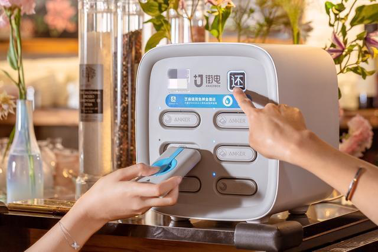
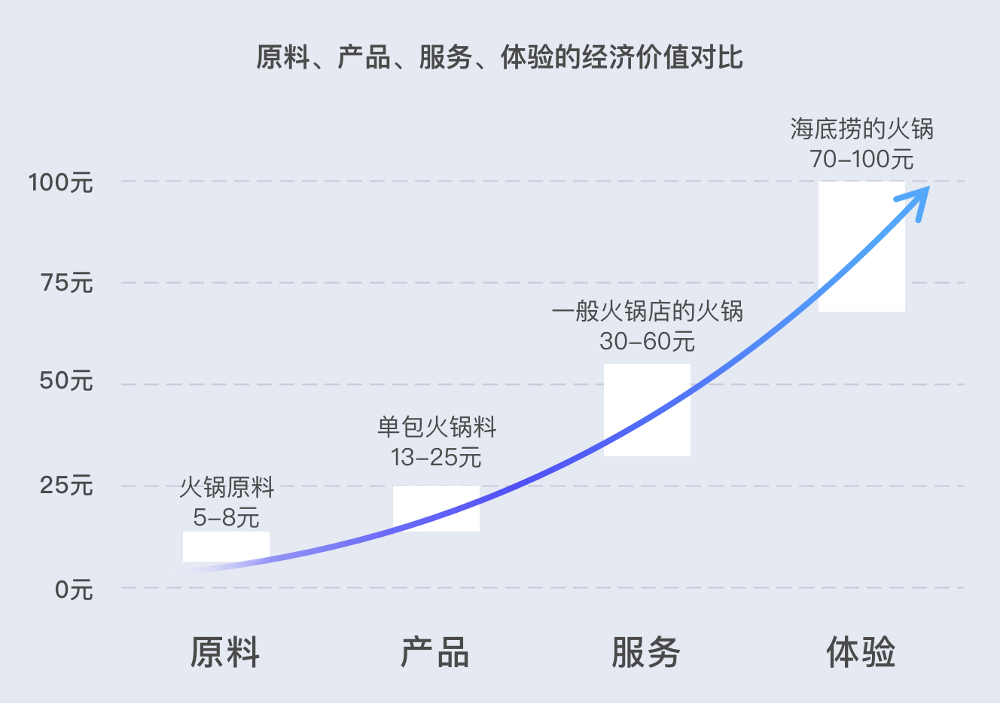
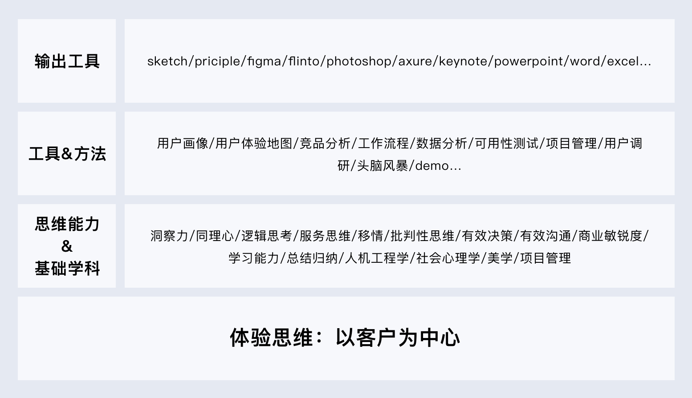
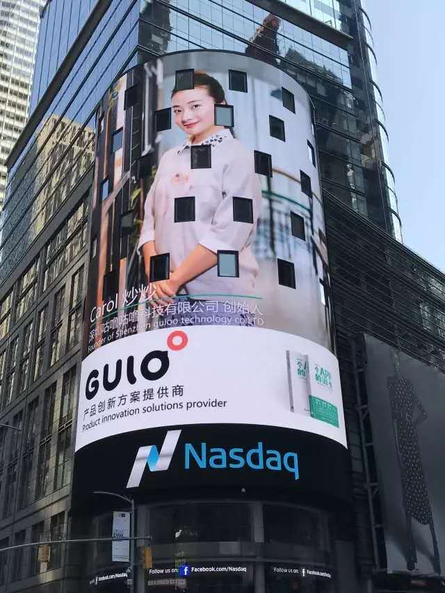

---
date: "2019-06-23"
---  
      
# 开篇词 | 不解决实际问题的体验设计都是耍流氓
你好，我是炒炒。很高兴你能点进来，与我一起来探索体验设计的世界。

作为设计师的你，是不是在工作中会遇到这样的问题：

* 协作方总是难沟通，不懂设计，感觉设计就是出图的美工
* 设计专业上遇到瓶颈，不知道怎样突破自己
* 感觉设计师没有话语权，想转行
* 知道数据很重要，但不知道怎样来帮助设计
* 设计方案总是通不过，一稿能改 10遍以上
* 总感觉进步很慢，自己也非常努力，但是不知道怎样更快地提升自己
* … …

作为设计Leader的你，是不是也遇到了以下问题：

* 自认为很公平的考核了，员工还是觉得你偏心，不公平
* 老板总是觉得设计人员多，投入大；而设计师的工作饱和度很高。老板认知和价值证明陷入僵局
* 招聘设计师时不知道他到底值不值这个价
* 时间不够用，不知道怎样平衡设计管理和设计实操之间的精力分配
* 怎样提高设计的单人效能，团队能够持续稳定的输出高质量的设计
* 不知道怎么带领团队持续地输出爆款产品，助力业务拿结果
* … …

作为老板的你，是不是也困扰，每个人都说这个体验不好那个体验不好，到底什么才是好的体验？

这些问题是不是经常让你辗转反侧，难以入眠，想到头秃？

别着急，我有一套体系的解决方案想分享给你。

现在，你可能还不认识我，但我还是很高兴你点进来了，来了解用户体验设计这门课。在课程开始之前，我想先让你思考这样一个问题，**到底什么是用户体验设计？**为了让你更好理解，我来给你举几个例子。

<!-- [[[read_end]]] -->

有一次，我在外面跑客户，手机快没电了，我叫了个车，车还没到呢，手机自动关机了。好不容易找到一个共享充电宝机器，结果因为手机已经关机了，扫不了充电宝 。

太糟糕的体验了。

其实只要在每个充电宝机器旁边预留一根多头充电线就可以，既能帮到有需要的用户，还能帮助提升产品的美誉度。这个预留一根多头充电线的设计就是好的体验设计的一个案例，是共享充电宝行业的有心人对用户极端情况的一个暖心设计。

我有炒股的小爱好，用的是某一互联网公司的炒股平台，有一次美股出现熔断，用户疯狂卖股票。我也挂卖出，但是这个突然平台瘫痪了，出现了不跟价，点击毫无反馈的情况。因为这次事故，我亏损了一个爱马仕包。

在用户群里面反馈，客服就只会道歉，然后此事就不了了之。

太糟糕的体验了。

其实他只要换一个更稳定的交易通道就行，做好平台高并发可以避免这种情况。

体验太重要了。

所以，什么是用户体验设计？**就是发现用户的一个问题 ，然后去想办法、想方案，去解决它，让用户觉得自然又有趣，解决这个问题的路径就是体验设计。**

## 体验设计的价值

当一个行业，没有体验设计的时候是什么样？

例如教育行业，没体验的时候就是老师填鸭式按照学校的规定自顾自地说课程内容，按照规定时间以及流程布置作业和修改作业；学生呢，要想学到知识，需要“头悬梁，锥刺股”，闻鸡起舞，日日苦读，才有成为大儒的可能性。

有了体验设计后 ，就不一样了。

最近很火的罗翔，和其他老师不同，罗翔老师将枯燥无味的刑法基本概念与幽默诙谐的段子结合在了一起，大受同学们欢迎。学生们学知识的热情就这样高涨起来了，不仅本专业的人有热情，连非本专业的人也是热情满满，天天守罗翔老师的课程。

既学了知识，还听了段子，最重要的是价格还便宜，还能免费追星，简直太划算了。这就是**体验设计的第一个价值点：物超所值。**

罗翔老师这样优化授课的体验，不仅传播和普及了法律知识，还打造了个人IP，这就是从用户出发，加强用户体验的力量 ！这是**一种自然又有趣的高端体验**！

那中端的体验是什么样子的呢？是那种有体验但是很刻意的好体验。

比如说餐饮，过去我们只要求吃饱，所以对商家的要求就是份量要大、价格要低。现在时代不一样了，要求不仅仅是吃饱了，我们还想吃好、吃爽，最好还能吃出点意境来。

火锅界的“王牌网红”海底捞，就有自己的一套解决方案。用户从靠近海底捞门店开始，就会进入服务员热情的目光里。要是排队，还有各种小零食，碰到有小朋友，还会教小朋友折五角星。

从海底捞出来的用户，没有人觉得海底捞的服务是不好的。

* 老人会觉得，虽然火锅没那么正宗，但是服务真好 ，服务员都好热情；
* 小朋友会觉得，有游乐场，还送礼物，服务员非常和蔼可亲；
* 白领会觉得，服务相比其他的火锅店来说，有花式营销活动，真的很不错。

我妈这个生在红旗下，长在新中国的老太太去海底捞，去洗手间，从洗手间出来，有人给他递洗手液，有人给他递擦手纸。她觉得都不好意思去上洗手间了。

每个人都在说海底捞吃的不是火锅，是服务，是**消费者是上帝的优越感**。

这个就是相对**刻意的体验，刻意的在营造我体验好的“人设”**。

**体验也是根据时代不同、对象不同、环境不同的变化而变化的**。

例如钱的变迁。在时间这条长河里，同样是钱，一开始，就是贝壳，在然后到贵重金属币，然后进阶到纸质的交子，在到现代的纸币 ，最近的数字币。

花钱，是一件很爽的事情，但是，当我们适应了无感支付，有感支付就变得不爽了。这个就是体验跟时代发展一起发展的表现了。

我们再接着往前追溯，在有了交子之后，携带金银变成了一件并不友好的事情了–笨重、不好携带，还容易遭贼；但是金银这种钱可比携带一大包贝壳要轻量的多。

体验跟我们的日常生活息息相关，在现在这个社会，我们无法预知科技会进步到什么程度，但如果只追求表面上的多功能和高性能，**恐怕无法获得可持续的竞争力，因为用户追求的是使用这个产品时的综合体验。**

基于此，我们说，**体验设计的第二个价值点：在现有情况下的最优解**。

那体验的价值用商业来计算，他到底值多少钱？怎么值钱了？

咱们按经济价值来计算火锅底料的价格，和其他价值相比，体验的价格优势格外显著。

但是啊，如果没有好吃的火锅这个产品落地 ，再好的体验也都是空中楼阁。所以，**体验设计不是商业的本质，是商业的辅助行为**。

拼多多，一家才6岁的神奇公司。他是怎么起来的？就靠在微信上拉好友给你砍一刀拼团买水果起来的。他的体验非常的简单，点开好友的链接，砍一刀 ，你也可以发起拼团，就可以获得低价水果，你若不愿意，也可以单独购买比市面价格低的水果。

后来在扩充到不同的品类，越做越大，有了接近7亿的用户，1890.75亿市值。

这就是**体验设计的第三个价值点：抓住用户，成就商业**。

从这个角度来看，可以说，**体验是未来商业的成功密码。**

体验无处不在，只要**有与人互动的地方，就有体验**。大到一个行业的不同组织形态，小到一个勾选点击方案，都是体验设计的范畴。

## 体验设计的目标

既然体验设计这么重要，我们怎么才能做出好的体验设计？

其实，目前用户体验设计已经有了一整套科学的底层思维方式，有成系统的操作工具和方法，帮助我们完成产品的体验设计。市面上，也有很多相关的书籍和资料。

但是，很多人在又多又杂的信息面前，却忘了最重要的一点，体验设计的目标到底是什么？

举个例子，我们在工作中，经常会听到有人吐槽说体验不好 、丑，然后建议换个icon或者换个颜色，认为这样就会解决体验不好的问题。

我有一次做一个产品大版本改版，口号是打造极致用户体验。但是，在功能上，却没有变化，主要就是换了个皮肤颜色，还花了很多的资源去做功能平移工作。

在被用户吐槽的流程冗长、功能冗余这些实际问题上，未曾改变分毫。结果可想而知，数据只在刚上线的时候发生过波动，后来产品的数据表现就“稳若磐石”，跟改版之前没有质的变化。

如果极致用户体验只是 UI 设计师换个颜色，界面美化下就能做到的话，就有点**草率和过时**了。对体验设计的这种理解 ，还停留在2000年的第一场雪里。

你可能觉得这个例子有点离奇，但是这却是很多用户体验设计都会犯的错误。

是他们水平不够吗？是他们技艺不佳吗？都不是，是因为他们没有关注实际问题，**所有不解决实际问题的用户体验设计都是耍流氓。**一个好的体验设计一定是解决了实际问题的，体验设计的目标就应该以解决问题为主。**想学好体验设计，就要先从解决实际问题这个目标开始。**

体验从业者是一群什么人？是无论在哪个行业的有心人，有了这些有心人，在人、在事、在物上下力气，做研究，这个行业的体验就会变好。

## 这门课要讲什么？

体验 ，是一个主观感受，如何让这个主观感受客观化，是我一直在研究的方向。

这门课程，我会从实际问题出发，带你一步步深入学习体验设计，我会给你梳理出一整套从基础到进阶的体验设计方法论。如何入门？如何精进？在这里，你都会找到答案。

首先，在课前导读部分，我会基于解决实际问题这个目标，拆解出工作中一些熟悉的场景，来定义出什么是不好的用户体验，什么是好的用户体验，让你对**用户的体验**这件事有个认识。接着，我们会探讨交互设计师和产品经理的区别，从而对**专业分工和协同**有个清晰的把握。

接下来，第二个模块，我会从体验工具、设计思路到如何提案等体验设计中**八个关键步骤**出发，讲解**科学的体验设计实操，**结合我的个人案例，给你提供可落地、可借鉴的高手思路和经验。

学完这个部分，你就可以掌握用户画像、体验地图、竞品分析、数据分析等工具的有效用法，会更熟练地通过设计工具找到产品的设计方向，少走弯路、少掉坑。

在第三个模块，我会系统化地给你讲解**设计量化**的知识。设计量化是近几年在用户体验设计领域里一个新兴发展的名词。作为一种科学的方法，设计量化可以帮助设计师通过量化指标来证明设计的价值，帮助自身有计划地成长，科学地提升产品的体验。

我总结了一套系统的体验设计量化体系给你，可以称得上是**行业里第一套这么完整又系统的设计量化知识体系**。学完这个部分，你就可以轻松地利用量化的方式评估自己的专业水平、评估需求、评估设计价值并说服老板，也能够更科学合理地评估设计的投入产出比。

第四个模块，我会跟你分享**设计工作中的流程与效率**问题。在这个过程中，你会有自己的反思，有自己的精进，你会找到一种提高自己工作效率的方法，一种打破自我成长天花板的方法。

最后，我还会跟你聊一聊几个有趣的话题，比如说35岁的设计师都去干嘛了？腾讯的体验设计师是怎么干活的？等等，这部分主要是为了让你不局限于自己的一方天地，拓宽你的视野。

如果你是一名**体验设计师**，你在听完这个课程后，可以与我一起，科学地、体系化地复盘一下体验设计的前因后果，不再感觉体验设计像一门玄学一样；你会掌握可落地的设计量化的全套知识体系，通过大量的实战案例会帮助你找到设计能力提升的有效途径，实现升职加薪；

如果你是一名**设计管理者，**你在听完这个课程后，你会找到高效管理设计项目和提升团队设计师能力的一些小技巧，提高设计团队的整体效能；同时你也能够有理有据地讲清楚体验设计的价值，向你的上级证明设计的重要性价值；

如果你是一名**老板**，希望你在听完这个课程后，能够科学评估设计的投入产出比，把设计团队的价值最大化，让设计为业务带来更多的增值。

## 我是谁？

说了这么多，现在你可以来认识一下我了。

我叫炒炒，现在是一家银行的客户体验设计团队负责人。在过去的12年里，我一直从事体验行业工作，拥有手机、纯互联网、咨询、银行跨行业的工作经验，服务过腾讯、平安等大型企业。

至今，一共参与了 15 款 App、10 +个后端服务系统、一本杂志、其中千万级别的 App 有5个，比如腾讯微博、应用宝、QQ 家园、腾讯充值等。出版过图书《一个 APP 的诞生》《设计职场的三种打开方式》。其中，《一个 APP 的诞生》这本书还幸运地登上了纳斯达克的广告屏。

当时，这本书真的帮助到了很多读者，有刚毕业的学生、还有想转行到互联网行业的人，以及许许多多的职场新人。这本书让那些在互联网产品体验设计这条路上，不知道该怎么入行，或者片面地认为体验设计就是UI设计的小伙伴们，重新认识了体验设计。

今天，我开了这门课，有幸再一次来跟你分享我在体验设计领域的经验和思考。

希望学完这门课程后，不仅可以让你入门用户体验设计，还会让你进阶体验设计、跨过职业成长的门槛、突破设计职场的瓶颈，更重要的是，培养你的体验思维意识。

不过，这门课不会让你学完就变成用户体验行业的专家，只是给了你一个学习的路径指导，分享给你一些案例，让你知道什么是好的体验设计、怎样科学地看待体验设计。要想成为专家，还需要千百次的刻意练习以及复盘思考，不断在实践中提升。

但是，我有信心和你一同进步，你准备好了吗？