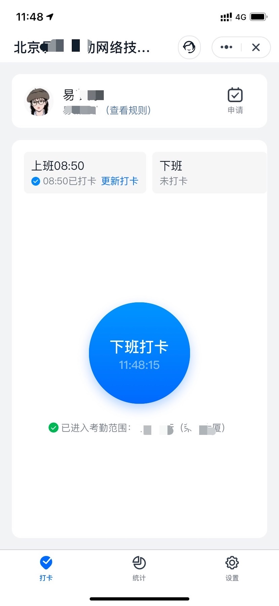
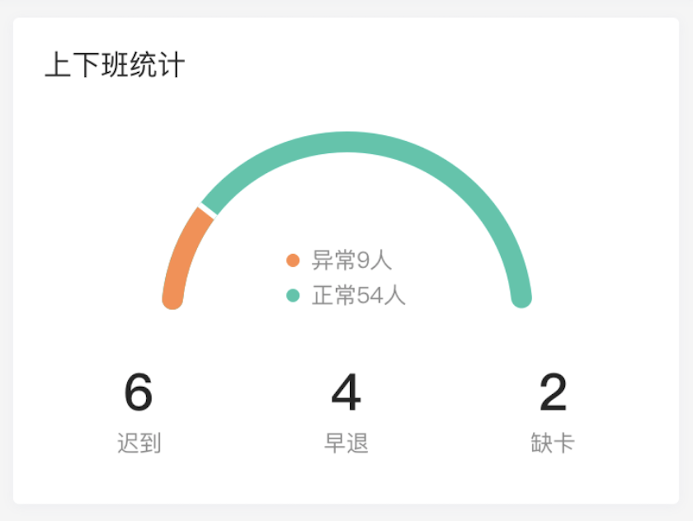
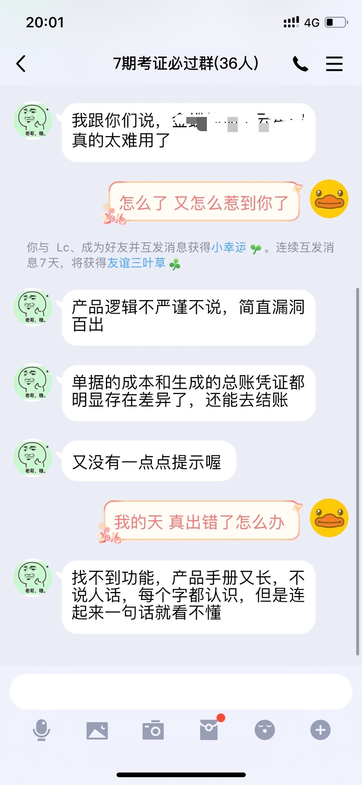

---
date: "2019-06-23"
---  
      
# 10 | B端设计师如何真正地接近你的用户？
你好，我是炒炒。

到今天为止，我们已经学习了用户画像、竞品分析、体验地图等等知识，这些都是帮助我们做出更优秀的体验设计的方法和工具。但是，在工作中，我还经常听到小伙伴有这样的烦恼，“用户画像和竞品分析我都会做，可是我在B端很难获取到一手的用户意见呀！”

的确，和C端的设计师不同，B端的设计师通常为企业或商家工作。C端的用户量庞大，而B端的用户人群相比之下，却十分的少，别说获取用户意见了，能获取到真实的用户都很难。

但是，我们一直强调，用户体验设计和真实的目标用户是分不开的，想要做出好的体验设计，就一定要从用户的实际问题出发。那么，作为B端设计师，到底该怎样接近你的用户呢？

今天，我就结合B端相关的项目经验，来跟你探讨一下怎样才能真正地接近并了解B端用户。

首先，我想就B端体验设计的两个关键点进行分析，分别是设计目标和用户。

## B端产品的设计目标

既然产品分为B端和C端，那它们的设计目标自然是不同的。目标是关键点之一，目标的不同，两种产品对应的设计策略、设计方法、设计的方向就也会有所不同。

以“转账”为例，从字面理解，转账不就是把钱从用户A手里转移到用户B手里吗？比如说，我们很熟悉的支付宝或者微信转账，把流程稍微拆分一下，分别是：

<!-- [[[read_end]]] -->

* 进入支付宝/微信；
* 选择转账；
* 选择收款人；
* 输入金额；
* 输入密码；
* 转账成功。

从这个拆分的流程中，我们可以发现，个人转账是一个人就可以完成的，这就是常见的C端用户的操作流程和用户行为。可是，企业转账的用户行为和操作流程并不是相同的。

企业转账是用职能的身份，代表企业去执行转账，本质上来说属于企业的行为。我们也试着拆分一下用移动端完成企业转账的流程，分别是：

* A员工进入企业手机银行App；
* 选择转账；
* 填写转账信息（含转出金额、收款人信息、到账时效、用途等）；
* 确认转账；
* 输入安全验证；
* 提交转账申请 ；
* B员工（具有复核权限的员工）进入App；
* 打开转账复核；
* 选择对应款项条目；
* 输入安全验证；
* 转账成功。

你看，企业转账是不是比个人转账要复杂得多？企业转账本质上是企业的资金交易行为，你无法一个人去完成这件事情，你必须要与任务流上的相关角色协同才能完成。在这条任务流上，每个角色都承担着不同的职能，像上面的企业转账例子，员工A和员工B的职能责任就是不一样的：

* 员工A是财务经办，负责资金交易信息的接收、录入与提交，是企业资金转出的第一道门；
* 员工B是财务主管，负责对资金交易做进一步的核验与确认，是企业资金转出的第二道门。

要同时存在这两道门，才能满足企业交易的严谨性与安全性的要求。

通过这个例子，关于B端产品和C端产品的设计目标，我们可以做个简单的区分。

**C端产品的行为属于单一用户的行为，我们的设计****会****以****个人****用户为中心来展开**。所以，怎么让个人用户爽，才是我们做产品时要深度考虑的。**而B端产品的行为属于多角色的行为，设计是以任务流为中心展开的**。要把企业的安全、效率放在首位，不能纯粹地只强调使用者的个人体验。

## B端产品的目标用户

通过C端和B端产品的设计目标，我们知道了，C端的使用者和决策者是同一个人，自己就能为自己的行为负责，为不为这个产品买单，都是自己一个人说了算。

但是，**B端产品的用户****是****企业中的各个角色**，他们共同服务于企业的相关任务流程。各个岗位的员工都会是产品的主要使用者，但要不要使用该产品的决策者却可能是这家企业的老板。

我们就拿考勤类产品来说，同样是使用考勤产品，你和你老板的使用目标和场景是一样的吗？

对于员工来说，我们日常无非就是上下班打卡、申请考勤异常、请假等。你看到与你自己相关的个人数据，会针对你的个人数据去进行下一步的操作，这是个人行为维度的功能与数据统计。

比如说，你可以通过考勤App看到，你这个月迟到了多少分钟？迟到了多少次？是不是会影响到你拿这个月的全勤奖？

那老板用考勤App来干嘛呢？也是用来上下班打卡吗？当然不是。

从老板的角度来看，他们的诉求更多是通过企业员工的考勤报表，对员工的出勤进行管理，然后为人事管理、考勤排班、绩效考核、薪资福利等方面提供企业管理方面的参考，方便企业在优化人力资源成本等方面做出更优的解决方案。

例如，老板通过部门员工的考勤统计，发现小A同学这个月的请假次数特别多，迟到也不少。然后，老板就会结合小A同学这段时间的工作状态，预判小A是有跳槽的倾向呢？还是家里发生了什么事情？是对小A进行工作上的重新分配还是人文关怀？

但无论是哪种，其实这个考勤App对于老板来说，就是一个把控团队人力的辅助工具。所以，会出现一种很现实的情况，就是如果一个产品能给企业带来利益点，即使员工觉得这个App的体验不怎么好，老板可能还是会购买这个产品。

钉钉就是一个典型，记得前一阵子很多自媒体都在抨击钉钉，说钉钉缺少人文关怀，但这并没有妨碍老板们将钉钉设定为企业智能移动办公的首选。

所以，你看，**B端产品的决策者和使用者是分开的**，而且两者之间的关注点和使用场景也不同，这提醒我们，在B端产品设计过程中，我们要同时关注决策者和使用者的声音。

接下来，我就给你分享一下我们分别去了解决策者和使用者的一些方法。

## 如何搞定决策者

### 了解决策者的经营场景

既然产品决策者是老板，作为一家企业的核心人物，我们就要去了解老板对产品的诉求：

* 他希望产品给企业带来什么效益？是降本增效吗？
* 哪个维度的降？哪个维度的增？资金利用率还是员工效能？
* 目前企业哪个环节做的不好，想让我们提供怎样的服务？

对上述问题，我们都要做到心里有数。举个我之前的一个项目例子。

当时，我们在做一个跨境客群专区的产品。在前期，我们对外贸生意者进行了采访，主要目的是了解他们的经营模式以及与银行的连接点都有哪些。

我们选择了义乌的小商品批发市场进行走访。在走访过程中，我们发现了这个市场的几个特征：

* 大部分店面都是很小的，且只有3-4人在店里；
* 每个店面都会有一个柜面，且都有人在柜面坐镇；
* 店面里不会堆积大量货品，都是样品展示；
* 没有客人的店面，店员工会在电脑面前忙活；
* 市场有一个专门做“开票”的大楼。

通过这些观察，我们猜想，这些店面的规模到底有多大呢？是夫妻经营吗？除了现场销售，还通过什么渠道卖货呢？店面这么小，是从仓库出货吗？仓库是在附近吗？为什么楼里都有一个专门的开票地方呢？以及他们又是通过什么方式做账的呢？

一系列的疑问涌现在我们的脑海里，为了得到求证，我们选择了几个店家进行采访。其中，我们采访的一个店面，是一家卖地毯产品的店，店里只有两个人，一男一女。对话如下：

> “您好，这位一定是老板吧，哎呀，你好你好，我们是XX银行的市场调查员，今天主要是.....”  
> “走走走，没看到我很忙吗”（冷漠脸）  
> “我们不是销售，是市场调查员，主要是来跟您聊聊天，请教一下。听听您的吐槽，看看有什么需要帮忙的。听说最近年底关头，老板们想要审批快、随借随还的贷款产品，是吗？”

老板听了我们的描述后，慢慢停下了手上的敲字动作，跟我们聊了起来。

在访谈过程中，我们跟老板聊了义乌小商品市场的基本情况、经营范围、店里的人力情况、仓库运作方式、怎么订船、怎么组装货柜、跟国外客户的交易方式、线上通过什么平台经营、个体工商户都想要什么样子的贷款产品、什么时候会最需要、是怎么做公账的、为什么要去专门的大楼开票等等问题。

为什么我们能问出这么多问题呢？主要是因为以下三点。

**第一，要选对人**。

在这么多店面里，为什么我们会选择一个只有两个人的店面呢？因为我们觉察到店里的就是老板。相对于访谈员工，访谈老板更容易知道店里内在的经营模式，以及老板对银行的诉求。

**第二，****将心比心的交流****。**

在访谈过程中，我们更多的是以“朋友”的身份跟老板交流，即使我们不熟悉这个市场的情况，但是我们是一个真诚的聆听者，而非冰冷的、生硬的按照问卷从头问到尾的调查工具人。

**第三，****善于观察访谈者所处的场景****。**

在访谈之前的巡楼过程中发现的疑问点，我们都会以“好奇者”的身份诚恳地请教老板，这些小观察点，也是我们跟老板深聊的切入点。

所以，想要深入了解B端产品的使用者、场景、需求等，就要从企业的核心人物入手，即决策者。我们要以将心比心的方式与决策者交流，交流这个行业的企业通病、经营问题。

### 用数据让决策者直观看到利益点

在产品设计的前期，我们可以用以上的方式来接近决策者。但是，接近决策者之后，又怎样来吸引决策者为我们的产品买单呢？**我们****要****用数据证明****产品的能力****，让决策者直观看到利益点。**

我们之前做了一个企业记账功能的产品，主要是统计商家各个渠道的收支，以数据的统计（收支总额 、渠道、产品销售类别等）作为核心功能，给商家的经营状况做数据的盘点，自动生成收支分析图表。希望能给商家的经营一些科学化的建议，做到经营心中有数，收支有计划。

在访谈的过程中，商家A一开始对这个产品不太感兴趣。我们就展示了一个跟他类似的商家B在用了这个产品一段时间后的经营数据情况，让他看到这个商家B在使用我们的产品后，所带来的一些经营上的直接变化。

在使用这个产品前，商家B的收支也都是通过本子来记录的，什么货品进货多少也是全凭感觉，对库存的数量也只是个大概。这就导致了每年年底，商家B需要核对经营情况时，他都要跑各个银行打印流水，再核对自己的记账本子。同时，仓库也大量存着某一类滞销产品。

使用了我们的产品后，虽然表面上只是把记账功能转移到了线上，但数据的统计对经营的有效建议才是给商家B带来的最直接的价值。商家B可以在我们App上看到，哪个产品卖得最多，哪个产品最近滞销，在产品运营上做哪些调整，才能减少库存的压力。

另一方面，产品汇集了各个银行/渠道的收入。在年底统计时，一个按钮就汇总了所有金额，还能看到买家都喜欢在哪个平台选购，从而调整这个平台的销售优惠策略。经营模式的调整使商家B的收入呈平稳的上升趋势，再也不是以前的波折起伏了。

这个数据展示非常直观地吸引了商家A，他一下子就相信了我们产品是有这个能力给他带来直接的收益价值的。所以，我们要想接近B端产品的决策者，必须要从决策者最关心的事情入手。

通过上面的两个方法，你是不是也知道怎样接触B端产品的决策者了？聊完了怎样接近决策者，我们再来一起看看怎样真正接触到使用者。

## 如何融入使用者

### 了解使用者的使用场景

对于决策者来说，我们要了解经营场景，但是换成了使用者，我们就要关心使用场景。

还是说一个之前的项目。当时，我们想要做一个财务系统的优化，在调研时联系了一些用户，但是我们发现，用户对产品反馈的积极性并不强。而且，当问到我们的系统好不好用的时候，大部分用户都会有点敷衍地说“挺好的，没啥问题”。但是，结合我们系统的数据来看，其实某一个功能的页面流向与漏斗转化率并不乐观，也就是用户的“好”其实不太真实。

为了可以知道使用者的真正使用场景和心声，我们做了两件事情：

首先，我们联系了公司的财务人员，告知他们我们想要优化产品的目的，并请求他们允许设计师做他们的一天小跟班。作为小跟班 ，我们从财务人员出地铁进公司那一刻开始，记录财务人员一天的行程、要对接的人、在使用财务系统某个功能时的流程以及习惯等等。通过一天小跟班的体验，我们也的确了解到了使用者在使用产品时的场景，以及这一类使用者的用户特点。

第二件事情，为了能听到用户真正的心声，我们从小跟班转向了小卧底。财务人员经常需要考证，我们以这个为切入点，加入了财务人员的一些考证微信群和qq群，观察他们的日常交流。

在微信群和qq群，用户偶尔会跟同行吐槽某某系统的难用，某某功能的反人类设计等。

从吐槽的内容中，我们结合自己系统的流程，对照我们的产品是否也有同样的问题，以此作为优化的一些参考点。这一次的卧底行为，得到了很多真实有效的信息，收集了很多产品的优化点，我们马上反哺到了自己的产品设计上。

### 借助与使用者有直接接触的第三方

还有一种方法就是，借助与使用者有直接接触的第三方。

比如说，银行的企业用户一般都会配客户经理的，企业用户遇到什么问题或业务咨询时，都会第一时间联系客户经理。也就是说，客户经理就像是企业用户的一个金融管家，他们会获取到企业用户的很多反馈。从这个角度说，客户经理知道的东西对我们来说就很重要了。

当我们没法直接面对用户时，我们就通过客户经理帮助我们打听，我们做出了一份问题清单，一步一步地指引客户经理去咨询企业客户对我们产品的反馈。

这份问题清单其实就是我们的发言，客户经理按照问题清单对企业用户进行提问与记录，然后把用户的反馈给我们，协助我们通过非直接的手段了解使用者。

再比如说，当你没办法接触到用户时，你可以去求助销售部门的同事，或者是运营部门的同事，借助这些第三方的力量，更好地帮助自己获取到真实的用户反馈。

## 炒炒总结

今天，我们探讨的话题是，B端设计师如何真正地接近到用户。

为什么要聊这个话题？因为很多B端设计师小伙伴都反馈过这个问题，C端用户量大，B端用户人群太少，接触不到真实的用户，想获取真实的用户反馈太难了。针对这个问题，我们先分析了产品的设计目标。

和C端以个人行为为主不同，**B端产品的行为属于多角色的行为，设计是以任务流为中心展开的**。我们要把企业的安全、效率放在首位，不能纯粹地只强调使用者的个人体验。

所以，我们进一步锁定了B端产品的目标用户，老板和员工，即决策者和使用者。

确认了这两类目标用户后，我们就可以分头去获取反馈了。首先，想要搞定决策者，我们要先接近到一家企业的核心人物，然后要了解决策者的经营场景，不仅要学会将心比心地交流和沟通，还要善于用数据亮出产品的能力，让决策者直观地看到产品带给他们的利益点。

其次，想要融入使用者，就要了解使用者的使用场景，可以考虑做使用者的小跟班，同时还要深入 这类用户群体中去 ，去调查真实的心声和意见，必要时还可以借助一下第三方的力量。

只要思想不滑坡，办法总比困难多！你说是不是？

## 课后题

你在进行B端产品的用户访谈时，顺利地接触到你的目标用户了吗？你都遇到过哪些难题呢？学完了这一讲，你有哪些收获呢？

记得在留言区和我讨论、交流你的想法，每一次思考都会成为你进步的基石。

如果你喜欢今天的内容，也欢迎你把这一讲分享给你的朋友。

感谢你的阅读，我们下一讲再见。