---
date: "2019-06-23"
---  
      
# 11 | 设计师的能力水平可以量化吗？
你好，我是炒炒。

在上一个模块，科学的体验设计实操里，我们学习了体验设计的一些工具，以及工作的方法。在接下来的模块中，我们就要开始进入到我们的重头戏——体验量化了。

有朋友留言说 ，学习这个课程就是想看下只能凭感受的体验是如何被量化的。

从某一种角度来说，**万物****皆可****量化**。比如，疼痛虽然是一种感觉，但是就可以被粗略量化。用户可以根据疼痛等级表，结合自身的感受和表现给出一个分值，帮助医生诊断情况。

体验也是。跟体验相关的人、物、场景都可以通过类似的方法被量化。那么，给体验设计做量化的目的是什么呢？其实，就是**为了在不确定性中获得更多的确定性**。

如果我们能用量化的方式，给设计师的能力做个定级，那么我们在面试设计师的时候，我们就会有更多的把握。同时，我们还可以用这种方式，来审视自己身上的能力和不足。

今天，我们就着重讲讲设计师的能力怎么量化，方便你对齐自己能力以及有意识提升某块能力。

## 设计师能力模型

针对设计师的能力量化，我们总结了一个全面的设计师能力模型。在行业里，一般会将能力分为三类，分别是**通用能力、专业技能和组织建设**，每一类下面又细分更小的能力项。

接下来，我会带你一起分析每一个小项的定义，以及量化的标准。不过，有一点需要强调，在我们的体验团队，按照角色来划分，会有三个角色，交互、视觉和用研。

<!-- [[[read_end]]] -->

岗位角色不同，能力象限也是有区别的，我们这一讲主要以交互设计师为主。

## 通用能力

我们先来看通用能力，通用能力就是在我们团队，无论哪个岗位都需要具备的能力。一般我们认为包含以下四种能力：**沟通能力、解决问题能力、执行力、项目管理能力。**

### 沟通能力

用一句话来定义设计师的沟通能力就是，**能否有效传达设计方案。**

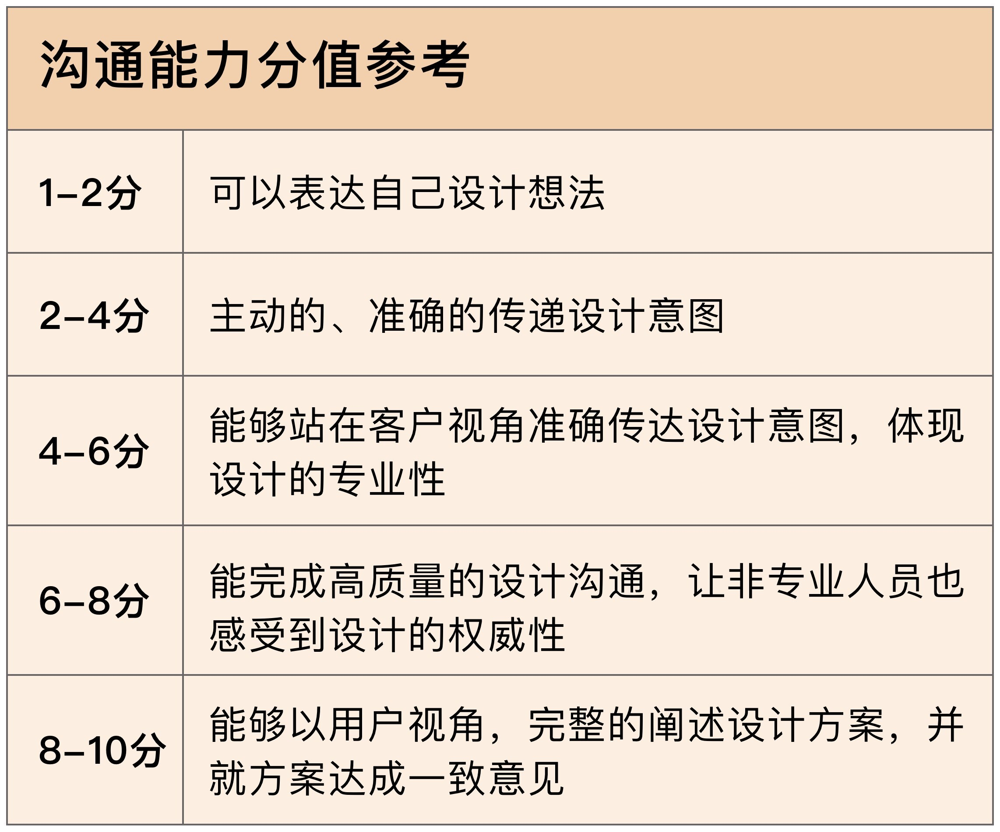

有了定义，有了分值，那我们怎么针对设计师在沟通能力方面，进行一个打分呢？

下面我举一个例子来说明沟通能力的评分。团队里分别有两个设计师，小A和小B。

小A每次讲设计方案的时候，开门见山直接讲设计方案，会说一些卡片式提高效率、风格国际化之类的词语，听起来很高大上，有时候也能够直接获得协作方的认可。

但是经常会有一些分歧，例如产品关注的是效率，如何提高当前页面的流量分发效率，而小A强调这样的布局体验更好，点击范围大之类的，经常出现沟通不同频的情况。

而设计师小B，他会从现有的产品问题开始说起，然后抛出自己的问题，设定一个设计目标，提出解决方案，并且给出验证解决方案有效性的指标。整个流程下来，不仅通俗易懂，而且给人的感觉，目的性也很明确，其中还不乏专业的视角和理解。

根据这些典型的表现，你觉得谁的沟通能力更强？是小B，小A只是做到了主动地传递设计意图，但是并没有站在客户或者用户的角度上，而小B显然是更关注实际问题。

最后，我们给的分值是小A在沟通能力的得分是3分，而小B的得分是8分。

### 解决问题能力

我们再来看通用能力的第二项：解决问题能力。我们同样用一句话来定义这种能力，就是**设计师能否发现并解决问题，解决的是哪种问题**。根据这个定义，我们同样可以得出一份评分表。

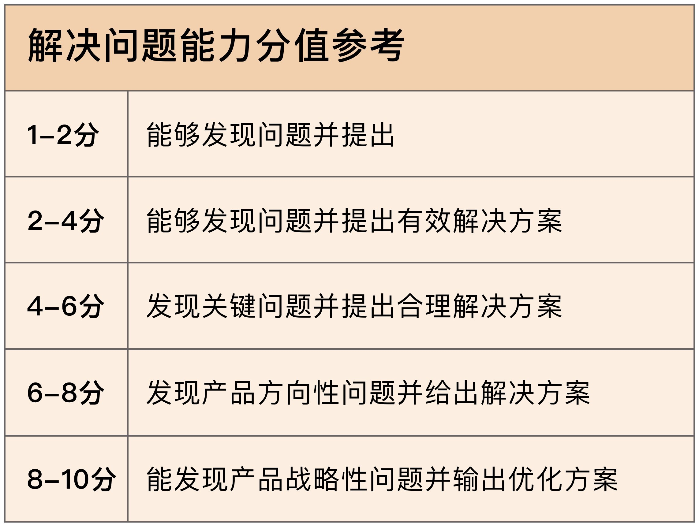

下面，我们还是以设计师小A和小B为例子，说明解决问题能力的评分。

设计师小A在工作中只能发现一些设计层面的小问题，例如没对齐、风格不符合规范，差个icon等等之类的视觉层面的问题，而且他也能够解决这些设计层面的小问题；

而小B，他往往能够发现一些关键流程背后的问题，例如小B就能够敏锐地找出某个页面的设计不符合整体规范。在解决这个问题的时候，他也并不是机械地按照规范调整页面。

他会思考这个页面不符合规范的原因是什么，是特殊场景的缘故还是由于设计师的失误，然后根据判断出来后的原因，再决定是直接调整本页面还是优化规范。

所以，能不能发现问题，并不足以证明一个设计师的能力，如果一名设计师能够找到关键问题所在，甚至是帮助产品和企业发展的方向性和战略性问题，才是更有实力的体现。

根据这些典型的表现，小A的得分是4分，而小B的得分是6分。

说完了沟通能力和解决问题能力，还有执行力和项目管理的能力，因为后两个比较容易理解，所以我就不做过多的展开，但是你可以对照我给出的评分表，评价自己其余两项能力的分数。

### 执行力

关于执行力，我们的定义是：**完成预定目标及任务的能力**，包含完成任务的意愿，完成任务的方式方法，完成任务的程度。我们又可以把完成任务分为完成个人任务和团队任务两种。

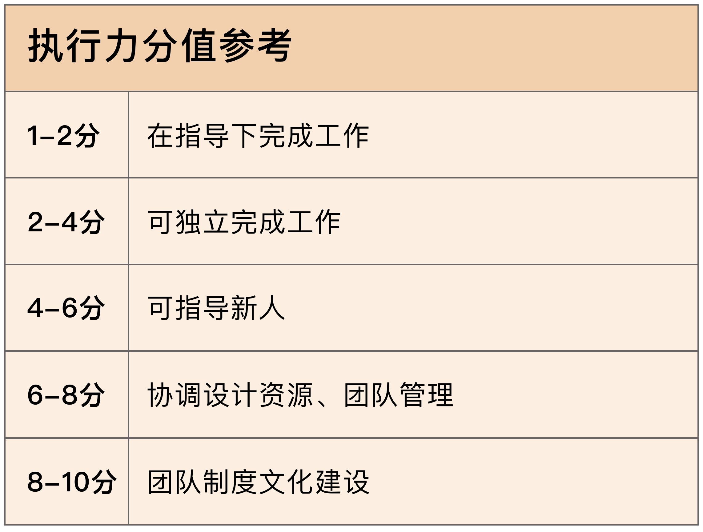

### 项目管理能力

项目管理能力的定义是，能否有效安排和合理分配时间，明确需求的轻重缓急，了解和关注项目内外合作人员的整体节奏，整体运用资源，达到解决问题的最大化性价比目标。

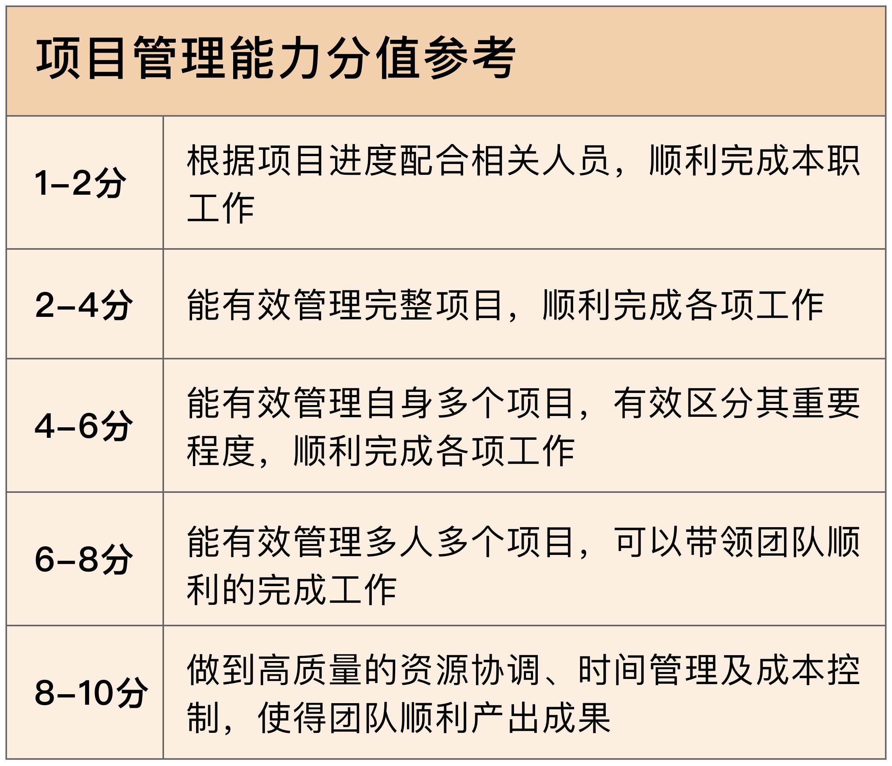

## 专业技能

专业技能方面，我们会分为**设计定位、设计技能、设计实施、设计总结**四个能力。但是，因为设计师岗位不同，对能力的描述会有些许的不同。接下来，我们以交互设计师为例。

同样，我会重点拆解设计定位和设计技能两项能力，设计实施和设计总结部分我给了评分表。

### 设计定位

设计定位这一项能力，主要看的是**设计师能不能明确产品的商业目标定位**，拆分重点交互设计任务并制定设计目标，有商业化思维和成本控制意识，具备一定的业务大局观。

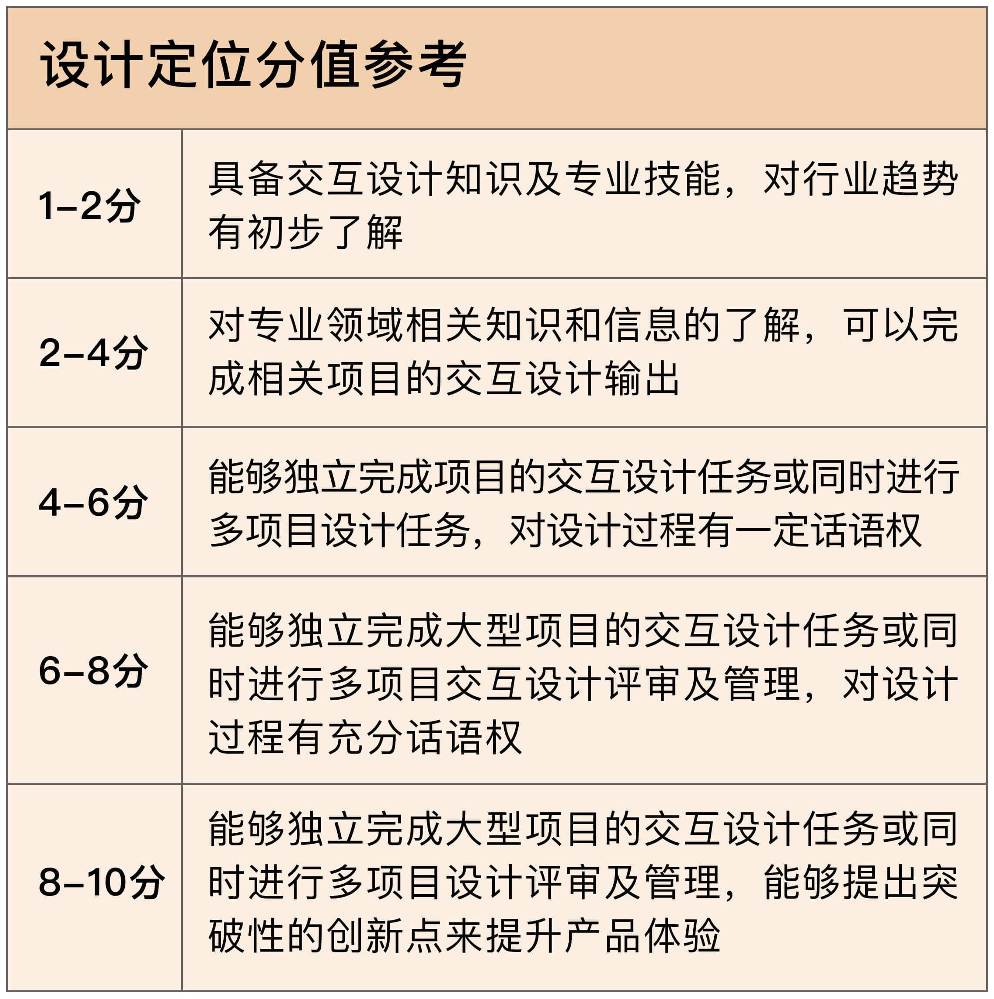

我们还是以交互设计师小A和小B为例子，进一步说明下怎样进行设计技能能力的评分。

交互设计师小A在工作中，非常熟悉业务的逻辑，面对一些不合理的需求也能够有效地与需求方进行讨论，并且推动这个需求的合理化。

在流程设计中，他能够串联起来前后端的多个关联系统，保证流程逻辑的完整性，对于他人交互设计稿的评审中，能够一眼就发现逻辑问题。他总是能够把产品需求、用户流程、页面设计等方面串联起来做有效的沟通，而需求方往往也会非常接受他在交互设计上的建议。

而交互设计师小B，他会遵照已有的流程规范完成对应的交互设计输出，但他在思考逻辑和流程的时候往往局限于一个具体的模块，缺乏一些全盘的项目视角。

根据这些典型的表现，你会怎样给交互设计师小A和小B打分呢？

我们给交互设计师小A的评分是6分，给小B的评分是4分。

### 设计技能

设计技能这块，你可能会认为是专业技能的能力项，比如说实际操作水平，但其实设计师和设计师之间的操作水平相差的不多，能力差异的背后主要是意识方面的差异。

比如说，是不是对产品所属行业/用户/场景有充分了解，能不能灵活运用交互设计和客户体验设计思想与方法达成设计任务，是不是具备一定的用研操作经验及交互表达能力。

下面，我们还是以交互设计师小A和小B为例子。

在我们的一个新产品签约的交互设计中，交互设计师小A会遵循之前存在的相关产品签约的交互规范，使用正确的控件、流程等，完成该模块的交互设计输出。

针对一些已有规范未覆盖的场景，小A也能够结合已有的规范进行相应的调整。

而交互设计师小B面对已有规范未覆盖的场景时，不但能够结合规范完成新场景的交互设计，还能把新出现的设计梳理成规范，并把新抽离的规范补充到已有规范中去，对其他模块形成复用。

最后，我们给交互设计师小A的评分是4分，给小B的评分是6分。

### 设计实施

设计实施比较容易理解，就是指设计师能否利用工具/方法/流程等，高效完成设计目标，甚至是达成商业目标，能否呈现设计带来的推动或结果影响，并有一定的交互设计创新能力。

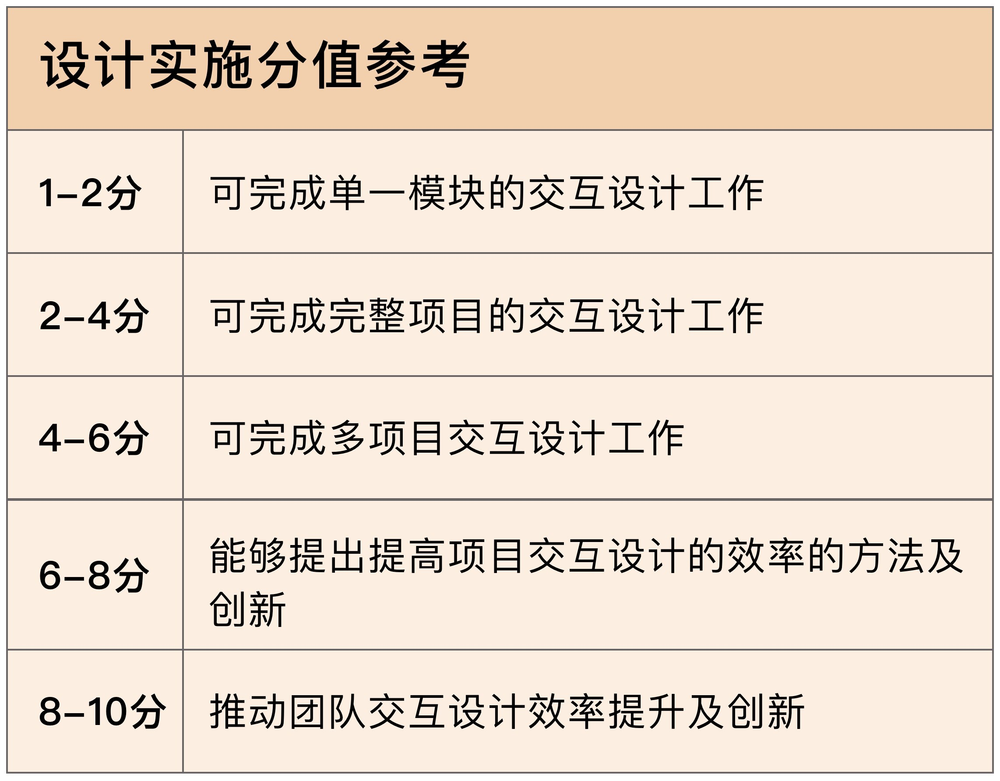

### 设计总结

设计总结看的则是，设计师是否具备交互设计标准化思想，能否注重设计效率与统一性，能在工作中总结设计师项目过程，形成交互设计规范，包括组件，设计模版，可变模块以及流程效率优化等等，并有明确的应用方法与案例。

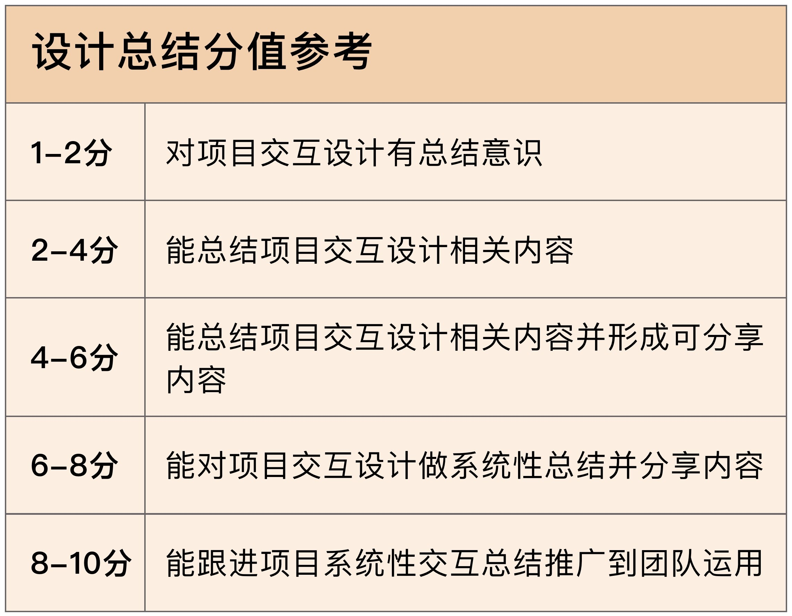

## 组织建设

我们来看最后一块组织建设能力，也被分为三个项：**知识沉淀**、****人才培养****、**工作态度**。

### 知识沉淀

和专业技能中的设计总结不同的是，知识沉淀针对的是更大范围、更抽象的理论梳理。

一个有知识沉淀的设计师不仅能够通过项目总结出相关设计经验或工作方法，并通过各种方式分享给团队，帮助团队成员的专业能力提升，还能够聚焦于行业内外的先进经验，充实自身。

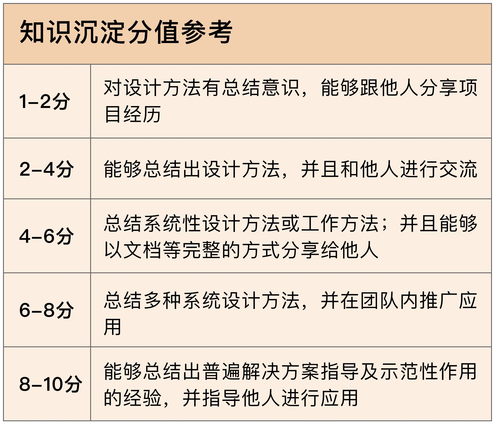

小A是我们团队中的一个特别乐于总结和分享的设计师。他经手的每个项目结束后，他都会做项目总结，同时结合业界内的优秀可复用的例子，以PPT的形式在团队中做分享。

他会把他在项目中遇到的困难、解决办法、设计思考、得出的可借鉴经验、学习的例子等，跟团队做一个很好的交流，并且团队的其他人每次听了他的分享后都会觉得收获颇多。

小B也是我们团队的一个优秀的设计师，但他就不太擅长做项目的总结和分享，他的设计输出是没有问题的，但你如果让他把在这个项目中的收获分享下，他只是会进行一些简单的设计结果的陈列，对于背后的思考却很难展示出来。

我们给设计师小A的评分是6分，给设计师小B的评分是3分。

### 人才培养

人才培养，从字面就很容易理解，指的是设计师在工作中会不会主动帮助他人提升专业能力或者提供发展机会，帮助他人的学习与进步。这项能力也很重要，决定了设计师能走多远，能否有晋升的空间，经验是否可以复用给他人。

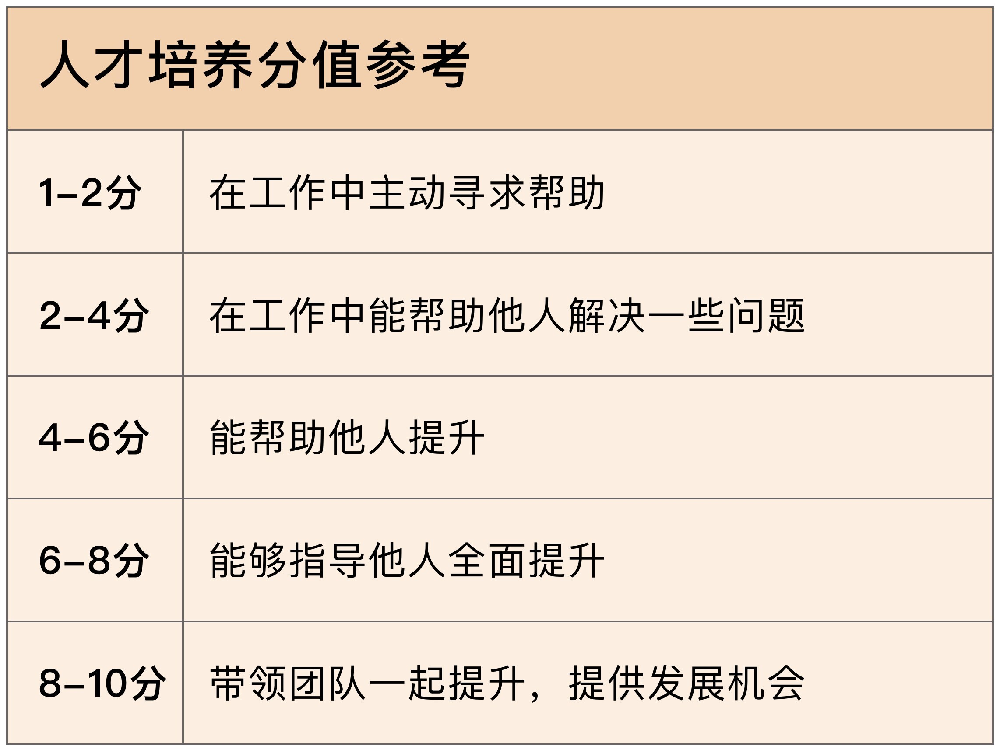

小A和小B都是我们团队中的资深设计师，他们都各自带了一个项目组。

在平时的工作中，面对他人在项目中遇到的设计问题，小A通常的做法是直接给出设计方案的指导，直接指出他人在设计方案上的问题，帮助他人完成设计方案的正确输出。

而小B遇到这种问题，他不会直接给出设计的结果方案，而是会带着设计师回过头去分析这个项目的对应需求，看是不是在需求分析和切入点的选择上就出现了问题。

他们会一起先看设计背后的问题，再看设计方案的问题，而且在调整设计方案的时候，小B仅仅是给出思路，具体的方案还是由设计师自己来执行。

久而久之，我们就发现，相对于小A团队的设计师，小B团队的设计师能力提升的更快一点。

最终，我们给设计师小A的评分是4分，给设计师小B的评分是6分。

### 工作态度

工作态度，就是根据上级管理者的期望合理完成任务，包括能够站在项目视角看待工作任务，主动思考，主动推进，超出既定范围也会积极承担。

根据上面的能力细项拆解以及分值的划分，我们初步可以把设计师分为5个等级。也就是从D1到D5，我们通过一个能力雷达图就可以非常直观地看到了。

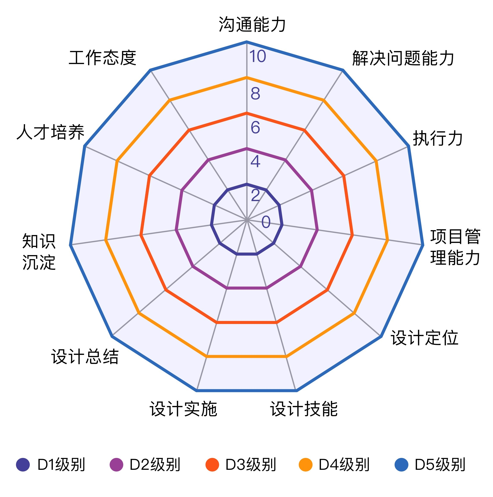

按照这种方法，你就可以根据公司的**实际情况**对设计师的能力项进行一个分类、定义、拆解，多个维度的分值加在一起，给设计师所有级别应该有的能力项定义一个范围值，就可以得出当前设计师的设计级别。然后就可以对设计师的能力进行评估，给出更科学、合理的定级。

慢慢地，设计师的晋升通道也建立起来了。你定义好能力和级别的对应，设计师可以比照着进行自查，看看自己的能力项哪里需要补充，由此追问下去 ，这个能力项怎么补充？什么方式？一点一点的深挖，一点一点的进步，大家用自己看得见、能反馈的方式突飞猛进，于设计师自己与团队而言，都是特别好的事情。

到了年终考核，可以比照这个表格，做一条暗线 ：业务贡献、专业贡献、团队贡献。倘若整个组织是一个强行政管理组织，我们可以根据每个级别定义一个基准分数，通过打分的方式，这样每个人会得到一个自己级别与基准分数的偏差值，这样就可以一键对整个团队进行绩效排名了。

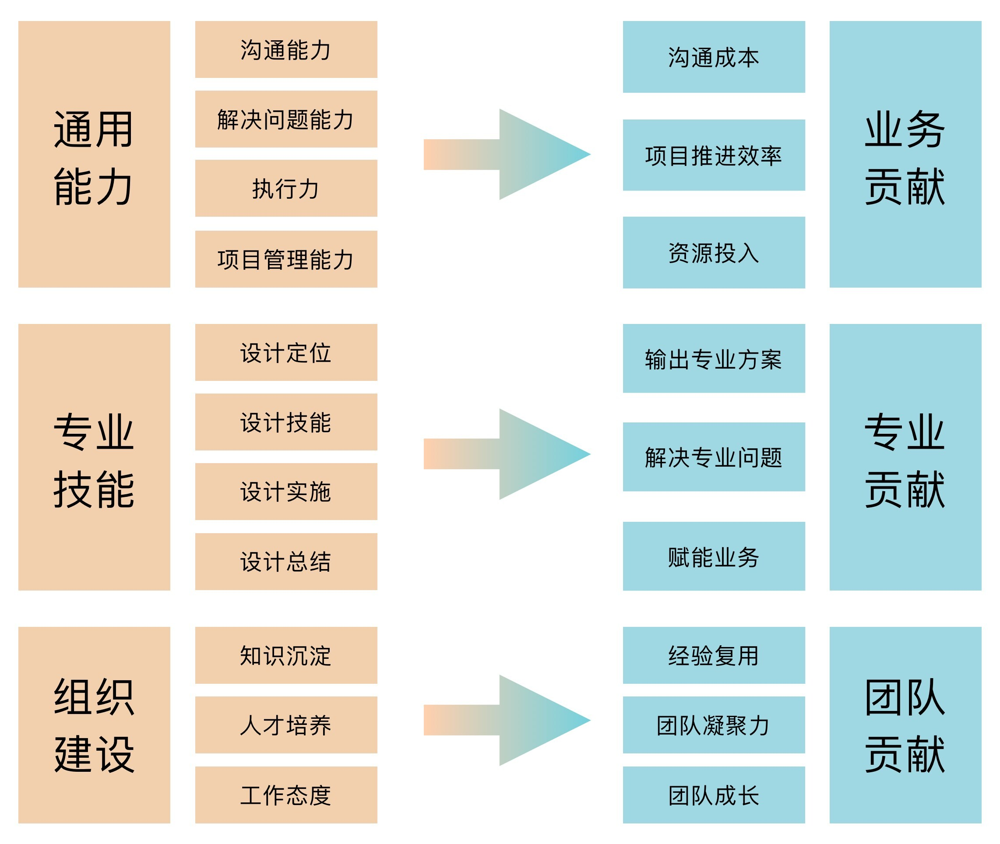

## 业务对设计的诉求

这一块是我们设计师团队自我的要求，也是设计团队负责人管理设计团队时候的一个相对量化的依据。那业务方对我们的要求是什么？其实和上面的能力模型大同小异。

**首先，****是****高效的、高品质的出图**！对于业务方来说，我们首先是一块资源。大部分的业务方对设计的“偏见”就是画图的，那么高效、高品质的出图就是我们能展开愉快合作的第一步。

**其次，是洞察**！能快速地get到业务的核心诉求，并能快速拆解业务流程，形成业务流程图，甚至在收到需求的第一时间就能在白板上生成关键页面。最好还能先于业务方洞察到用户的需求。

**最后，是好沟通**！技术类的设计师有自己的专业理想，会坚持自己设计的定义。从设计师层面上来说，是在坚持设计的理想，但是我们设计师并不直接对KPI负责。

本着谁担责谁决策的原则，我建议有分歧的时候，按照自己的想法出一个方案，按照业务方的需求出个方案，说清楚设计的逻辑，将决策权交给业务方。对方会觉得你好沟通，还一切为他着想。这样，未来的合作就会越来越顺。

最后，总的来说，初级和高级设计师最大的区别是什么？其实，如果单看输出图的话，初级和高级的差别没有特别大，**最大的区别****就****是思路，也就是拆解业务的思路**。

高级设计师输出的东西也会左右反复，但是是有序地在往最优目标迭代进化；初级的就比较随机，思路比较混乱。给别人的感受是不稳定，可靠性有待提升。

## 炒炒总结

今天，我们对设计师能力进行了量化，提出了一个能力模型以及对应的能力象限图。我们把设计师的能力分为了三类，分别是**通用能力、专业技能和组织建设**。

其中，通用能力指的是每个岗位都要有的能力，像是沟通能力，解决问题能力、执行力和项目管理能力。可以说，不光是设计师，每一个“打工人”都要注重通用能力的培养。

而到了专业技能，则更多地指向设计师的本职专业，从设计定位、设计技能、设计实施到设计总结，在设计的每一个环节里，做事的细节和逻辑的差异就是设计师能力的不同。

另外，如果一名设计师的目光不止放在自身的岗位，他能够自觉地进行知识沉淀、人才培养，有一个好的工作态度，那么他的职场晋升之路就会越来越顺，空间会越来越大。

虽然每一项可能只有两三分的差异，但是积少成多，最终的总分就会拉开一定的差距，让设计师形成不同的等级。当然，排等级这件事不是为了搞排名，重要的是**通过量化的方式，认识到自己的不足，找到自己努力的方向，而不是一味地迷茫，踌躇不前**。

## 练习题

通过这一讲的学习，根据设计师的能力量化模型，你能评估一下你大概在什么级别吗？接下来，你打算往哪个方向努力呢？

记得在留言区和我讨论、交流你的想法，每一次思考都会成为你进步的基石。

如果你喜欢今天的内容，也欢迎你把这一讲分享给你的朋友。

感谢你的阅读，我们下一讲再见。