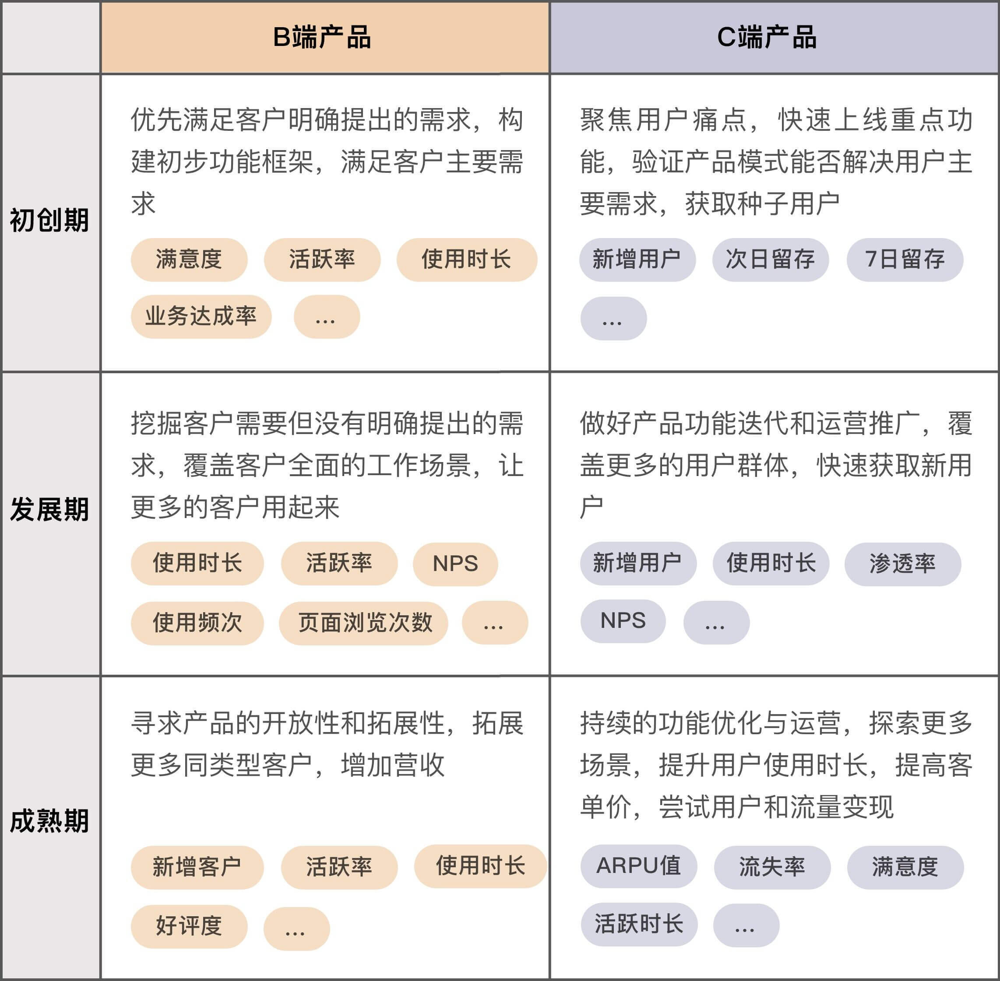
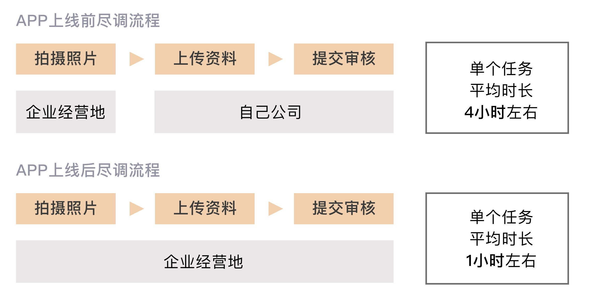
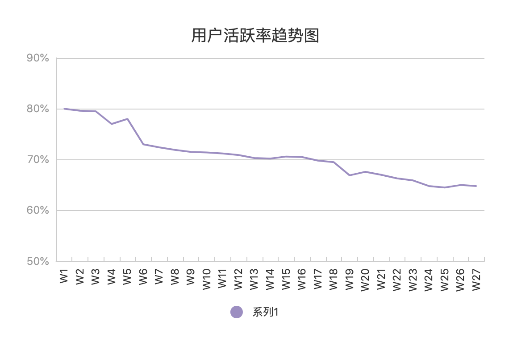

---
date: "2019-06-23"
---  
      
# 17 | 如何轻松应对不同产品阶段的设计量化？
你好，我是炒炒。

在之前的讲解和学习中，我给你分享了很多量化产品体验的小技巧，有设计创意、设计价值、设计评估等，我们全方位地研究了一个产品的设计着力点，那么，这就足够了吗？

对于想要走得更远的设计师来说，可能是不太够的。

因为，我们不仅要横向地研究一个产品的方方面面，还要纵向地去研究它的完整生命周期。在行业里，我们有一个比较通用的划分产品阶段的方式——根据产品的生命周期，可以把产品的发展阶段大致划分为以下四个阶段：**初创****期、 发展期、成熟期****和衰退期**。

那么，产品在不同阶段会有怎样的特点？面对不同特点，我们如何调整量化手段来应对呢？以及B端和C端的产品在不同的生命周期，有哪些区别呢？

今天，我们就来好好地探讨一下这些问题。

## 不同阶段的B端和C端特点

首先，在本节课中，我们会主要围绕**初创期、发展期和成熟期三个阶段**来讲体验量化。

为什么不讲衰退期？因为衰退期是产品生老病死的最后一个阶段。此时的产品通常没有了新生的可能性，除非彻底变更商业模式或产品战略。要不然，再多的体验设计投入都是徒劳的。

接下来，我们就先来分析一下在生命周期的不同阶段，B端和C端产品各有什么特点。

说到生命周期这个词，你可能会有疑问了，通常我们说的一个产品的生命周期不是针对C端产品吗？B端的产品也有这种生命周期吗？一样的，只是**B端产品的生命周期会更长一些**。

<!-- [[[read_end]]] -->

但是，在同样的产品阶段，B端产品和C端产品的体验指标关注点会有一些细微差异。以我曾经做过的一个产品为例，我列举下B端和C端的区别，给你作个参考。

在接下来的内容中，我会结合之前的一个B端App产品的案例，进一步拆解在不同的产品阶段中，我们怎样利用**设计量化的思维方式去逐步完善产品的设计和体验**。当你掌握了B端这个例子，C端产品你只要对照表格内容，就可以做到举一反三。

为了让你对这个项目有个大致了解，我给你简单地介绍一下产品的背景。

这个App的对象是银行公司业务的客户经理，他们的主要工作涵盖以下四个方面：

* 协助企业客户进行相关金融业务的办理；
* 维护自己名下客户的存贷款情况；
* 拓展更多的公司客户；
* 查询个人业绩。

为了提高对公客户经理在移动办公场景的效率，这个App就被提上了日程。

## 初创期：主客观数据结合，优先满足用户需求

先来看初创期，我先问你一个问题，你对初创期怎样理解？

你可能觉得，初创期不就是刚创建产品的阶段吗？其实，不一定指一个全新又完整的App。如果是一个全新的功能，也可以拎出来以初创期来对待。因为对于原项目来说，它是个新东西。

对于我们的App，在初创期，我们计划优先上线两种类型的功能：

* 一是客户明确提出的功能；
* 二是能明显提升业务效率和用户效率的功能。

客户明确提出的功能，还比较好理解。那么，我们怎样理解**业务效率和用户效率**呢？接下来，我用两个实际的功能来进一步给你说明一下。

我们先来看业务效率。在银行对公领域的业务场景中，有一项工作叫尽职调查，就是说企业来银行开户后，银行需要进一步去核实企业是否真实存在、是否有真实的办公场地、是不是空壳公司等这些信息，这通常都需要客户经理去企业实地调查。

在没有App的时候，客户经理的工作流程是这样的：

先去企业的经营场地，然后拍一些办公场景和补充的材料照片。回到公司后，再通过电脑上传到系统，提交到审核部门。这样一个流程下来，至少是大半天甚至是一天的时间。

倘若审核不通过，那客户经理还需要再跑一趟。

而App上线后，客户经理在企业经营场地拍完照片后，通过App就可以直接上传并提交到审核部门。十分钟内，审核就完成了。他还可以在手机上看是在哪个流程审核，如果审批不通过，是哪里存在问题，当场就可以修改提交，让客户经理只跑一次现场，就可以完成尽职调查。

这大大地节约了客户经理完成尽职调查的时间成本。

最后，通过数据的统计，我们发现，在App上线前，1位客户经理平均完成1家企业尽职调查的时间大概是四小时左右，而App上线后，这个时间缩短到了一个小时，平均效率提升了4倍。

接下来，**用户效率**层面，我们优先上线了一些用户高频使用的功能。比如资金变动提醒功能。

对于客户经理来说，其名下客户的存款、贷款直接关系到了他的业绩和奖金，所以他们会经常看自己名下客户的存贷款情况。在没有App的时候，客户经理都是通过电脑查看这些信息，而且他们对于一些资金的变动也不能够及时地掌握。

但是，在App上线后，客户经理就可以通过App，随时随地查看自己名下客户的存贷款情况，对于一些资金变动，系统还会主动推送；与客户存贷款情况相契合的营销产品，系统也会主动把商机推送给业务经理，帮助他们及时调整优化自己的工作计划。

在我们的App1.0版的第一个月的试运行结束后，为了评估1.0的版本是否能够真正地对客户经理的工作产生帮助，我们从**主观态度和客观数据**两个层面进行了验证。

在**主观态度**层面。我们借鉴了“[16 | 产品体验的评估也可以量化吗？](https://time.geekbang.org/column/article/343763)”其中说到的体验分评估模型，我们做了一次线上问卷调研，看一下现有的产品功能是否能够满足客户的需求。

我们筛选了350名用户做了问卷推送，回收的有效问卷大概是300份左右。通过对这300份问卷的评分计算，我们得出了App1.0版本的满意度是8.5分，对应的等级是非常满意。

再看**客观数据**层面，我们观察了周活跃率这个指标。试运行最后一周的周活跃率是77\%，周活跃用户数是2766人。在这里，我们给周活跃的定义标准是每周使用App的次数大于5次。

结合主观态度和客观数据的初步结果，可以看出我们的App切实地给客户经理的工作带来了很大的帮助。这里我们找的主观和客观体验指标分别是：**满意度、****周****活跃率**。

## 发展期：聚焦用户活跃率，覆盖更多业务场景

到了产品的发展期，阶段变了，核心任务也就变了。此时，我们更应该关注**用户的活跃率**。用户的活跃率才能够反映出来我们的产品是否能够真正对用户的工作有帮助。

再回到我们上面所说的例子。

差不多过了半年时间，相关的主要功能已经基本都上线了。但通过对数据的跟进，我们发现，与试运行相比，我们的周活跃率却一直是一个下降趋势，半年的时间已经下降到了65\%左右。

为了解决活跃用户数量持续下降的问题，我们和产品经理一起开展了一场用户调研。

我们安排了两组调研人员，每组1个设计师、1个产品经理。还联系了一些分行的客户经理，让调研小组跟着客户经理去工作一周，包括每日站会、周会、拜访客户、柜台协作客户办业务等。

通过一周的调研，我们发现了一些App功能没有覆盖到的工作场景。

比如说，对于一些大客户，客户经理都会定期拜访，维护好客户关系；每天的站会和周会，一个组的客户经理都需要互相对齐下拜访客户的情况；在拓展一个新客户或新业务的时候，客户经理会互相打听其他分行有没有做过类似的客户或业务，提前找一些经验参考。

基于这些细分工作场景的掌握情况，我们又找到了一些**新的设计机会点**。

比如说，升级原有的客户拜访功能，帮助客户经理更轻松、全面地掌握客户信息；增加知识库功能，让客户经理在手机上就可以学习其他分行的经验知识……

接下来，我来给你具体地拆解一个客户拜访功能的优化例子，讲一下整个升级优化中的设计思路，希望能给你带来更多的启发。

原来的客户拜访功能只有定位打卡和拍照上传，这个设计最初的出发点是杜绝客户经理假拜访来刷自己的拜访数据。功能比较单一，每次客户经理到了客户那打个卡，拍张自己和公司前台以及公司法人、公司经营执照的合影，几秒钟完成。之后，客户经理就再没有打开过我们的App了。

但其实在拜访客户的实际工作场景中，他们还有很多工作要做：记录拜访客户的信息（时间、拜访了谁、哪些重点事情、需要跟进的事项……）、每天还要邮件汇总拜访客户的情况给小组长、有待办事项的还要另外记到备忘录上等等。

既然客户经理还有这么多工作要做，我们为什么不能够让他们在App上完成整个拜访客户的工作流呢？是不是就不用他们综合使用邮件、本子、其他App才能完成整个工作流了？

所以，针对客户拜访功能的升级，我们有针对性地完善了几个功能：

* 拜访笔记功能

客户经理可以把拜访时间、拜访对象、重点事情等关键信息直接记录在该客户名下，而且会用时间轴的方式帮客户经理做一个拜访记录的汇总。这样，客户经理就可以非常清晰地看到自己拜访每个客户的情况。

* 自动生成日报和周报

根据客户经理的每次拜访笔记，系统自动生成拜访日报和周报，同时一键同步到小组长那里。这样，每次开会前，客户经理就不用再以邮件的方式重新汇总一次材料，而小组长也能够提前了解到客户经理的总体拜访情况，提高每日站会和周会的效率。

* 增加待办事项功能。

对于那些拜访后产生待办事情的场景，客户经理可以在App里直接录入，系统会自动同步到手机日历上，避免客户经理忘记此项待办。

这些细分工作场景的覆盖，让客户经理有了更多的动机来使用我们的App。

随着这些优化功能的逐步上线，我们发现App的周活跃率逐步上升到了85\%左右，同时，周页面浏览次数也同步提升到了205,396次，比六周前的数据提升了28.9\%。

这个阶段，我们看的体验指标是：**周****活跃率、周页面浏览次数****。**

## 成熟期：完善基础功能配置，定制特殊化功能

对于我们的产品来讲，想要**批量去获得更多客户**是一件非常不容易的事情。

因为我们产品最初的出发点往往是基于我们企业的工作场景设计的，其他企业的工作场景跟我们的并不完全一样。所以，我们的产品做批量获取新客户会有一些先天局限性，但这并不是说明我们的产品做不到。

那么，我们的产品是怎样去批量获取新客户呢？答案就是**基础功能配置化+特殊功能定制化**。还是以上面的App为例子，跟你分享一下我们在这个阶段是怎么做的。

在我们集团的其他子公司，也有一大批客户经理进行公司相关的金融业务，与我们这边的客户经理的工作场景很相似。所以，集团从上往下推，将我们的App拓展到了它的子公司。

但是在前期试运行阶段，该子公司每周新增客户数非常少，活跃率也很低，与当时我们试运行期间的活跃率相差很大。为了搞清楚活跃率低的原因，我们组织了一次客户访谈。

通过访谈，我们了解到一个关键信息：我们的App提供的功能，他们只会用到一部分，而另外一部分，他们完全用不到；还有另外一些他们需要的功能，我们却没有。

了解到这个信息后，我们就制定了把**拆分基础功能做配置**和**针对特殊功能做定制**两个思路。

什么意思呢？就是一边把他们需要的的基础功能提取出来，做成配置化的功能模块，他们需要什么功能，就配置什么功能；一边再去安排人去对接定制化的特殊功能。

最后，在这个优化的版本中，我们实现了个人业绩查看、知识库、营销推送、客户拜访等基础功能的上线，另外还完善了每日一图、多角色切换等针对该子公司的定制化功能。

这样，App上的功能就基本覆盖了该子公司的全部工作场景。

在优化的版本上线后，我们同样持续观察了该子公司的周新增客户数和活跃率，发现两个指标都有在稳步提升。两个月后，周新增客户数由原来的15个增加到了53个，周活跃率由优化前的43.6\%增加到了78.5\%。这也为我们获取更多新客户开了一个好头。

我们又把同样的逻辑，也就是基础功能配置化+特殊功能定制化，快速地推到了其他子公司。这个阶段，我们看的体验指标是：**周活跃率**、**周新增客户数。**

## 炒炒总结

今天，在本节课中，我用了一个工作中的B端App产品为例子，跟你分享了一下在产品的初创期、发展期、成熟期的设计量化的使用方法，我们再一起回顾一下。

首先，在初创期，我们优先上线了客户明确提出的功能，还有明显提升业务效率和用户效率的功能，用来满足客户的主要工作需求。这个阶段，我们主要使用的体验指标是**满意度和周活跃率**；

其次，在发展期，为了让更多的客户活跃起来，我们逐步上线了一些客户没有明确提出，但在工作中会用到的功能。通过对更多业务场景的覆盖，提高用户的使用意愿。

在这个阶段，我们主要使用的体验指标是**周活跃率和周页面浏览数。**

最后，在成熟期，为了提高我们的产品批量获取更多新客户的能力，我们采用了**基础功能配置化+特殊功能定制化**的思路，也顺利地把我们的产品推广到了更多的子公司。在这个阶段，我们主要使用的体验指标是**周活跃率和周新增客户数**。

以上，就是我们在产品的不同发展阶段的设计量化思路，你应该发现了，主要使用的就是**不同的体验指标**。选用体验指标的思路，就是选用和产品的属性相关联的指标。

因为，和产品属性相关联才是解决实际问题的最好的切入点。

## 课后题

针对本节课中说到的客户经理拜访客户的场景，你还能够挖掘出更多的细分场景吗？

记得在留言区和我讨论、交流你的想法，每一次思考都会成为你进步的基石。

如果你喜欢今天的内容，也欢迎你把这一讲分享给你的朋友。

感谢你的阅读，我们下一讲再见。