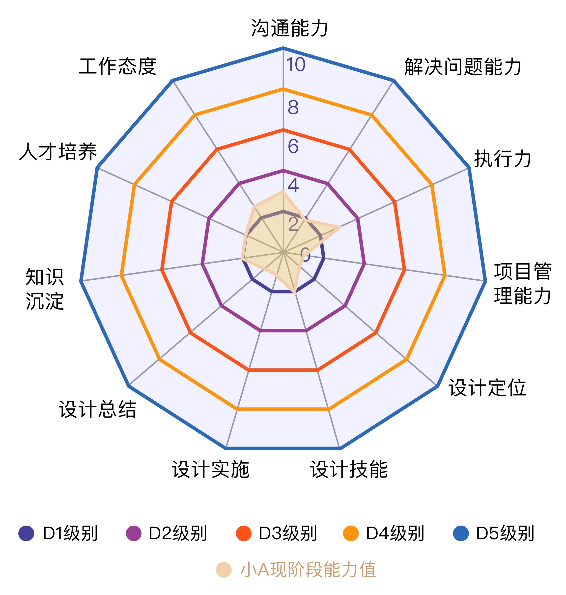
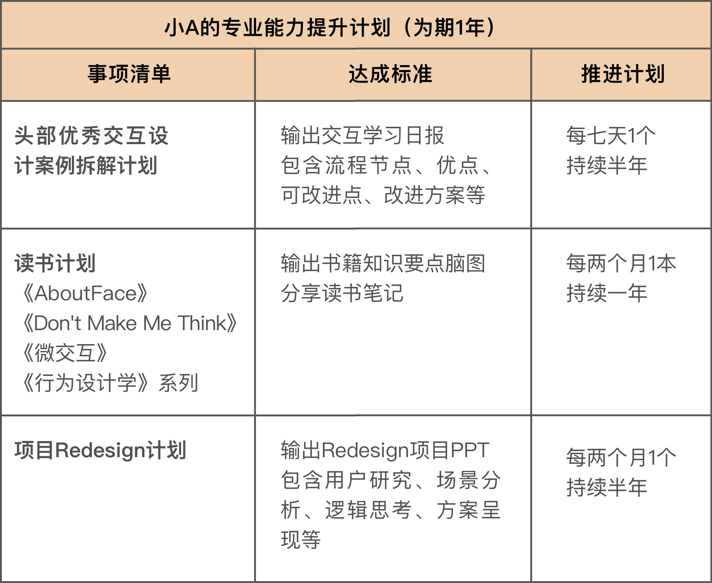

---
date: "2019-06-23"
---  
      
# 18 | 怎样用量化的方式帮助设计成长？
你好，我是炒炒。

到目前为止，我已经给你分享了七节关于设计量化的课程，不知道你对量化这件事，是不是有了一个全新的认识呢？那么，这一讲，我们又要了解哪方面设计量化的内容呢？

在前面的几讲中，大部分的量化知识点都是运用在具体设计过程中的。设计做好了，那关于设计师的能力成长，你有想过也是可以利用“量化”这个方式来做成长指引的吗？

当然是可以的。而且，量化的方式会让你更清晰、更明确地找到自己的成长路径。

这节课，我就给你分享一下怎样用量化的方式，有效帮助设计师完成个人设计能力的成长。我把这方面的内容归纳成了三个关键点。首先，我们来看第一个关键点。

## 评估能力，选择提升方向

在“[11 | 设计师的能力水平可以量化吗？](https://time.geekbang.org/column/article/339363)”中，我给你讲了怎样量化和评估设计师能力水平的相关知识，你可以按照那节课中提到的思路，完成自我评估，**确定自己目前能力所属的等级**。

毕竟，客观、准确的自我认知是提升自己的前提条件。

使用能力模型对自己进行评估后，你可能会列出很多项需要提升的能力。那么，问题来了，面对这么多待提升的能力项，到底该优先提升哪一项，才是最有效果的呢？

接下来，我就结合我团队里的一个设计师的成长历程，以他作为本节课的例子，带你看一下，他是怎样选择能力提升方向的。现在，我们假设，他叫小A。

<!-- [[[read_end]]] -->

小A刚来我团队的时候，已经工作了一年多，是一名初级交互设计师。他的特点就是学习意愿很高、自驱力很强，这也是我选择他进入我团队的原因之一。

在我的团队中，设计师入职后，我都会进行一次成长面谈，和入职前的面试有很大不同。

我会进一步了解一下，他们对于现有工作的具体想法、职业规划、对行业趋势的见解等，并结合他们自己的意愿和团队的能力要求，以及项目计划，帮他们一起规划接下来的工作方向和进阶计划。

小A上一份工作是在一家小公司，所以他对自己的能力项、未来的职业方向也都比较模糊。所以，我先用设计能力量化模型，对照分析他的能力，让他对自己的能力有个清晰的认知。

[第11讲](https://time.geekbang.org/column/article/339363)的时候，我们提到过，在交互设计师的能力模型中，总共有11个能力项。

这些能力项又可以分为专业能力、通用能力和组织建设能力三大类。对于设计师来说，**专业能力是基础，通用能力和组织建设能力都是杠杆**。只有基础扎实，杠杆才能起作用。

接下来，我们针对小A的能力项得分进行分析，我们发现，他在专业能力上的得分不算太高，而他的通用能力和组织建设能力的相关项得分却还算可以。

因此，针对小A这种初级阶段的设计师来讲，**打好地基，强化专业能力**才是这个阶段的重点。因为专业能力会直接影响到工作中的**设计输出效率和质量**，对设计师的**绩效**产生直接影响。如果设计输出的效率和质量不达标，就算你其他方面的能力再不错，估计也很难在团队中立足。

所以，还是初级设计师的小A，也把自己现阶段的提升方向放在了专业能力上。差不多过了半年的时间，团队的其他人都明显地感觉到了小A在专业能力方面的进步。连经常合作的产品经理也跟我表扬，说小A的设计输出比刚来那会专业多了，而且效率也高了很多。

那你可能会好奇了，小A在选择和确定了提升专业能力这个方向后，究竟做了哪些事情，才有了这样的进步呢？

接下来，一起来看看，我们是如何帮助小A提升和蜕变的。

## 结合方向，设定有效目标

其实，这第二步，就是结合要提升的方向，**设定有效的目标**。

说到目标，我先来给你举一些描述目标的例子。有一些人是这样描述目标的，“我要提升我的审美能力”“我要提高我的产品思维”“我要提高我的交互设计能力”“我要加强锻炼身体”……

还有一些人会这样描述自己的目标，“明年晋升为一名高级设计师”“每两周做一个产品分析报告，坚持半年”“坚持锻炼身体，每周慢跑三次，每次一小时”……

你应该发现了，上面两类人关于目标的描述，是不是觉得第二类人关于目标的描述更靠谱、更实际？你是不是也发现了这些靠谱目标的共同点，就是**可量化、贴合实际。**

那么，为了提升自己的专业能力，小A给自己设定了什么目标呢？

通过成长面谈，小A对自己的能力有了一个客观的认知。他结合我们团队的设计师能力指标量化，给自己设定了第一个阶段性的目标：**利用****一****年的时间，让专业能力达到D2级别**。

对小A现阶段来说，这个目标就是一个有效的目标。

第一，这个目标是可量化的，一个可量化的目标，就不能用一些模糊的词组来描述目标。

第二，这个目标是符合实际情况的。一般情况下通过努力就够得着。但是，假如小A说要用一年时间让专业能力达到D5级别，虽然这个目标是可量化的，但可能有点不太符合实际情况。

毕竟，专业能力达到D5级别的人，基本都在设计领域工作八年以上，且在行业有一定的影响力。小A才工作一年多，无论是专业能力还是对设计的感悟，离这个目标看起来，都需要大量时间和项目的深度打磨。

现在，我们知道第二个关键点了，就是设定好可量化、贴合实际的有效目标。那我们通过怎样的执行方式才能更好地达到目标呢？我们一起来看一下第三个关键点。

## 拆解目标，量化落地事项

为了达成一个目标，我们通常会把这个目标拆解成可以落地的几件事情。当我们把这些事情都完成了之后，目标或许就能够达成了。小A的目标是利用一年时间，让专业能力达到D2级别。

于是，我们帮助小A制定了一个为期一年的学习计划，这个学习计划大概分为了三个主要事项。

通过这份计划表可以看出，他并不是简单地把事项列出来就完了，而是把每件事情进一步拆解，有事项、有达成标准、还有明确的推进时间。这样，事情拆分得越明确，目标达成的可能性就越高。如果仅仅简单地只写出要做什么事情，那这件事情大概率的结果就是无疾而终。

接下来我再展开分享一下小A的这些计划事项的落地细节，希望能够给你带来更多的启发。

我们先来看第一件事——头部优秀交互设计案例拆解计划。

这件事主要是帮助他学习到一些优秀的交互设计思路和方法，保持自己交互思维的敏感性。

他计划每七天分析1个优秀的交互方式，但是，这个练习并不是下一个优秀的头部产品看一看、点一点，然后觉得这个交互好就完事了，而是要对交互方式进行流程分解，去思考这个交互好在哪里；如果是自己的话，会怎样处理，有没有更好的处理方式；另外，有没有一些可以优化的点，如果要优化，自己的方案是什么。

为了督促自己每日一练，他还参加了一个打卡群，用这种方式来督促自己完成每天的目标，避免目标被莫名地遗忘。他还给自己设定了一个小的惩罚机制，就是如果哪天没有做，就在打卡群里发一个30块钱的红包。这种小小的惩罚机制也反向督促了他目标的执行。

第二件事——读书计划。

小A结合别人的推荐，筛选了基本和专业能力层面联系度较高的书籍，用书籍中的理论知识进一步完善自己的知识体系。但是，读书也并不是翻一遍书就完事了。

每读完一本书，他都会把书中的核心知识点用脑图的方式梳理出来。另外，他还会把自己在读书过程中的一些思考以读书笔记的方式记录出来。**从输入到输出**，能把知识用自己的语言讲出来，才是真正的掌握。我记得小A还在内部的分享会上分享了他的《微交互》的读书笔记。

看完小A的读书方式，你可以回想一下，自己是怎样看书的呢？是像小A这样会形成知识点脑图和读书笔记，还是翻完就算读完了呢？

第三件事——对一些优秀产品进行交互设计的Redesign。

**先学习，****再****优化**。通过虚拟项目的方式，可以实践和验证一下自己在交互上的一些思考。

他选择了三个自己喜欢的产品，做交互设计的Redesign，每两个月做1个。同样地，Redesign这件事也并不是简单地把页面做出来就万事大吉了，而是要对现有产品的用户场景、交互流程、优劣点做进一步的思考，然后再输出页面设计方案。

在最终输出的Redesign材料中，要包含用户、场景、流程逻辑、设计切入点、方案页面设计等完整的思考过程的呈现。如果只是输出最后的页面设计，没有中间的思考过程，那么这个Redesign就不算是完成。

以上就是小A在事项落地上的一些细节，不知道有没有给你带来一点启发。

最后，通过这些计划的逐步执行落地，小A到了下一年能力评估的时候，他的专业能力基本达到了D2级别，而且到了年底的绩效评估，他也理所当然地进入到了升职加薪的名单内。

## 炒炒总结

今天，我们通过设计师小A成功晋升的例子，get了用量化的方式帮助自己成长的秘诀。

主要有三个关键点，我们来总结一下。

第一，先用量化评估的方式，客观评估自己的能力，选择自己的努力方向。在能力模型里，专业能力是基础，通用能力和组织建设能力是杠杆。基础扎实了，杠杆才能发挥作用。

所以，对于初级阶段设计师来讲，优先打好基础会更有效果。

第二，结合提升的方向，设定有效的目标。有效包含两个必要条件：可量化、贴合实际情况。

第三，拆解目标，形成待办事项，并且用量化的方式进一步拆分这些待办事项。需要注意，量化的待办事项一定要明确什么时间、做哪些事情、输出什么结果。而且在每一项的落地时，不能只做单一的、重复性的工作，为了完成任务而做，要有自己的思考在里面。

另外，你还可以通过设定打卡、小小的惩罚机制来督促这些事项的落地。

最后，希望这种量化的方式也能够给你一些帮助，助你完成能力进阶，升职加薪。

## 课后题

请你尝试着确定一下自己的提升方向，并根据这个方向，设定出一个有效目标。试着拆解一下目标，简单地列出2\~3项可以落地和量化的事项。

记得在留言区和我讨论、交流你的想法，每一次思考都会成为你进步的基石。

如果你喜欢今天的内容，也欢迎你把这一讲分享给你的朋友。

感谢你的阅读，我们下一讲再见。