---
date: "2019-06-23"
---  
      
# 05 | 重新认识视觉（中）：构图的力量
你好，我是Rocky。

上节课主要是给你讲解了视觉是如何生成、如何被感知到的。同时我在色彩的层面给你介绍了色彩心理学，今天我们接着来谈谈视觉中的构图部分。

## 构图

还记得咱们重新认识感觉里面提到的几个特性吗？整体性、选择性、对比性、理解性、恒常性、联觉性和错觉。其实这几个特性，就是**人在自然世界中寻找意义**。

意义来源于对规律的探寻。即便无规律，大脑也会尝试创造出规律。人会从图形的组合中，从整体中寻求规律，也会从单个的图形中寻求意义。前者就是格式塔原理，后者就是形状心理学。

### 格式塔原理

我们先谈谈格式塔原理。在20世纪早期，一个德国心理学家总结了人在整体性、选择性和对比性的一些规律，统称为格式塔原理（Gelstalt）。其实格式塔就是德语图形的意思，本来如果叫图形原理听起来概念就挺清晰的，但是阴差阳错非被叫成了格式塔原理。

先不吐槽，我们来看看这个德国人到底发现了哪些人类寻找图形组合规律的原理呢？这些原理都非常简单，我们先看看下面的例子。

同样的16个小圆球，在A图里就成了4行，在B图就变成了4列。你会发现，我们看行与列的观感，其实和球之间的间距有关。

A图横向上小球的间距更小些，就会被人理解为是属于一起的。B图纵向上小球间的距离更近些，看起来就是属于一组的。**距离近的关联亲密，距离远的各自独立分组，这就是格式塔理论中的接近性原则。**

<!-- [[[read_end]]] -->

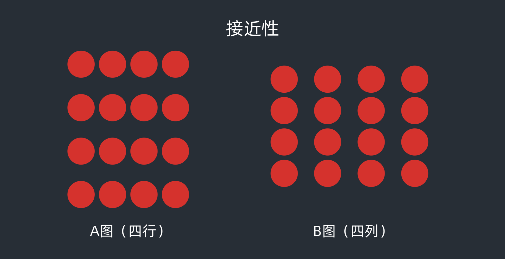

其实距离也并不是绝对有效。我在C图里把第二列和第四列的色彩调整为不同色，你很可能就改变了是四行的认知。而且你会容易认为第一、三列是一类，第二、四列是另外一类。这说明色彩对归类的优先级大于距离。

在D图里，保证距离不变的前提下，我把A图的第一列换成了方形，你也肯定会理解为左边的第一列是一类。

在E图里，在保证左右距离不发生变化的前提下，我把第一列的球放大，你也很容易做出判断左边第一列是一类。

以上三种情况，就是格式塔理论中的相似性原则。它们分别是**色彩相似**，**形状相似**和**大小相似**。

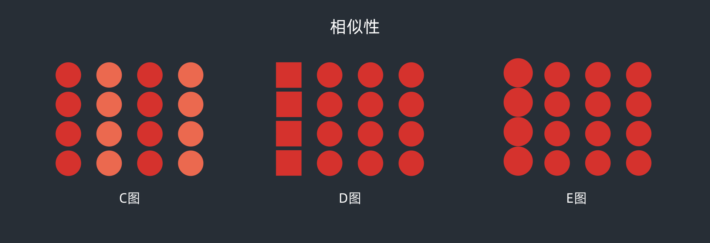

在下面的F图中，这些小球没有连在一起，但是我们还是会清晰地看出一个大写的M字母。人眼的视觉会偏向连续的形式，在观察事物的过程中，我们会情不自禁地形成一种视觉延续的感受，这就是格式塔的连续性原则。

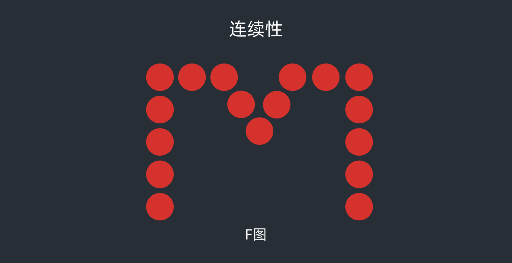

再看看G图，G图是我在B图的基础上做了一些处理得到的（我把某些球去掉了四分之一）。在这个场景下，你已经几乎看不到球了，你看到的是4个类似花瓣的图形。而且尽管没有正方形的存在，但我们还是能在视觉上脑补出矩形。这种**视觉上人自动把空白填满形成封闭的空间的能力，就是格式塔的闭合性原则。**

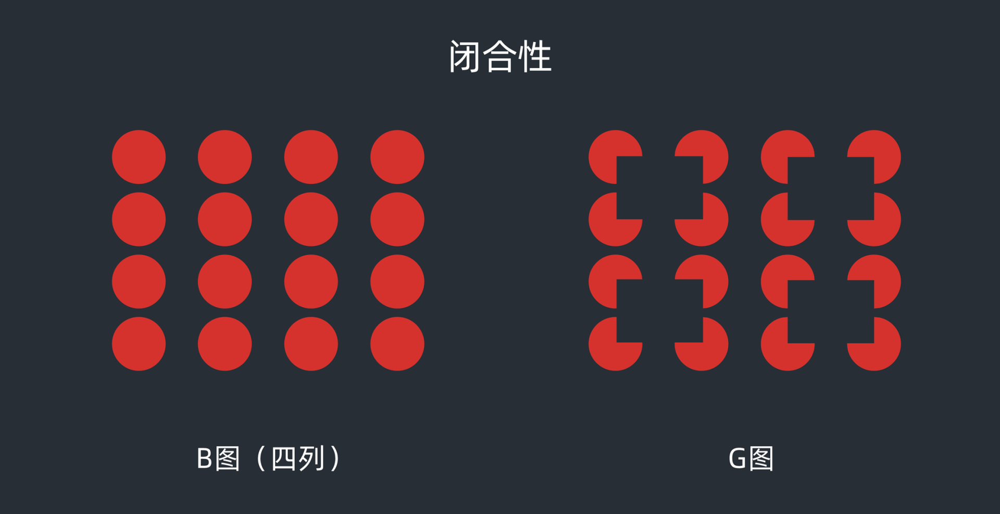

在H图中，从最上面的图形里你能看出什么？最直观的感受是两个圆相交。进一步分析，也许你会觉得是两个月牙形对称，或者对称的月牙形中间多了一个纺锤形。

但你很难去接受这个是一个圆形加上一个月牙形（尽管外轮廓是一样的）。**在观察事物过程中，我们第一印象更倾向于简单而且对称的图形，这就是格式塔的对称性原则。**

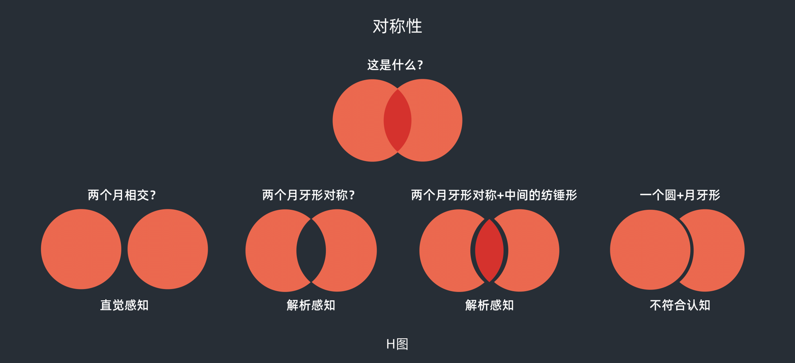

我们继续回到图B。我在B图上面两行的背后，增加了一个大大的暖色的矩形。你会立即感觉出这个矩形是背景，前面的8个小球是前景。而且这8个小球属于一类，其他没有在矩形框住的其他小球属于另外一类。

**当小图形重叠于大图形之上，我们的视觉会倾向于将小图形归为主体，大色块为背景，同时把小图形归为一组，就是格式塔中的主体与背景原则。**

以上这些格式塔原则，在我们做版式设计时经常会被混搭利用。把图文信息以不同距离、形状、大小、颜色、背景分组排列，就可以在视觉上营造视觉层次，便于用户阅读，让主要信息、次要信息、辅助信息等内容各司其职。

栅格系统布局设计就是格式塔原则运用的典型体现。我在这里给你分享一些运用格式塔原则的小技巧。

首先，一定要让用户理清视觉层级，建立关系。相似性是基础。如果某些界面上的元素是属于同一组的，那就要尝试拉近他们之间的距离。

其次，如果因为界面空间的局限，导致距离达不到要求，那就要通过一些区域分割的方式（不同的背景，不同的框图，或者简单的分割线）来制造元素的分组。或者通过色彩、形状、大小、材质感来分组。

最后，在B图的基础上，我让其中随机3个小球左右抖动起来变成了J图。你会立即发现，这3个球属于一类，其他没动的属于另一类。看来，运动的优先级也是大于距离的。**一起运动的物体会被感知为属于同一组或是彼此相关，这就是格式塔中的共同命运原则。**

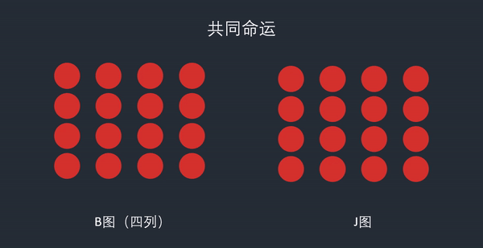

共同命运原则在动效设计中被大量运用。比如苹果手机删除多个应用时候的图标抖动，又比如拖拽移动多个文件夹时的移动动效。当你设计多个物体需要一起运动的时候，共同命运应该是第一个跳入你脑海中的基本原则。

在我们在做好了一个界面设计后，你可以通过格式塔原理来校验一下你的设计是否符合人类寻找图形组合规律的心理学认知。

## 识别物体

人对图形的整体组合规律有一个大概理解后，是如何识别具体物体形状的呢？我接下来会从形状心理学开始，给你分析一下不同的形状究竟会给我们带来哪些不同的感觉。我还会和你聊聊在设计中，如何去考虑我们看物体的视角与别人注视的方向。

### 形状心理学

人类从出生之后，在我们的记忆中就会存储非常多的形状，以及对应的物体心理学认知。人类至少能快速识出24种基本形体，它们构成了我们能看见和辨认的所有物体。不同的形状会带来不同的心理感受。我下面会给你举几个常见的形状例子。

矩形因为和建筑联系在一起，它会带给人可靠、安全、信任和权威的感觉。矩形也代表着规矩、纪律。如果你希望增加活泼和亲和力，请避免用直角矩形，以圆角矩形取代。圆角矩形边缘的弧度会让你的设计更加年轻和具有活力。

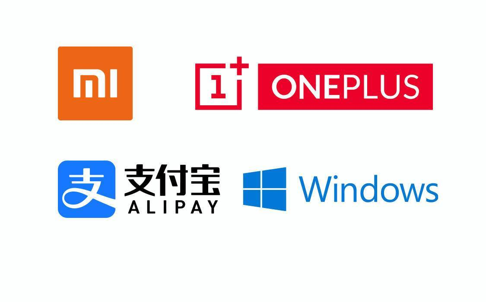

圆形代表了整体和和谐的概念。圆形也因为和宇宙中星体形状一致，因此会给人带来永恒、圆满和神秘的感觉。

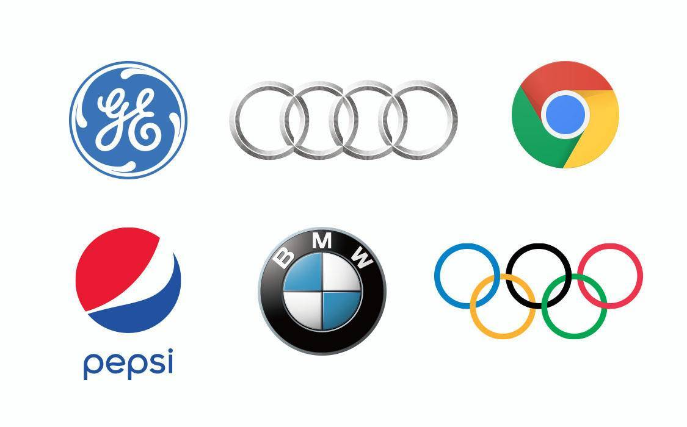

三角形，给人坚固、权力、科学、宗教、法律、男性化、动感的心理感受。 正三角会让人感觉稳定和平衡，但是倒三角会让人感觉到危险和紧张。

黄金分割，这是隐藏在大自然的一个神奇的比例1：1.618。在自然界当中太多黄金分割比例存在（比如螺纹、向日葵、蕨类植物、人体比例等等）。黄金分割给人的联想是成长、发展、生命、创造力和循环。

我以前在华为设计部，给图标设计师提过这样一个要求：把黄金分割用在所有的桌面手机图标设计里面。结果还真设计出一套严格按照黄金比例的系统图标，图标所有的圆弧都以黄金比例的圆来进行切割。那套图标毫无争议地被选为华为的其中一套默认系统图标。

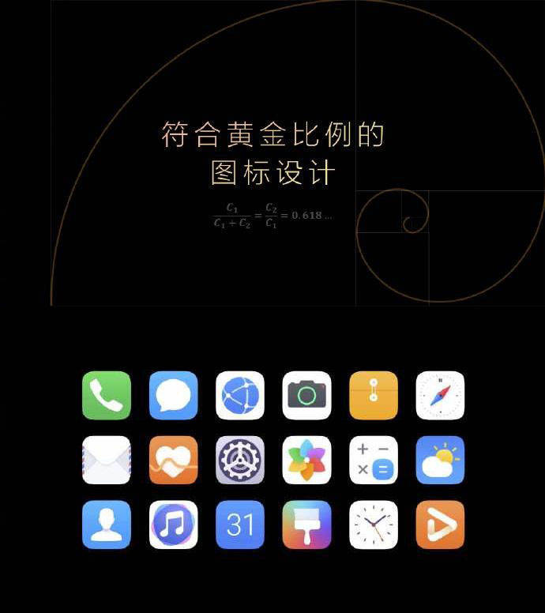

平行线会给人带来冷静、发展、有稳中求进的心理感受。但如果把平行线旋转90度，变成垂直平行线，就会给人力量、侵略、霸道的感觉。

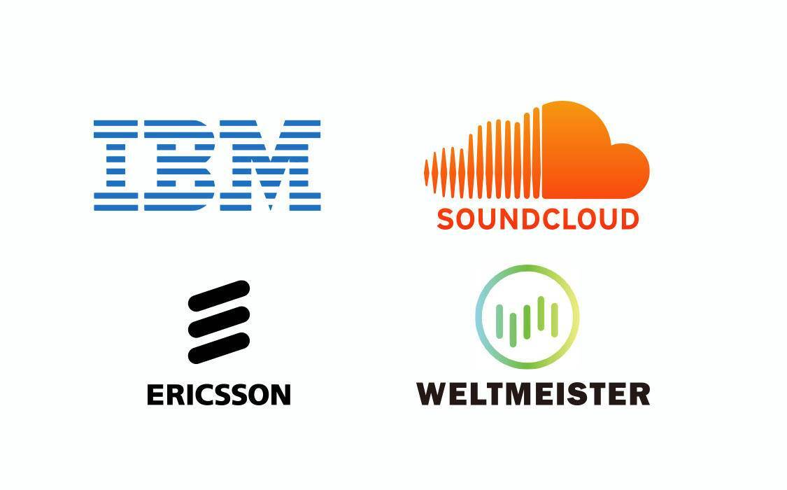

其他自然界存在的形状，它们大多数都会给人心理上有机、自然、活力、平衡、清新的感受。很多动植物也可以有自己的特征和符号。例如玫瑰代表了爱与激情，狮子代表骄傲与勇敢等等。

莫比乌斯环，无穷大的符号图形表达，在人的心理认知上是无穷大、亘古永恒、生命循环、无限可能。

形状是几乎所有设计中都无法忽略的关键性因素。我们不管设计什么样的元素，都要选择恰当的形状，去传达相对准确的情绪。在体验设计中，经常是多种形状进行搭配使用。

### 视角

讲完形状，我们来看看我们看形状时的视角。曾有人做过一个实验，让世界各地的人画一下咖啡杯，结果大部分图片都是类似下图这样。

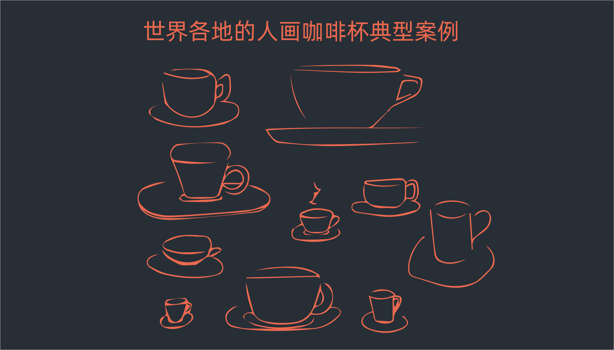

你发现什么特点没有？这些咖啡杯个别是正面的，但是多数都是略微俯视的角度，而且杯把大多数都是右边。这是因为人们对事物的认知，基本上都是标准视角的认知。

如果有人画了一个咖啡杯是正上方俯视，或者正下方仰视，估计很多人一开始很难辨别出来这是个咖啡杯。

这个实验告诉我们，**人从标准视角识别物体速度最快**。因为人类大部分的思考、记忆、想象和识别都是通过标准视角进行的。所以如果你要设计一个希望别人很快认出来的图形（比如图标），别忘了用标准视角构图。

### 别人的注视方向

我们人类对眼睛的注视方向特别敏感。前面我在04里讲选择性的时候，举了一个你跟随你的朋友的眼神，看到一个红衣美女的例子。这种**观察者追随他人注视线索，迅速转移注意的现象称为注视追随。**

在构图设计时候，巧妙运用图像中人物的视觉注视线索，会给用户带来不一样的体验感受。你可以看看下面两张电影《阿丽塔》的海报。

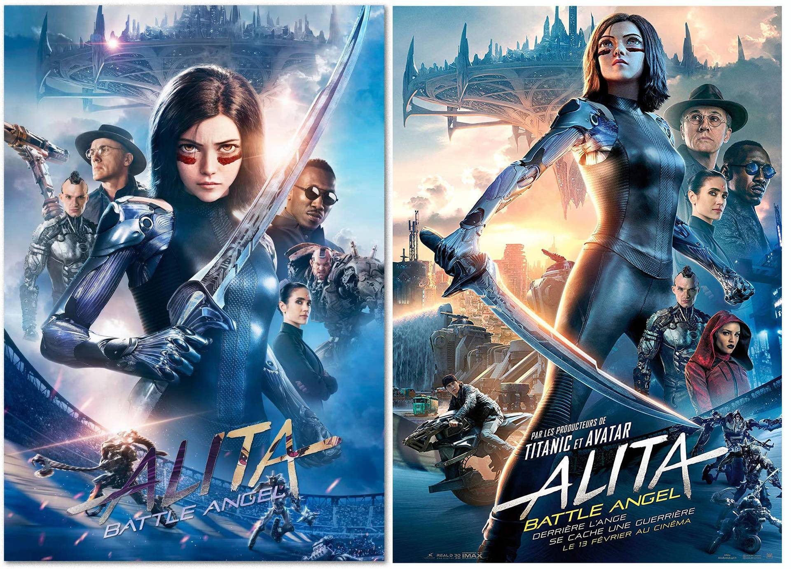

左边的Alita盯着你，你能从她的眼神中看到坚定、无畏，有一种和这个人物直接进行灵魂沟通的错觉。右边的Alita盯着天空，你的视线也被引导到天空，于是你开始观察天空上的空中都市。你的思绪也被她的视线引导，也和她一样，希望探寻身份之谜。

我们在banner设计上，可以用借用这种方法。如果你希望画面与用户产生灵魂沟通，提升感染力的话，图中的人物一定要与读者有眼神交流。如果你希望让人物视线引导用户的注意力在某些事物上（比如商品），或者想要有助于物体的识别，那么图中的人物的目光就要朝向目标物体。

## **总结**

好了，讲到这里，今天的内容也就基本结束了。最后我来给你总结一下今天讲的要点。

在今天的课程里，我们重点谈了构图中的心理学。

人总是从图形中寻求意义。首先是整体性和图形组合的意义。通过格式塔原理，其实我们可以发现，人对构图的理解无非以下几种类型的组合：接近性、相似性（形状相似、大小相似、色彩相似）、连续性、封闭性、对称性、主体/背景以及共同命运。

体验设计中要通过对格式塔的理解，理清视觉层次，建立关系。通过距离、背景、框图或者分割线分割区域，你也可以通过色彩、形状、大小、材质感、运动特征等来分组。

人类在理解整体后，就会开始寻求具体形状的意义，识别物体。和上一节课理解色彩一样，我们也先从形状心理学开始。不同的形状有不同的心理感受，我们需要在设计中组合运用这些特点，选择恰当的形状，去传达相对准确的情绪。

人类倾向于通过标准视角来理解认知物体，所以如果我们要设计一个别人很快就能认出来的图形，就需要用标准视角构图。

根据人注视追随的特点，要善于用图像中的人物视觉焦点线索，去牵引用户注意力和体验感受。直视会更容易和用户产生灵魂沟通，而其他的视线引导，可以牵引用户注意力。以上就是本节课的要点了。下节课，我们一起来学习视觉中的排版部分。

## 作业

最后，我给你留了一个小作业，从今天我讲的内容，希望你重新审视你最近的构图设计，然后逐条对照一下，看看有无改进的可能？

同时，你最近有遇见过什么有意思的电影海报或者图标吗？欢迎在评论区分享一下。