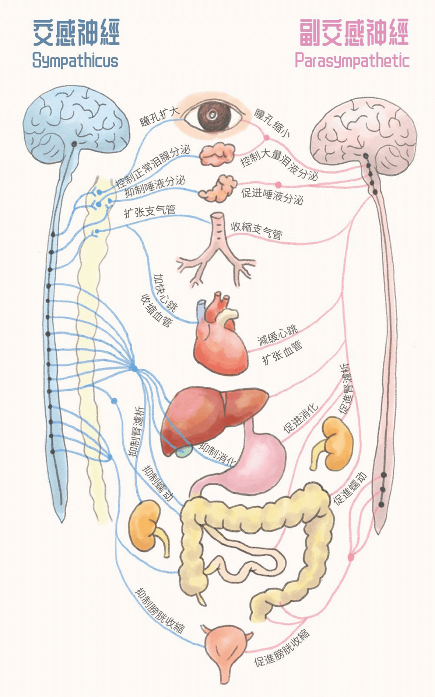
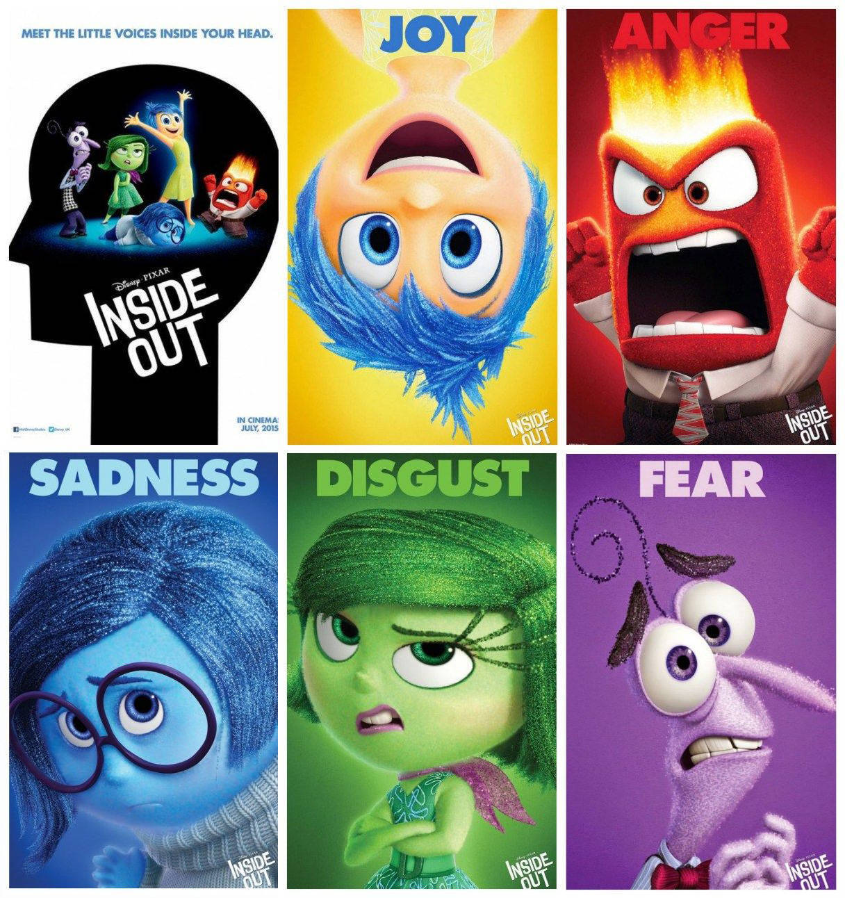
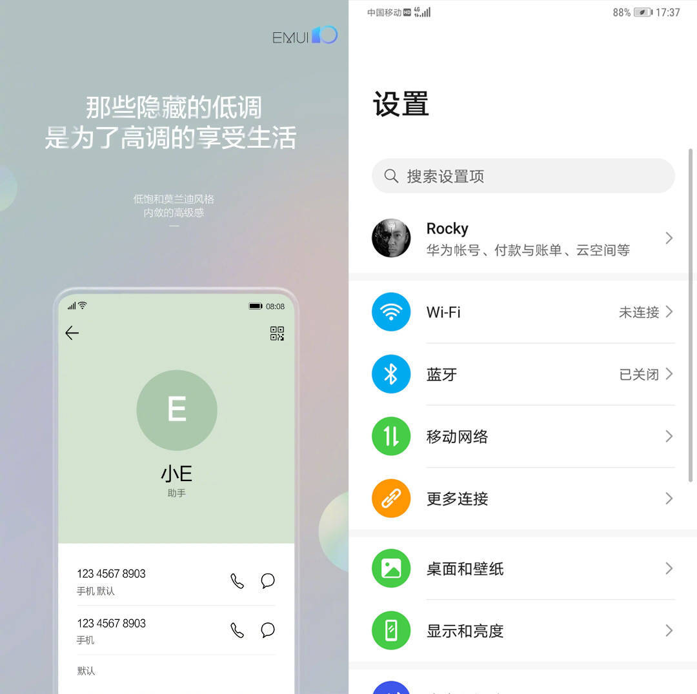
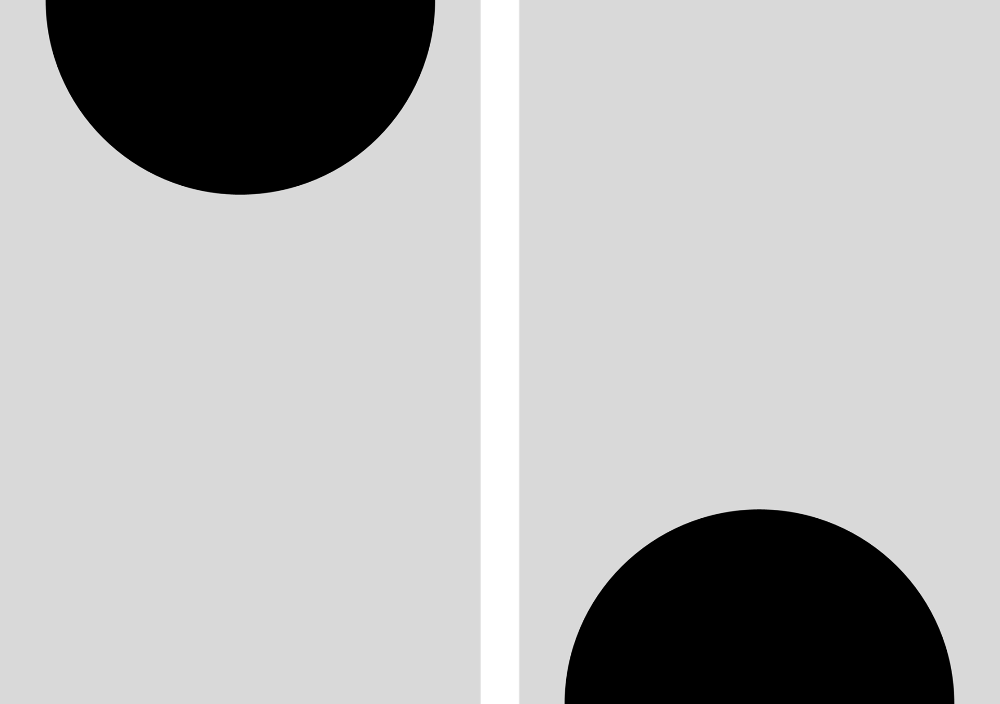
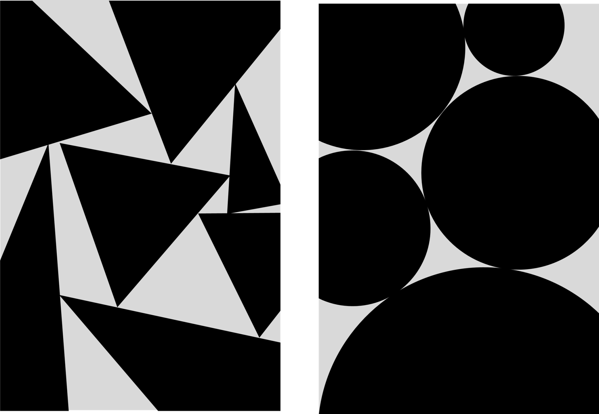
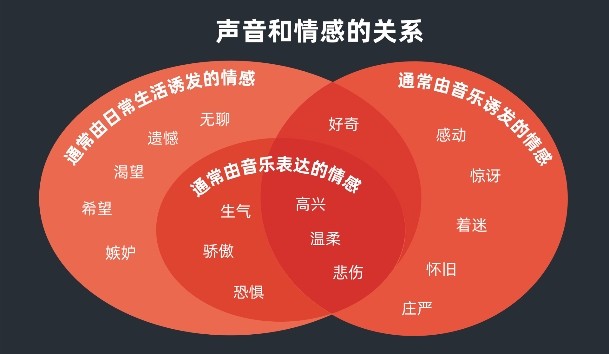
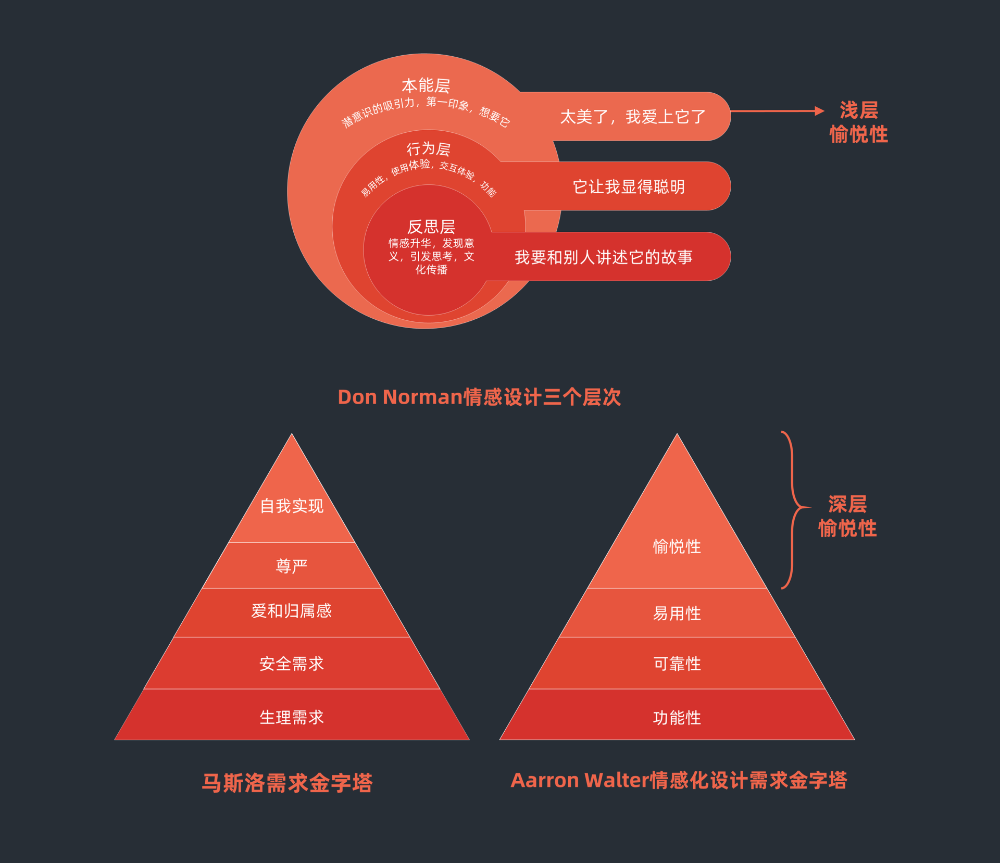
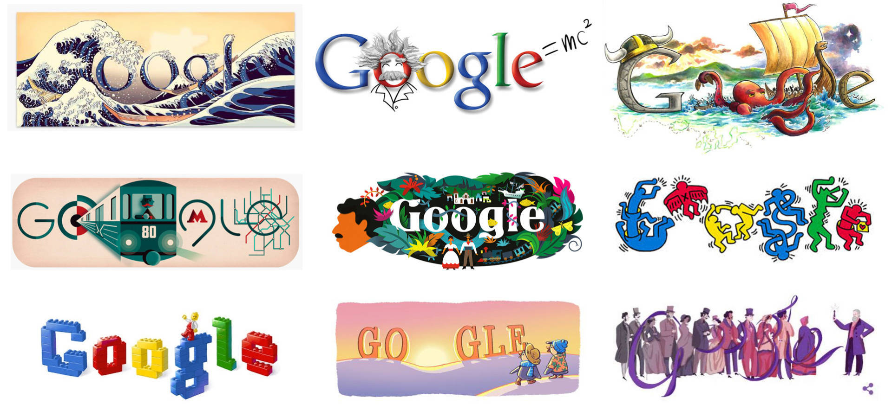
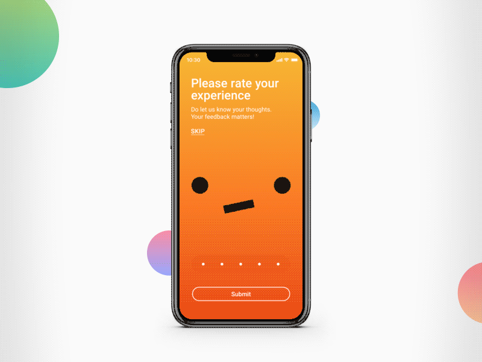
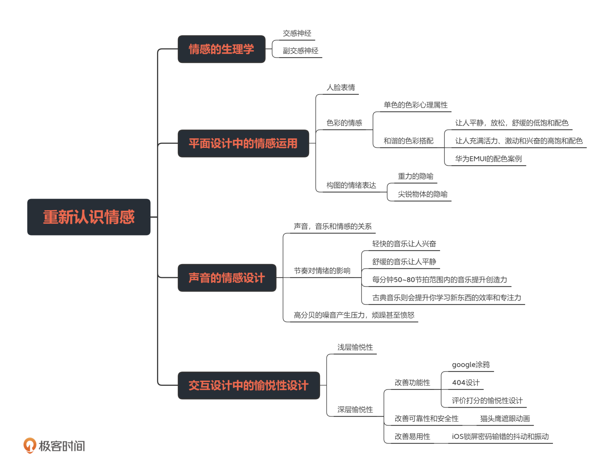

---
date: "2019-06-23"
---  
      
# 11 | 重新认识情感：愉悦性设计
你好，我是Rocky。今天我们来谈谈情感和设计的关系。

在情感和设计的关系里，其实有两个维度。一个维度是如何让设计唤醒人的情感共鸣，另一个维度是如何利用人的情感进行交互。前者称为情感设计，后者称为情感计算。今天我们先聚焦在情感设计上，关于情感计算的相关知识，我会在后续讲智能交互的时候再展开。

## 情感的生理学

在谈情感设计之前，我们先看一下情绪是如何影响我们的。情绪引发的生理反应由自主神经系统来实现。

情绪刺激由大脑皮层处理后传到情绪中枢杏仁体，再通过自主神经系统传导到身体各处，让你产生不同的生理反应。**自主神经分为交感神经和副交感神经：**

* 交感神经负责应对环境中的压力。比如会让你脊背发凉、汗毛直竖、满脸通红、心跳加速，会调动你的全身运动资源应对；
* 副交感神经负责休息时的身体机能应对，比如让你心跳平缓。

刚刚提到的生理反应和情绪的对应关系，就表明了通过人因实验环境，可以验证我们的设计是否达成效果。比如眼动仪可以感知瞳孔的变化，面部红外感应仪可以感知面部血液的流动，心跳和血压监控可以感知你的紧张情绪等等。

## 平面设计中的情感设计

带你理解了情感的生理学知识后，我们接着来看平面设计和情感的关系。

### 人脸表情

人的情感是复杂的。在心理学研究中，最基本的情感有7种：恐惧、惊讶、厌恶、蔑视、愤怒、快乐和悲伤。这些情绪是普适性的，特别是面部表情对于情绪的表达，不管是什么文化背景的人，调用40块面部肌肉表达情感的方式都很类似。所以全世界任何地方人都能读懂这七种表情。

<!-- [[[read_end]]] -->

下面我举的几个例子，从左到右，从上到下依次为：惊讶、蔑视、愤怒、厌恶、悲伤和恐惧。你在做广告和平面设计时，可以通过人脸表情运用给观者带入到不同的情感状态。

### 色彩的情感

除了人脸，色彩也有强烈的情感暗示。我给你讲一个对色彩情绪化的小例子，下面是电影《头脑特工队》中的几个情绪小人：

* 用明亮的黄色诠释乐观积极的乐乐；
* 用频谱上最强烈的红色诠释总是暴躁发火的怒怒；
* 用深蓝色来诠释忧郁的忧忧；
* 用蔬菜和青虫的绿色诠释对什么都反感的厌厌；
* 用蓝色和红色两种冲突色混合的紫色来诠释惧怕一切的怕怕。

除了单色，颜色的搭配也同样重要。相近色、互补色和拟自然的配色会带来和谐的感受。和谐分为两种：

* 饱和度低的色彩和谐。比如莫兰迪色，人对这种色彩的情绪感受是平静、放松、舒缓；
* 饱和度高的配色和谐。这样的配色给人的情绪感受是充满活力、激动和兴奋。

**如果是儿童产品，就需要用饱和度高的配色。需要安静的氛围就需要饱和度低的色彩搭配。**

我以前在华为给EMUI 10做色彩体系设计的时候，就采用了上面的原则。在某些大面积的色块，采用宁静的莫兰迪色，可以不喧宾夺主。而在某些小面积的系统图标，我用了饱和度较高的色彩，来吸引大家的视觉焦点，激发兴趣。

### 构图的情绪表达

除了人脸和色彩，构图也一样会对情绪产生影响。**利用物理世界重力的隐喻，视觉设计会让人产生不同的情绪反应。**

比如下面左边的图你会感觉紧张不舒服，因为你会随时担心这个顶部的圆会掉下来。但是右图你会觉得这个圆很稳地停留在底部，心境会平和。所以，当你希望牵引用户压抑和焦虑的心境时，在构图的画面上方可以设计视觉很重的元素。如果你不想要一个压抑的感觉，就要避免这种构图。

同样，在物理世界中人惧怕被尖锐物体刺到，这种紧张感也会在视觉设计中映射到。比如下图的左边各种尖角相互交错就造成了紧张感，而右边是圆球的堆叠就不会有这种不安全感。所以，除非你希望制造焦虑感，可以用左边的形式，否则就要避免。

## 声音的情感设计

除了视觉，声音同样也会影响人的情感。声音影响人的情感有很多方面的原因：

* 某些历史声音记忆能引起反射和共鸣；
* 声音的节奏和生理节奏的合拍程度不同，会引起舒适或者不适；
* 声音引发文化群体共情或者情绪传染。

有些情感只能由人声来诱发，有些情感可以由音乐来诱发，还有些音乐直接就表达了情感。在音乐可以表达的情感中，音乐的律动会牵动情绪的变化，从而让创作者和听者产生共鸣。下图给出了声音和情绪的关系，你可以参考一下。

### 节奏对情绪的影响

音乐节奏会影响情绪，背后的机理是节奏共鸣。当音乐节奏和身体的节律（如心率、呼吸、脉搏）不同时，身体节律会根据音乐节奏而调整，并最终形成一个新的相对稳定的状态。

**轻快的音乐节奏快于身体的节奏，这样会刺激交感神经。**交感神经是在身体需要迅速被动员时候起作用的。不知道你会不会一听到轻快的音乐，就想跟着摇摆呢？

而**舒缓的音乐节奏慢于身体的节奏，会加强对副交感神经的刺激。**副交感神经系统在人感觉疲惫或者身体需要静止的状况下占据主导地位，所以会加速让人安静下来。

研究还发现，节奏在每分钟50\~80节拍范围内的音乐，可以帮助诱导大脑中的阿尔法α脑电波，让你注意力更加集中，并大幅度提升你的创造力。古典音乐会提升你学习新东西的效率和专注力，自然白噪声会让你更容易平静下来。

对应到体验设计上，那就是在需要用户多停留、心情平静的情景里，适合使用舒缓的音乐（比如比较安静的酒吧）。当需要增加用户流量，提升用户交互速度，和刺激紧张情绪的境况中，就适合运用快节奏的音乐（比如快餐店）。

有研究发现，当超市播放慢节奏音乐时，销售额会比播放快节奏的音乐高38\%。在需要创新的场景中，最好背景音乐选用每分钟50\~80节拍范围内。如果你希望提升用户专注力，请选用古典音乐作为背景。

### 噪音与情绪

除了节奏，噪声对情绪的影响也非常大。根据全国物业协会的数据显示，邻里噪音的投诉量占比超40\%。高分贝的噪音会刺激中枢神经，让人产生压力，进而变得烦躁甚至愤怒。这也就很好地解释了为什么重金属音乐常常引发骚动和混乱。

## 交互设计中的愉悦性设计

谈完平面和声音的情感设计后，我们接着来看一下交互设计中的愉悦性设计。对于我们普通的产品而言，情感设计最应该聚焦在快乐上面，但很多人对这个词有很大的误解。

当你听到愉悦性设计一词时，你会先想到什么？炫酷的动效？时尚的插画？还是简洁美观的外观设计？

很多设计师容易刻板地把愉悦性理解为表层UI元素，但这并不是正确的理解。酷炫、时尚、美观这些词仁者见仁智者见智，本身就带有争议性。所以为了更好地阐述，我们先定义好愉悦性。

**愉悦性是指用户与产品交互时，产生的任何积极的情感影响。**这种积极影响来自于本能层，也来自于行为层和反思层。

愉悦性设计有两个层次，它们分别是浅层的愉悦性和深层的愉悦性设计。很多人第一时间想到的UI界面主要还是本能层的浅层愉悦性。

而在功能性、可靠性，愉悦性的累计满足之后，产生的愉悦则是深层次的愉悦。深层次的愉悦性可以类比马斯洛的需求，在体验设计上属于高层次的情感累计。你可以参考下面这幅图，在需求金字塔中，如果没有好的功能性、可靠性、易用性，那么愉悦性也是根基不稳的。

那么哪些交互愉悦性可以提升下层体验需求的呢？我下面举几个例子。

### 改善功能性

有些愉悦性设计是对某些功能体验很好的改善。你可以看看以下三个设计。

第一个是**Google Doodle**的设计，它又叫Google涂鸦。这是为庆祝节日、纪念日、成就以及纪念杰出人物等，对Google首页商标所做的一种特殊临时变更。有些涂鸦是插画设计，有些是动画，甚至有些是可以挖彩蛋的互动小游戏。

Google搜索引擎的首页设计一直以极简设计著称，但Google涂鸦绝对是给这个界面增加了非常多的亮色。下面我随便摘录了几个，你可以感受一下。

第二个是**404**的设计。在网页浏览过程中经常有异常情况发生，404就是很多人经常遇到的页面。不管404指向的原因是什么，但一个可爱的插图总比一个冰冷的404更能缓解尴尬，带来愉悦性的感受。

第三个是**评价打分**的愉悦性设计。很多应用程序都会在用户使用过程中，要求用户根据自己的使用体验打分。很多产品设计师就是简单做了一个调查表，或者直接让用户从一星到五星打分来达到目的。这样就会使整个打分过程很枯燥，不能激励用户完成任务。

而如果试着把打分和人的情绪联系起来，不同的分数去代表不同的情绪表达。通过这样的动画效果设计，会使评价打分这件小事更加引人入胜和有趣。

### 改善可靠性和安全性

很多应用在让用户输入密码的时候，就是一个简单的密码框。但有的网站在输入密码时，会出现吉祥物小猫头鹰双手捂眼的小动画。通过睁眼与遮眼的动画，巧妙地表达了用户名是明文输入，而密码为密文输入的含义。

猫头鹰遮住眼睛，仿佛是在提醒用户输入密码时要注意防止他人偷窥，并且在视觉上给用户一种心理暗示，这款产品会充分尊重用户隐私并保障用户账户安全。

### 改善易用性

很多产品在交互设计中，都融入了模拟人的自然情感反应的交互细节。比如当iOS用户输入不正确密码的时候，整个界面画面会抖动同时配合振动反馈。这种简单的反馈处理就是在模拟人说“不”时的摇头动作。

类似提升愉悦性的设计细节有很多。但是请你注意，这些愉悦性存在的价值并非单纯为了愉悦性，而是为了让功能性、可靠性和易用性变得更好。不要单纯追求表面的愉悦性，而要追求深层愉悦性的交互体验。

## **总结**

这节课讲到这也就接近尾声了，我来给你总结一下今天讲的要点。

首先我们要理解情绪可以通过生理表征来进行测量和研究。自主神经系统的交感神经和副交感神经会因为情绪而引发一系列的生理变化，这些变化都可以通过仪器来进行测量。

在平面设计中，人脸表情是普适性的，平面设计可以通过人脸表情运用，把观者带入到不同的情感状态。除了人脸，色彩也会有强烈的情感暗示。饱和度低的莫兰迪色会带给人平静，放松和舒缓的感觉。而饱和度高的配色会让人激动和兴奋。

因为物理世界的隐喻，违背重力的构图和尖锐棱角的构图会给人带来紧张的情绪，要谨慎运用。

对音乐而言，每分钟50\~80节拍的音乐会提升创造力，古典音乐会提升专注力。高分贝的噪音会让人产生压力，进而产生烦躁甚至愤怒的情绪。

在交互设计中的愉悦性设计，除了注意表层的愉悦性，你更应该把产品的功能性、可靠性和易用性结合起来，综合考虑去设计深层的愉悦性。

为了方便你后续的学习，我总结了一个脑图，你可以长按保存下来，帮助你在这个知识点上有清晰系统的认知。

## 作业

最后，我给你留了一个小作业，你能运用今天学到的知识，找出在你的产品（或者你生活里喜欢的产品）中，哪些是浅层愉悦性设计，哪些是深层愉悦性设计吗？