---
date: "2019-06-23"
---  
      
# 20｜基于人因的动效设计：动效背后的物理认知
你好，我是Rocky。

从今天开始，我们开始进入高级篇的课程了。这节课我们先来谈谈动效设计。

首先我们来看下迪士尼动画制作的12个基本原则。下图里的这12原则让卡通形象用夸张手法遵循物理学基本定律，并在此基础上去呈现角色的情感表达和魅力。这12个基本原则特别经典，几乎被所有卡通动画制作借鉴，被称为动画圣经。至今仍然有非常多的原则，可以直接沿用到动效设计中。

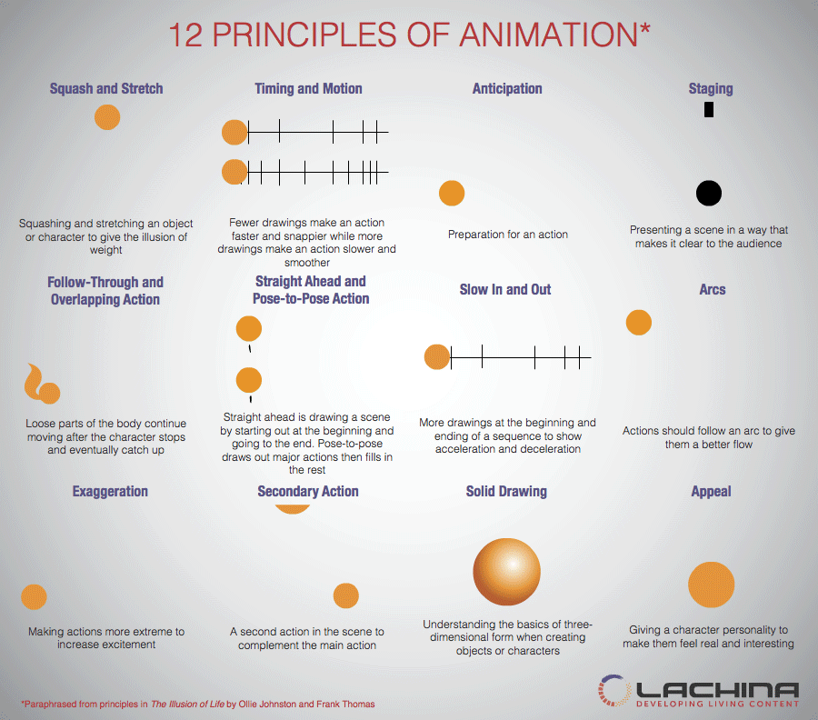

当然我们今天重点聊的不是动画制作，而是动效。动效是用来表达界面元素在交互事件下的行为关系的运动手法。

和交互有关的动效分为两类，第一类是实时性动效（也就是跟手动效），第二类是非实时动效（也就是交互完成才开始播放的动效）。动效有三点好处：

* 更清晰地体现内容元素之间的逻辑和层级关系；
* 提供当前的状态反馈，加强用户对操作行为的感知，给用户以可控的感觉；
* 通过动效设计可以辅助视觉元素更好地传达产品品牌理念。

我接下来分别从人的维度和自然物理世界的维度，分别和你聊聊动效设计。

## 人的维度

动效的表象是用视觉表现手法填充时间。那么首先需要回答的问题就是：多长时间的动效设计是合理的呢？

### 人对动效时间的感知

动效分为实时动效和非实时动效。这两种动效对时间的要求不同。

我们在[09](https://time.geekbang.org/column/article/350185)中聊过可见并能对我们产生影响的视觉刺激最短时长是5ms，对应的帧率是200帧。所以跟手的实时动效只有快到低于5ms，人才感觉不到延迟。如果要谈实时动效，那么时延比时长更有意义。下图是不同时延的视觉感受，如果你仔细观察，其实10ms的时延你还是可以感知出来的。

<!-- [[[read_end]]] -->

相对而言，非实时动效就不是越快越好了。

过快的非实时动效以人的感知觉根本理解不到。一个视觉事件与我们对它完整感知之间的时间差是100ms，100ms也是科学界公认的人类反应速度的最快极限（不经大脑的条件反射）。

而人看到一个事物然后经过大脑意识处理并有动作反应的时间，最快也要在200\~300ms左右。我们识别了一个事物之后，注意力可能会发生变化的最小周期是500ms。

综合以上数据，一般非实时动效的最佳周期要限定在100\~400ms之间。根据人对事物的理解，不同时间长度的运用也要与现实世界相符。

比如对虚拟键盘某些按键的悬浮放大来说，要把处理周期缩短在100ms。而对于某些复杂的或者移动距离长的非实时动效就需要耗时长一些，也符合用户的心理预期。

在谷歌Material Design的规范中，智能手机触屏交互非实时动画的持续时间限制为200\~300毫秒。对于平板电脑，持续时间应延长30％，大约为400\~450毫秒。在可穿戴设备上，持续时间应缩短30％，大约为150\~200 ms。原因很简单：屏幕尺寸更大，因此对象在改变位置时需要克服更长的路径。而在较小的屏幕上，行进距离更短。

控件的尺寸也会对动效的时长产生影响。控件尺寸越大，我们需要越慢的速度（即便是同样的移动距离、同样类型的动作）。这是因为要有重量感的隐喻。

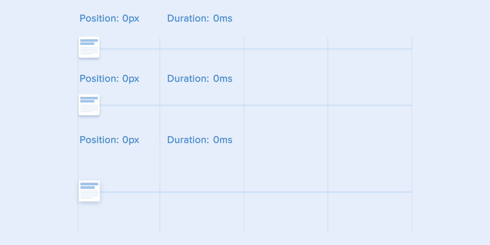

下图是苹果在左右滑动的动效设计中对重量感的运用：更轻的卡片滑动速度更快。

多任务的滑动加载本身需要更多CPU资源占用，任务调起时间会更长。这种重量感的隐喻也恰巧掩盖了技术上所需的加载时间。

在瀑布流的连续滑动中或者加载一个新闻页面时，会出现界面元素因为网络延迟逐渐刷新出来的情况，这个时候的动效就不能遵守最小100ms延迟的规律了。

因为所有的刷新清单元素依次出现的情况，本质是因为网络传输、数据加载的技术约束，而不是真实物理世界的认知。所以这种元素依次出现的延迟要做到越短越好，并且要考虑到实时动效。比如下图中左半部分就是一个比较好的处理方式。

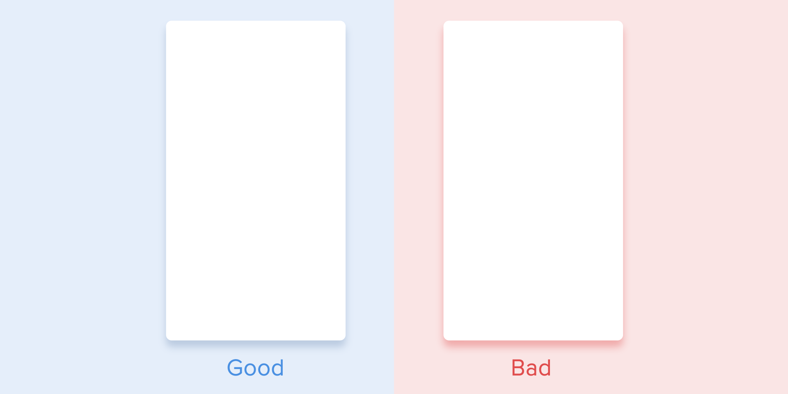

### 人的视觉深度感

我们的智能手机触摸屏是一块平面玻璃，那要如何欺骗用户的眼睛，让他能感觉到立体视觉呢？

首先我们可以考虑使用模拟焦点视觉的方法。当视野聚焦近处时远景产生模糊，就会给人感觉某些元素距离我们近，而另外一些距离我们远。比如下图中苹果的应用和桌面图标的关系。

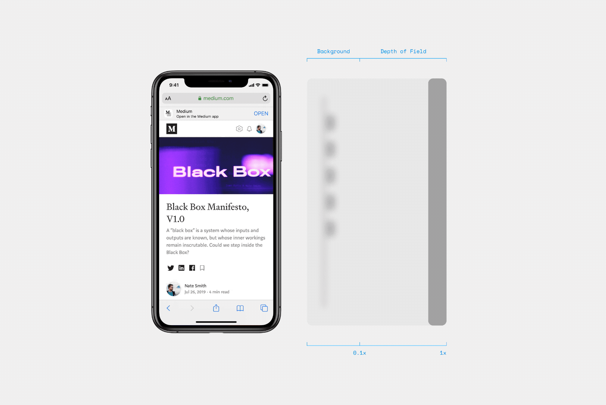

也可以根据近大远小的原理，通过缩放一个物体的大小来体现这个物体距离用户的远近。比如下图某一个元素突然从背景拉到近前，这其实是摄影手法中的滑动变焦（Dolly \& Zoom）。

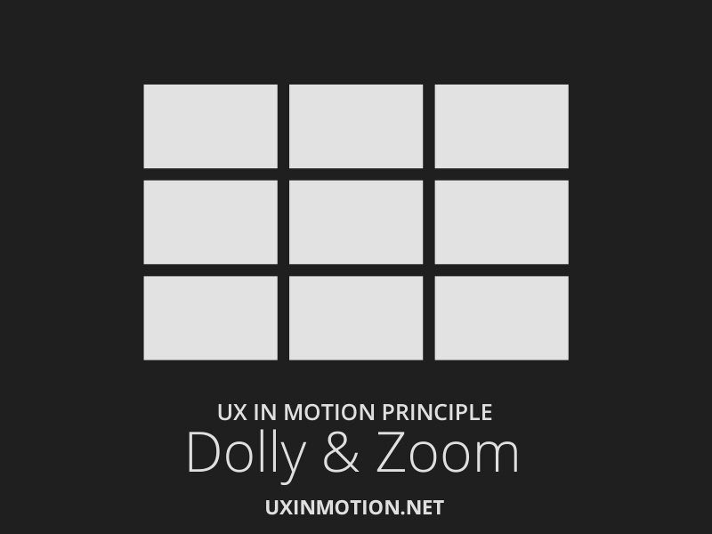

苹果在滑动变焦的隐喻中还通过距离去映射时间。天的颗粒度更近，月、年的颗粒度更远。在缩放日历、照片月视图的时候，用户能明显感觉到这种滑动变焦的镜头运用。

对运动的元素进行编组组合也能骗过用户立体视觉。当这些元素在隐喻中处于不同层级的时候，如果远处的元素运动慢而近处的元素运动快，那么就会产生视差效果。

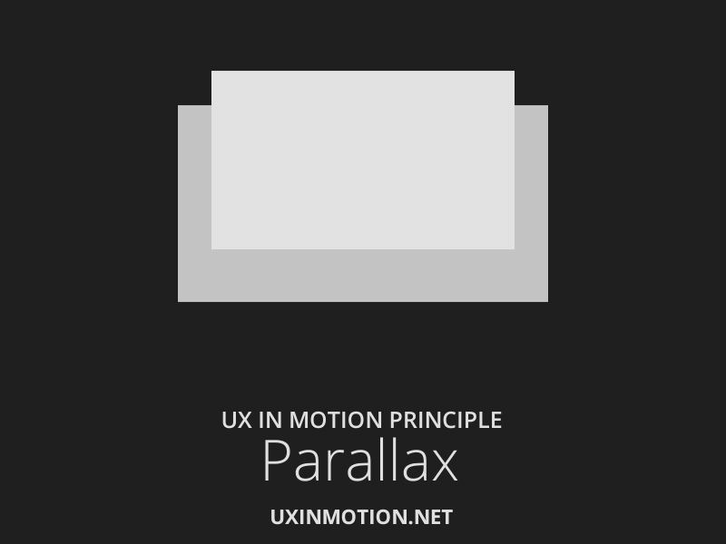

最后一种就是直接模拟翻板或者折纸等现实世界的元素，来展示某些切换。这种立体切换的元素一般都处于同一层级，采用立体化表达仅仅是单纯的效果运用。

也可以是表明一种隐藏的元素，通过翻牌的方式来呈现出来。

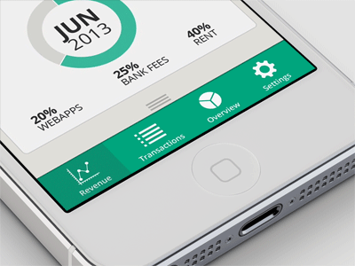

### 动效对注意力的吸引

谈完时间和深度的感知，我们接着来看动效如何吸引人的注意力跟随。

如果一个动效不是由交互触发，而是需要通过视觉线索去吸引人注意，那么什么样的方式能够更好地给用户提供线索呢？特别是需要引导用户的交互元素在边界视觉范围的时候？

强调动效可以达到这种目的。比如下图的上半部分的动效，就比下半部分单纯用色彩来的醒目。

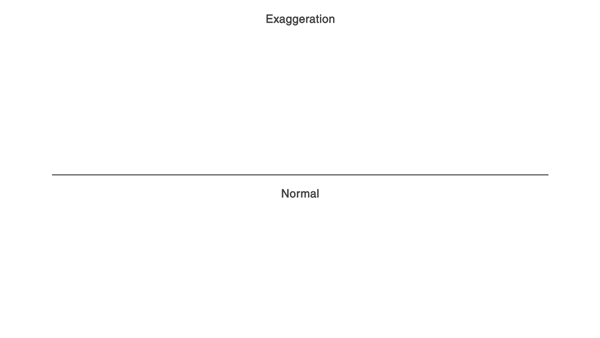

如果你要在跟手操作的实时动效中，去明显地暗示手指滑动方向和事件顺序、前后的关系，那么你可以选择通过某些坐标移动的动效或者数字的变化，来引起人的注意力聚焦。

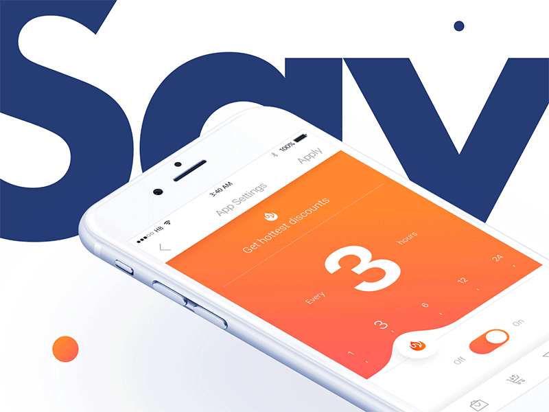

## 动效设计语言与物理隐喻

从人的维度聊完动效设计后，我们再从物理世界隐喻的维度来看一下动效设计。既然动效是对自然世界物理规律的模拟，那么动效究竟是在模拟哪些自然规律呢？

在物理世界里存在经典力学的约束（重力、摩擦力、浮力、磁力和弹力）。在数字世界如果去模拟这些经典力学的效果，会让用户产生更强烈的“这个设计符合现实世界”的感觉，从而降低认知负荷。

除了对力学的认知，我们还要对材质有更深入的理解。这个东西到底是硬的还是软的？是液态还是固态？是厚的还是薄的？是透明、半透明、还是彻底不透明？材质的感觉是一个有机体还是一个无机物？

上面的这些问题其实就隐藏着对一致性的要求。我们不能拿同一个设计语言去选择各种不同的种类的材质，也不能一个控件在一个交互场景里体现的是磁力而在另外一场景里就表现为弹力，这样用户会困惑。

很多动效设计师在开始动效设计之前，并没有仔细思考过这个问题。**这些所有的考虑因素，是构建一个动效设计语言的关键输入。**

因为在物理世界里不同材质的东西，它们的运动效果、对各种力的反应会不同，尺寸的不同也会产生不同的物理反馈。

### 缓动（Easing）

我们先来看加速和减速。因为有摩擦力的存在，在物理世界我们很少看到匀速的物体运动。在你臂长可以操控到的距离内物体的运动模式，基本都是加速从静止到运动，然后再减速从运动到静止。

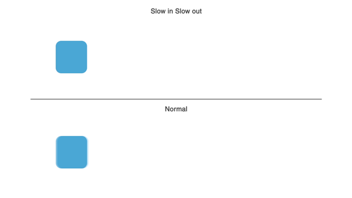

在同样时间的情况下，缓进缓出比匀速不仅仅看起来自然，而且还感觉更加快速。当然缓动有非常多的变种，你选择的材质、力的类型，都会对最终的缓动动效产生影响。下面是一些缓动的动效示例，你可以参考一下。

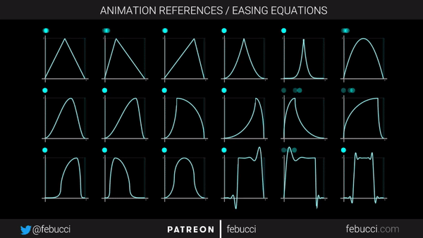

在现实设计中，你要结合具体的场景去判断选择什么样的缓动是最合适的。

某种物体从界面中离开，用的是加速的缓动（Ease-Out）。

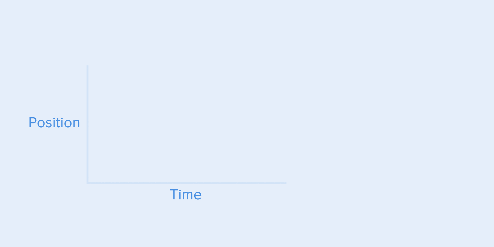

而当一个物体从屏幕外进入到屏幕中，用的是减速的缓动（Ease-In）。

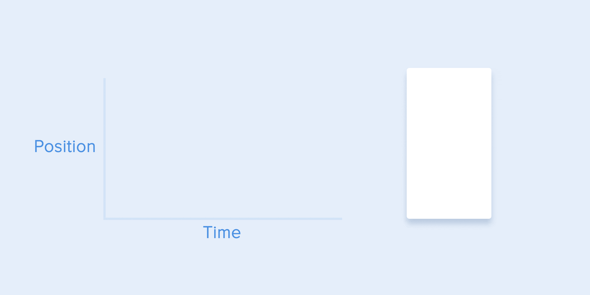

而一个物体从屏幕的A点移位到B点，一般用的就是加速并减速的缓动（Ease-In \& Ease-Out）了。

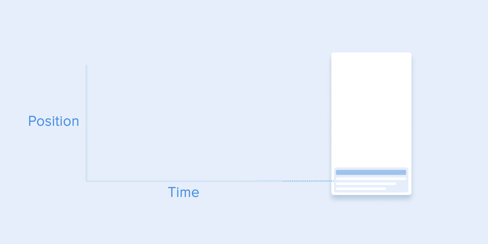

### 惯性运动

在列表的滚动过程中，缓动已经不足以去映射物理世界。因为在交互过程中滑动速度越快，那就意味着滚动越快，停下来需要的时间越长，这就是惯性作用。那么对应惯性动效的时长，就不能拘泥于前面500ms的局限，可能得滑动1\~2秒钟。

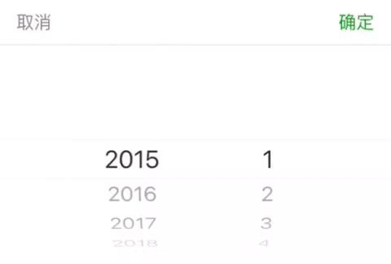

在物体运动过程中如果突然遇到障碍物（特别是坚硬的障碍物），如果这个物体有弹性，那还会出现回弹效果。

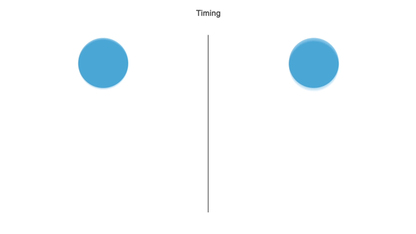

不同材质的物体弹跳能力不同。我在下图中给你列出了不同种类的球体掉落到地面上，能产生弹跳的最短距离。在你的动效语言中不同材质的选择，会决定你选择回弹的程度多大是合适的。

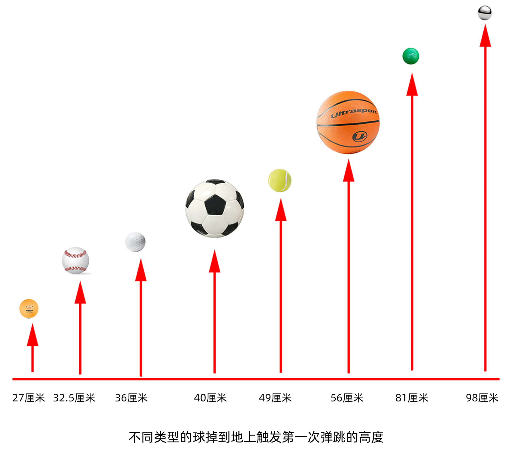

当然，刚刚我们讲的是重力回弹。但很多时候也可能是下拉回弹、横向滑动回弹，这就是要去模拟弹簧的回弹效果了。

惯性除了回弹还有其他表现。比如我们坐在车里突然急刹车，人身体因为惯性原因不经意前倾。在缓动中，如果这个元素和另外一个元素之间并非刚性耦合，那么就会因为运动惯性而继续晃动，比如下图的设计。

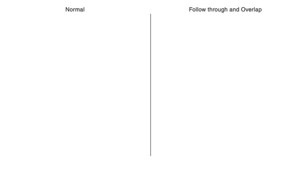

当你想帮助用户区分到底是滑动卡顿还是滑动到了边缘，采用一个回弹的响应设计会让用户分得很清楚，你可以参考下图的回弹响应设计。

不过回弹或者晃动都不能过多使用。因为这种动效其实是对屏幕元素不稳定的隐喻，过度使用会造成视觉干扰和用户的不安。

### 挤压和变形

回弹的过程也会受到材质的影响。如果是一个有弹性的有机体，那么它在加速中会出现拉伸变形，减速中会出现挤压变形。

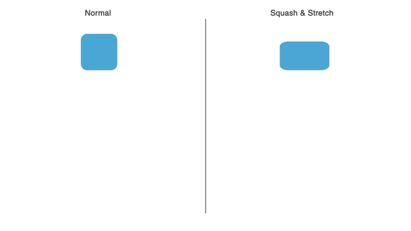

在触屏交互中，触屏点击本身就是一种挤压的隐喻，所以很多按钮把点击的时候设计为挤压效果。

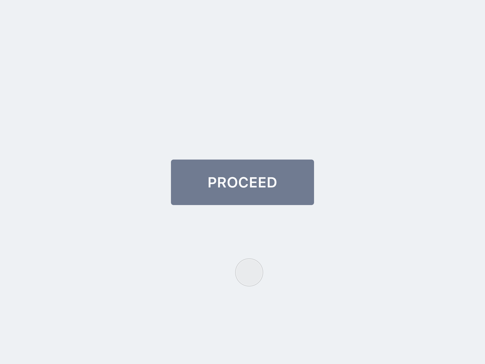

### 抛物线

抛物线运动在我们生活里非常常见，我们来简单看一个在动效设计里使用抛物线的例子。

苹果手机把全面屏返回的手势动效设计成了一个抛物线运动。但这个运动还有一定的特殊性，因为返回后对应的界面要缩小为一个图标，回到屏幕上固定位置，因此苹果在这个抛物线运动的最后落定环节，增加了磁力吸引。

我还是要和你再强调一下，动效要结合产品品牌语言来有选择地运用。不同的品牌需要给用户不同的感觉。如果你的品牌是年轻化、生动活泼的，那就需要选择快速的动效，并且在材质上最好选用半透明、Q弹的材质。如果你的品牌偏向于稳重平和，那么动效就需要适当减少透明度，聚焦在实时动效上，避免过度使用非实时动效。

## **总结**

讲到这里，今天的内容也就基本结束了。最后我来给你总结一下今天讲的要点。

在理解所有的动效之前，我们先要感谢卡通动画制作中的12原则，它如动画圣经般存在，至今仍有很大借鉴意义。

但动效和动画不同，动效一定和交互有关。动效通过模拟真实世界的运动，能够建立屏幕内虚拟世界与现实世界的联系。动效分为实时性和非实时性动效。

如果要基于人因去理解动效设计的话，我们可以从人以及物理世界隐喻两个维度来剖析。

人的维度包含时间、距离和注意力的感知。

交互动效要越短越好，人能感知到5ms以上的延迟。非实时动效一般在100\~400ms之间。对不同屏幕尺寸来说，动效的时长要适当缩小和延长。元素的尺寸可以映射为重量感，但列表刷新不受上述时间的约束。

构建人的视觉深度感有4种手段，你要根据不同情况来适当选用：

* 模拟焦点视觉的模糊；
* 模拟透视视觉的滑动变焦；
* 编组运动的视差效果；
* 立体翻板的隐喻。

强调动效会吸引用户边界视觉范围内的注意力聚焦。数字的变化、时间轴线的隐喻都是好的手段。

从物理隐喻上分析动效，那就先要理解物理世界的材质和力的种类。缓动比匀速更为符合自然规律，要根据实际情况选择加速、减速和加减速并存的动效。

如果是长列表，缓动会伴随着惯性运动。如果缓动遇到障碍物，会出现回弹。如果戛然而止，会出现惯性前倾或者晃动。这种交互不要过多运用，每次的运动都要有具体的易用性意义。挤压和变形，可以在按钮点击中运用。抛物线则是在快速滑动动效中运用，比如返回桌面的动效。

**所有的动效最终都要回归到统一的动效语言**，不建议你混搭和滥用。

今天的内容比较多，我给你总结了一个脑图，你可以长按保存下来，帮助你在这个知识点上有清晰系统的认知。

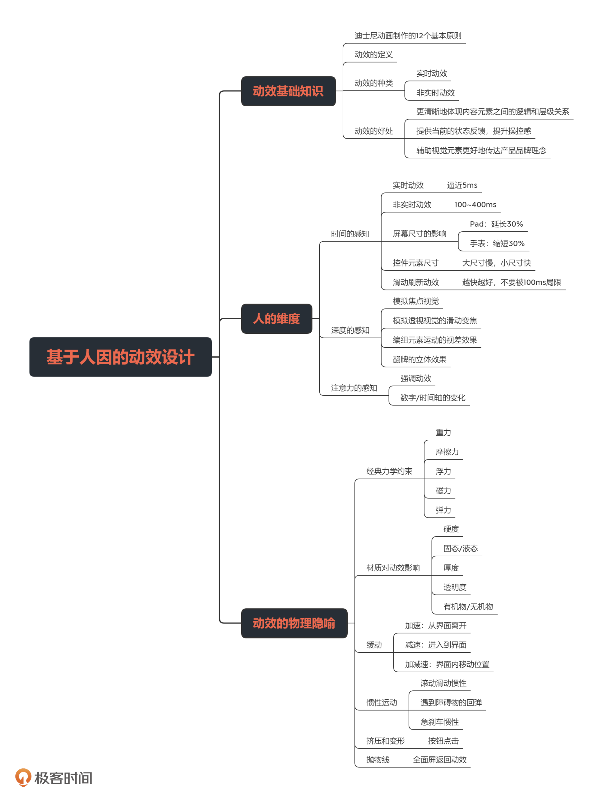

## 作业

最后，我给你留了一个小作业，分析一个你的产品中层级切换的动效，如果按照立体视觉的方式，你可以如何去改进？

你有最喜欢的动效吗，为什么喜欢它？