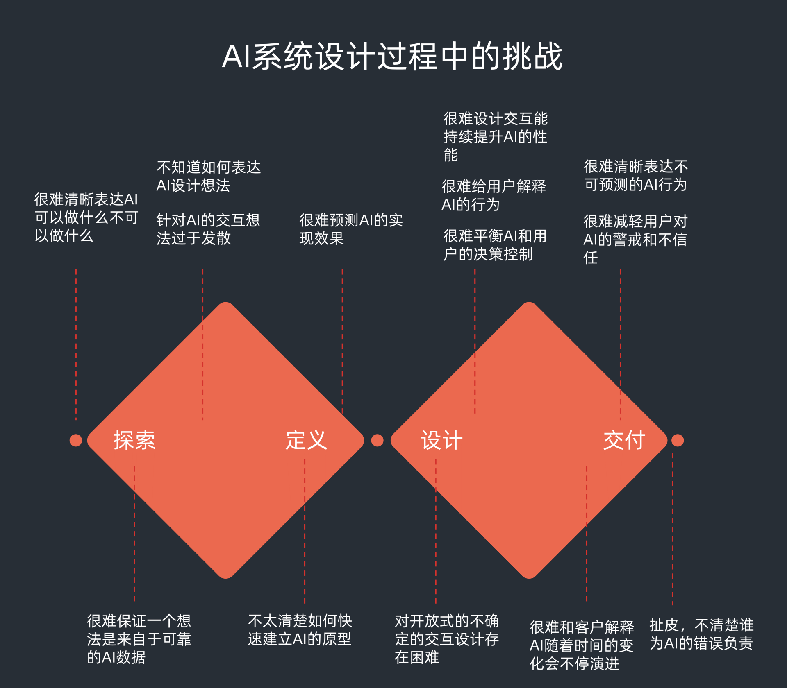
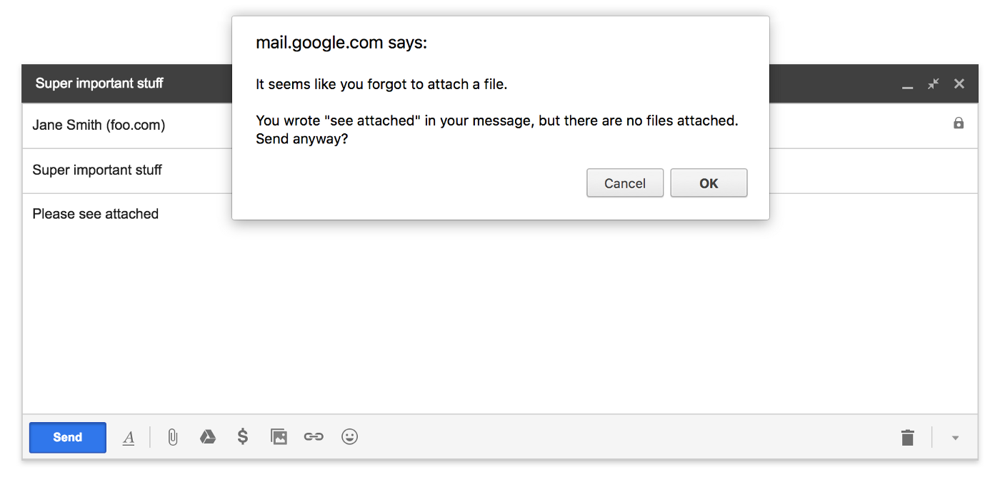
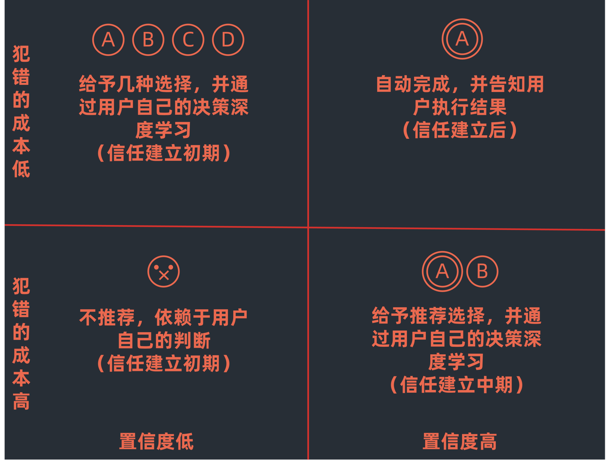
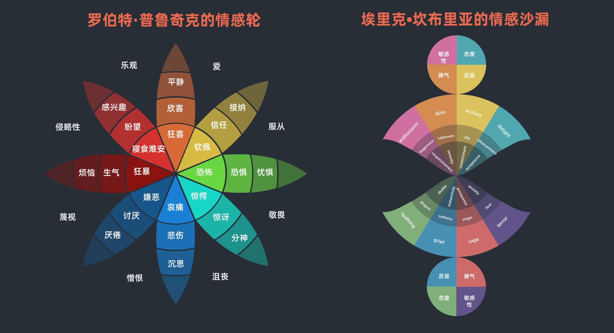

---
date: "2019-06-23"
---  
      
# 22｜正确运用智能交互：谁才是主人？
你好，我是Rocky。

今天我们继续来谈一谈智能交互。在[15](https://time.geekbang.org/column/article/355099)课的时候我们谈了语音交互，今天我们来谈谈更广义的智能交互。

以前提到智慧交互的时候，人们第一时间会想到的是语音交互、智能音箱。现如今随着计算机视觉兴起，智能系统可以更加准确地去理解人的体态、表情、情绪。

而未来可以预见的是脑机接口，让智能系统更加精准地去理解人的意图。在这种背景下，智能可能无处不在，比如智能家居、安防、金融、零售、交通、教育、医疗、健康、制造、交通等等。但从交互上来看，不管是什么场景，交互无非还是那么几种。所以这节课我尝试从人因的角度，透过现象看本质，带你探寻一个智能系统和人交互的基本特点。

## AI系统设计的挑战

首先我们来看看我们在AI系统设计中，究竟会面对哪些挑战。

作为一个智能交互系统，有三个特点我们是必须要面对的：

* 智能系统会根据获取的信息自行作出一些判断和回应，而且这些回应很多时候是不完美的；
* 智能系统是一个进化系统，它在不停学习，进步或者退步完全取决于训练的数据（和教育一个孩子类似）；
* 由于它会学习并能主动回应，因此未来演进的状况是未知的，并不能简单预测（和一个孩子的成长类似）。

人对智能体的态度是新奇并且警戒的，信任关系的建立取决于接触的深度。最终信任的建立取决于：

<!-- [[[read_end]]] -->

* 人判断智能系统已经成长到有能力承担某个具体任务；
* 人发现智能系统对人的意图理解准确，不会曲解，更不会有恶意；
* 没有干扰智能系统正常运行的元素。

为什么目前大多数人难以建立对智能系统长期稳定的信赖关系？多半是自己深度使用后，发现真实体验和预期的差距太大，或者智能系统的能力成长太慢，显得太笨。

正是因为AI系统的这些特质，导致很多设计师在设计的时候无从下手。我以前接触很多设计师在给AI相关的技术做界面设计的时候，概念稿都非常漂亮。但真正做出来用户体验后，用户的感知就是买家秀、不理想。我下面列了一些设计师在给AI系统做设计时，一般会遇到的困难和挑战。

## 应对不完美的AI

之所以存在这些挑战，究其根源，就是大部分设计师并非技术出身，对AI和人之间的关系理解不深，存在诸多误解。

有的设计师对AI技术充满理想主义，把人工智能的技术想象得非常完美。很多设计师基于智能技术最佳表现情况去设计交互体验。但实际上AI技术和传统自动化技术的最大区别在于，它会犯错，而且犯错的概率还蛮高。比如对于下面这些图，当前很多AI技术的确很难准确区出狗狗和美食。

谷歌因为在2015年误把黑人识别为大猩猩，干脆在图像识别里面把大猩猩或者猿这一类的关键词给删除了。也就是说哪怕是6年后的现在，你如果在Google以图搜图，即便是个大猩猩的脸，搜出来也没有大猩猩的词。

我得承认，这是一个糟糕的、偷懒的设计。但是在当下“Black Lives Matter”的平权政治正确的大背景下，至少算是一个安全的处理手法。

面对AI技术经常犯错的事实，我们确实需要严肃地思考，在设计中如何应对这种错误？针对不同的技术成熟度水准，我们有没有给用户足够的提示，让用户意识到AI技术的局限，从而降低用户的期待？这本质是一个设计问题，而不是一个技术问题。

### 坦诚展示系统的可信度

当下很多AI产品在广告宣传里，展示了谜一般的自信（广告里会展示该AI产品的响应速度十分迅速）。其实好的体验绝对不是响应的速度有多快，也不是回答有多细致，而是**答案是否精准正确**。

如果系统在判断时纠结，那就应该体现这种不确定。甚至直接说“不清楚、不知道”，都会比回答一个错误的答案要显得更为真挚和坦诚。

在AI技术识别一个物体的时候，置信度累计是经常采用的方式。置信度的高低依赖于优秀样本的数量以及累积机器学习的时间。当AI不太自信，存在置信度判断阈值不够，就会出现纠结。这个时候，是不是应该把这种不确信的情况展露在明处而不是隐藏起来？

比如下面是一个图像识别应用的例子，左半部分是真实的情况，右半部分是改进的建议。显然改进后增加了置信度的信息，让这种图像识别显得更为真诚和可信。

### 阐明系统的预测逻辑

告诉用户你的预测逻辑，其实也会让用户对你的算法产生理性的判断和评价。

我在微信阅读里面看到两个数据的展示方式，一个是推荐值，一个是匹配度。在推荐值方面给的信息很清楚，其实就是根据历史阅读这本书的用户对其评价说好看的比例，严格来说这也不算是AI算法。

但是对于匹配度，就有些讳莫如深了。尽管点进去提示为你推荐的理由是“根据你的阅读记录推荐与你匹配度超过80\%的书”。但用户会产生一连串的疑问：到底分析了我的什么阅读记录？是我看过的书的品类还是我读过的文字，还是根据书名关键词？这其中有没有侵犯隐私的情况？80\%是如何计算出来的，怎样才算80\%？

**在AI时代，如果给用户展示的是黑盒子，信任就会很难建立。**淘宝和拼多多在每个商品下面的推荐更多用的词分别是：“看了又看”和“相似商品”，在推荐逻辑上都没有讲透。用户不知道推荐商品的排序逻辑是什么样的，信任感的建立也不够。特别是如果用户买过一个商品，结果后续又推荐给用户一个他觉得更好的同类商品，那么用户会对系统的推荐产生一种排斥和警惕。

我们再来看看亚马逊的例子。亚马逊在推荐商品的前面加了一句话“看过这个商品的用户也同样看过”。别小瞧这句话，这就很明显讲出了背后的计算逻辑。相对于淘宝和拼多多，其实这种推荐更容易和用户建立信任。

### 寻求用户的帮助和裁决

我们经常会用“空杯心态”去评价一个学习型人格。作为一个学习成长的系统，也应该有这样的心态。AI系统如果经常寻求用户的帮助，也是一个成长学习的过程。比如你对着智能音箱说“给Zoe打电话”。假如系统发现通讯录有多个Zoe，不确定是哪一个的时候会怎么办？系统可以按照下面的方式回应。

系统：好的，请问是昨天联系过的哪个Zoe吗？

你：是的。

系统：好的，正在拨打Zoe的手机。

注意，系统询问用户是哪个Zoe的时候，坦诚地告知了用户，它猜测应该是最近联系过的那个，背后其实也披露了系统进行判断的算法逻辑。但是系统仍认为没有达到准确判定的阈值，因此寻求用户的帮助和裁决进行了二次确认。

同样在Gmail的AI识别算法中，当系统发现你的邮件正文提到“附件”这个关键词，而你点击发送按钮时并没有附件时，会和你进行二次确认是否要添加附件，这也是寻求用户裁决的一种方式。

通过用户的裁决来反向训练AI系统，系统就会不断优化，体验也会提升。**一个好的智能系统一定要懂得什么时机“可以交给我”以及“我不行，你要帮我”。**人机的信任需要建立在这种坦诚的基础上。

### 让用户训练正确的数据

现在有些App喜欢通过后台收集用户行为数据的方式去训练智能系统，这其实是一种灰度的隐私侵犯。尽管有数据收集协议让用户在使用APP的时候点击确认签署，但是很少有用户会去仔细读协议里大段的晦涩文字，也就相当于默许了这种行为。

一些高级的让用户训练数据的方法，会把收集做在明面上。前面说的用户参与决策就是其中一种。

还有的高级方法会寻求用户的调研反馈。华为以前会随机地向其使用者手机发放一些电子调查问卷，用户选择答复后还会有对应的回馈和答谢。这也是一种暴露在阳光下的数据训练。

再比如很多智能音箱背后的AI算法数据训练都不够，要如何去优质地持续训练这个系统呢？讯飞就提供了讯飞听见的业务，表面上是构建一个翻译业务的平台，其本质是通过人工翻译业务去更加高质量地训练数据。

### 成长的系统需要成长的设计

人工智能的内核技术是机器学习，而机器学习的本质是一个不停通过数据训练学习来不断进步的技术。与传统的工业自动化不同（工业自动化从都到尾都是一个确定的规则，也同样意味着确定的交互界面），随着AI学习的深入，机器对人意图的判断会越来越准确（如果训练数据质量高的话），所以交互界面也应该是一个动态变化的过程。

正如两个人交往，随着了解越来越深，沟通的方式也会随之发生变化。如果智能系统对人的意图了解更深了，但还是同样的交互界面，会让用户觉得无可理喻。注意，这里说的是交互界面，而不仅仅是交互内容的精准推荐。

在交互方式的选择上，无非是以下几种可能性。

一开始智能系统不了解用户，会谨小慎微，各种迟疑犹豫，让用户询问更多决策需要的细节。随着对用户的了解深入，就可以直接给推荐决策了。

如果了解再深入，就直接帮助用户把事情做完并给个提醒。甚至如果人对智能系统的信任默契达到一定程度，智能系统就会承担管家或者助理的角色，做事就可以润物细无声了。你可以参考下面语音交互中的例子。

在智能系统的图形界面（比如对话机器人、智能助手）设计中，也要有类似量体裁衣的动态变化。

## 情感计算交互

关于如何去应对智能系统的不完美，这是从智能系统自学习的特点去考虑的。但是关于智能系统是否应该感知和表达情绪，进而是否应该具有自我认知、良知，这就是一个存在争议的话题了。

从设计维度来看，如果要AI正确地表达情感会是一个非常大的挑战。因为在真实的场景中，绝对不止[11](https://time.geekbang.org/column/article/351883)里提到的这六种情绪。你可以参考下面这两个相对复杂的模型（情感轮和情感沙漏），模型里有8种情绪，并且每种情绪还都分为了三种强度。

而且在现实中即便运用这些模型，人的情绪也并非简单地单一出现，而是不同强度的8个类别的组合。比如我们在微信里用得非常高频的一个捂脸表情符，它到底是表示高兴、悲伤、尴尬、自嘲还是无奈？

即便是人脸表情识别，对智能系统而言也是非常大的挑战。迄今为止，针对表情的情感计算在体验上使用最为广泛的，也仅仅是类似Animoji这种通过跟踪人脸42块肌肉的变化，进而做出表情模仿，这其实就是简化版的皮克斯动画表情捕捉和生成技术。

尽管表情是识别情绪的最关键依据，但是绝不是不唯一。人说话语气语调语速的变化、打字的文字表达方式的不同、体征的变化甚至手指滑动屏幕的力度和速度都可能会暴露情绪。

智能系统是否有能力捕获到这些变化后面隐含的情绪呢？很难。其实何止机器，在人与人的沟通中，我们也很难正确捕捉到对方的情感变化并做出积极正确的回应。

人和人沟通里的小误会可以宽容，但拟人机器错误的情绪判断和僵硬的情绪表达，会加深恐怖谷的感受。**对智能体主动表达情绪的视觉效果设计，请避免过于参照真人。**Cozmo的表情包是一个很好的参照。

未来随着智能系统的学习成长，一定会对表情的识别、理解、表达越来越精准，到那个阶段新的问题也会随之出现：人对情绪的掩饰也是个人隐私的一部分。如何准确地检测情绪并且要避免拆穿人刻意掩饰的情绪，这是对情感计算的高阶挑战。

所以回到前面那个“应对不完美的AI”的话题，现在的表情识别的应用其实很少去寻求用户帮助，比如去问用户当下这个表情具体代表什么？你是否觉得合理？

一旦缺乏这种正向反馈渠道，所有的设计包括Animoji，都更像是一个玩具，而不是一种有演化前景的表情识别应用。

## 总结

好了，讲到这里，今天的内容也就基本结束了。最后我来给你总结一下今天讲的要点。

今天我们谈到了智能交互系统的三个特点：

* 主动判断并回应，容易出错；
* 进化学习系统；
* 未来演进存在未知性。

也同样谈到了，从人的心理分析，和智能系统建立信任关系的前提：

* 认为智能体能力具备；
* 发现智能体对意图理解准确；
* 人认为当前环境是安全的。

很多设计师设计的AI系统之所以会出现很多买家秀体验，就是对以上AI不完美的状况理解不到位。改善AI系统的设计有5个方法：

1.  坦诚展示系统的置信度情况，让用户理解自己纠结或者出错的原因。

2.  避免黑盒，阐明系统的预测逻辑，逐步建立和用户的信任。

3.  在出现决策判断纠结时，寻求用户的帮助和裁决，这同样也是一种学习优化的途径。

4.  把对智能系统的训练做在明处，不要完全做地下党。

5.  在交互设计中，要有演进思维，交互的形式会随着智能系统能力的提升而趋于“自信”。

情感计算交互是智能交互系统的一种特殊方式，人类真实的情绪非常复杂，不要僵化在某一种或者两种模型的单一情绪运用。表情仅仅是情绪感知的一种手段，体征的变化，肢体语言、语音和文字的表达等都会体现情绪变化。在技术不成熟的时候不要去过度拟人化，采用卡通方式处理情绪反应会减少恐怖谷效果。

即便情绪检测准确，也要在准确地检测情绪和避免拆穿人刻意掩饰的情绪之间做出平衡。

## 作业

最后我给你留了一个小作业，从今天我讲的内容，谈谈你对你熟悉的某款手机智能助手的理解，哪些设计做的好，哪些设计做的不够理想？