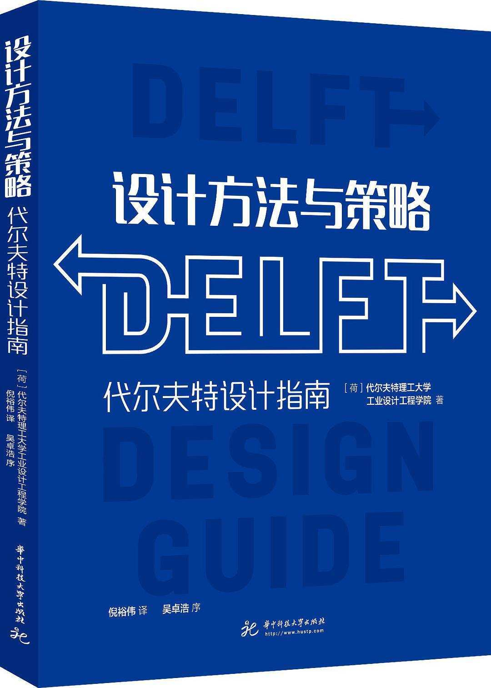
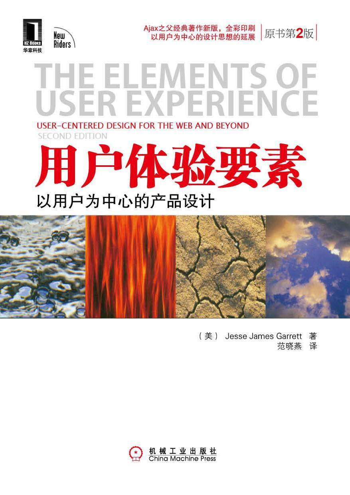
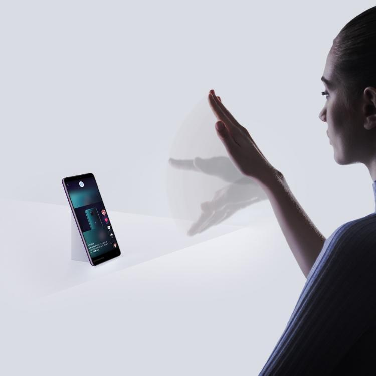
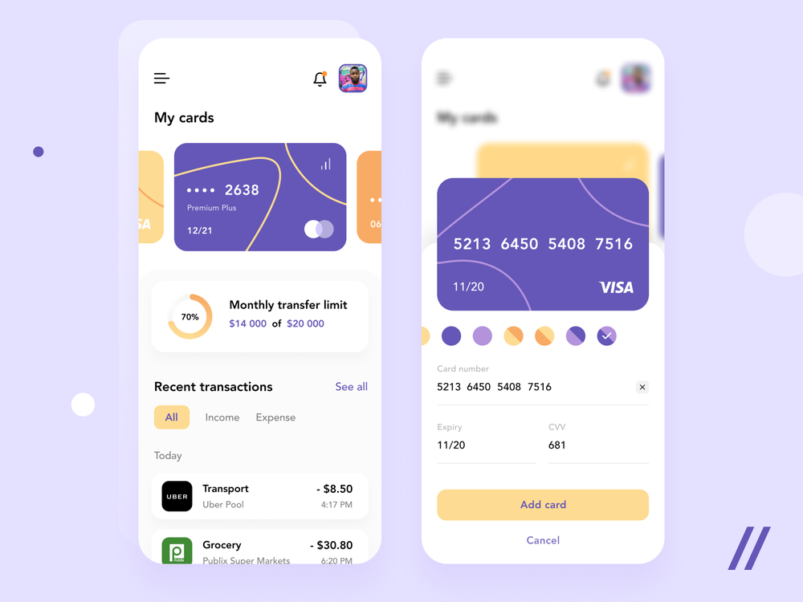
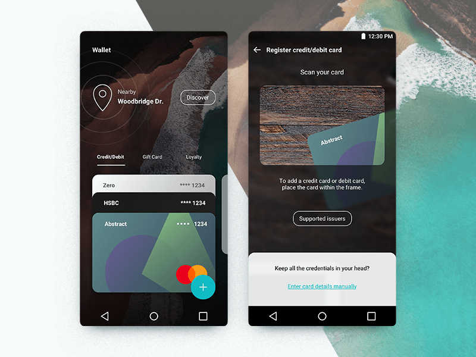
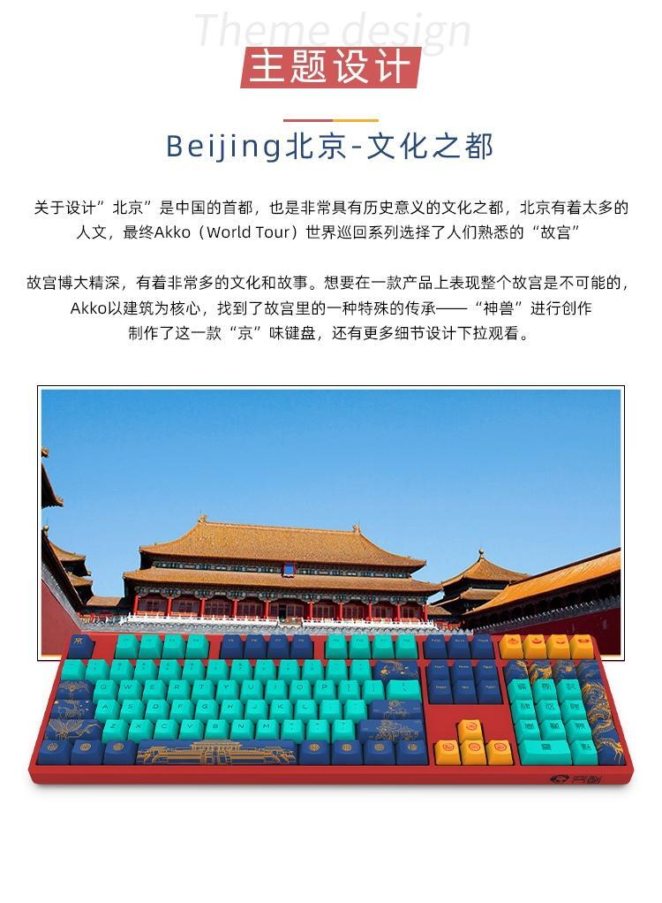
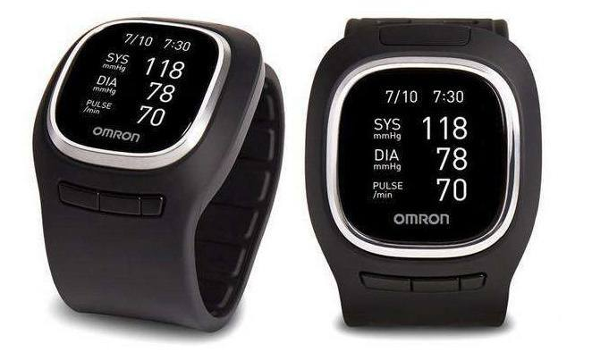
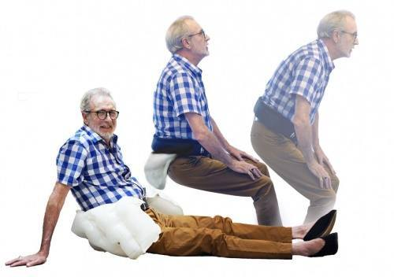

---
date: "2019-06-23"
---  
      
# 用户故事｜JT：设计为生活赋能
你好，我是JT，目前在杭州一高校工业设计工程专业就读研究生，所涉及的研究领域有智能交互和游戏交互相关的设计内容。

## 初识设计

先和你分享两本算是带我入门设计的书吧。一本叫《设计方法与策略：代尔夫特设计指南》，这是我读的第一本设计相关的书籍。我看了目录介绍后特别感兴趣，就立马下单入手了。读完后给我带来最重要的认知更新在于，原来设计的流程和开发竟然是如此相似，设计并不如我之前想就是艺术、是天马行空的玄学，它也和开发一样可以通过科学的方式得出合适的结果。

由于当时我还不懂设计，无法深入理解也没有结合实际运用这本书，只有个大致的印象。等到后面我踏入设计领域再回头看这本书时，其中的很多设计方法总是能再次刷新我自己的认知，这是一本我准备一直反复刷的书。

另一本书叫《用户体验要素》，这本书更浅显易懂地讲明了一个产品从想法到落地的路径是怎样的，我通过这本书第一次了解了以用户为中心的设计概念，这本书也就此打开了我踏入交互设计行业的大门。

再和你分享一个我非常喜欢的设计。

在2019年我看了一场华为发布会，当时发布的Mate30系列有一个新增的功能——“AI隔空操控”。用户可以在不接触手机屏幕的情况下，实现滑动、截图等操作。我当时打心底认为，这真是一个解放双手的神器。从用户体验角度来看，这是非常棒的交互设计创新。

<!-- [[[read_end]]] -->

我是从计算机专业跨到设计专业的，相比拥有专业设计背景的同学，对设计方法论的把握会有一些欠缺。在了解完刘石老师个人介绍后，我感觉我和刘石老师有一定的共同点，我们都有交叉学科的经历，有一种遇知音的欣喜。

再后来，我在IXDC的文章中看到刚刚说的“AI隔空操控”功能是刘石老师团队的设计，这更让我有一种这门专栏一直在静静等我的感觉——在遇到这个专栏之前，我就已经喜欢上专栏作者的设计了。

## 我的学习四步法

前面的算是一段我和设计的“不解之缘”吧。接下来我和你分享一下我学习这个专栏的小小心得。我把学习专栏分为了四步：

**第一步，学习。**

我会先在碎片时间听一遍音频，刘老师的讲述感非常棒。听的过程中我会先大概记住能触动到我的点，然后在电脑上打开课程和笔记软件，记录下知识点和自己的想法。由于这样的学习方式还是比较碎片化的，很难保持高专注度，所以在学习这一步里，我会在电脑上再浏览一遍文字稿进行细致地学习，有疑惑的内容也会查阅其他资料。

**第二步，思考。**

专栏内容干货满满，其实对思考的要求是比较高的。所以我会根据老师讲述的知识，去生活中或工作学习中去寻找对应的案例，深化理解，这样会对知识点有一个更深的印象。

**第三步，讲解。**

除了学习和思考还是不够的，为了进一步理解并为运用打下基础，我会把自己学习到的内容向身边的人讲解。当然，这个前提是要找到愿意听的人。所以我想分享知识点时，会拉上身边学设计的同学或者是对设计感兴趣的朋友，一起探讨某个有意思的人因知识点。

**第四步，实践。**

最后一步就是实践了。这也是我目前努力的方向，我接下来除了学术研究外还会参加设计方面的比赛，希望人因课程能够成为我最佳的比赛助力。当然不参加比赛也会有很多的实践渠道，比如我在用一些App时，会更多地去思考它们有没有人因方面的考量，自己填各种用户反馈问卷时候，也没那么排斥了。甚至是吃饭的时候，我也会去思考怎样摆盘才是最方便舒服的，以及为什么这么摆最方便。

## 学习后所带来的启发

刘石老师在[预习篇](https://time.geekbang.org/column/article/345053)借由《设计心理学》的本能层、行为层、反思层来衡量什么是用户体验设计，我想和你具体分享一下这节课给我带来的一些启发。

**本能层**的设计能让人体会到产品的吸引力，让人感觉良好。如果一个产品在视觉、听觉、嗅觉、味觉和触觉五个方面都能提供给用户一种舒服的自然反馈，那么这个产品在本能层的设计就是成功的。我们通过用户与产品之间的接触互动来增强感知、优化感知、利用感知，从而有效达到本能层设计的目的。

例如在支付平台中绑定银行卡输入卡号时，如果是得一口气输入10多位数字，可能你需要检查很多遍才能确定是否输入正确。

但是如果你看到的界面是一张空的银行卡，然后输入时数字会依次显示在卡片上，而且数字还分隔开，这样一来你识别输入是否正确的效率就会高很多。

因为你已经习惯了银行卡或信用卡的卡号记录方式，以及它的外观一张一张放在钱包里的样子。当把银行卡还原到手机当中去，它还是以日常的形式出现在你面前，所以你本能上就能感觉到这是在输入自己的卡号。

**行为层**设计关注点在于一个产品能否提供给人们合适的交互方式，是否易于理解和被使用。尤其是对功能性产品而言，产品的性能是不可忽视的。

我们还是接着说那个输入银行卡号的例子。一般的输入卡号的方式就是键盘输入，但是现在有了图像识别技术，我们只要通过摄像头扫描就能获取到相关的信息，再检查核对下是否一致即可。不用手动键盘输入就结束了记录卡号的步骤，这就是一个很不错的行为层设计。

与本能层和行为层相比，**反思层**的设计有很大区别，反思层设计涉及了更多的领域，它与文化、时尚、信息以及产品的定义和功能都密切相关。

一个物品能激起某些人的情感，而另外的人则不会有对它情感上的波动；一个物品在某些文化里也许会引起很多人的共鸣，而在其他的文化中则不会引起一丝涟漪。

最近很火的各类故宫联名（美妆、电竞设备甚至热水袋），其实都做出了很不错的反思层设计。

## 人因之我见

我研究生阶段主要接触的是智能交互，所以平时会有刻意去关注一些关于智能穿戴、AR/VR的内容。接下来我想结合专栏的知识，再和你分享一下我对智能穿戴的想法。

从市场层面来说，智能穿戴涵盖了医疗、保健、游戏、娱乐、音乐、时尚、交通、教育等多个领域。从健身的可穿戴设备来看，当前市场上有的产品可以记录每天行走的步数、运动消耗的卡路里、减肥的运动量，还有的还具有姿态识别、加速度计算、力的反馈等等功能。

在智慧医疗的背景下，有的设备能通过记录心率、睡眠情况来改善睡眠质量。智能穿戴把人体静态、动态的生命体态特征进行数据化，给医疗帮助提供科学依据。

除了不同的场景以外，不同的人群使用到的智能穿戴设备也会不一样，例如有专门给婴儿、老人这些特殊人群设计的智能穿戴设备。

**智能穿戴的用户体验设计要关注人、机、环境三者之间的因素。**例如智能穿戴设备给谁用、在什么场景下用、怎么用，以及人与智能穿戴、智能穿戴与终端控制和内部各个传感器之间的关系是怎样的等等。

外界信息80\%是通过我们的眼睛来接收的。所以就获取信息而言，眼睛是最高效的，与眼睛相关的智能穿戴就是眼镜形式。

我很看好类似Hololens 2这样不受线缆束缚的混合现实设备。试想这样一个场景，在工厂装配车间内有非常多的机械零件需要人工进行组装，传统的方式就是车间工人根据平面装配示意图去组装，或者根据经验去排查机械中的故障。是不是感觉很费劲？

但是现在如果有一款眼镜，你戴上后看机械零件时能自动显示三维装配步骤、零件式样、最终效果，或者能够扫描出三维显示出机械中的故障点。在观察的过程中你不需要动手去翻图纸或者切换屏幕，可以直接双手对机械进行操作，如果自己不能解决还能连线视频专家快速解决问题。

我每次想到这样一个场景就激动不已。

而这个眼镜的设计就非常需要人因工程学的指导。

如果我们光从戴上去是否方便、舒适来看，如果戴上去过程繁琐，戴着感觉夹头或者感觉很重，因为还没正式开始使用就已经使人不舒服了，那么人们使用它的频率自然不会高。

这个反馈看似很浅显，其实就已经涉及了很深的人因问题了。在做产品硬件时，它的造型结构是否符合人体工程学、材质是否轻量化、结构是否易于使用等等一系列问题，能回答的只有人。针对人做的智能穿戴设备在设计初，就得从人因角度出发去考虑各种问题，以科学的方式来进行设计。

虽然有的智能穿戴产品已经非常高科技，能够做非常多的事情了，但是体验、效果俱佳才是人们购买的决定性因素。

## 对体验设计思考的变化轨迹

在学习过程中，我常常会思考实际生活中我们能在哪些方面发现设计的价值，随着不断地学习我的思维也在不停地变化。

本科期间做网站项目时，会感觉网站设计做得好丑，所以我会从主观意识上认为，设计其实就是为了好看、美观。

到后来接触了《代尔夫特设计指南》这本书，发现做设计和做开发流程相似，都是有根有据的。从发现问题、提出问题、分析问题再到解决问题乃至于更新迭代，走完生命周期，不是凭空想象出来单纯为了好看的。

《用户体验要素》这本书时让我更加系统了解设计是分层级的，从公司提出战略目标到最终投入市场交付产品给用户进行使用，这是一层一层进行的，好看只是用户最初接触的最浅显的一层，更多深层次的东西自己还没真正了解过。

开始学习交互设计深层次内容时我曾一度认为，交互设计其实就是人机交互。后面逐渐发现，人机交互只是交互设计的微观层面。从宏观层面来看交互设计还包括人与物、人与环境、人与人之间的设计。

学习完人因设计的课程后，又多了很多新的思考。比如我现在去星巴克，就会下意识在门口感受一下咖啡香，心想：“这是用嗅觉的体验来吸引顾客”。咖啡店里慢节奏的音乐，服务员专业、友善的服务态度，这使快节奏的生活突然慢了下来，让顾客在等咖啡的那段时间也不会在店里无所适从。我现在更加能够理解星巴克为啥能够这么火了，星巴克的设计者真的有从人的角度出发，去以人为中心来做设计。

随着我自己对体验设计的不断学习，我感觉自己对于生活的认知也在不断更新，对生活的感受度也越来越高了。我觉得人就像一个器皿，我们总得不停地往里面注入点其他东西。不是“器皿”本身赋予了我们生活意义，生活的重点在于我们选择为自己注入什么。

希望你也能够时刻保持对新事物的热情，我们一起学习，不断更新我们的生活，持续为生活赋能。