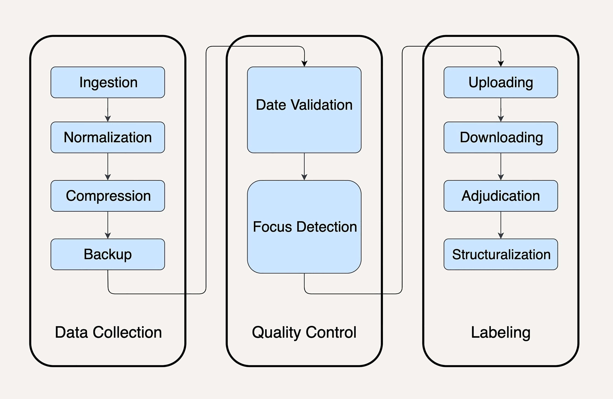
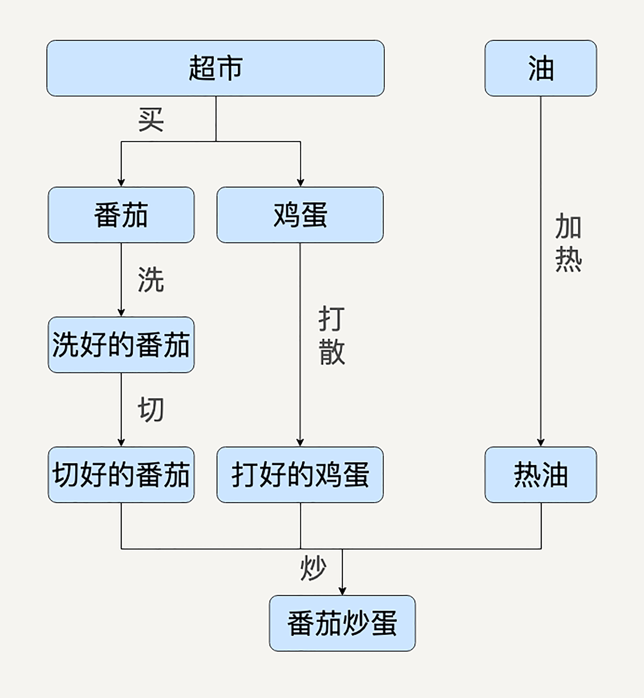
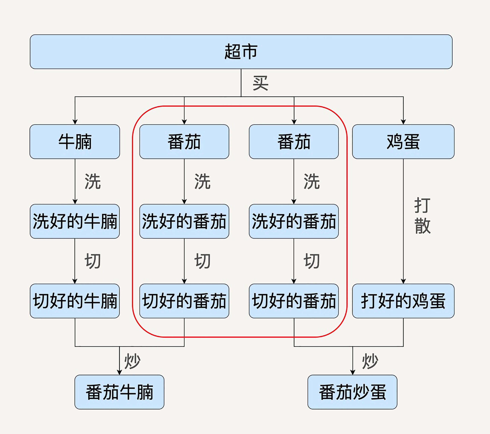
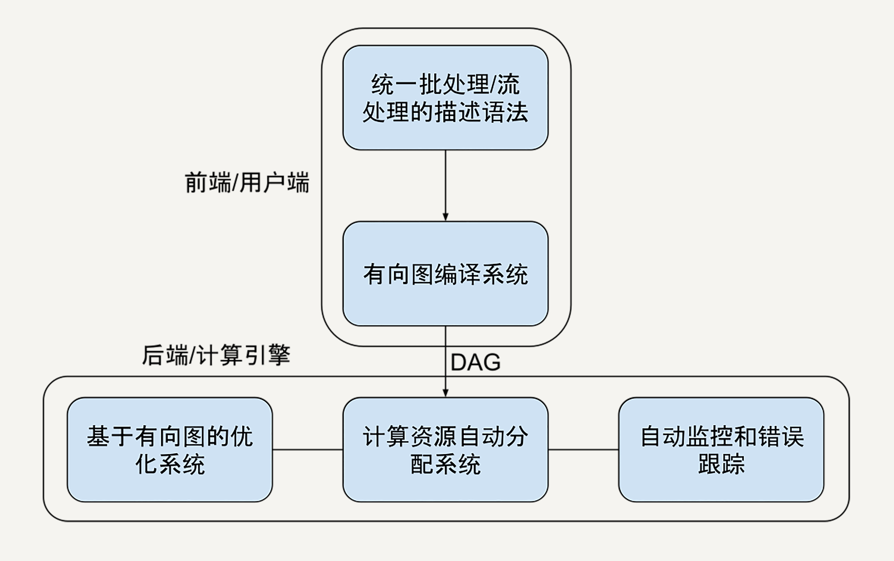

---
date: "2019-06-23"
---  
      
# 02 | MapReduce后谁主沉浮：怎样设计下一代数据处理技术？
你好，我是蔡元楠。

在上一讲中，我们介绍了2014年之前的大数据历史，也就是MapReduce作为数据处理的默认标准的时代。重点探讨了MapReduce面对日益复杂的业务逻辑时表现出的不足之处，那就是：1. 维护成本高；2. 时间性能不足。

同时，我们也提到了2008年诞生在Google西雅图研发中心的FlumeJava，它成为了Google内部的数据处理新宠。

那么，为什么是它扛起了继任MapReduce的大旗呢？

要知道，在包括Google在内的硅谷一线大厂，对于内部技术选择是非常严格的，一个能成为默认方案的技术至少满足以下条件：

1.  经受了众多产品线，超大规模数据量例如亿级用户的考验；

2.  自发地被众多内部开发者采用，简单易用而受开发者欢迎；

3.  能通过内部领域内专家的评审；

4.  比上一代技术仅仅提高10\%是不够的，必须要有显著的比如70\%的提高，才能够说服整个公司付出技术迁移的高昂代价。就看看从Python 2.7到Python 3的升级花了多少年了，就知道在大厂迁移技术是异常艰难的。

今天这一讲，我不展开讲任何具体技术。

我想先和你一起设想一下，假如我和你站在2008年的春夏之交，在已经清楚了MapReduce的现有问题的情况下，我们会怎么设计下一代大规模数据处理技术，带领下一个十年的技术革新呢？

<!-- [[[read_end]]] -->

### 我们需要一种技术抽象让多步骤数据处理变得易于维护

上一讲中我提到过，维护协调多个步骤的数据处理在业务中非常常见。

像图片中这样复杂的数据处理在MapReduce中维护起来令人苦不堪言。

为了解决这个问题，作为架构师的我们或许可以用有向无环图（DAG）来抽象表达。因为有向图能为多个步骤的数据处理依赖关系，建立很好的模型。如果你对图论比较陌生的话，可能现在不知道我在说什么，你可以看下面一个例子，或者复习一下极客时间的《数据结构与算法之美》。

西红柿炒鸡蛋这样一个菜，就是一个有向无环图概念的典型案例。

比如看这里面番茄的处理，最后一步“炒”的步骤依赖于切好的番茄、打好的蛋、热好的油。而切好的番茄又依赖于洗好的番茄等等。如果用MapReduce来实现的话，在这个图里面，每一个箭头都会是一个独立的Map或Reduce。

为了协调那么多Map和Reduce，你又难以避免会去做很多检查，比如：番茄是不是洗好了，鸡蛋是不是打好了。

最后这个系统就不堪重负了。

但是，如果我们用有向图建模，图中的每一个节点都可以被抽象地表达成一种通用的**数据集**，每一条边都被表达成一种通用的**数据变换**。如此，你就可以用**数据集**和**数据变换**描述极为宏大复杂的数据处理流程，而不会迷失在依赖关系中无法自拔。

### 我们不想要复杂的配置，需要能自动进行性能优化

上一讲中提到，MapReduce的另一个问题是，配置太复杂了。以至于错误的配置最终导致数据处理任务效率低下。

这种问题怎么解决呢？很自然的思路就是，如果人容易犯错，就让人少做一点，让机器多做一点呗。

我们已经知道了，得益于上一步中我们已经用有向图对数据处理进行了高度抽象。这可能就能成为我们进行自动性能优化的一个突破口。

回到刚才的番茄炒鸡蛋例子，哪些情况我们需要自动优化呢？

设想一下，如果我们的数据处理食谱上又增加了番茄牛腩的需求，用户的数据处理有向图就变成了这个样子了。

理想的情况下，我们的计算引擎要能够自动发现红框中的两条数据处理流程是重复的。它要能把两条数据处理过程进行合并。这样的话，番茄就不会被重复准备了。

同样的，如果需求突然不再需要番茄炒蛋了，只需要番茄牛腩，在数据流水线的预处理部分也应该把一些无关的数据操作优化掉，比如整个鸡蛋的处理过程就不应该在运行时出现。

另一种自动的优化是计算资源的自动弹性分配。

比如，还是在番茄炒蛋这样一个数据处理流水线中，如果你的规模上来了，今天需要生产1吨的番茄炒蛋，明天需要生产10吨的番茄炒蛋。你发现有时候是处理1000个番茄，有时候又是10000个番茄。如果手动地去做资源配置的话，你再也配置不过来了。

我们的优化系统也要有可以处理这种问题的弹性的劳动力分配机制。它要能自动分配，比如100台机器处理1000个番茄，如果是10000个番茄那就分配1000台机器，但是只给热油1台机器可能就够了。

这里的比喻其实是很粗糙也不精准的。我想用这样两个例子表达的观点是，在数据处理开始前，我们需要有一个自动优化的步骤和能力，而不是按部就班地就把每一个步骤就直接扔给机器去执行了。

### 我们要能把数据处理的描述语言，与背后的运行引擎解耦合开来

前面两个设计思路提到了很重要的一个设计就是有向图。

用有向图进行数据处理描述的话，实际上**数据处理描述语言**部分完全可以和后面的**运算引擎**分离了。有向图可以作为**数据处理描述语言**和**运算引擎**的前后端分离协议。

举两个你熟悉的例子可能能更好理解我这里所说的前后端分离（client-server design）是什么意思：

比如一个网站的架构中，服务器和网页通过HTTP协议通信。

比如在TensorFlow的设计中，客户端可以用任何语言（比如Python或者C加加）描述计算图，运行时引擎（runtime\) 理论上却可以在任何地方具体运行，比如在本地，在CPU，或者在TPU。

那么我们设计的数据处理技术也是一样的，除了有向图表达需要**数据处理描述语言**和**运算引擎**协商一致，其他的实现都是灵活可拓展的。

比如，我的数据描述可以用Python描述，由业务团队使用；计算引擎用C加加实现，可以由数据底层架构团队维护并且高度优化；或者我的数据描述在本地写，计算引擎在云端执行。

### 我们要统一批处理和流处理的编程模型

关于什么是批处理和流处理概念会在后面的章节展开。这里先简单解释下，批处理处理的是有界离散的数据，比如处理一个文本文件；流处理处理的是无界连续的数据，比如每时每刻的支付宝交易数据。

MapReduce的一个局限是它为了批处理而设计的，应对流处理的时候不再那么得心应手。即使后面的Apache Storm、Apache Flink也都有类似的问题，比如Flink里的批处理数据结构用DataSet，但是流处理用DataStream。

但是真正的业务系统，批处理和流处理是常常混合共生，或者频繁变换的。

比如，你有A、B两个数据提供商。其中数据提供商A与你签订的是一次性的数据协议，一次性给你一大波数据，你可以用批处理。而数据提供商B是实时地给你数据，你又得用流处理。更可怕的事情发生了，本来是批处理的数据提供商A，突然把协议修改了，现在他们实时更新数据。这时候你要是用Flink就得爆炸了。业务需求天天改，还让不让人活了？！

因此，我们设计的数据处理框架里，就得有更高层级的数据抽象。

不论是批处理还是流处理的，都用统一的数据结构表示。编程的API也需要统一。这样不论业务需求什么样，开发者只需要学习一套API。即使业务需求改变，开发者也不需要频繁修改代码。

### 我们要在架构层面提供异常处理和数据监控的能力

真正写过大规模数据处理系统的人都深有感触：在一个复杂的数据处理系统中，难的不是开发系统，而是异常处理。

事实正是如此。一个Google内部调研表明，在大规模的数据处理系统中，90\%的时间都花在了异常处理中。常常发生的问题的是，比如在之前的番茄炒鸡蛋处理问题中，你看着系统log，明明买了1000个鸡蛋，炒出来的菜却看起来只有999个鸡蛋，你仰天长叹，少了一个蛋到底去哪里了！

这一点和普通的软件开发不同。比如，服务器开发中，偶尔一个RPC请求丢了就丢了，重试一下，重启一下能过就行了。可如果在数据处理系统中，数据就是钱啊，不能随便丢。比如我们的鸡蛋，都是真金白银买回来的。是超市买回来数错了？是打蛋时候打碎了？还是被谁偷吃了？你总得给老板一个合理的交代。

我们要设计一套基本的数据监控能力，对于数据处理的每一步提供自动的监控平台，比如一个监控网站。

在番茄炒蛋系统中，要能够自动的记录下来，超市买回来是多少个蛋，打蛋前是多少个蛋，打完蛋是多少个蛋，放进锅里前是多少个蛋等等。也需要把每一步的相关信息进行存储，比如是谁去买的蛋，哪些人打蛋。这样出错后可以帮助用户快速找到可能出错的环节。

## 小结

通过上面的分析，我们可以总结一下。如果是我们站在2008年春夏之交来设计下一代大规模数据处理框架，一个基本的模型会是图中这样子的：

但是这样粗糙的设计和思想实验离实现还是太远。你可能还是会感到无从下手。

后面的章节会给你补充一些设计和使用大规模数据处理架构的基础知识。同时，也会深入剖析两个与我们这里的设计理念最接近的大数据处理框架，Apache Spark和Apache Beam。

## 思考题

你现在在使用的数据处理技术有什么问题，你有怎样的改进设计？

欢迎你把自己的想法写在留言区，与我和其他同学一起讨论。

如果你觉得有所收获，也欢迎把文章分享给你的朋友。