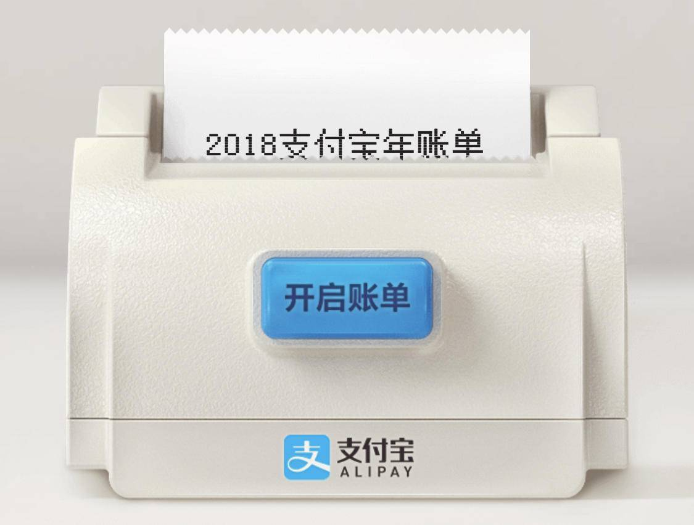

---
date: "2019-06-23"
---  
      
# 06 | 如何区分批处理还是流处理？
你好，我是蔡元楠。

今天，我将会带领你一起学习在进行大规模数据处理时，无论如何也绕不开的两个处理模式：批处理（Batching Processing）和流处理（Streaming Processing）。

在我看来，大规模的视频流系统、大规模物联网（IoT）数据监控系统等各种现代大规模数据系统的出现，已经成为了一种必然的历史潮流。

无论你是在从事哪一种开发方向，都不可避免地要与这些海量数据打交道。如何能既满足实际应用场景的需求，又高效地处理好大规模数据，在整个项目开发架构中都是非常重要的一个环节。

在开始讲解批处理和流处理之前，我想先介绍一下几个必要的背景知识。

### 无边界数据和有边界数据

这个世界上的数据可以抽象成为两种，分别是无边界数据（Unbounded Data）和有边界数据（Bounded Data）。

顾名思义，**无边界数据**是一种不断增长，可以说是无限的数据集。

这种类型的数据，我们无法判定它们到底什么时候会停止发送。

例如，从手机或者从传感器发送出来的信号数据，又比如我们所熟知的移动支付领域中的交易数据。因为每时每刻都会有交易产生，所以我们不能判定在某一刻这类数据就会停止发送了。

在国外的一些技术文章上，有时候我们会看到“流数据（Streaming Data）”这一说法，其实它和无边界数据表达的是同一个概念。

<!-- [[[read_end]]] -->

与此相反，**有边界数据**是一种有限的数据集。

这种数据更常见于已经保存好了的数据中。例如，数据库中的数据，或者是我们常见的CSV格式文件中的数据。

当然了，你可能会问，那我们把无边界数据按照时间窗口提取一小份出来，那这样的数据是什么数据呢？

拿我们之前提到过的移动支付中的交易数据来说吧。移动支付中的交易数据可以看作是无边界数据。那我们按2019年4月29日这个时间窗口提取出来的数据呢？这个当日的交易数据就变成了有边界数据了。

所以，有边界数据其实可以看作是无边界数据的一个子集。

### 事件时间和处理时间

在处理大规模数据的时候，我们通常还会关心**时域**（Time Domain）的问题。

我们要处理的任意数据都会有两种时域，分别是事件时间（Event Time）和处理时间（Precessing Time）。

**事件时间**指的是一个数据实际产生的时间点，而**处理时间**指的是处理数据的系统架构实际接收到这个数据的时间点。

下面我来用一个实际的例子进一步说明这两个时间概念。

现在假设，你正在去往地下停车场的路上，并且打算用手机点一份外卖。选好了外卖后，你就用在线支付功能付款了，这个时候是12点05分。恰好这时，你走进了地下停车库，而这里并没有手机信号。因此外卖的在线支付并没有立刻成功，而支付系统一直在重试（Retry）“支付”这个操作。

当你找到自己的车并且开出地下停车场的时候，已经是12点15分了。这个时候手机重新有了信号，手机上的支付数据成功发到了外卖在线支付系统，支付完成。

在上面这个场景中你可以看到，支付数据的事件时间是12点05分，而支付数据的处理时间是12点15分。事件时间和处理时间的概念，你明白了吗？

在了解完上面的4个基本概念后，我将开始为你揭开批处理和流处理模式的面纱。

### 批处理

数据的批处理，可以理解为一系列相关联的任务按顺序（或并行）一个接一个地执行。批处理的输入是在一段时间内已经收集保存好的数据。每次批处理所产生的输出也可以作为下一次批处理的输入。

绝大部分情况下，批处理的输入数据都是**有边界数据**，同样的，输出结果也一样是**有边界数据**。所以在批处理中，我们所关心的更多会是数据的**事件时间**。

举个例子，你在每年年初所看到的“支付宝年账单”就是一个数据批处理的典型例子。

支付宝会将我们在过去一年中的消费数据存储起来，并作为批处理输入，提取出过去一年中产生交易的事件时间，然后经过一系列业务逻辑处理，得到各种有趣的信息作为输出。

在许多情况下，批处理任务会被安排，并以预先定义好的时间间隔来运行，例如一天，一个月或者是一年这样的特定时间。

在银行系统中，银行信用卡消费账单和最低还款额度也都是由批处理系统以预先定义好的一个月的时间间隔运行，所产生出来的。

批处理架构通常会被设计在以下这些应用场景中：

* 日志分析：日志系统是在一定时间段（日，周或年）内收集的，而日志的数据处理分析是在不同的时间内执行，以得出有关系统的一些关键性能指标。

* 计费应用程序：计费应用程序会计算出一段时间内一项服务的使用程度，并生成计费信息，例如银行在每个月末生成的信用卡还款单。

* 数据仓库：数据仓库的主要目标是根据收集好的数据事件时间，将数据信息合并为静态快照 （static snapshot），并将它们聚合为每周、每月、每季度的报告等。

由Google MapReduce衍生出来的开源项目Apache Hadoop或者是Apache Spark等开源架构都是支持这种大数据批处理架构的。

由于完成批处理任务具有高延迟性，一般可以需要花费几小时，几天甚至是几周的时间。要是在开发业务中有快速响应用户的时间需求，我们则需要考虑使用流处理/实时处理来处理大数据。

### 流处理

数据的流处理可以理解为系统需要接收并处理一系列连续不断变化的数据。例如，旅行预订系统，处理社交媒体更新信息的有关系统等等。

流处理的输入数据基本上都是**无边界数据**。而流处理系统中是关心数据的事件时间还是处理时间，将视具体的应用场景而定。

例如，像网页监控系统这样的流处理系统要计算网站的QPS，它所关心的更多是**处理时间**，也就是网页请求数据被监控系统接收到的时间，从而计算QPS。

而在一些医疗护理监控系统的流处理系统中，他们则更关心数据的**事件时间**，这种系统不会因为接收到的数据有网络延时，而忽略数据本来产生的时间。

流处理的特点应该是要足够快、低延时，以便能够处理来自各种数据源的大规模数据。流处理所需的响应时间更应该以毫秒（或微秒）来进行计算。像我们平时用到的搜索引擎，系统必须在用户输入关键字后以毫秒级的延时返回搜索结果给用户。

流处理速度如此之快的根本原因是因为它在数据到达磁盘之前就对其进行了分析。

当流处理架构拥有在一定时间间隔（毫秒）内产生逻辑上正确的结果时，这种架构可以被定义为**实时处理**（Real-time Processing）。

而如果一个系统架构可以接受以分钟为单位的数据处理时间延时，我们也可以把它定义为**准实时处理**（Near real-time Processing）。

还记得我们在介绍批处理架构中所说到的不足吗？没错，是高延迟。而流处理架构则恰恰拥有高吞度量和低延迟等特点。

流处理架构通常都会被设计在以下这些应用场景中：

* 实时监控：捕获和分析各种来源发布的数据，如传感器，新闻源，点击网页等。
* 实时商业智能：智能汽车，智能家居，智能病人护理等。
* 销售终端（POS）系统：像是股票价格的更新，允许用户实时完成付款的系统等。

在如今的开源架构生态圈中，如Apache Kafka、Apache Flink、Apache Storm、Apache Samza等，都是流行的流处理架构平台。

在介绍完这两种处理模式后，你会发现，无论是批处理模式还是流处理模式，在现实生活中都有着很广泛的应用。你应该根据自己所面临的实际场景来决定到底采用哪种数据处理模式。

## 小结

批处理模式在不需要实时分析结果的情况下是一种很好的选择。尤其当业务逻辑需要处理大量的数据以挖掘更为深层次数据信息的时候。

而在应用需求需要对数据进行实时分析处理时，或者说当有些数据是永无止境的事件流时（例如传感器发送回来的数据时），我们就可以选择用流处理模式。

## 思考题

相信在学习完这一讲后，你会对批处理模式和流处理模式有着清晰的认识。今天的思考题是，在你的日常开发中，所面临的数据处理模式又是哪一种模式呢？

欢迎你把答案写在留言区，与我和其他同学一起讨论。如果你觉得有所收获，也欢迎把文章分享给你的朋友。