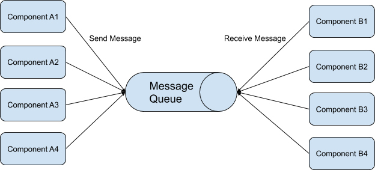
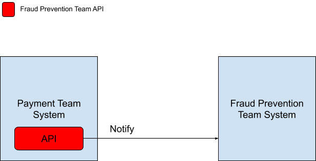
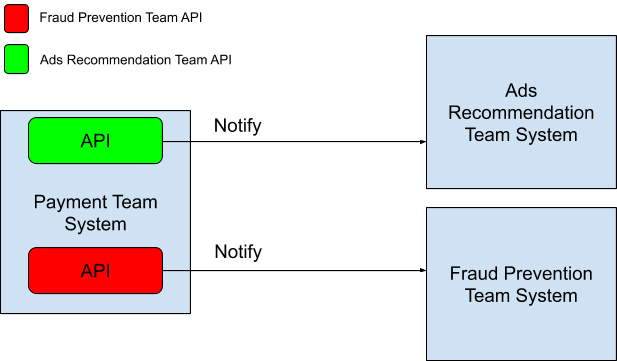
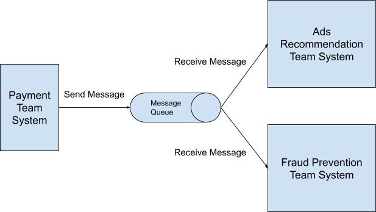
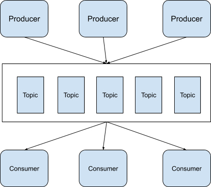

---
date: "2019-06-23"
---  
      
# 08 | 发布/订阅模式：流处理架构中的瑞士军刀
你好，我是蔡元楠。

今天我想要与你分享的是在处理大规模数据中十分流行的一种设计模式：发布/订阅模式（Publish/Subscribe Pattern），有些地方也称它为Pub/Sub。

在了解发布/订阅模式之前，我想先简单介绍几个基础概念——消息（Message）和消息队列（Message Queue）。

## 消息

消息是什么呢？

在分布式架构里，架构中的各个组件（Component）需要相互联系沟通。组件可以是后台的数据库，可以是前端的浏览器，也可以是公司内部不同的服务终端（Service Endpoint）。

而各个组件间就是依靠通过发送消息互相通讯的。如下图所示。

消息可以是任意格式的。例如，我们可以利用JSON格式来传输一个消息，也能利用XML格式来传输一个消息，甚至可以使用一种自己定义的格式。

## 消息队列

知道了消息的含义后，你知道消息队列有什么作用吗？

消息队列在发布/订阅模式中起的是一个持久化缓冲（Durable Buffer）的作用。

消息的发送方可以发送任意消息至这个消息队列中，消息队列在接收到消息之后会将消息保存好，直到消息的接收方确认已经从这个队列拿到了这个消息，才会将这条消息从消息队列中删除。

有的消息系统平台如Apache Kafka，它能够让用户自己定义消息队列对消息的保留时间，我将会在介绍Apache Kafka的时候讲到。

<!-- [[[read_end]]] -->

有了消息队列后，整个发送消息的流程就变成下图所示。

## 发布/订阅模式

在了解了消息和消息队列后，现在我想和你正式地介绍发布/订阅模式的概念。

发布/订阅模式指的是消息的发送方可以将消息异步地发送给一个系统中不同组件，而无需知道接收方是谁。在发布/订阅模式中，发送方被称为发布者（Publisher），接收方则被称作订阅者（Subscriber）。

发布者将消息发送到消息队列中，订阅者可以从消息队列里取出自己感兴趣的消息。

在发布/订阅模式里，可以有任意多个发布者发送消息，也可以有任意多个订阅者接收消息，如下图所示。

读到这里，你可能会有一个疑问，从概念上看，发布/订阅模式只是简单地在消息发送方和消息接收方中间多加了一个消息队列，为什么这种设计架构在实际应用会如此流行呢？我来给你举个例子说明一下。

现在假设，你是一个移动支付App公司里支付团队的开发人员，App里所有的支付操作都是由你的团队来开发的。而公司最近新成立了一个欺诈预防团队，他们希望从你的支付团队里获取交易数据。

也就是说，每次有交易发生的时候，你都需要通知他们交易的金额、地点、时间这些数据，让他们能够实时分析这次的交易是否存在欺诈行为。

按照传统的做法，两个团队需要开会交流，以确定数据消息传输的API和传输数据的格式。确定后，两个团队系统的交流方式会如下图所示。

欺诈预防团队将自己需要的数据格式定义在API中告诉支付团队，每次有交易产生的时候，支付系统就会通过调用欺诈预防系统API的方式通知他们。

一段时间过后，公司希望和商家一起合作推动一项优惠活动，不同的商家会有不同的优惠。公司希望能够精准投放优惠活动的广告给感兴趣的用户，所以又成立了一个新部门，我们叫它广告推荐组吧。

广告推荐组的同事也希望从你的支付团队里获取交易数据。这个时候，你有两种选择，一种是选择第六讲中说到的批处理方式，另一种就是今天讲的发布/订阅模式。

批处理方式会从数据库中一次性读取全部用户的交易数据来进行推荐分析。

这种做法有几个不好的地方。

它需要你开放自己数据库的权限给广告推荐组，推荐组每次大量读取数据时，可能也会造成你自己的数据库性能下降。同时，还要考虑广告推荐组也想维护一份自己的数据库的需求。

如果还是按照之前欺诈预防团队的做法，让广告推荐组分享API给你，每次有交易产生的时候再通知他们的话，系统的运行模式会如文中图片所示。

看到这里你应该明白了。每一次有一个新的系统想从支付团队里读取数据的话，都要双方开会讨论，定义一个新的API，然后修改支付团队现有的系统，将API加入系统中。

而且这些API通常都是同步调用的，过多的API调用会让系统的延迟越来越大。这样的设计模式被称作观察者模式（Observer Pattern），系统中的各个组件紧耦合（Tightly Coupled）在一起。

如果是采用发布/订阅模式来重新设计呢？整个系统就如下图所示：

采用这样的数据处理模式，作为消息发布者的支付团队无需过多考虑以后有多少其它的团队需要读取交易数据，只需要设计好自己提供的数据内容与格式，在每次交易发生时发送消息进消息队列中就可以了。任何对这些数据感兴趣的团队只需要从消息队列中自行读取便可。

## 发布/订阅模式的优缺点

说到这里，我们可以看到发布/订阅模式会有以下几个优点：

* 松耦合（Loose Coupling）：消息的发布者和消息的订阅者在开发的时候完全不需要事先知道对方的存在，可以独立地进行开发。

* 高伸缩性（High Scalability）：发布/订阅模式中的消息队列可以独立的作为一个数据存储中心存在。在分布式环境中，更是消息队列更是可以扩展至上千个服务器中。我们从Linkedin公司的技术博客中可以得知，光在2016年，Linkedin公司就维护开发了将近1400个消息队列。

* 系统组件间通信更加简洁：因为不需要为每一个消息的订阅者准备专门的消息格式，只要知道了消息队列中保存消息的格式，发布者就可以按照这个格式发送消息，订阅者也只需要按照这个格式接收消息。

虽然发布/订阅模式的数据处理模式优点多多，但是还是存在着自身的缺点的。

例如，在整个数据模式中，我们不能保证发布者发送的数据一定会送达订阅者。如果要保证数据一定送达的话，需要开发者自己实现响应机制。

在硅谷，很多大型云平台都是运用这个发布/订阅数据处理模式。

例如，Google的Cloud Pub/Sub平台，AWS的Amazon Simple Notification Service（SNS）。被Linkedin、Uber等硅谷大厂所广泛使用的开源平台Apache Kafka也是搭建在发布/订阅数据处理模式之上的。甚至是连Redis也支持原生的发布/订阅模式。

Apache Kafka作为一个被在硅谷大厂与独角兽广泛使用的开源平台，如果你是在创业阶段的话，说不定可以用得上，所以在这里我想简单介绍一下Apache Kafka。

在Apache Kafka中，消息的发送方被称为Producer，消息的接收方被称为Consumer，而消息队列被称为Topic。

Apache Kafka在判断消息是否被接收方接收是利用了Log offset机制。

什么是Log offset机制呢？我举个例子给你解释一下。

假设发送方连续发送了5条数据到消息队列Topics中，这5条消息被编号为10000、10001、10002、10003和10004。

如果接收方读取数据之后回应消息队列它接收的Log offset是10000、10001和10003，那么消息队列就会认为接收方最多只接收了消息10000和10001，剩下的消息10002、10003和10004则会继续发送给接收方，直到接收方回应接收了消息10002、10003和10004。

## 发布/订阅模式的适用场景

我们说回到发布/订阅模式来，看看它能用在哪些场景。

如果你在处理数据的时候碰到以下场景，那么就可以考虑使用发布/订阅的数据处理模式。

* 系统的发送方需要向大量的接收方广播消息。

* 系统中某一个组件需要与多个独立开发的组件或服务进行通信，而这些独立开发的组件或服务可以使用不同的编程语言和通信协议。

* 系统的发送方在向接收方发送消息之后无需接收方进行实时响应。

* 系统中对数据一致性的要求只需要支持数据的最终一致性（Eventual Consistency）模型。

要提醒你注意的一点是，如果系统的发送方在向接收方发送消息之后，需要接收方进行实时响应的话，那么绝大多数情况下，都不要考虑使用发布/订阅的数据处理模式。

## 小结

今天我们一起学习了大规模数据处理中一种十分流行的设计模式——发布/订阅模式。它能够很好地解耦（Decouple）系统中不同的组件，许多实时的流处理架构就是利用这个数据处理的设计模式搭建起来的。因为发布/订阅模式同时具有很好的伸缩性。

如果你在开发的场景适合我所讲到的适应场景，可以优先考虑使用发布/订阅模式。

## 思考题

你认为微信的朋友圈功能适合使用发布/订阅模式吗？为什么？

欢迎你把答案写在留言区，与我和其他同学一起讨论。如果你觉得有所收获，也欢迎把文章分享给你的朋友。