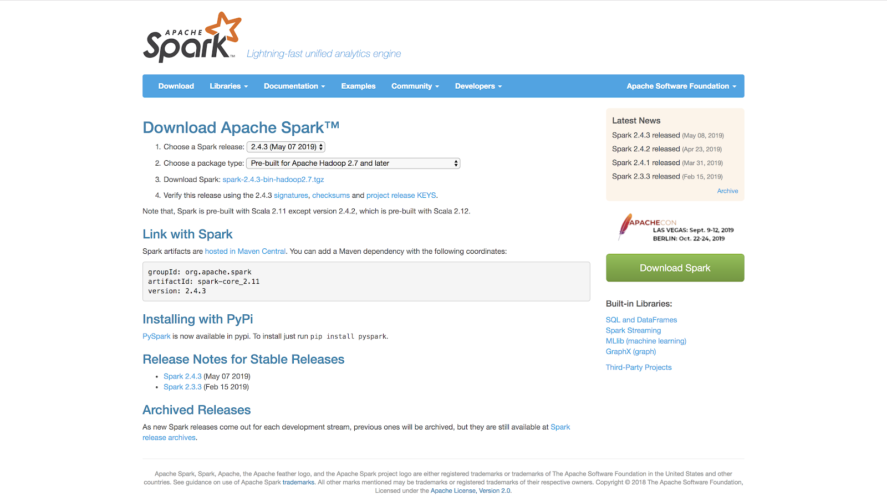

---
date: "2019-06-23"
---  
      
# 18 | Word Count：从零开始运行你的第一个Spark应用
你好，我是蔡元楠。

今天我们来从零开始运行你的第一个Spark应用。

我们先来回顾一下模块三的学习路径。

首先，我们由浅入深地学习了Spark的基本数据结构RDD，了解了它这样设计的原因，以及它所支持的API。

之后，我们又学习了Spark SQL的DataSet/DataFrame API，了解到它不仅提供类似于SQL query的接口，大大提高了开发者的工作效率，还集成了Catalyst优化器，可以提升程序的性能。

这些API应对的都是批处理的场景。

再之后，我们学习了Spark的流处理模块：Spark Streaming和Structured Streaming。两者都是基于微批处理（Micro batch processing）的思想，将流数据按时间间隔分割成小的数据块进行批处理，实时更新计算结果。

其中Structured Streaming也是使用DataSet/DataFrame API，这套API在某种程度上统一了批处理和流处理，是当前Spark最流行的工具，我们必需要好好掌握。

虽然学习了这么多API以及它们的应用，但是大部分同学还没有从零开始写一个完整的Spark程序，可能更没有运行Spark程序的经历。纸上谈兵并不能帮助我们在工作生活中用Spark解决实际问题。所以，今天我就和你一起做个小练习，从在本地安装Spark、配置环境开始，为你示范怎样一步步解决之前提到数次的统计词频（Word Count）的问题。

<!-- [[[read_end]]] -->

通过今天的学习，你可以收获：

* 怎样安装Spark以及其他相关的模块；
* 知道什么是SparkContext、SparkSession；
* 一个完整的Spark程序应该包含哪些东西；
* 用RDD、DataFrame、Spark Streaming如何实现统计词频。

这一讲中，我们使用的编程语言是Python，操作系统是Mac OS X。

在这一讲以及之前文章的例子中，我们都是用Python作为开发语言。虽然原生的Spark是用Scala实现，但是在大数据处理领域中，我个人最喜欢的语言是Python。因为它非常简单易用，应用非常广泛，有很多的库可以方便我们开发。

当然Scala也很棒，作为一个函数式编程语言，它很容易用链式表达对数据集进行各种处理，而且它的运行速度是最快的，感兴趣的同学可以去学习一下。

虽然Spark还支持Java和R，但是我个人不推荐你使用。用Java写程序实在有些冗长，而且速度上没有优势。

操作系统选Mac OS X是因为我个人喜欢使用Macbook，当然Linux/Ubuntu也很棒。

## 安装Spark

首先，我们来简单介绍一下如何在本地安装Spark，以及用Python实现的Spark库——PySpark。

在前面的文章中，我们了解过，Spark的job都是JVM（Java Virtual Machine）的进程，所以在安装运行Spark之前，我们需要确保已经安装Java Developer Kit（JDK）。在命令行终端中输入：

```
    java -version
    

```

如果命令行输出了某个Java的版本，那么说明你已经有JDK或者JRE在本地。如果显示无法识别这个命令，那么说明你还没有安装JDK。这时，你可以去[Oracle的官网](https://www.oracle.com/technetwork/java/javase/downloads/index.html)去下载安装JDK，然后配置好环境变量。

同样，我们需要确保Python也已经被安装在本地了。在命令行输入“Python”或者“Python3”，如果可以成功进入交互式的Python Shell，就说明已经安装了Python。否则，需要去[Python官网](https://www.python.org/downloads/)下载安装Python。这里，我推荐你使用Python3而不是Python2。

我们同样可以在本地预装好Hadoop。Spark可以脱离Hadoop运行，不过有时我们也需要依赖于HDFS和YARN。所以，这一步并不是必须的，你可以自行选择。

接下来我们就可以安装Spark。首先去[Spark官网](https://spark.apache.org/downloads.html)的下载界面。在第一个下拉菜单里选择最新的发布，第二个菜单最好选择与Hadoop 2.7兼容的版本。因为有时我们的Spark程序会依赖于HDFS和YARN，所以选择最新的Hadoop版本比较好。



下载好之后，解压缩Spark安装包，并且把它移动到/usr/local目录下，在终端中输入下面的代码。

```
    $ tar -xzf ~/Dowmloads/spark-2.4.3-bin-hadoop2.7.tg
    $ mv spark-2.4.3-bin-hadoop2.7.tgz /usr/local/spark
    

```

经过上述步骤，从官网下载并安装Spark的文件，这样我们便完成了Spark的安装。但是，Spark也是要进行相应的环境变量配置的。你需要打开环境变量配置文件。

```
    vim ~/.bash_profile
    

```

并在最后添加一段代码。

```
    export SPARK_HOME=/usr/local/spark
    export PATH=$PATH:$SPARK_HOME/bin
    

```

这样，所需的步骤都做完之后，我们在命令行控制台输入PySpark，查看安装情况。如果出现下面的欢迎标志，就说明安装完毕了。

```
    Welcome to
          ____              __
         / __/__  ___ _____/ /__
        _\ \/ _ \/ _ `/ __/  '_/
       /__ / .__/\_,_/_/ /_/\_\   version 2.4.3
          /_/
    
    Using Python version 2.7.10 (default, Oct  6 2017 22:29:07)
    SparkSession available as 'spark'.
    >>>
    

```

## 基于RDD API的Word Count程序

配置好所需的开发环境之后，下一步就是写一个Python程序去统计词语频率。我们都知道这个程序的逻辑应该是如下图所示的。


对于中间的先map再reduce的处理，我相信通过前面的学习，所有同学都可以用RDD或者DataFrame实现。

但是，我们对于Spark程序的入口是什么、如何用它读取和写入文件，可能并没有了解太多。所以，接下来让我们先接触一下Spark程序的入口。

在Spark 2.0之前，**SparkContext**是所有Spark任务的入口，它包含了Spark程序的基本设置，比如程序的名字、内存大小、并行处理的粒度等，Spark的驱动程序需要利用它来连接到集群。

无论Spark集群有多少个节点做并行处理，每个程序只可以有唯一的SparkContext，它可以被SparkConf对象初始化。

```
    conf = SparkConf().setAppName(appName).setMaster(master)
    sc = SparkContext(conf=conf)
    

```

这个appName参数是一个在集群UI上展示应用程序的名称，master参数是一个Spark、Mesos 或YARN的集群URL，对于本地运行，它可以被指定为“local”。

在统计词频的例子中，我们需要通过SparkContext对象来读取输入文件，创建一个RDD，如下面的代码所示。

```
    text_file = sc.textFile("file://…...") //替换成实际的本地文件路径。
    

```

这里的text\_file是一个RDD，它里面的每一个数据代表原文本文件中的一行。

在这些版本中，如果要使用Spark提供的其他库，比如SQL或Streaming，我们就需要为它们分别创建相应的context对象，才能调用相应的API，比如的DataFrame和DStream。

```
    hc = HiveContext(sc)
    ssc = StreamingContext(sc)
    

```

在Spark 2.0之后，随着新的DataFrame/DataSet API的普及化，Spark引入了新的**SparkSession**对象作为所有Spark任务的入口。

SparkSession不仅有SparkContext的所有功能，它还集成了所有Spark提供的API，比如DataFrame、Spark Streaming和Structured Streaming，我们再也不用为不同的功能分别定义Context。

在统计词频的例子中，我们可以这样初始化SparkSession以及创建初始RDD。

```
    spark = SparkSession
           .builder
           .appName(appName)
           .getOrCreate()
    text_file = spark.read.text("file://….").rdd.map(lambda r: r[0])
    

```

由于SparkSession的普适性，我推荐你尽量使用它作为你们Spark程序的入口。随后的学习中，我们会逐渐了解怎样通过它调用DataFrame和Streaming API。

让我们回到统计词频的例子。在创建好代表每一行文本的RDD之后，接下来我们便需要两个步骤。

1.  把每行的文本拆分成一个个词语；
2.  统计每个词语的频率。

对于第一步，我们可以用flatMap去把行转换成词语。对于第二步，我们可以先把每个词语转换成（word, 1）的形式，然后用reduceByKey去把相同词语的次数相加起来。这样，就很容易写出下面的代码了。

```
    counts = lines.flatMap(lambda x: x.split(' '))
                      .map(lambda x: (x, 1))
                      .reduceByKey(add)
    

```

这里counts就是一个包含每个词语的（word，count）pair的RDD。

相信你还记得，只有当碰到action操作后，这些转换动作才会被执行。所以，接下来我们可以用collect操作把结果按数组的形式返回并输出。

```
    output = counts.collect()
    for (word, count) in output:
        print("%s: %i" % (word, count))
    spark.stop() // 停止SparkSession
    

```

## 基于DataFrame API的Word Count程序

讲完基于RDD API的Word Count程序，接下来让我们学习下怎样用DataFrame API来实现相同的效果。

在DataFrame的世界中，我们可以把所有的词语放入一张表，表中的每一行代表一个词语，当然这个表只有一列。我们可以对这个表用一个groupBy\(\)操作把所有相同的词语聚合起来，然后用count\(\)来统计出每个group的数量。

但是问题来了，虽然Scala和Java支持对DataFrame进行flatMap操作，但是Python并不支持。那么要怎样把包含多个词语的句子进行分割和拆分呢？这就要用到两个新的操作——explode和split。split是pyspark.sql.functions库提供的一个函数，它作用于DataFrame的某一列，可以把列中的字符串按某个分隔符分割成一个字符串数组。

explode同样是pyspark.sql.functions库提供的一个函数，通俗点的翻译是“爆炸”，它也作用于DataFrame的某一列，可以为列中的数组或者map中每一个元素创建一个新的Row。

由于之前代码中创建的df\_lines这个DataFrame中，每一行只有一列，每一列都是一个包含很多词语的句子，我们可以先对这一列做split，生成一个新的列，列中每个元素是一个词语的数组；再对这个列做explode，可以把数组中的每个元素都生成一个新的Row。这样，就实现了类似的flatMap功能。这个过程可以用下面的三个表格说明。


接下来我们只需要对Word这一列做groupBy，就可以统计出每个词语出现的频率，代码如下。

```
    from pyspark.sql import SparkSession
    from pyspark.sql.functions import *
    
    if __name__ == "__main__":
       spark = SparkSession
           .builder
           .appName(‘WordCount’)
           .getOrCreate()
       lines = spark.read.text("sample.txt")
       wordCounts = lines
           .select(explode(split(lines.value, " "))
           .alias("word"))
           .groupBy("word")
           .count()
       wordCounts.show()
       
       spark.stop()
    

```

从这个例子，你可以很容易看出使用DataSet/DataFrame API的便利性——我们不需要创建（word, count）的pair来作为中间值，可以直接对数据做类似SQL的查询。

## 小结

通过今天的学习，我们掌握了如何从零开始创建一个简单的Spark的应用程序，包括如何安装Spark、如何配置环境、Spark程序的基本结构等等。

## 实践题

希望你可以自己动手操作一下，这整个过程只需要跑通一次，以后就可以脱离纸上谈兵，真正去解决实际问题。

欢迎你在留言中反馈自己动手操作的效果。

如果你跑通了，可以在留言中打个卡。如果遇到了问题，也请你在文章中留言，与我和其他同学一起讨论。