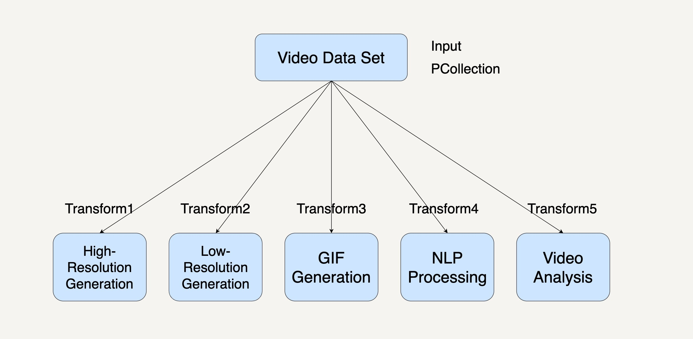
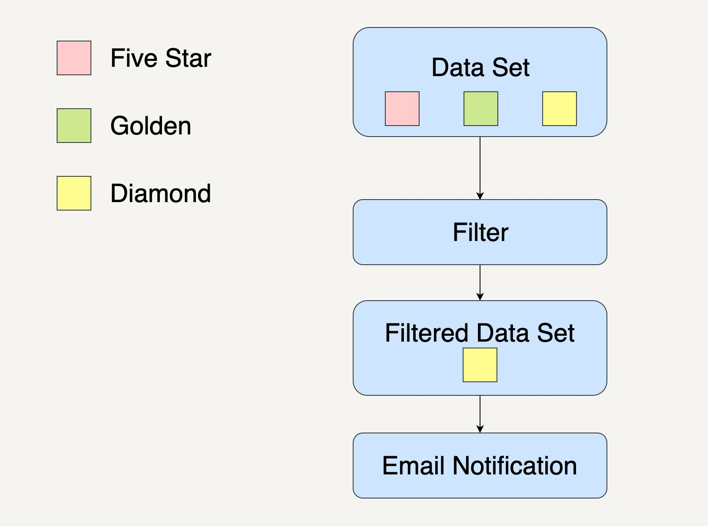
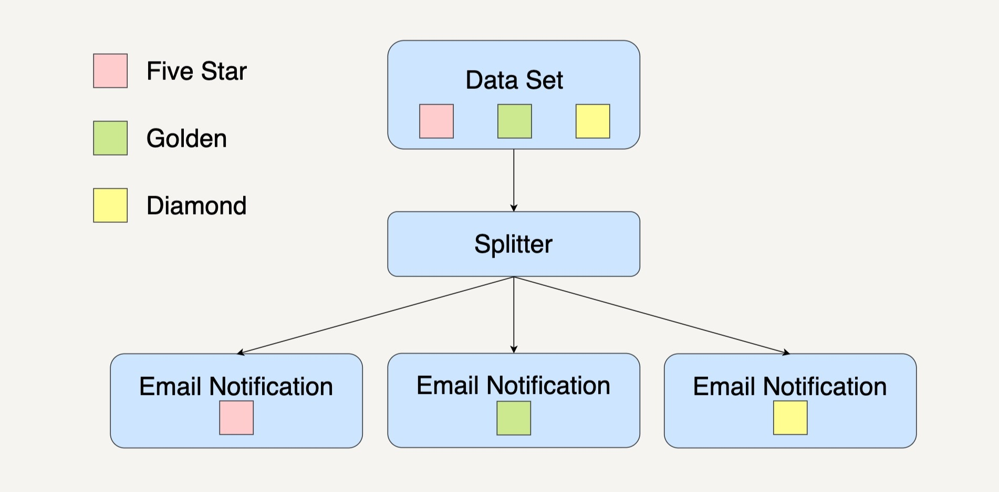
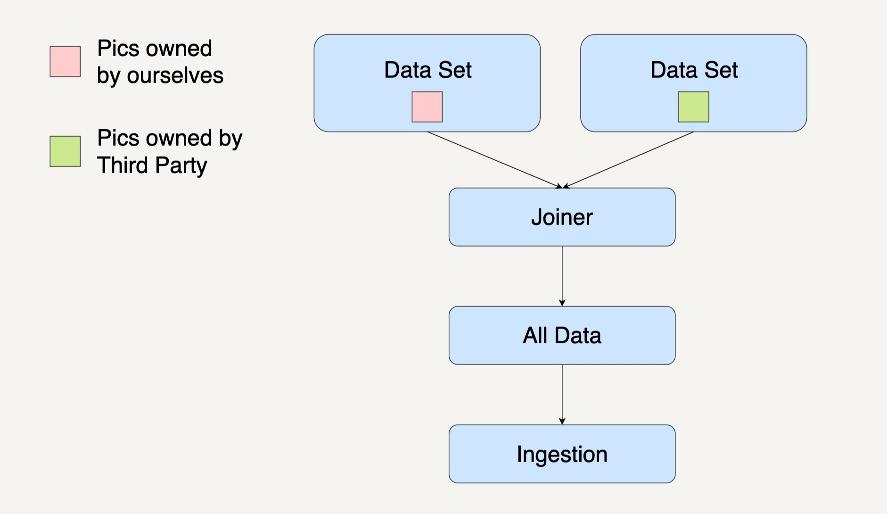

---
date: "2019-06-23"
---  
      
# 28 | 如何设计创建好一个Beam Pipeline？
你好，我是蔡元楠。

今天我要与你分享的主题是“如何设计创建好一个Beam Pipeline”。

这一讲我们会用到[第7讲](https://time.geekbang.org/column/article/92928)中介绍过的四种常见设计模式——复制模式、过滤模式、分离模式和合并模式。这些设计模式就像是武功的基本套路一样，在实战中无处不在。今天，我们就一起来看看我们怎么用Beam的Pipeline来实现这些设计模式。

## 设计Pipeline的基本考虑因素

在设计Pipeline时，你需要注意4条基本的考虑因素。

### 1.输入数据存储在哪里？

输入数据是存储在云存储文件系统，还是存储在一个关系型数据库里？有多大的数据量？这些都会影响你的pipeline设计是如何读入数据的。上一讲已经讲到过，Pipeline的数据读入是使用Read这个特殊的Transform。而数据读入往往是一个Pipeline的第一个数据操作。

### 2.输入数据是什么格式？

输入数据是纯文本文件？还是读取自关系型数据库的行？还是结构化好的特殊数据结构？这些都会影响你对于PCollection的选择。比如，如果输入数据是自带key/value的结构，那你用Beam的key/value为元素的PCollection能更好的表示数据。

### 3.这个pipeline你打算对数据进行哪些操作？

<!-- [[[read_end]]] -->

提前想好要做哪些数据操作，可以帮助你设计好Transform。可能你也会使用一些Beam提供的Transform或者是你的团队共用的一些Transform。

### 4.输出数据需要是什么样的格式，需要存储到哪里？

和输入数据相同，对于输出数据，我们也要提前判断好业务的需求。看看需要的数据格式是什么样的，是要存储到本地文本文件？还是存储到另一个数据库？

比如，你在跑一个本地批处理作业，就会需要先存到本地看一看。如果你在生成环境有永久性数据库，或者你有结构化的数据，可能更想存储到你的数据库里。

## 复制模式的Pipeline设计

现在，我们就来看看在第7讲中提到的复制模式（Copier Pattern）的例子是怎么用Beam实现的。这里需要用到[第7讲](https://time.geekbang.org/column/article/92928)的YouTube视频平台的复制模式案例。这里就简单介绍一下，以便唤醒你的记忆。如果你完全忘记了，我建议你先去做个回顾。

如今的视频平台会提供不同分辨率的视频给不同网络带宽的用户。在YouTube视频平台中，将鼠标放在视频缩略图上时，它会自动播放一段已经生成好的动画缩略图。平台的自然语言理解（NLP）的数据处理模块可以分析视频数据，自动生成视频字幕。视频分析的数据处理模块也可以通过分析视频数据产生更好的内容推荐系统。这使用的就是复制模式。

要想在在Beam中采用复制模式，我们可以用一个PCollection来表示输入的Video data set。将每一种视频处理编写成Transform。最后，多重输出各自为一个PCollection。整个过程就如同下图所示。



你可以从图片中看到，在这个工作流系统中，每个数据处理模块的输入都是相同的，而下面的5个数据处理模块都可以单独并且同步地运行处理。

复制模式通常是将单个数据处理模块中的数据完整地复制到两个或更多的数据处理模块中，然后再由不同的数据处理模块进行处理。当我们在处理大规模数据时，需要对同一个数据集采取多种不同的数据处理转换，我们就可以优先考虑采用复制模式。

比如下面的代码，我们用5个不同的pipeline来表示，它们的作用分别是生成高画质视频、生成低画质视频、生成GIF动画、生成视频字幕、分析视频。

```
    PCollection<Video> videoDataCollection = ...;
    
    //  生成高画质视频
    PCollection<Video> highResolutionVideoCollection = videoDataCollection.apply("highResolutionTransform", ParDo.of(new DoFn<Video, Video>(){
      @ProcessElement
      public void processElement(ProcessContext c) {
        c.output(generateHighResolution(c.element()));
      }
    }));
    
    //  生成低画质视频
    PCollection<Video> lowResolutionVideoCollection = videoDataCollection.apply("lowResolutionTransform", ParDo.of(new DoFn<Video, Video>(){
      @ProcessElement
      public void processElement(ProcessContext c) {
        c.output(generateLowResolution(c.element()));
      }
    }));
    
    // 生成GIF动画
    PCollection<Image> gifCollection = videoDataCollection.apply("gifTransform", ParDo.of(new DoFn<Video, Image>(){
      @ProcessElement
      public void processElement(ProcessContext c) {
        c.output(generateGIF(c.element()));
      }
    }));
    
    //  生成视频字幕
    PCollection<Caption> captionCollection = videoDataCollection.apply("captionTransform", ParDo.of(new DoFn<Video, Caption>(){
      @ProcessElement
      public void processElement(ProcessContext c) {
        c.output(generateCaption(c.element()));
      }
    }));
    
    //   分析视频
    PCollection<Report> videoAnalysisCollection = videoDataCollection.apply("videoAnalysisTransform", ParDo.of(new DoFn<Video, Report>(){
      @ProcessElement
      public void processElement(ProcessContext c) {
        c.output(analyzeVideo(c.element()));
      }
    }));
    

```

## 过滤模式的Pipeline设计

过滤模式（Filter Pattern）也可以用Beam来实现。这里我们先简单回顾一下[第7讲](https://time.geekbang.org/column/article/92928)的例子。在商城会员系统中，系统根据用户的消费次数、消费金额、注册时间划分用户等级。假设现在商城有五星、金牌和钻石这三种会员。而系统现在打算通过邮件对钻石会员发出钻石会员活动的邀请。



在过滤模式中，一个数据处理模块会将输入的数据集过滤，留下符合条件的数据，然后传输到下一个数据处理模块进行单独处理。

在用Beam实现时，我们把输入的用户群组表达成一个PCollection。输出的钻石会员用户群组也表示成一个PCollection。那么中间的过滤步骤就能编写成一个Transform。如下面代码所示，我们在一个Beam Pipeline里调用isDiamondUser\(\)方法，从所有的用户中过滤出钻石会员。

```
    PCollection<User> userCollection = ...;
    
    PCollection<User> diamondUserCollection = userCollection.apply("filterDiamondUserTransform", ParDo.of(new DoFn<User, User>(){
      @ProcessElement
      public void processElement(ProcessContext c) {
        if (isDiamondUser(c.element()) {
          c.output(c.element());
        }
      }
    }));
    
    PCollection<User> notifiedUserCollection = userCollection.apply("notifyUserTransform", ParDo.of(new DoFn<User, User>(){
      @ProcessElement
      public void processElement(ProcessContext c) {
        if (notifyUser(c.element()) {
          c.output(c.element());
        }
      }
    }));
    

```

## 分离模式的Pipeline设计

分离模式（Splitter Pattern）与过滤模式不同，并不会丢弃里面的任何数据，而是将数据分组处理。还是以商城会员系统为例。系统打算通过邮件对不同会员发出与他们身份相应的活动邀请。需要通过**分离模式**将用户按照会员等级分组，然后发送相应的活动内容。



用Beam应该怎么实现呢？我们可以应用[第25讲](https://time.geekbang.org/column/article/101735)中讲到的side input/output技术。同样的还是把用户群组都定义成不同的PCollection。最终的输出会是三个PCollection。

```
    // 首先定义每一个output的tag
    final TupleTag<User> fiveStarMembershipTag = new TupleTag<User>(){};
    final TupleTag<User> goldenMembershipTag = new TupleTag<User>(){};
    final TupleTag<User> diamondMembershipTag = new TupleTag<User>(){};
    
    PCollection<User> userCollection = ...;
    
    PCollectionTuple mixedCollection =
        userCollection.apply(ParDo
            .of(new DoFn<User, User>() {
              @ProcessElement
              public void processElement(ProcessContext c) {
                if (isFiveStartMember(c.element())) {
                  c.output(c.element());
                } else if (isGoldenMember(c.element())) {
                  c.output(goldenMembershipTag, c.element());
                } else if (isDiamondMember(c.element())) {
    	  c.output(diamondMembershipTag, c.element());
    	}
              }
            })
            .withOutputTags(fiveStarMembershipTag,
                            TupleTagList.of(goldenMembershipTag).and(diamondMembershipTag)));
    
    // 分离出不同的用户群组
    mixedCollection.get(fiveStarMembershipTag).apply(...);
    
    mixedCollection.get(goldenMembershipTag).apply(...);
    
    mixedCollection.get(diamondMembershipTag).apply(...);
    

```

比如在上面的代码中，我们在processElement\(\)方法中，根据过滤函数，分拆出五星会员，金牌会员和钻石会员。并且把不同的会员等级输出到不同的side output tag中。之后可以在返回的PCollection中用这个side output tag得到想要的输出。

## 合并模式的Pipeline设计

合并模式（Joiner Pattern）会将多个不同的数据集合成一个总数据集，一并进行处理。之前介绍的合并模式案例是用街头美团外卖电动车的数量来预测美团的股价。

数据接入这一处理模块里，我们的输入数据有自己团队在街道上拍摄到的美团外卖电动车图片和第三方公司提供的美团外卖电动车图片。我们需要先整合所有数据然后进行其它数据处理。



使用Beam合并多个PCollection时，需要用到Beam自带的Flatten这个Transform函数，它的作用是把来自多个PCollection类型一致的元素融合到一个PCollection中去。下面的代码用元素类型为Image的PCollection来表达输入数据和输出数据。

```
    PCollectionList<Image> collectionList = PCollectionList.of(internalImages).and(thirdPartyImages);
    PCollection<Image> mergedCollectionWithFlatten = collectionList
        .apply(Flatten.<Image>pCollections());
    
    mergedCollectionWithFlatten.apply(...);
    

```

例如，在上面的代码示例中，我们把internalImages和thirdPartyImages两个PCollection融合到一起。使用apply\(Flatten\)这样一个Transform实现多个PCollection的平展。

## 小结

今天我们一起学习了怎样在Beam中设计实现第7讲介绍的经典数据处理模式，分别是4种设计模式，分别是复制模式、过滤模式、分离模式和合并模式。

在实现这四种数据处理模式的过程中，我们学到了两种Beam Transform的两个重要技术，分别是分离模式中用到的side output，和在合并模式中用到的Flatten。正如前文所说，第7讲的经典数据处理模式就像是武功的基本套路，实战项目中可能80\%都是这些基本套路的组合。有了这些小型的模块实现，对我们未来实现大型系统是有很大帮助的。

## 思考题

在你的项目中有没有这四种设计模式的影子呢？如果有的话你觉得可以怎样用Beam Pipeline实现呢？

欢迎你把答案写在留言区，与我和其他同学一起讨论。如果你觉得有所收获，也欢迎把文章分享给你的朋友。