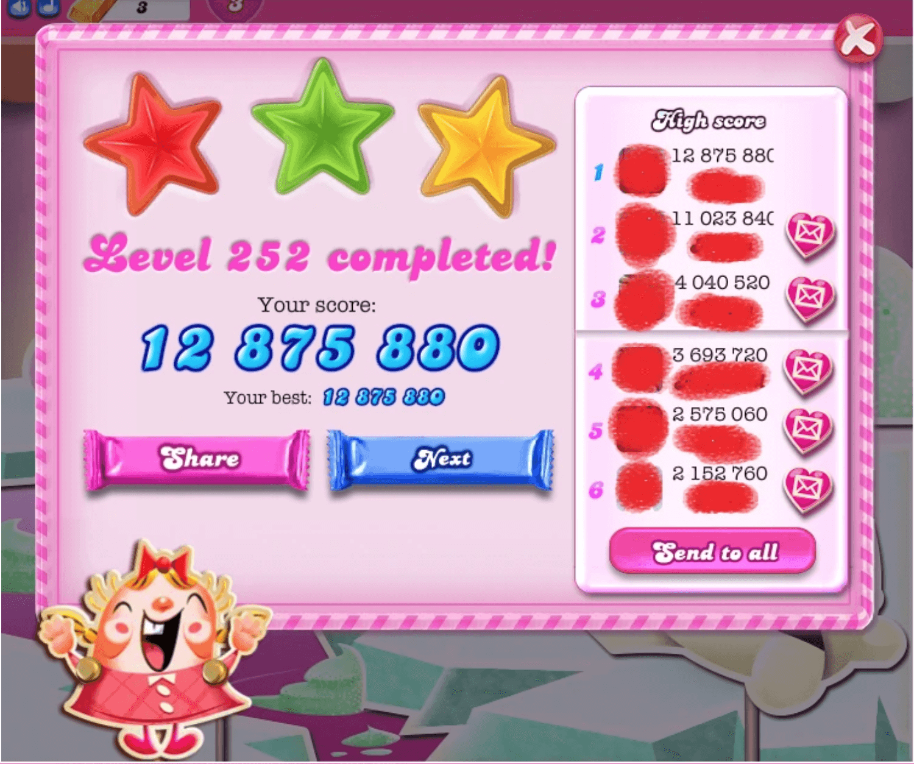

---
date: "2019-06-23"
---  
      
# 35 | Facebook游戏实时流处理Beam Pipeline实战（上）
你好，我是蔡元楠。

今天我要与你分享的主题是“Facebook游戏实时流处理Beam Pipeline实战”。

Facebook这个社交平台我相信你一定早有耳闻。它除了能够让用户发送消息给好友，分享自己的动态图片和视频之外，还通过自身的App Center管理着各式各样的小游戏。许多游戏开发商借助Facebook的好友邀请机制让自己的App火了一把。

曾经有一段时间，在Facebook上有一款名为糖果传奇（Candy Crush Saga）的游戏风靡了整个北美。各个年龄层的玩家都会在空闲的时间拿出手机，过五关斩六将，希望尽快突破更多的关卡，并且获得高分。


当然了，除了消除游戏本身带来的乐趣以外，可以在Facebook里和自己的好友进行积分排名比拼也是另外一个能吸引用户的地方。



想要一个类似Facebook这样的好友间积分排行榜，你可以有很多种实现方式以及各种优化方法。那么，如果我们要利用Apache Beam的话，该怎样实现一个类似的游戏积分排行榜呢？

今天我就来和你一起研究，要如何利用Apache Beam的数据流水线来实现一个我们自定义的简单游戏积分排行榜。

为了简化整个游戏积分排行榜案例的说明，我们先来做几个方面的假设：

<!-- [[[read_end]]] -->

* **面向的群体**：游戏积分排行榜针对的是全局每位用户以及每一个关卡，我们不需要担心如何在Beam的数据流水线中优化每个用户自身的好友积分列表。
* **更新时间**：为了保持用户的粘性，我们设定这个游戏积分排行榜的数据每隔一周就会更新一次。也就是说如果一位用户在2019年7月15日成功通关了一次游戏并且分数是这周内自身的最高分，那么这次的最高分数将一直留在2019年7月15日至2019年7月21日这周的排行榜中。但是到了2019年7月22日后，这个分数将不会再出现，需要用户重新通关这个关卡后分数才会重新出现在新的一周游戏积分排行榜中。
* **积分排位**：游戏积分排行榜需要显示出这个关卡中得分最高的前100位用户。
* **输入数据**：每次用户通关后，这个App都会将用户自身的ID，通关游戏的时间（也就是事件时间）还有分数以CSV格式上传到服务器中，每个用户的游戏积分数据都可以从Google Cloud Bigtable中读取出来。
* **输出数据**：最终这个游戏积分排行榜结果可以从一个文件中获得。也就是说，我们的Beam数据流水线需要将最终结果写入文件中。

有了这些假设，我们就一起来由浅入深地看看有哪些执行方案。

正如上一讲中所说，如果可以用简单的方法解决战斗，我们当然要避免将问题复杂化了。一种比较直观的做法就是使用crontab定时执行一个Beam数据流水线，将每周需要进行计算排名的开始时间点和结束时间点传入数据流水线中，过滤掉所有事件时间不在这个时间范围内的数据。

那么，具体要怎么做呢？

首先，我们先要定义一个类，来保存我们之前假设好用户上传的信息。

Java

```
    class UserScoreInfo {
        String userId;
        Double score;
        Long eventTimestamp;
    
        public UserScoreInfo(String userId, Double score, Long eventTimestamp) {
          this.userId = userId;
          this.score = score;
          this.eventTimestamp = eventTimestamp;
        }
    
        public String getUserId() {
          return this.userId;
        }
    
        public Double getScore() {
          return this.score;
        }
    
        public Long getEventTimestamp() {
          return this.eventTimestamp;
        }
      }
    

```

这个类十分简单，构造函数需要传入的是用户ID、游戏通关时的积分还有通关时间。

有了这个类之后，整个数据流水线的逻辑就可以围绕着这个类来处理，步骤大致如下：

1.  从Google Cloud Bigtable中读取保存用户通关积分等信息的所有Bigtable Row出来，得到PCollection。
2.  将PCollection转换成我们定义好的类，成为PCollection。
3.  根据我们传入的开始边界时间和结束边界时间过滤掉不属于这一周里数据，得到有效时间内的PCollection。
4.  将PCollection转换成PCollection\<KV\<String, UserScoreInfo>>，KV里面的Key就用户ID。
5.  自定义一个Composite Transform，其中包括三个步骤：利用Top Transform将每一个用户的最高分率选出来，得到PCollection\<KV\<String, List\>>；将PCollection\<KV\<String, List\>>转换成为PCollection\<KV\<String, UserScoreInfo>>；再次利用Top Transform将PCollection\<KV\<String, UserScoreInfo>>中前100名高分用户筛选出来。
6.  将结果写入CSV格式的文件中，格式为“用户ID，分数”。

在上面所描述的步骤中，第5步出现了一个叫Composite Transform的概念。

那么，什么是Composite Transform呢？其实Composite Transform并不是指一个具体的Transform，而是指我们可以将多个不同的Transforms嵌套进一个类中，使得数据流水线更加模块化。具体做法是继承PTransform这个类，并且实现expand抽象方法来实现的。

用我们实现过的WordsCount来举例，我们可以将整个WordsCount数据流水线模块化成一个Composite Transform，示例如下：

Java

```
    public static class WordsCount extends PTransform<PCollection<String>,
          PCollection<KV<String, Long>>> {
        @Override
        public PCollection<KV<String, Long>> expand(PCollection<String> lines) {
    
          PCollection<String> words = lines.apply(
              ParDo.of(new ExtractWordsFn()));
    
          PCollection<KV<String, Long>> wordsCount =
              words.apply(Count.<String>perElement());
    
          return wordsCount;
        }
      }
    

```

在上面这个例子中，输入的参数是每一行字符串PCollection，输出结果是每一个单词对应出现的次数PCollection\<KV\<String, Long>。在实现expand这个抽象方法的时候，里面总共嵌套了两个不同的Transform，分别是一个ParDo用来提取每一行的单词，还有一个Count Transform统计单词出现的次数。

所以在第5步中，我们也可以自己定义一个ExtractUserAndScore的Composite Transform来实现上面所描述的多个不同的Transforms。

好了，为了事先知道游戏积分排行榜中开始的边界时间和结束的边界时间，我们还需要自己实现一个Options接口。方法是继承PipelineOptions这个接口，具体如下所示：

Java

```
    public interface Options extends PipelineOptions {
        @Default.String("1970-01-01-00-00")
        String getStartBoundary();
    
        void setStartBoundary(String value);
    
        @Default.String("2100-01-01-00-00")
        String getEndBoundary();
    
        void setEndBoundary(String value);
      }
    

```

这样开始的边界时间和结束的边界时间就都可以通过Pipeline option的参数传入。

例如，我们想要得到2019年7月15日至2019年7月21日这周的排行榜，那在运行数据流水线的时候，参数就可以按照“–startBoundary=2019-07-15-00-00 \--etartBoundary=2019-07-21-00-00”传入了。

整个数据流水线的大致逻辑如下：

Java

```
    final class LeaderBoard {
      static class UserScoreInfo {
        String userId;
        Double score;
        Long eventTimestamp;
    
        public UserScoreInfo(String userId, Double score, Long eventTimestamp) {
          this.userId = userId;
          this.score = score;
          this.eventTimestamp = eventTimestamp;
        }
    
        public String getUserId() {
          return this.userId;
        }
    
        public Double getScore() {
          return this.score;
        }
    
        public Long getEventTimestamp() {
          return this.eventTimestamp;
        }
      }
    
      private static DateTimeFormatter formatter =
          DateTimeFormat.forPattern("yyyy-MM-dd-HH-mm")
              .withZone(DateTimeZone.forTimeZone(TimeZone.getTimeZone("Asia/Shanghai")));
    
      public static void main(String[] args) throws Exception {
        Options options = PipelineOptionsFactory.fromArgs(args).withValidation().as(Options.class);
        Pipeline pipeline = Pipeline.create(options);
    
        final Instant startBoundary = new Instant(formatter.parseMillis(options.getStartBoundary()));
        final Instant endBoundary = new Instant(formatter.parseMillis(options.getEndBoundary()));
    
        pipeline
            .apply(
                BigtableIO.read()
                    .withProjectId(projectId)
                    .withInstanceId(instanceId)
                    .withTableId("ScoreTable"))
            .apply("ConvertUserScoreInfo", ParDo.of(new ConvertUserScoreInfoFn()))
            .apply(
                "FilterStartTime",
                Filter.by((UserScoreInfo info) -> info.getTimestamp() > startBoundary.getMillis()))
            .apply(
                "FilterEndTime",
                Filter.by((UserScoreInfo info) -> info.getTimestamp() < endBoundary.getMillis()))
            .apply("RetrieveTop100Players", new ExtractUserAndScore())
            .apply(
                FileIO.<List<String>>write()
                    .via(
                        new CSVSink(Arrays.asList("userId", "score"))
                            .to("filepath")
                            .withPrefix("scoreboard")
                            .withSuffix(".csv")));
    
        pipeline.run().waitUntilFinish();
      }
    }
    

```

其中，ConvertUserScoreInfoFn这个Transform代表着第2步转换操作，数据流水线中两个Filter Transform分别代表着第3和第4步。第5步“获得最高分的前100位用户”是由ExtractUserAndScore这个Composite Transform来完成的。

你可以看到，不算上各种具体Transform的实现，整个数据流水线的逻辑框架大概用60行代码就可以表示出来。

虽然这个批处理的方法可以用简单的逻辑得到最后我们想要的结果，不过其实它还存在着不少的不足之处。

因为我们的批处理数据流水线使用crontab来定时运行，所以“运行数据流水线的时间间隔”以及“完成数据流水线”这之间的时间之和会给最终结果带来延迟。

比如，我们定义crontab每隔30分钟来运行一次数据流水线，这个数据流水线大概需要5分钟完成，那在这35分钟期间用户上传到服务器的分数是无法反应到积分排行榜中的。

那么，有没有能够缩小延时的办法呢？

当然有，答案就是将输入数据作为无边界数据集读取进来，进行实时的数据处理。在这里面我们会运用的到第23讲所讲述到的窗口（Window）、触发器（Trigger）和累加模式（Accumulation）的概念。

我将在下一讲中，与你具体分析怎样运用Beam的数据流水线实现一个实时输出的游戏积分排行榜。

## 小结

今天我们一起展开讨论了自己实现一个简易游戏积分排行榜的过程。可以知道的是，我们可以使用Beam的数据流水线来完成这一任务。而在Beam数据流水线的实现方式中，我们又可以分成批处理的实现方式和即将在下一讲中展开讨论的实时流处理的方式。批处理虽然简单，但是存在着延时性高、无法快速更新积分排行榜的缺点。

## 思考题

在今天这一讲的最后，我提示了你在实时流处理中需要用到窗口、触发器和累加模式。那我们就先来做个预热，思考一下，在流处理中你会对这三种概念赋予什么值呢？

欢迎你把答案写在留言区，与我和其他同学一起讨论。如果你觉得有所收获，也欢迎把文章分享给你的朋友。