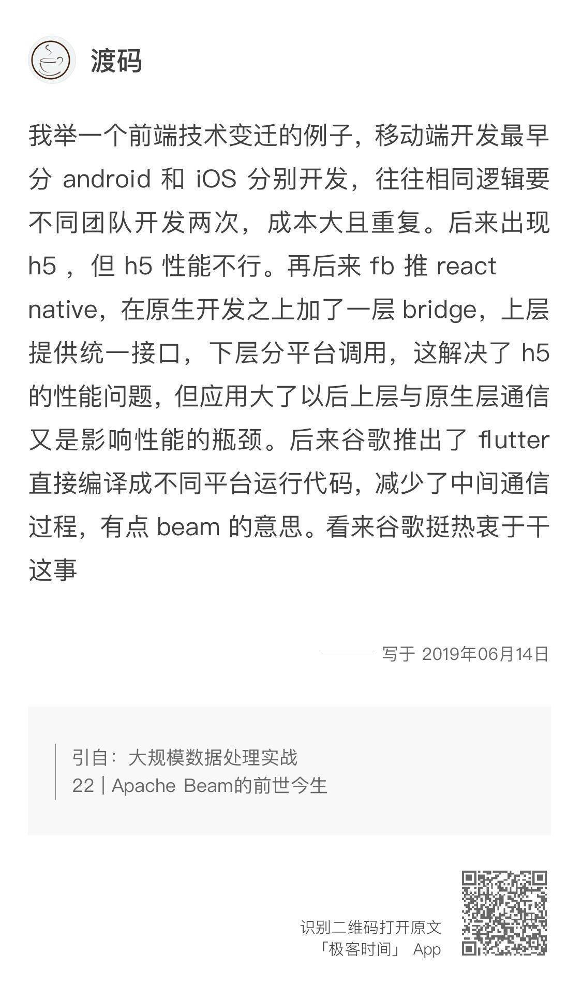
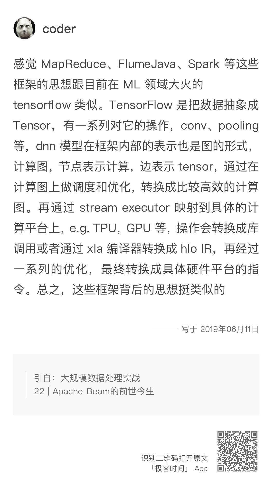
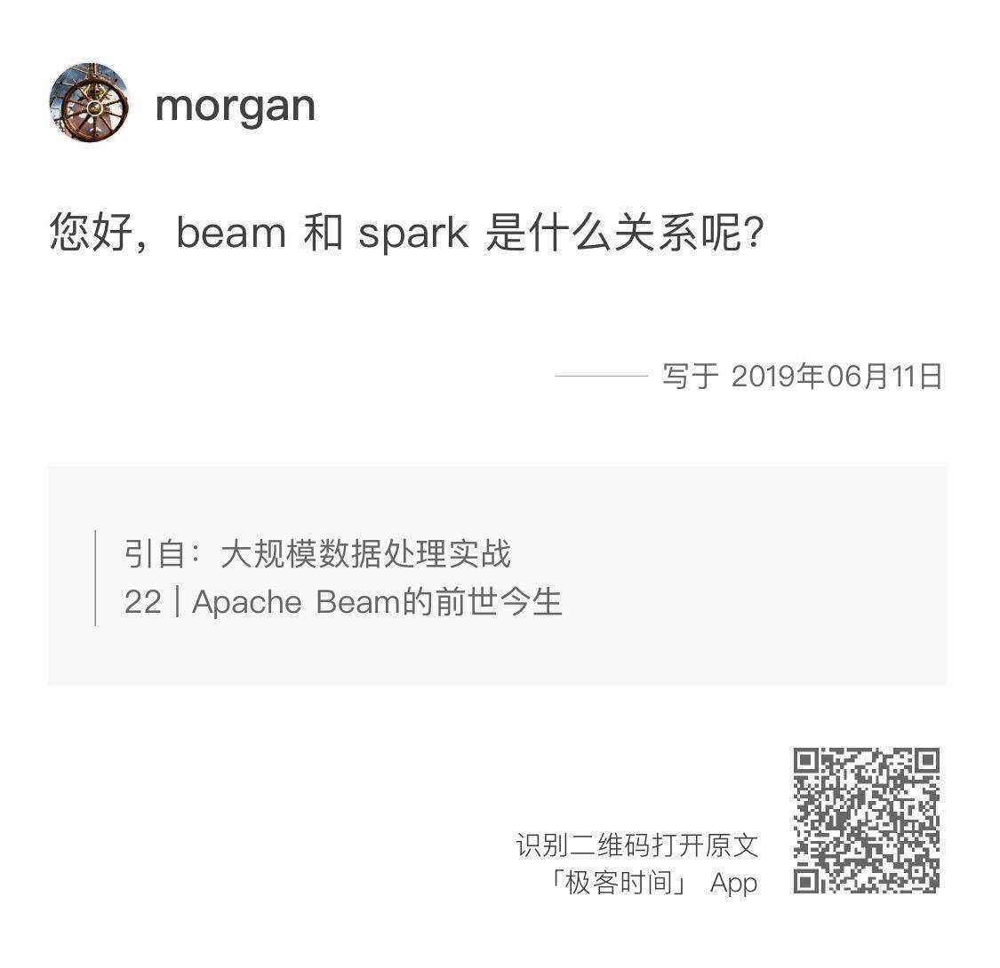
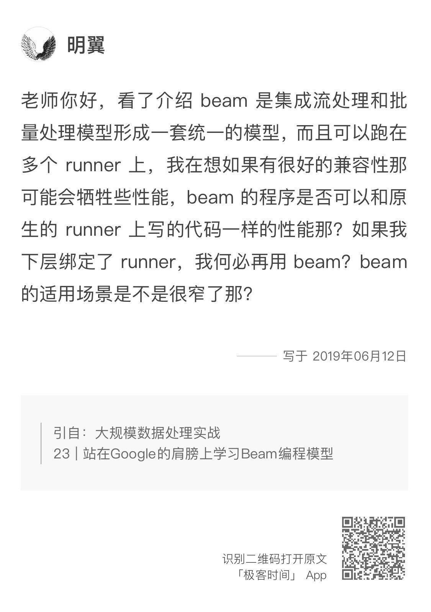
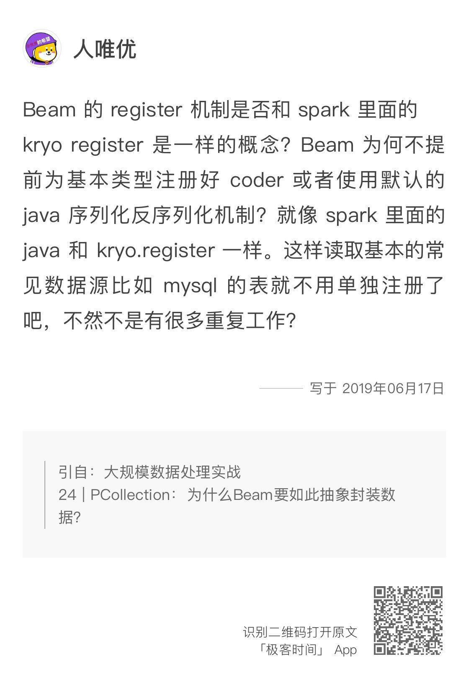
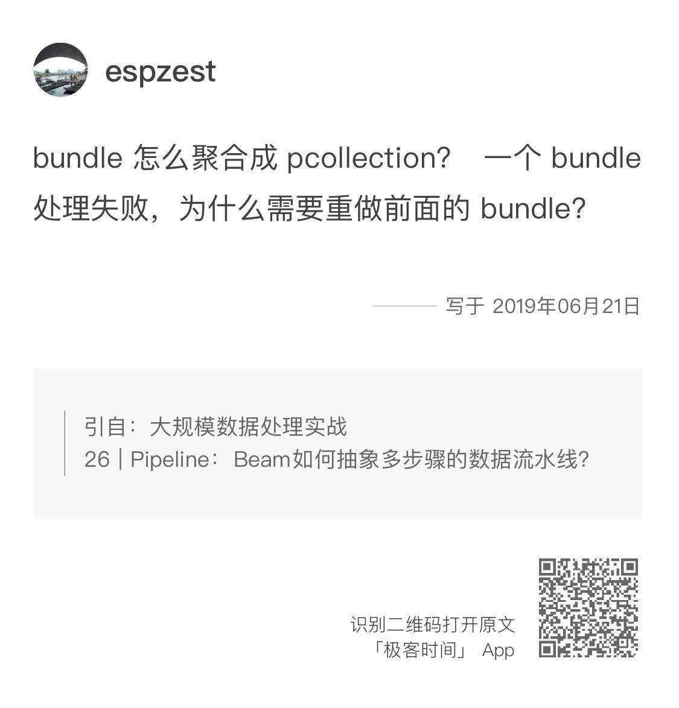
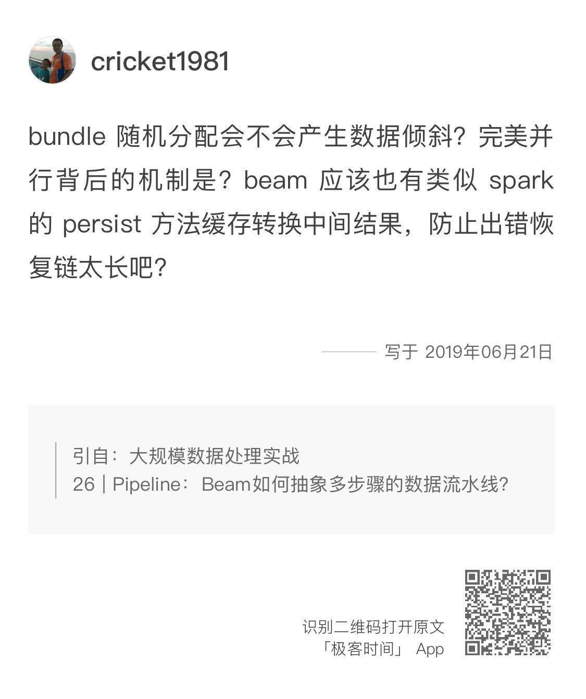
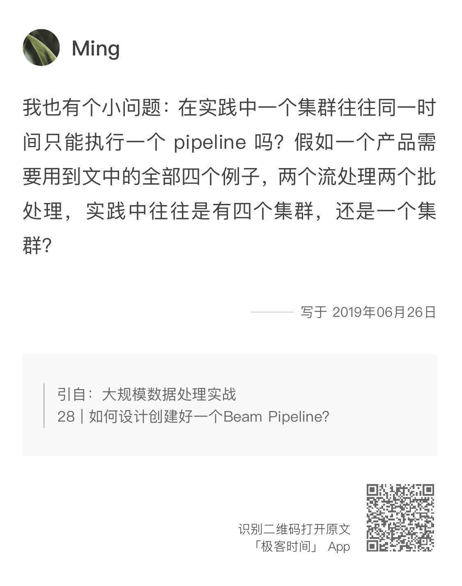
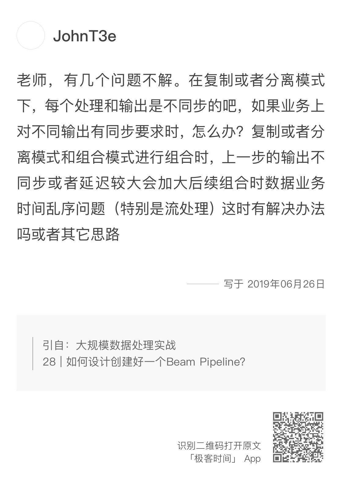

---
date: "2019-06-23"
---  
      
# FAQ第三期 | Apache Beam基础答疑
你好，我是蔡元楠。

这里是“FAQ第三期：Apache Beam基础答疑”。这一期主要是针对上周结束的模块四——Apache Beam的基础知识部分进行答疑，并且做了一些补充。

如果你对文章的印象不深了，可以先点击题目返回文章复习。当然，你也可以继续在留言中提出疑问。希望我的解答对你有所帮助。

## [22 | Apache Beam的前世今生](https://time.geekbang.org/column/article/99379)

在第22讲中，我分享了Apache Beam的诞生历程。留言中渡码、coder和Milittle都分享了自己了解的技术变迁、技术诞生历史。





而JohnT3e则是分享了我在文章中提到的几个论文的具体内容。他分享的论文是非常好的补充材料，也希望你有时间的话可以下载来看一看。我把链接贴在了文章里，你可以直接点击下载浏览。

[MapReduce论文](https://research.google.com/archive/mapreduce-osdi04.pdf)  
[Flumejava论文](https://research.google.com/pubs/archive/35650.pdf)  
[MillWheel论文](https://research.google.com/pubs/archive/41378.pdf)  
[Data flow Model论文](https://www.vldb.org/pvldb/vol8/p1792-Akidau.pdf%5D)

Morgan在第22讲中提问：Beam和Spark是什么关系？



我的回答是，Spark可以作为Beam的一个底层Runner来运行通过Beam SDK所编写的数据处理逻辑。相信在读完第23讲的内容后，Morgan会对这个概念有一个更好的认识。

## [23 | 站在Google的肩膀上学习Beam编程模型](https://time.geekbang.org/column/article/100478)

<!-- [[[read_end]]] -->

在第23讲中，明翼提出的问题如下：



其实明翼的这些问题本质上还是在问：Beam在整个数据处理框架中扮演着一个什么样的角色？

首先，为什么不是所有的大数据处理引擎都可以作为底层Runner呢？原因是，并不是所有的数据处理引擎都按照Beam的编程模型去实现了相应的原生API。

我以现在国内很火的Flink作为底层Runner为例子来说一下。

在Flink 0.10版本以前，Flink的原生API并不是按照Beam所提出的编程模型来写的，所以那个时候，Flink并不能作为Beam的底层Runner。而在Flink 0.10版本以后，Flink按照Beam编程模型的思想重写了DataStream API。这个时候，如果我们用Beam SDK编写完数据处理逻辑就可以直接转换成相应的Flink原生支持代码。

当然，明翼说的没错，因为不是直接在原生Runner上编写程序，在参数调整上肯定会有所限制。但是，Beam所提倡的是一个生态圈系统，自然是希望不同的底层数据处理引擎都能有相应的API来支持Beam的编程模型。

这种做法有它的好处，那就是对于专注于应用层的工程师来说，它解放了我们需要学习不同引擎中原生API的限制，也改善了我们需要花时间了解不同处理引擎的弊端。对于专注于开发数据处理引擎的工程师来说，他们可以根据Beam编程模型不断优化自身产品。这样会导致更多产品之间的竞争，从而最终对整个行业起到良性的促进作用。

在第23讲中，JohnT3e也给出了他对Beam的理解。


我是很赞成JohnT3e的说法的。这其实就好比SQL，我们学习SQL是学习它的语法，从而根据实际应用场景来写出相应的SQL语句去解决问题。

而相对的，如果觉得底层使用MySQL很好，那就是另外的决定了。写出来的SQL语句是不会因此改变的。

## [24 | 为什么Beam要如此抽象封装数据？](https://time.geekbang.org/column/article/100666)

在第24讲中，人唯优的提问如下：



确实，Beam的Register机制和Spark里面的kryo Register是类似的机制。Beam也的确为常见的数据格式提供了默认的输入方式的。

但这是不需要重复工作的。基本的数据结构的coder在[GitHub](https://github.com/apache/beam/tree/master/sdks/java/core/src/main/java/org/apache/beam/sdk/coders)上可以看到。比如String，List之类。

## [25 | Beam数据转换操作的抽象方法](https://time.geekbang.org/column/article/101735)

在第25讲中，我们学习了Transform的概念和基本的使用方法，了解了怎样编写Transform的编程模型DoFn类。不过，sxpujs认为通用的DoFn很别扭。


这个问题我需要说明一下，Spark的数据转换操作API是类似的设计，Spark的数据操作可以写成这样：

```
    JavaRDD<Integer> lineLengths = lines.map(new Function<String, Integer>() {
      public Integer call(String s) { return s.length(); }
    });
    

```

我不建议你用自己的使用习惯去评判自己不熟悉的、不一样的API。当你看到这些API的设计时，你更应该去想的，是这种设计的目标是什么，又有哪些局限。

比如，在数据处理框架中，Beam和Spark之所以都把数据操作提取出来让用户自定义，是因为它们都要去根据用户的数据操作构建DAG，用户定义的DoFn就成了DAG的节点。

实际使用中，往往出现单个数据操作的业务逻辑也非常复杂的情况，它也需要单独的单元测试。这也是为什么DoFn类在实际工作中更常用，而inline的写法相对少一点的原因。因为每一个DoFn你都可以单独拿出来测试，或者在别的Pipeline中复用。

## [26 | Pipeline：Beam如何抽象多步骤的数据流水线？](https://time.geekbang.org/column/article/102182)

在第26讲中，espzest提问如下：



其实我们通过第24讲的内容可以知道，PCollection是具有无序性的，所以最简单的做法Bundle在处理完成之后可以直接append到结果PCollection中。

至于为什么需要重做前面的Bundle，这其实也是错误处理机制的一个trade-off了。Beam希望尽可能减少persistence cost，也就是不希望将中间结果保持在某一个worker上。

你可以这么想，如果我们想要不重新处理前面的Bundle，我们必须要将很多中间结果转换成硬盘数据，这样一方面增加很大的时间开销，另一方面因为数据持久化了在具体一台机器上，我们也没有办法再重新动态分配Bundle到不同的机器上去了。

接下来，是cricket1981的提问：



其实文章中所讲到的随机分配并不是说像分配随机数那样将Bundle随机分配出去给workers，只是说根据runner的不同，Bundle的分配方式也会不一样了，但最终还是还是希望能使并行度最大化。

至于完美并行的背后机制，Beam会在真正处理数据前先计算优化出执行的一个有向无环图，希望保持并行处理数据的同时，能够减少每个worker之间的联系。

就如cricket1981所问的那样，Beam也有类似Spark的persist方法，BEAM-7131 issue就有反应这个问题。

## [28 | 如何设计创建好一个Beam Pipeline？](https://time.geekbang.org/column/article/103301)

在第28讲中，Ming的提问如下：



对此，我的回答是，一个集群有可能同时执行两个pipeline的。在实践中，如果你的四个pipeline之间如果有逻辑依赖关系，比如一个pipeline需要用到另一个pipeline的结果的话，我建议你把这些有依赖关系的pipeline合并。

如果你的pipeline之间是互相独立，你可以有四个独立的二进制程序。这个提问里，Ming说的集群应该是物理上的机器，这和pipeline完全是两个概念。好的集群设计应该能够让你可以自由地提交pipeline任务，你不需要去管什么具体集群适合去安排跑你的任务。

JohnT3e的问题如下：



对于这个问题，我觉得JohnT3e可以先退一步，看看这个需求场景到底适不适用于分布式数据处理。

分布式的核心就是并行，也就是说同一批数据集合元素和元素之间是无依赖关系的。如果你的场景对于元素的先后顺序有业务需求，可能可以看看PubSub，RPC等是不是更适合。而不是Beam的PCollection。

好了，第三期答疑到这里就结束了。最后，感谢在Apache Beam的基础知识模块里积极进行提问的同学们，谢谢你们的提问互动。

\@JohnT3e、\@渡码、\@coder、\@morgan、\@Milittle、\@linuxfans、\@常超、\@明翼、\@ditiki、\@朱同学、\@Bin滨、\@A\_F、\@人唯优、\@张凯江、\@胡墨、\@cricket1981、\@sxpujs、\@W.T、\@cricket1981、\@espzest、\@沈洪彬、\@onepieceJT2018、\@fy、\@Alpha、\@TJ、\@dancer、\@YZJ、\@Ming、\@蒙开强