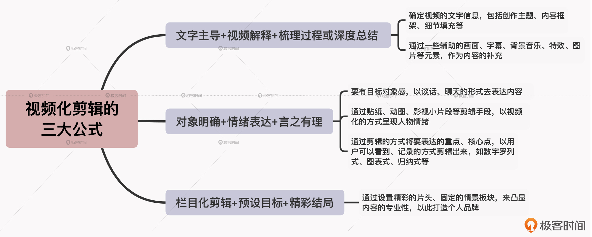

---
date: "2019-06-23"
---  
      
# 16 | 视频剪辑：如何轻松掌握视频化剪辑的三大公式？
你好，我是周维。

短视频创作中少不了剪辑这个重要的环节，可以说剪辑的好坏直接决定了视频内容的质量，而视频质量的高低也是影响内容成为爆款的重要因素之一。

不过，虽然很多人都懂得视频质量的重要性，但剪辑的水平却是参差不齐，甚至有太多的人根本就没碰过剪辑工具。于是，这种过高的技术门槛就会导致很多人存在一种错误的认知，那就是一定要了解和学习不同类型短视频的剪辑方式，达到专业的剪辑水平才行。其实在我看来，这是大错特错的。主要原因有两点：

* 第一，专业的剪辑水平来自从0到1的系统学习，是需要付出大量的时间、精力、金钱成本才能够堆砌起来的能力，而不是简单依靠学会剪辑几种不同类型的短视频，就掌握了所有的剪辑技能；
* 第二，短视频的发展及技术的成熟让剪辑的门槛越来越低，比如短视频刚刚诞生时，如果想要剪辑一个短视频，就必须依靠PC端上的专业剪辑工具（如PR、Final cut pro等），但是如今剪映、快影等手机剪辑App使用起来更方便，字幕都可以一键生成，准确率也很高。换句话说，如果你还是站在技术流派的角度来看待剪辑这件事，是完全没必要的。

既然如此，对于短视频剪辑来说，有没有一些通用的方法或者技巧，能帮助我在短时间之内快速提升剪辑能力呢？或者是，我之前从来没有接触过短视频剪辑，有没有什么途径可以让我快速掌握剪辑方法？

<!-- [[[read_end]]] -->

这就是咱们今天这节课的重点了。**我会通过视频化剪辑的三大公式，带你轻松掌握短视频剪辑的底层逻辑，让你不管在哪个内容领域创作，都可以快速找到视频剪辑的方法。**

不过在开始介绍之前，我还想说明一点，那就是所有的剪辑技巧、手法，其实都要服务于具体的创作场景。今天我所讲的视频化剪辑公式也是如此，我的目的是要让你真正理解如何根据不同的创作场景，来选择不同的剪辑方式，从而达成快速掌握短视频剪辑方法的目的，更好地提高创作效率。

## 公式一：文字主导+视频解释+梳理过程或深度总结

我们来看看视频化剪辑的第一个公式，也就是文字主导+视频解释，再加上梳理过程或者深度总结。这个剪辑公式最重要的核心点是对外传递价值、给予解决方案，因此其主要的应用场景就是知识类、教育类、科普类等内容领域。

现在，我们来一一拆分下这个公式：

* **文字主导**：即在围绕一个事件、一个知识点或一种价值观进行输出时，需要先确定视频的文字信息，包括创作主题、内容框架、细节填充等。
* **视频解释**：在确定了创作主题及详细的文字内容以后，就需要通过视频化的画面将其呈现出来，并且还需要针对一些关键信息进行解释和说明。
* **梳理过程：**所谓的梳理过程就是指对整个视频的重点内容进行一个系统性的梳理，在此过程中帮助用户强化记忆、记住重点，并可以突出你传递的内容价值。
* **深度总结**：你可以理解为是一篇文章最后的结语，在这里你可以传递价值，表达核心观点，也可以针对前面的视频内容再做思考或延伸。

所以，在这样的创作场景之下，这里的**视频解释**就是我们做剪辑时重点要凸显的地方了，因为只有这样才能更好地将最重要的文字信息以视频化的方式呈现给用户。

那么具体要怎么做呢？我给你举个例子。

我们知道，短视频的出现其实只是改变了信息记录的方式，其内核还是在为用户提供内容价值，所以很多原来的传统媒体从业者，如今会通过短视频的方式来记录和输出观点，典型代表就是B站的UP主“硬核的半佛仙人”。

在他的视频中，其实并没有体现太多剪辑上的高超技术，反倒更多的是剪辑小白都会的操作：对照文本内容找相应的视频素材，然后拼接起来即可。而且在视频中，很多时候他都会直接用PPT来代替动态画面，但依然不影响用户对有价值、有知识点的内容的喜爱。比如，你可以看下他的[这期视频](https://www.bilibili.com/video/BV1UJ41157Lw)。

也就是说，当你身处一个重知识输出、重核心观点表达、重价值提供的内容创作场景时，视频化剪辑的底层逻辑，就是通过一些辅助的画面、字幕、背景音乐、特效、图片等元素，作为内容的补充即可，而没必要通过更多炫酷的技术手段来提高视频的质量，因为用户关心的是你传递的内容核心，而不是技术流的展示。

除此之外，这里我还要提醒你注意以下两点：

* 在剪辑之前，你可以先把所有的文字信息列出来，然后逐字逐句地去查看每一句话要如何用视频的方式去表达。
* 如果你创作的是重价值的短视频内容，那剪辑的作用就是要突出核心或关键的信息，所以你可以采用剪辑中独有的贴纸、特效、声音等方式给予提醒，让用户能get到重点。

## 公式二：对象明确+情绪表达+言之有理

好，我们再来看看第二个视频化剪辑的公式，那就是对象明确+情绪表达，再加上言之有理。

乍一听这个公式，你可能有些摸不着头脑，别着急，下面我就给你具体拆分一下。

* **对象明确**

即创作者在创作视频内容时要有目标对象感，要将屏幕另一端的用户当成倾诉、对话的朋友，然后以谈话、聊天的形式去表达内容，让用户在观看视频时会感觉像是在跟自己说话、沟通。这样的内容形态有很多，比如第一人称的表达视角、真人出镜等，目的就是与用户产生亲近感，拉近彼此的距离。

* **情绪表达**

即在创作中遇到有情绪、能展现个人态度的地方，一定要通过视频化的方式，如表情包、动图、特效或者影视小片段，来淋漓尽致地表达出来。这一点很重要，一定要让用户感受到内容中带来的情绪渲染，这样用户就会觉得你传递的信息是真实可信的。

* **言之有理**

即创作的内容要能表达出自己的观点、看法，千万不能是流水账式的平铺直叙。这一点适合所有短视频的创作，因为没有精彩内容的呈现，不仅会失去用户的注意力，也不会让更多的用户喜欢自己。

其实，以上三个元素加在一起可以应用在很多的内容领域中，比如知识科普类、美食类、旅行类、财经类，等等。

那么，在这些内容场景下，视频化的剪辑主要体现在什么方面呢？

首先，对应“对象明确”这一点，你可以根据创作内容的重点来匹配合适的表现形象，然后利用剪辑手段体现在封面和视频当中。我举个简单的例子，B站上的一位UP主“芜湖大司马”，围绕不同的内容，他每期视频的出镜方式也不同，比如在与九球天后潘晓婷[合作的视频](https://www.bilibili.com/video/BV1Xa4y1s79W?from=search&seid=1495116512575075219)中，不仅穿着正装，视频封面还刻意做出有PK感觉的画面；在一期[cos酒桶](https://www.bilibili.com/video/BV1jy4y1U78D?from=search&seid=220941802936856067)的搞笑内容中，封面就刻意发上了自己搞笑滑稽的照片。

其次，对于“情绪表达”，在视频化的剪辑上一定要遵循的原则是：**通过贴纸、动图、影视小片段等剪辑手段，以视频化的方式呈现人物情绪。**这是啥意思呢？我给你举个例子。比如你在短视频中，出现了一幕是你面对一件事很生气，如果你只是简单说出来，那么传递给用户的情感力量是微弱的，而通过剪辑的方式，比如加入一个愤怒的贴纸或者生气的表情包动图、动画片段等，马上就可以将这种效果传递出来。

通过这样的剪辑方式，用户就能非常清晰直观地感受到你传递的情绪变化，这样对你塑造的人设也好，传递的核心价值也罢，都能有感同身受的效果。

最后，针对“言之有理”，就是通过剪辑的方式将要表达的重点、核心点，以用户可以看到、记录的方式剪辑出来。最简单的方法就是采用数字罗列式、图表式、归纳式等，让用户看了之后可以通过直接剪屏、抄写等方式直接拿走，减少用户总结的难度。

## 公式三：栏目化剪辑+预设目标+精彩结局

好了，最后一个公式，就是栏目化剪辑+预设目标，再加上精彩结局。

这里我同样也给你一一分析下每个元素的意思。

首先，所谓的栏目化有两层含义，第一层是说**栏目机制**，比如电视节目会被分门别类、定时定点地播出，整个节目从策划到制作都有专人负责；第二层意思是说**栏目形式**，大多的电视节目都是借鉴了杂志编排内容的形式，最后串联成一个整体再播出。此外还有一些统一的特征，比如固定的主持人、每期会有明确的主题、栏目风格形式统一，等等。

而随着短视频的发展，栏目化的视频内容越来越多，而且它会分布在各个内容创作领域中，比如汽车测评领域，基本上都是固定的出镜人物围绕不同的汽车进行测评，而测评的内容主要会围绕静态、动态、性能等多个固定板块进行。

另外，在这种栏目化短视频中，而且往往还会伴随着一个预设目标。也就是说当一期内容刚刚开始时，就给用户抛出本期视频的主题或者需要完成的任务，让用户怀有期待来观看后面的内容，最后在结尾处得到答案。

这样，在视频的结束阶段往往就是整个视频内容的精彩之处，创作者会多维度地来详细总结关键信息，带给用户超预期的收获。

那么，对于这样的栏目化组合形式，对应的剪辑手法就是**通过设置精彩的片头、固定的情景板块，来凸显内容的专业性，以此打造个人品牌。**

我给你举个例子。主打美食探店的创作者“吃货请闭眼”，每期会带领用户探寻一个美食小店。他的内容之所以受到用户的喜爱，主要就是因为栏目化的剪辑风格，通过设置固定的内容板块，对一款美食进行全方面的评价。而且他的剪辑手法也不会轻易改变，目的就是强调自己的品牌意识。我这里放了一期这个创作者的[视频内容](https://www.ixigua.com/user_playlist/60529054268?rank=1&offset=0&order=hot&filterTS=1617183689&logTag=ecf189bd555fc6acf5eb)，你可以感受一下。

## 小结

我们一定要记得，在短视频创作中，剪辑需要围绕具体的创作场景，它起到的是辅助、衬托、突出关键信息的作用，而不是为了单纯的炫技。今天我们学习的三种剪辑公式，目的都是为了凸显出内容的视频化效果，让用户能够通过画面第一时间感知到我们传递的核心价值。

另外，我们在通过剪辑去服务创作的内容时，一定要简单化、便利化，为用户降低观看难度，这样用户更容易理解或学习，也更容易做出分享或转发等动作。

## 思考题

你在剪辑时，一般会采用什么样的剪辑公式？欢迎你在留言区分享自己的所学所悟，通过分享来提升自己的学习效果。

如果觉得今天的内容对你有所帮助，欢迎分享给更多的朋友。好了，这节课就到这里，我们下节课再见吧！