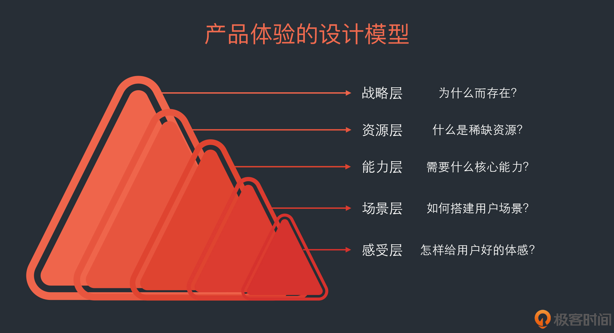
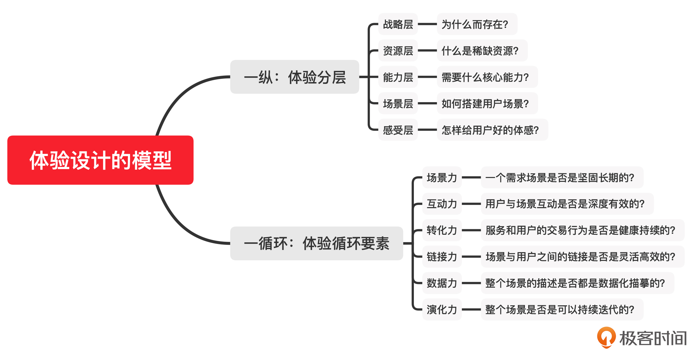

---
date: "2019-06-23"
---  
      
# 03 | 体验设计的模型：找到体验设计的关键规律
你好，我是相辉。

在前面的两讲中，我们了解了商业阶段和商业化价值对于体验设计策略的影响。那么接下来最重要的，就是为体验设计构建模型了。利用体验设计的模型，可以帮助我们理解用户体验是如何构成的，进而帮我们寻找到产品体验的规律，定位体验问题，优化和改进产品。

所以今天这节课，我们就一起来了解如何搭建一个体验设计的模型，找到体验设计的关键规律。

## 体验设计：以人为尺度的价值交换模型

体验设计是商业在用户端的交付，比如我们的出行体验就取决于价格、及时性、效率、出行过程的服务感受，这个整体，就是体验的交付。不过这个交付的结果并不是一味地满足人的欲望，而是为了多方的价值交换可持续。它既需要满足场景需求，又需要满足价值平等。

还拿出行的服务体验来举例，其实除了以上所提到的这些，我们还可以做很多，只不过并不是所有的服务设计都能让用户好感度大增，但我们相应投入的成本却会很高，所以这也就变成了不可持续的协作模型。而**我们的体验设计，需要既让用户感受良好，又要在商业价值上可持续，这是一个围绕人的平衡**。

但我们也要知道，体验模型并不是我们一开始就可以设计出来的，而是需要供给方和需求方一起多方磨合，逐渐成型。**产品的体验并不是无根之水，它是附着在价值交换上的琉璃光宝，并且本身也是一种价值。**

<!-- [[[read_end]]] -->

这就像医学一样，如果只看症状而不去做实际的化验，一定是不科学的，这并不能从根本上解决问题。在体验设计中，我们也必须能看到一个商业闭环从头到尾是如何运作的，找到体验设计中各个环节下的运作原理，这样才能真正理解和解决复杂的商业和人性问题。

而一个产品体验的模型，我们往往可以从两个维度去看，一纵一循环。所谓的一纵，指的是体验的层次；一循环，指的是体验模型的循环要素。那么接下来，我就根据这个划分原则，跟你一起拆解一个公司的体验模型。

## 一纵：体验分层

在这里，我想先给你更正一个概念。最早执行用户体验的一拨人，基本上都是设计师，所以现

在各个公司都会认为设计就是用户体验，就是UX，这其实是一种误解。

**用户体验应该是一个公司级别的战略，它应该是所有人为之努力的对象。**

还是拿出行的例子来说明，出行的体验基础是“我”能打到车，那么运营团队的关键动作就是囊括更多的司机来做供给；出行的安全服务是来自于安全团队，那么安全体验就应该由安全策略与客服团队来负责；而出行过程中的感受应该是服务设计，因此这个时候服务设计和产品团队会是关键。也就是说，用户体验战略，应该是站在公司的角度，整体规划的战略。

所以，如果你公司里的设计团队叫自己是UX Team，那最好更正一下，让大家明白，其实每一个人，都是在为公司的UX而努力。

好了，那么接下来，我们就来明确一下用户体验设计都是怎么分层的。这里我借助了《用户体验要素》的分层方法，并稍作改动，我会用我自己的理解，来带你明确“战略层、资源层、能力层、场景层、感受层”这五个体验层次，并用顺风车的案例来帮你梳理清楚各层次之间的关键动作。

### 战略层

战略层，就是要回答这个产品**“为什么而存在”**。专业人士往往会有个很容易犯的错误：不是从产品场景需要的角度去设计业务，而是从技能专业的角度去做产品。产品出来以后功能有一堆，但是没有用户场景，这是一个很可怕的事情。

一个产品的出现，都是有自己非常刚的需求场景的，它要回答提升了什么效率、释放了什么红利、降低了什么成本、提升了什么品质等问题。而一个产品最核心的部分，就是要找到**产品的关键体验为什么而存在**的答案。

这里我拿顺风车产品的体验模型给你展示一下。因为顺风车是C2C平台，车主都是平台运营的个人车主，所以运营成本比较低，那么就可以做到给乘客更低价格的出行服务，并且体验和效率都可以做到相对到位，这就决定了这样一个产品可以拥有自己的市场空间，比快车和专车以及出租车都便宜，尤其是那些中长距离的场景，这就是顺风车的关键立足点。

### 资源层

**决定一个产品体验好坏的最底层，是资源。**你拥有什么供给资源，决定了你能否把产品做成。比如渠道资源、服务资源等。如果产品设计得再好看，资源不到位，那基本产品功能是没有办法实现的。就好像没有油的加油站，设计得再漂亮，也没有车会去那儿加油的。

资源层主要解决的问题就是**“什么是稀缺资源”**，我还是接着用顺风车的案例给你说明一下。一个出行产品能把足够多优质的车主资源聚集起来，其实是一件很难的事情。而每个顺风车产品，都拥有自己获取车主的能力，留下他们，就是平台运营动作的关键。

### 能力层

这一层次，是指我们的产品**是否有能力达到用户的需求**。比如，是否有足够的分发能力、服务能力，以及技术能力，等等。你想想看，一个视频网站的资源再好，如果没有足够的技术能力来保证视频播放不卡顿，那也是会让用户骂街的。

在能力层，我们主要解决的是**“需要什么核心能力”**的问题：顺风车产品高效服务的关键，在于C端车主的服务标准化、安全问题，以及路线匹配的能力。而在后顺风车时代，车主的服务能力也是关键能力。

### 场景层

在场景层，我们需要明确，我们的产品**是否有足够的场景功能的设计能力**，以保证用户在每个场景，都能有很好的功能规划和场景契合度。一个很简单的例子，很多在技术设计上很不错的产品，但在使用上却功能规划不合理，缺乏产品交互设计，用户用起来会觉得非常反人类。

这一层次，主要解决的就是**“如何搭建用户场景”**的问题：在顺风车出行产品中，设计好车主、乘客的匹配场景，以及功能规划和运营策略规划，就是产品和运营团队的主要任务。另外安全场景，也是需要深耕的场景之一。

### 感受层

顾名思义，感受层指的就是**用户的体感和心灵体验**。比如说产品文案是否得当、是否符合人体工学的设计、是否能给用户足够的精神满足，等等。

再比如，很多早期就在使用特斯拉的车主跟我说过，他们刚开始开电动汽车的时候，感觉自己好像是在操控钢铁侠的高科技装备。嗯，我想这大概是一种营销策略在作怪。但我们不能否认的是，**人的心灵感受是产品体验的最终定义**。

那么在这一层次，主要解决的就是**“怎样给用户好的体感”**的问题：顺风车产品最终交付给用户的产品交互、服务体验、文案设计、品牌传达等，都放在了感受层当中，它的品牌定位也非常清晰：“顺路出行还不贵”。

好，综上所述，我们其实可以看到，一个产品体验的好坏，从最底层的战略到最高层的心灵，均有涉及。而不同的品类，所涉及的层次权重不一样。比如，奢侈品更注重品牌感受的塑造，而很多水电煤的基础产品更需要解决用户的实际问题，这是不同商业模式下采用的不同策略。

总而言之，你要知道，一个产品体验的设计模型，最重要的就是解决以下这五个问题：

1.  **为什么而存在？**
2.  **什么是稀缺资源？**
3.  **需要什么核心能力？**
4.  **如何搭建用户场景？**
5.  **怎样给用户好的体感？**

OK，现在你就已经了解了体验的层次。只有明晰了用户体验的分层，你才能知道产品的强项弱项分别处在哪个层次。不把各类体验问题混为一谈，是各个职能一起协作及信息交换的最重要的一环。那么对于一个体验设计的模型来说，你还需要知道体验模型的循环要素是什么，这样构建出来的体验模型才具有使用价值。

## 一循环：体验循环要素

商业有模型，体验同样有。而达到某种优秀体验的产品，都是通过**时间窗口**训练出来的最佳平衡。所以有人问我：辉哥，为什么说现金流不全是企业的竞争壁垒？其实就是这个道理。现金流固然重要，但随着现金流一次又一次的交易循环，训练出来的商业协作模型才是一个企业扎根的真正价值。

我又要拿顺风车产品来给你举例子了。顺风车通过用户一次又一次的交易，训练出来路线匹配的中台算法能力，就是它的竞争壁垒之一。同时，车主服务的收益/成本控制力模型，也是平台的价值和壁垒。用同样的价格，顺风车就可以比其他出行产品做到更好的用户服务体验。

所以一个体验模型除了分层，还要看它们是如何循环的。

在一个需求场景里，一个体验往往可以划分为6个要素，并按照该需求场景的逻辑来搭建，以**体现人、货、场的互动关系**。也就是，一个需求场景是否是坚固长期的、用户与场景互动是否是深度有效的、服务和用户的交易行为是否是健康持续的、场景与用户之间的链接是否是灵活高效的、整个场景的描述是否都是数据化描摹的，以及整个场景是否是可以持续迭代的。

### 1.场景力

场景是用户体验的容器，是一个产品和用户发生协作的空间。场景不是一个点，不是一个体，而是一个不断发生需求协作的流，它是动态的。场景力，意味着协作的生命力。场景力强，意味着用户和产品发生协作的生命力就强。**我们和用户之间协作的场景是不是足够的稳定和有粘性，这就是场景力的关键。**

以蔚来汽车为例，蔚来挖掘了用户买车之后种种的需求场景来提供后续的服务，这样通过各种服务，就与用户之间形成了多场景的互动，这个产品占领的场景生命力就非常强。

而很多叫好不叫座的产品，听上去可能还不错，但其实它和用户的协作场景非常容易被替代，也就是该产品占领的场景有问题。 比如很多工具产品，用户只是偶尔用一下就走，并且需求也不可持续，那么场景力就会非常弱。

### 2.互动力

在用户端，产品体验最重要的体现，还是要能满足用户的各种需求，而每个用户对该产品的使用专注度、口碑度、情绪波动曲线、需求完成满意度、记忆度等都是各不相同的。**用户与场景互动是否是深度有效的，这就是互动力的关键。**

我们可以从用户的**认知、体感、粘性、传播**几个角度，来看场景和用户的互动。

第一，用户能否清晰、正确地认知到场景内产品的价值？曾经，我在针对某出行软件做用户调研的时候，发现大多数用户其实是分不清快车和顺风车之间的区别的。大多数用户只是把顺风车理解为低价的快车，这就造成了各种产品策略和用户沟通之间的问题，用户并没有与产品场景很好地融合在一起。

第二，用户是否对场景内的功能和内容都有所触动，还是只看看就走？我们的服务和产品的设计，需要能与用户产生“持续深度”的链接，而不能只是摆设。

第三，场景内的服务是否对用户有粘性，即用户在这个场景下是否拥有长期的使用惯性？也就是说，用户只有对产品和场景的互动上瘾，才能与我们产生更长远的合作关系。

第四，用户是否会主动传播我们的产品，有没有情绪曲线的设计？好的产品总是有魅力的，同时也会拥有诸多分享渠道和场景。

### 3.转化力

每个产品激发用户产生交易情绪的能力都是不同的，好的产品服务，总是能让用户产生付费的意愿，并转化为消费行为。因此，**确定用户与产品之间的交易行为是否是健康持续的，这就是转化力的关键。**

在场景内，转化力一般会伴随着商业化能力的大小。就好像一个直播带货的明星，虽然其流量和口碑都不错，但真的和专业直播带货的头部网红来比的话，那还是差很多的。有的明星虽然刚开始的带货效果很好，但用户失去新鲜度后就立刻呈断崖式下跌，那这就是转化力的问题。你要知道，一次转化不是真转化，持续转化才是真正的价值。

### 4.链接力

用户体验链接能力强的产品，能够用非常快的速度来满足用户的各种场景需求，因此总让用户又一次记起它。**场景与用户之间的链接是否是灵活高效的，这就是链接力的关键。**

那么我们就需要明确一个问题，也就是诸如App、订阅号、小程序、短视频、直播、线下触点、社交分享等，我们都是以什么样的体验设计策略来触达用户的？我们有没有把自己的产品体验按照用户的场景需求，最大效率地和用户接触，并以多变高效的体验策略来满足用户不同的场景需求？

最好的办法是，为产品生态内的各类用户绘制体验地图，并根据用户的生活场景来适配各类端到端的能力。现在的服务与产品已经早已不再是凝固于一个渠道，通过全方位的需求场景与用户对接，以及和各类合作伙伴的跨界混搭，都是我们需要运维的方向。

### 5.数据力

一个场景数据力的强弱，意味着每个产品体验运用新技术的可能性。**对整个用户使用场景的描述是否都是数据化描摹的，这就是数据力的关键。**

当前互联网时代的趋势，就是随着传感器和用户行为信息的逐渐丰富，让每个场景都能有越来越多获取细节数据的能力，从而在尊重用户隐私的情况下，智能化地满足用户各种需求。

就好像我之前与一家书店合作过的会员体系搭建的例子，其中我们投入了很大一部分的时间精力，就是开始用更细密的数据去描绘用户的行为，比如开始努力做用户画像，记录用户在每个区域停留的时间，计算每个区域的评效比，努力还原用户从浏览到交易的行为过程。通过这些更细致的数据维度来不断改进会员服务。

### 6.演化力

任何产品体验都不是一成不变的，它们都是从一个种子，随着用户的持续使用，让功能得以逐渐强大起来，但有些产品体验也会在此过程中变得过于臃肿。比如说，市面上各类的超级App（如微信），其实都是从一个细小的交互场景开始，逐渐变成了市面上的巨无霸App。

因此，在产品演化的过程当中，我们需要克制能力，需要进化能力，需要重构能力，等等。总之，演化力的关键，也就是**整个场景是否是可以持续迭代的**。一个产品体验的演化力，是不断让产品强大和适应新环境的关键能力（下一讲我会带你了解如何为产品体验进化选择正确的增长路径）。

比如，张小龙说的微信的克制，就是产品演化的一个很关键的考虑因素。因为微信的一点点进化，都会影响到太多人的生活。你想想看，朋友圈如果再稍微地多做一点商业化，虽然短期来看收入会很可观，但可能就此会让朋友圈彻底沦为鸡肋。不过，产品又不能只固守自己的场景功能不去进化，稍微慢一点，就会被市场遗弃。

所以演化的进退节奏，永远考验的是业务人和产品人的智慧。

好了，通过了解一个产品体验循环的6个要素，我们就能知道体验的模型该如何来架构和评判了。对于未来的商业和产品来说，并不是帮用户完成任务就完美了那么简单，而是要通过一个更丰富的体验模型，来看待商业和产品带给用户的价值。

只有体验模型的各项要素足够强健，我们才敢说自己做出了一个令人喜爱的心动产品。而这个体验模型在一次又一次的用户使用循环里，与商业模型发生作用，形成双循环的促进，那就是业务真正的良性状态了。

用一句话来总结一下：**更多的利润产生更强的体验塑造的能力，更强的体验塑造能力增加更多的商业化能力，双向促进，越来越强。**

## 课程小结

今天这节课，我们了解了产品体验模型的一纵一循环。一纵指的体验的层次，一循环指的体验模型的循环作用力。你要记住以下的核心要点：

* **用户体验分层：**通过用户体验分层，你能清晰地知道一个企业赋予用户各种价值的区别之处，并以此找到自己的产品体验优势属于哪一层次。
* **体验模型循环：**你要从体验模型的6个要素，包括场景力、互动力、转化力、链接力、数据力、演化力，来设计和架构体验设计的循环。

只有找到了体验设计的关键规律，架构起体验设计的模型，这样你才能准确地定位在日常中碰到的各种产品体验问题，而不是混为一谈且缺乏判断的标准。

不过，你也更应该把产品体验的模型理解为一个动态的生物，随着用户的持续使用，循环着一次又一次体验的交付，让该模型不断长大、成熟。只有用动态的眼光看待产品体验，你一定会发现非常多的改进点和超越竞争对手的机会。那些突然拥有独特竞争力和增长速度的产品，无非就是在这一纵一循环的某个或某几个位置上发生了变化，从而带来了整体增长飞轮的变化。

## 一课一思

你能否把自己业务的体验分层写出来，然后思考一下，决定业务能成的最关键的那个点是什么？通过思考，我相信这会对你未来做业务决策大有帮助。

如果这节课对你有帮助，非常欢迎把它分享给你的朋友。感谢阅读，我们下一讲再见。