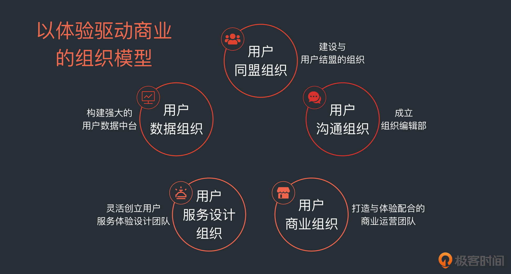
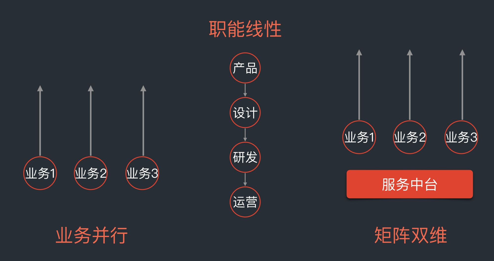
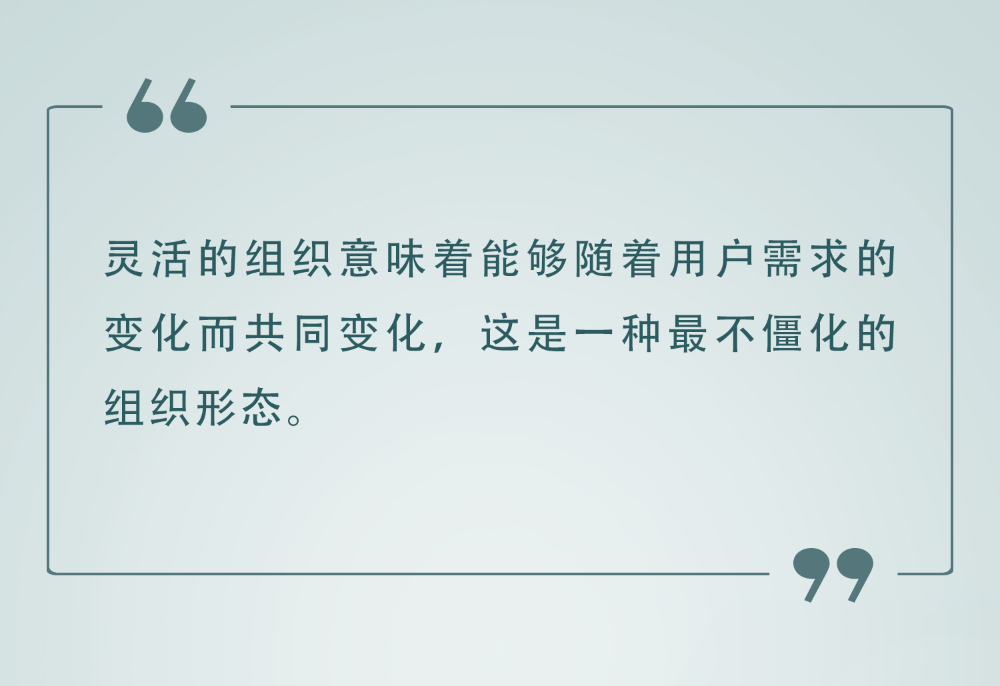

---
date: "2019-06-23"
---  
      
# 06 | 如何构建适合体验驱动商业的组织？
你好，我是相辉。

在我十几年的体验设计和商业咨询的工作经历当中，我逐渐发现了企业组织形式和市场需求之间的一个结构矛盾，主要体现在两个方面。

一方面，**在产品的生产结构上，流程和方法基本没有任何改变**。众所周知，管理的本质是构建一个企业的团队协作系统，通过流程机制设计，用规定动作确定性地完成企业的商业目标。

而我们现在大多数企业所沿用的产品流程和方法，仍然是偏向生产工程类的。15年前我在Yahoo的时候，使用的那一套产品生产流程，也就是从定义产品到UX再到交付研发，最后交给运营团队和市场团队去做增长，现在还是有很多公司在用，没有太大变化。我想这是有问题的。

另一方面，**在用户需求上，对产品与服务的期待却有了翻天覆地的变化**。十几年前，我们在设计产品的时候，往往只会瞄准用户的一个基础刚需，并不需要去绞尽脑汁地给用户塑造某种独特的体验。那个时候我们似乎不管做什么功能，只要产品上线了，流量就会到来。

而现在的产品和服务，无论是市场竞争、用户需求，还是技术能力、网络速度、连接强度、丰富程度，都发生了质的变化。比如说：

* DTC（Direct To Consumer，直接面对消费者）模式兴起，企业直接面向用户，去掉了经销商、渠道商等中间环节。企业建立起自己的用户运营部门，直接提供可保障质量的服务给用户，并直接从用户那里收集反馈，改进服务。

* 企业与用户共建产品和品牌，早期的用户甚至是公司的合伙人，还会与企业一起成长、为其发展助力。另外还会拥有独特的企业和用户之间的文化，有着超强的情感连接。早期的小米和现在的蔚来都是采用了这种模式。

* 企业会从用户生命周期的角度，思考并与用户建立长期关系，降低流量成本，深度链接产品和运营。

* 无论传统企业还是互联网公司，都开始建立自己的分层用户运营的中台，将用户进行分层，针对每个用户层次采取不同的服务运营策略，并做到以描绘用户画像来驱动体验设计，而不仅仅是粗放地关注交易数据。

<!-- [[[read_end]]] -->

所以我深刻地感受到了一个亟待解决的问题，就是我们现在沿用的从产品->设计->研发->运营->市场->PR和BD等类似的团队生产模式和运营策略是否还合适？**如果说未来是体验驱动商业的时代，那么我们在企业的组织上，是不是也应该进行相应的变化？**

答案是一定的。**企业的组织形式是产品交付的内部映射。**所以，当一切变化都是以用户体验驱动商业的目标时，企业的内部也必然会产生一些变化。

那么接下来，我就带你一起探究一下，关于构建适合体验驱动商业的组织模型，让你获得以用户体验为驱动的组织设计的办法，以及构建更符合趋势的流程构建方法。

## 如何构建适合体验驱动商业的组织？

我会从用户同盟组织、用户数据组织、用户服务设计组织、用户商业组织、用户沟通组织五个维度，带你去看如何改进我们的服务设计团队。

### 1.建设与用户结盟的组织

我在一些新近的企业里，都发现了一个能够组织用户的强力部门。他们会与用户一起，共同制定针对用户的组织体系，发现和塑造产品与用户的文化，了解用户最新的动向和需求，同时该组织也是用户利益在企业内部的代表。比如蔚来汽车的Fellow的角色，每个人都会跟随车主的全生命周期的用车生活。

你可能会问，这种为用户代言的部门，跟PM和UER有什么区别吗？他们不都是了解用户的人吗？其实是很不一样的。

和传统PM不同，PM像是一个产品功能的提出者，而用户代言部门更像是和用户玩在一起的用户工会，他们在组织用户的同时，还要在企业内为用户争取利益，并会把现状反馈给PM。

和传统UER也不同，UER仿佛只是一个个基于体验设计课题的研究人员，而用户代言部门除了会针对用户体验设计进行研究，还要将用户和企业凝结在一起。

这样的一个部门，会大大拉近企业和用户的距离，同时还能很容易地把企业的理念传递给用户，并且也能发展用户成为品牌的铁杆粉丝，从而实现产品与用户的共生。

而且，这样一个部门是不是在企业内受重视，会直接反应这个企业到底是不是注重用户需求体验。在有些企业当中，他们甚至是业务的主要驱动者之一。在下一个模块“成为用户企业”，我还会给你详细展开介绍。

### 2.构建强大的用户数据中台

就像我在上一讲所说的，我们要想做好用户体验的量化，就必然需要基于用户体验的数据中台的支持。那么一个强大的用户数据中台，就都将是企业用户运营的发动机。

举个例子。如果说头条的能力是准确地分发内容给相应的用户，做到千人千面，那么为用户打Tag，就是头条的每个产品的核心动作之一。用户在头条生态里，每一个行为动作，都是在细化自己在系统中的画像。今天看了什么内容，明天关注什么博主，后天下了什么单……在这不断细化画像的过程里，头条的服务能力越来越强，这和用户数据中台是离不开的。

同样对于线下店铺来说，无论是书店、餐馆、咖啡厅，拥有一个自己的用户数据中台，都是提升生意效率的一个关键工具。我们只有清晰地知道服务的用户是谁，以及在保护隐私的情况下，了解用户的消费习惯，我们才能发现在过去的生意里完全发现不了的增长秘密。

在这个中台里，我们可以积累用户的分层画像、用户的生命周期，以及基于用户产品使用流程的细节体验、各类数据工具，这样也便于让与用户体验设计相关的人员进行查阅和调取，同时商业化部门还能更准确地根据用户画像和生活路径进行全新的商业化探索。

最终我们可以这么理解，如果能把用户每次在商业体里的行为，都作为帮助我们建设用户数据中台的养料，那么我们完全要反过来看待消费者。他们不仅是我们的用户，还是帮助我们改进商业模型的数据贡献者。这个中台，就是我们和用户之间协作效率的共识工具。

### 3.灵活创立用户服务体验设计团队

在不同的产品体验设计的企业组织里，因为要追求产品体验的一致性和连贯性，保证交付产品体验的沉浸感，所以对组织会有更高的要求。对于此，在通常情况下，我们的产品体验设计有三种构建方式。

**第一，以职能为分野的整体组织。**这种方式比较传统，比较适合以产品、交互、内容、视觉、前端研发为核心的团队，在产品生产结构上主要以线性流程为主，便于其稳定产品的迭代，大部分单一业务的企业都会是这个结构。

**第二，以模块为分野的分块组织。**这种方式比较敏捷，适合快速创新业务的打法。这种方式是以业务发展效果为核心的组织形式，每个业务会配比不同需求的职能部门。但它有个缺点，就是业务之间和模块之间会缺乏联系，很难能保证一个产品服务的共性和复用，从而难以持续保持统一，且容易重复建设。大部分从单一业务快速分裂为多业务的企业，都会有这个阶段。同时，业务之间没有共性的企业，也比较适合这样的组织形式。

**第三，以双向为分野的矩阵组织。**这种矩阵型组织对组织的管理者能力要求最高，即产品体验设计要有中台团队来梳理大家共同的需求和特性，制定统一的体验设计语言和服务标准，但同时又要为各个团队规划相对的自由度，也要为各个团队建设工具，帮助每个模块或业务体验创新。这样既做到了产品之间有统一的价值观和产品基础体验，但又能在自己的业务里有一定的发挥空间，且做到敏捷。比如阿里就是一个在这个方面做得非常好的企业，不同的业务，都有自己的个性，但同时又有一个大中台做业务之间的互通。

这样的组织划分有一个好处，就是当市场环境足够好的时候，就可以放开一些标准，让大家更自由地往前跑。而到了一定的发展阶段，需要收紧用户体验落实中台共性的时候，又可以通过规范来调节。这就像一种收放自如的管理工具。比如，头条的业务模式和滴滴的体验设计就都做得不错，不同产品的中台化和统一性以及方法复用都做得很好。

所以，我以往在各个公司做顾问的时候，一向都会在企业商业模式进化或者规模扩大的时候，帮企业打造这种灵活的体验设计组织。因为只有团队与团队之间形成复用的力量和共识的思维，才能让体验设计不断进化，而不用重复造轮子。灵活的组织也意味着能够随着用户需求的变化而共同变化，这是一种最不僵化的组织形态。

### 4.打造与体验配合的商业运营团队

我最近发现，很多用户运营和服务体验做得好的公司，他们的商业增长计划往往做得很克制，并不会单纯追求单年的KPI和GMV有多高，也不会割韭菜，毕竟韭菜虽然割的一时爽，但不可持续。他们会进行理性的分析，制定让用户不产生反感、能够稳妥的、与用户长期走下去的商业化发展策略。

不节制和过度预期的商业运营战略，一定会伤害到用户体验。前十年的中国移动互联网，大家跑马圈地，为增长疯狂投入，这无可厚非，但同时也会把用户体验冲得七零八落。我经常看到各种团队的产品负责人，在面对运营同学因为增长压力而破坏体验时的种种无奈，但运营同学其实也非常委屈，他们总不能眼看着市场被别人抢走，总要做些什么来补救一下。

**而有节制的、与产品体验策略契合的商业化策略，才是企业健康发展的双增长循环。**我想，现在一切都变了，我们应当回到以用户体验为驱动的模式，有节制地和用户长期做朋友。

这个部分，是所有中国当下的互联网企业，甚至说所有企业都要学会的课题。如何配合体验去制定商业策略，而不是连根拔起割韭菜的方式。

### 5.成立组织编辑部

如何才能与用户进行高效的沟通，保证产品品牌、内容、界面、服务都能整合得像一个有性格的人，是现在每个企业都会碰到的体验设计问题。

我经常会碰到，很多产品的品牌广告每次都是不同气质的，都是割裂的。甚至也经常看到，自家产品与推出的品牌广告也是割裂的。这些都非常影响产品的魅力和气质。一个好产品，如果没有自己统一的沉浸感，怎么能受到用户的喜爱呢。

就拿星巴克来说，我在网上读到过一份他们的用户沟通的规则文档，其中规定了星巴克每年的新品风格、视觉风格、店面风格、店员沟通风格、内容风格等等。也就是站在企业的角度，全方位地指导如何让他们的用户产生沉浸的连续感。

所以，每个产品都应该有一个横跨在产品、品牌、设计的策划师，来保证产品统一的性格，并能做到人性化交付。只有这样，我们和用户的沟通才是真正有效的，我们的产品才能受到用户喜爱。让用户产生沉浸感的整体体验是体验设计的一个关键能力，我会在第三个模块“构建动人的场景服务”，给你重点讲清场景服务设计的具体操作方法。

好，以上就是我经过多年的摸爬滚打，梳理经验教训，总结出的构建适合体验驱动商业的组织模型的五个核心要点了。虽然不同的企业对产品体验的定义不同，但这五个方面是在组织设计上的共性。你可以参考这之间的思维方式，再根据自己的需要逐步改进到合适自己场景的落地形式。

有时候，某个企业说“我们要注重用户体验设计”，可能只是会形成一种口号。而只有在把体验设计的价值贯穿进企业的内部架构、组织能力、评判标准的制度的时候，才能真正地做出好设计。

**好设计，需要好土壤。**如果说未来是体验驱动商业的时代，那么谁先有了土壤，谁就拥有了发展的先机。

## 课程小结

今天，我带你了解了以用户体验驱动商业的企业，与以前的传统企业在内部组织和制度上的不同之处，同时我也给你总结了现在乃至未来，正在或者将要发生的企业组织变化。你要重点关注以下五个要点：

* **建设与用户结盟的组织；**
* **构建强大的用户数据中台；**
* **灵活创立用户服务体验设计团队；**
* **打造与体验配合的商业运营团队；**
* **成立组织编辑部。**

其实今天的课程，主要来源于我为企业做体验设计时，经常使用到的组织改进方法。不同的企业会有不同的改进阻力，但这并不妨碍我们一点点地去让所有人产生与体验设计相匹配的组织创新仪式。你在操作的时候，要戒骄戒躁，要有智慧地一点点推动组织的革新。

我一般都会从企业最痛的点开始推进，比如因为对用户的不敏感导致产品体验粗糙，进而造成的留存下降；或者由于不同部门割裂的设置，造成产品、设计、品牌各说各话等等。这些企业共同的痛感，都会是很好的推进体验设计的催化剂。

另外我也相信，未来一定会是用户企业的时代，不同领域的企业，都会在用户体验时代有全新的展现形式。那么在下一个模块中，我就会把它讲解清楚。

## 一课一思

请你总结一下，自己所在企业的组织和服务用户不匹配的情况。以及对于此，你有没有什么改进的建议？

欢迎你在评论区发表自己的见解。如果你身边也有对于提升用户体验的组织设计有疑问的朋友，那么也非常欢迎你把这节课分享给TA。

感谢你的阅读，我们下一讲再见。