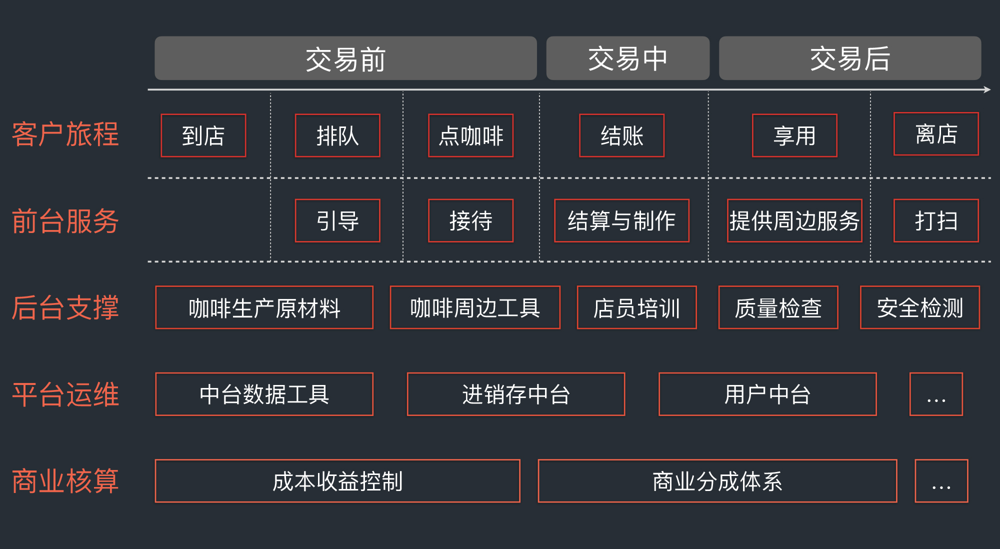
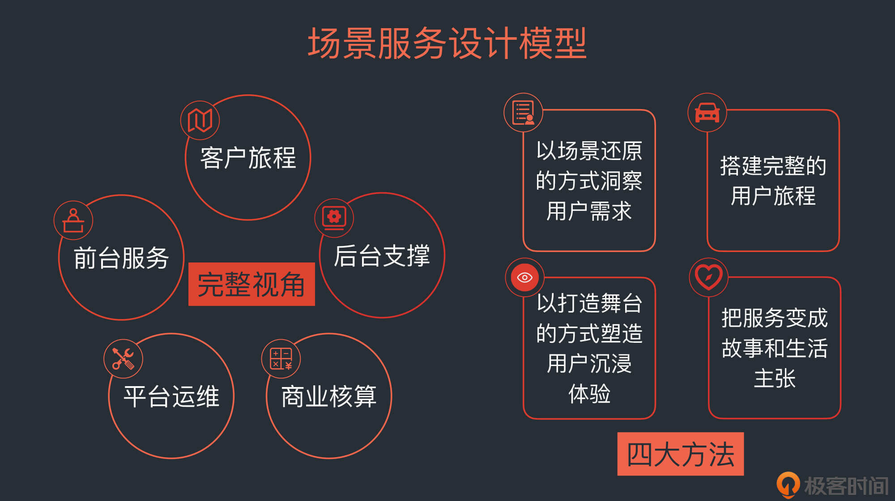
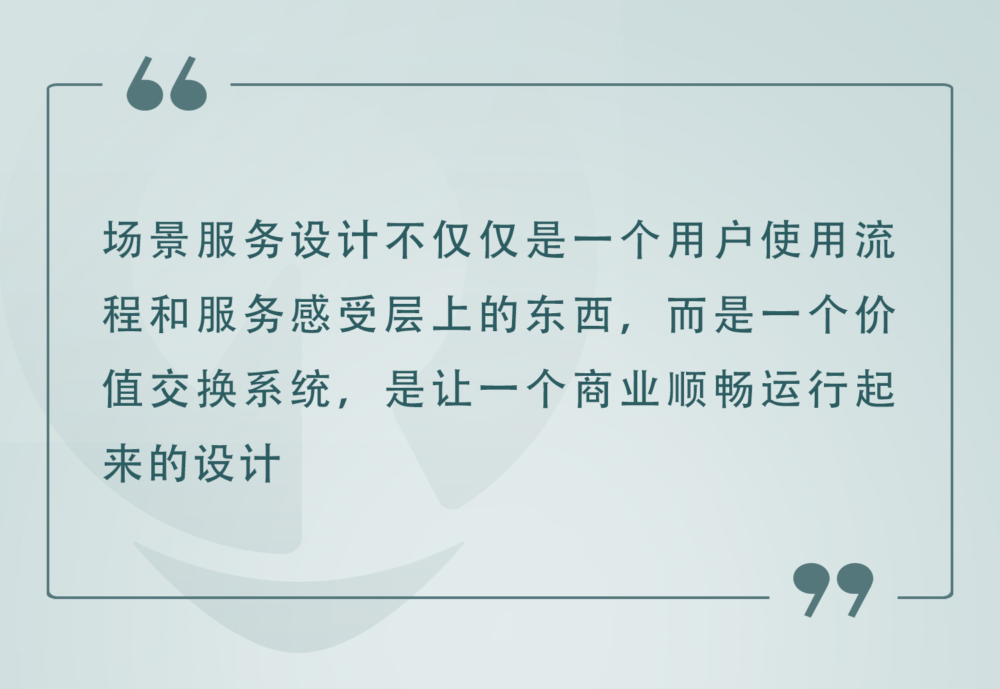

---
date: "2019-06-23"
---  
      
# 13 | 场景服务设计：拿到新商业的支点
你好，我是相辉。

前两个模块，我分别给你讲解了商业与用户的理解结构，以及它们和体验设计的关系。如果说商业和用户是体验设计的天时地利人和，那么场景服务设计就是实际体验骨架的搭建。

因此从这个模块开始，我将带你进入场景服务设计的整体流程，给你介绍构建体验设计模型后具体的落地方法。

在模块的第一讲，我将向你展现场景服务设计的最新趋势和基本理念，以及做好设计的核心方法。而在后面的几讲当中，我将会把场景服务设计的五个核心思考模型带给你。你可以根据这些模型，去看清身边的商业产品体验的质地。

好，下面我们就先来看看，场景服务设计的理念是什么。

## 什么是场景服务设计？如何创新场景体验？

在我过去十几年的体验设计生涯当中，每当我完成商业的分析和用户的洞察部分之后，就要开始体验服务设计的架构了，这也是我最喜欢的部分。

我们先来看一下场景服务设计的概念，维基百科上解释说：

> 服务设计是指为了提高服务质量和服务提供者与客户之间的交互，对服务的人员、基础设施、信息沟通和材料组成部分进行规划和组织的活动。服务设计可以是对现有的服务进行更改，也可以是创建全新的服务方式。

你可以这样理解，**场景服务设计本质上是一种资源组织和执行的系统设计，它需要根据用户的生活场景和需求，重新规划资源，来让价值交互系统运行。**

<!-- [[[read_end]]] -->

也就是说，场景服务设计不仅仅是一个用户使用流程和服务感受层上的东西，而是一个价值交换系统，是让一个商业顺畅运行起来的设计。

所以场景服务设计的结构应该是这样的：

* **客户旅程：**用户从接触产品的第一刻到完结的整个场景服务的完整旅程。
* **前台服务：**前台员工的服务流程设计与技术工具的流程设计。
* **后台支撑：**后台产品供应链、人员供给、安全保证等。
* **平台运维：**工具、数据、监控、基础设施搭建等。
* **商业核算：**成本收益控制、风险预估、分成体系、人力控制等。

基于以上各个层级的交付，就是一套完整的场景服务设计方案。

比如我们去宜家，从远远望见的“IKEA”Logo，到进门开始到逛店，然后选择自己喜欢的物品去提货，到最终付款，预约送货或者自己取货离开，这个流程就是客户的旅程；而IKEA的工作人员，从进门的引导，到设置每个区域的服务人员，到最后取货、送货、结账、一元冰淇淋的售卖等，这就是前台服务的设计；而后台的支撑，则是IKEA的产品供应链，也就是其产品的生产和设计等；那么IKEA中台的数据工具、基础设施的种种建设，就是平台的运维；最底层是商业核算，即IKEA整体在商业层面的控制和财务人力方面的支撑。

这样整体观察下来，就是一个商业场景服务设计的全部了。

而正像我们在[第2讲](https://time.geekbang.org/column/article/280982)中所说的，用户体验的设计越来越是商业的核心撬动力之一。在我近几年的工作经验里，我发现**越来越多的场景服务设计都在挖掘体验创新，从而重构整体产业后端的架构和模式**。

我举一个茑屋书店的例子，来帮你了解场景服务设计创新的过程。

2011年，代官山茑屋书店开业，它的体验设计过程，非常具有代表性。

在增田先生开始创立茑屋书店的时候，其实他周围的人都投来了怀疑的目光，因为大多数人都觉得在“出版萧条”的背景趋势下，开一个一万多平米的书店，是不可能成功的。但增田先生却不这样想，他经过认真的思考，认为书店最大的问题，就在于“它在卖书”。

为什么呢？因为增田认为，有价值的不是作为物体的书，而是包含在书中的答案，应该卖的是“书的内容”。人们总想着把书当作商品卖掉，这才导致了书店的危机。

也就是说，**如果我们总是以过去的惯性思维来思考产品的卖场，而不是基于用户的需求来思考卖场是什么，那自然就无法做好场景服务设计，也无法找到新的商业机会**。所以，如果开书店的人在一个客户缺席的场景里哀叹“书刊杂志卖不出去”，这是应该反思的。

那么增田先生呢，就重新设计了书店的内容分类。他是以用户生活方式的提案，也就是以用户生活问题的答案为线索，来构建书店内容的分类，重构了书店空间。但这也要求了书店的员工得具备极高的业务能力，店内的每个导购都要了解各行各业的知识，要能像一个高级编辑一样，具有为顾客提供生活问题答案的能力，知道顾客想要的产品在哪里，并且可以根据生活问题的答案来摆放。

这和一般的书店完全不在一个层次。他们提供的不只是收银、常规查询、包装服务等等，而是高水准的生活方式提案的特色服务。也就是说，茑屋书店在用户店面客户流程体验和人员服务设计上，做了场景服务设计的创新，从而也要求茑屋书店的供应链做出了相应的变化。

当然，能聚集这样的员工不是件容易的事儿。最后，增田先生是通过各行各业志愿者的帮助，才解决了这个问题。

在各地基于各种生活场景来创造不同的书店，为各地的人们创造一个想去的书店，为他们提供生活提案，是增田先生的目标。而这一切的核心就是要根据用户的需求，重新组织“后台支撑”的供给。

我特别喜欢增田先生的两句话：唯有设计师方能生存，唯有梦想方能实现。

其实，现在类似茑屋书店以场景服务设计创新来撬动行业的例子越来越多了。

比如，珠宝品牌Soufeel会提供超精致的包装和珠宝设计，但价格只有大牌的一半，给用户提供了超过预期的体验，并且它几乎所有的产品都可以进行私人订制。

再比如，希腊酸奶品牌Chobani，以提供饱腹感、高蛋白、健康饮食的独特体验，占领了新的用户市场。

所以，**一个新的场景体验往往会意味着出现了新的品类机会，这会对过去的老品牌形成意义上的覆盖，从而换来超额的增长。**这个也是场景服务设计的基本逻辑。

## 场景服务设计的关键方法

那么，我相信，结合第二个模块中所讲的[用户企业的基因](https://time.geekbang.org/column/article/286163)，你也会发现，其实场景服务设计的方法与用户企业的基因是无缝对接的。因为一个企业是如何理解商业增长模式的，就会如何去理解场景服务设计中，各个层次的结构。

比如用户企业最看重的是用户和企业的同盟，所以企业与用户的深度联动，就是场景服务设计的基础，所以蔚来汽车是Fellow对用户为核心，而所有的服务体系都是围绕这个搭建的。而以交易为核心的商业平台模式，则是以供应链能力和数据能力，来做平台效率服务的，比如滴滴和美团。

所以一般来说，场景服务设计会使用以下几个关键方法。

### 1.以场景还原的方式洞察用户需求

场景还原的方式，就是以目标用户的实际使用场景为内核，而不断地思考和分析用户的需求。我们要知道，任何的产品设计都不是以技术能力、功能能力、渠道能力和组织能力为核心的，而是以用户需求场景为核心，驱动我们围绕场景去搭建用户的场景设计。

我前面举的茑屋书店的例子，也是想给你强调一下，我们必须时刻思考用户需求的本源是什么，以及它和我们现在场景服务的关系是什么、问题都会出现在哪里。我们每个人也许并不能像增田先生那样拥有几十年的经营经验，但我们可以用科学的方法，来增加获取真实用户需求的概率。

所以，洞察用户需求，其实拼的并不是我们每个人的观察能力有多强，而是我们自己有没有真的把产品设计融入到用户场景里面去，最大限度地站在用户的角度，思考问题、挖掘机会。

### 2.搭建完整的用户旅程

用户旅程是一种还原用户和场景服务互动流程的有效办法。它可以帮助我们明确不同用户在相同场景的关键节点是什么、使用低谷的问题是什么，以及用户最可能有峰值体验的地方在哪里。

而配合用户体验旅程，我们同样还可以搭建出前端服务流程和后端支撑流程，从而做到从体验场景重塑企业内部协作流程。

比如我之前举的IKEA的例子，就是一个完整的体验流程的搭建，它是一个从第一层到第五层的立体模型。我会在后面的课程中，给你具体讲述用户旅程的设计方法。

### 3.以舞台的方式塑造用户沉浸体验

除了通过场景还原和搭建用户旅程以外，我们还可以用打造舞台的方式，来帮助用户扮演好一个该有的场景角色。这也是场景服务设计人性化的一面。

所谓的打造舞台，就是说，我们要为用户找到在这个场景下使用的主题，帮助用户尽快地进入角色，让他们能够在场景中前后一致且快速地完成任务，得到相应的奖励。

比如，用户在街边小店吃饭可能会很豪爽，但进入了奢侈品店可能也会让自己优雅起来，这就是一个用户在不同场景下的不同展现。

我们要清晰产品带给用户的“生活舞台”是什么。用户在我们的场景内，应该是一种怎样的人、他们希望扮演好什么角色，以及他们的体验预期是如何的、他们体验到什么样的场景服务会是超过自身预期的等等，这些都是在这个模块进行设计的。

### 4.把服务变成故事和生活主张

每一种好的场景服务设计都可以浓缩为一种理解生活的哲学，因为好故事是传播产品的主要手段。如果我们可以把自己的场景服务体验变成一种生活主张，那么就会更容易让用户识别，并且也能让用户在使用产品的过程中觉得很简单，因为用户的学习成本被降低了。

就好像，星巴克之前提过的第三空间（即把文化、精神和环境的体验融入到场景服务设计中，顾客会把星巴克作为家和工作间以外的最佳休闲去处），或者是lululemon的服务“Supergirl”（即创造并提倡超级女孩的每日一个小时瑜伽的生活方式），亦或者刚才提到的茑屋书店的“生活方式提案场所”。每个场景服务设计，都应该有自己的主张，就如同一本书的标题和简介，这样的文字能让用户更快地进入场景服务的“台本”当中。

## 课程小结

场景服务设计其实是一种完整的思考方式，它更全面地架设了用户产品的使用场景，并站在场景的角度，穷举了用户使用体验的每一个角落，系统全面地把用户和产品接触的全触点设计好，让用户在使用产品的过程中体验更好，在进行交易的过程中更加顺畅。

这一讲，你要了解的重点是：

* **场景服务设计的完整视角：**客户旅程、前台服务、后台支撑、平台运维、商业核算。
* **场景服务设计的四大方法：**洞察需求、用户旅程、打造沉浸、生活主张。

在中国，场景服务设计仍然处于刚起步的阶段，这并不是因为我们的才智不够，而是因为我们的商业阶段还没有达到需要进行服务设计的程度。到最近这两年，中国的场景服务设计才算真正地开始，因为很多的企业都已经发现，它已经成为了突破商业可能性的关键思考工具。而一旦我们不掌握这个知识，则必然会失去新时代的商业发展机会。

我今天讲到的这四个关键方法，分别涉及到了需求、框架、感受、品牌。**掌握了这些关键方法，我们就可以基于用户本源的需求，来重新思考产品形态的交付，并且重新结构化地进行体验设计，这样可以最大概率地创新出有价值的体验交付。**在后面的章节中，我还会一一给你展开介绍这些方法，并提供给你各种设计工具，来帮助你进行体验设计的深入操作，应对新时代的挑战。

## 一课一思

你可以找出你所在业务的场景服务体验层级的主要元素吗？通过这些层级的梳理，我相信你一定可以发现过去没有看到过的新事物。欢迎你在留言区发表自己的见解。

如果有所收获，也欢迎你把今天的内容分享给更多的朋友。感谢你的阅读，我们下一讲再见。