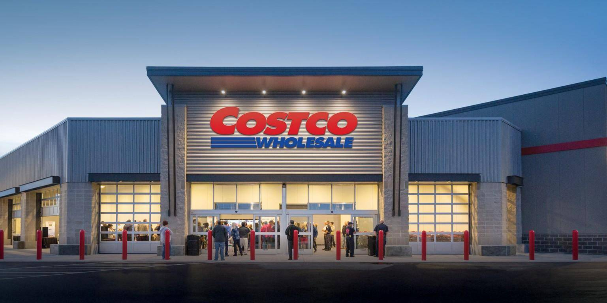
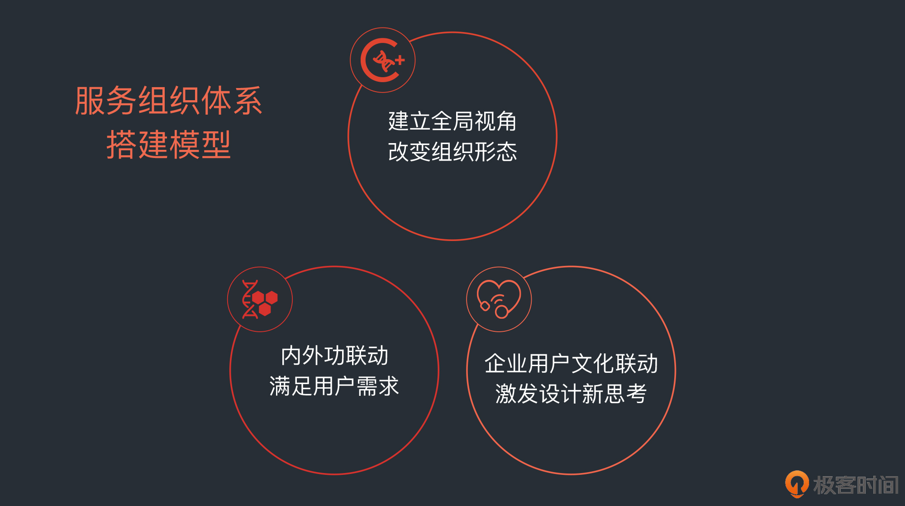
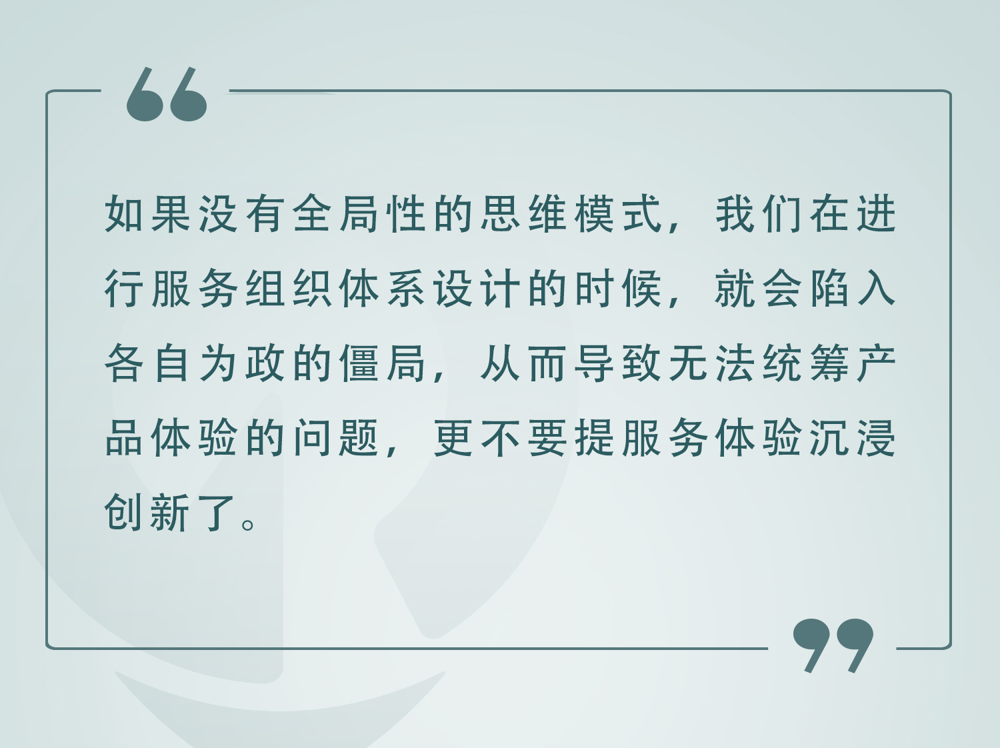

---
date: "2019-06-23"
---  
      
# 18 | 如何搭建服务的组织体系？
你好，我是相辉。

前面的几节课，我带你系统地了解了场景服务设计的脉络，现在你会知道，场景服务体验的设计是一套从用户场景洞察到体验地图再到服务主张提炼，最后是剧本设计的过程。而我们今天想要探讨的，就是做好服务设计的组织形式与流程应该是什么样子的。

服务设计流程是一个整体体验的沉浸设计，所以它和按部就班地生产产品、迭代产品的流程是不一样的。

比如，我在为一些公司设计会员体系服务的时候，发现有一个共性的问题，导致了中国大多数公司都设计不好会员体系。这个问题就是，**所有企业的团队生产结构，都是以产品生产和促成交易为目标，而不是以服务用户为目标**，那么在进行会员搭建的时候，按照其固有的生产结构，很难能设计出一个好的会员体系。

具体来讲，这个问题其实可以细化为几个不同角度的原因。

**第一，设计者的知识结构与服务设计目标的不匹配**。因为类似会员体系这样的服务组织，是一个非常需要全视角统筹规划的产品，所以在交付端，设计团队既需要明白会员的权益服务设计，又需要了解用户画像，同时也要懂得商业的发展规律以及产品体验。另外，设计团队还要能够学会采用数据工具描述体验和商业，同时也要懂得如何利用用户生产的内容，并且最后，还要有能将产品的体验品牌化的能力。所以，如果把自己禁锢在固有的产品、设计、运营、研发、宣传这样的产品设计逻辑里，没有全局性的设计视角，没有统筹的体系规划，那么我们就很难设计出好的会员服务。

<!-- [[[read_end]]] -->

**第二，任何好的服务组织的运转，还要依赖企业本身的供给能力。**比如，Costco商品的会员价之所以能做到那么便宜，还是因为他们有强大的供应链，以及高效的坪效比带来的议价能力、超低SKU（Stock Keeping Unit，库存单元）带来的成本管控能力和风险控制的能力。所以任何炫酷的服务，如果希望能够长久地做下去，一来是要在商业上行得通，二来是要有强大的供应链管理能力来进行服务的支撑。

所以，这也就意味着，我们不仅要根据用户体验地图来改进场景服务体验，还要根据体验地图来优化供应链流程、组织流程，以及反馈流程，以此实现长期稳定可持续服务的目的。

那么今天这一讲，我就来给你展开介绍几个设计服务组织的方法，让你能很好地和团队协作，设计出好的场景服务体验。

## 建立全局视角，改变组织形态

首先，要想搭建好的服务组织，我们需要拥有全局性的思维。因为**全局思维代表着，我们可以从固有的产品生产的设计流程中释放出来，从而重新去创新规划服务的整体策略**。

我举个例子。

自从福特汽车发明了生产流水线以后，每个工人组装汽车的学习成本就变低了，原来复杂的工作被拆解掉了，从而大规模地提高了生产力的协作水平，也就大大地提升了汽车的生产效率，释放了人工供给的红利。但这样做也有不好的地方，就是每个生产步骤中，工人之间的知识并不相通，随着生产工作的不断深入，你会发现职能开始割裂，大家都在自己的专业上越来越熟练，但却逐渐忽略了整体流程的目标，也就是团队的总体目标。

同样，我们知道，很多的互联网公司，每个职能部门都会有自己的KPI，每个部门也都会为了自己的KPI去做自己组织利益最大化的努力。不过这时，公司的整体协调可能就会开始出现问题了。比如说，运营部门想要增大交易多增加广告位，但体验部门却希望可以控制广告位的数量，这时候就缺乏一个衡量的标准。或者是，大家被限制在了各自的视角里和流程里，无法创新，于是割裂的产品体验就出现了。

我曾经就在某个人工智能团队任职设计顾问，公司各个项目团队能力都非常强，产品、运营、设计都是行业一等一。但可惜大家都太专注于自己的领域，结果我们当时在做一个App产品的时候，App的文案没有人负责，所有人都觉得不是自己的事。市场部认为他们的任务是在外面创造声量，App内部的东西和他们没关系。而产品部门觉得，润色文案不应该是他们的工作，应该是设计师的。但设计师又觉得，视觉和交互流程才是他们工作的关键……

于是我在当时，看到公司很多很好的团队，对文案的描述都是一团糟。但其实，只要他们把文案稍作优化，就会让App的产品体验大大提升。比如提示的简洁性、描述问题的吸引性、相同文案的统一性等等。一个简单的问题，在组织的夹缝中被忽略，这是太常见的事情了。

所以你看，**如果没有全局性的思维模式，我们在设计服务组织体系的时候，就会陷入各自为政的僵局，从而导致无法统筹产品体验的问题，更不要提服务体验沉浸创新了。**

而要做好服务的组织设计，就是要保证用户的整体感受都能够顺畅舒适，融合才是关键。无论是线上线下的融合、场景切换的融合、产品与服务的融合，还是物理与数字的融合、机械与人类的融合，等等。

你很难想象，线上线下两个场景对同一事物的称谓不同，比如线上叫会员登录，线下叫顾客登录，是多么精分的体验。你更难想象，一个广告词与产品体验对不上的设计流程，会让用户多么地抓狂且有受骗的感觉。按照我的经验来看，很多时候，其实不是企业故意为之的，而是因为两个部门之间的割裂造成的。

所以说，如果我们想要在新时代搭建起服务的组织体系，第一步就是要建立一个全局视角的流程，把业务场景、人、数据、产品、服务捏合起来。就好像一个导演或者一个指挥一样，做好整体的统筹规划工作，让团队能真正地和谐起来做事情，而不是各自为政。

**我的经验是，建立全局视角的第一要务，就是改变组织形态。**我们不能以过去稳定生产的流水线流程去策划服务组织的设计，而是要把大家化作一个虚拟团队，从设计的开始到结束，在各个阶段都做好Review。

举个例子，我之前在为滴滴设计会员服务的时候，是从一个包含各个职能的微型团队开始的，其中包括了一个安全专家、一个数据专家、一个产品专家和一个运营专家，还有一个我。

我们在设计的时候，首先是去定义会员服务的商业目标、服务目标、用户人群和体验剧本。我们要讨论清楚，滴滴的会员体系到底是在服务什么场景中的什么人群，同样也要梳理清晰商业上的模型是怎样的，之后整个体验流程的关键节点都是什么，如何给会员用户带来超量的体验。最后，就是如何把这个会员服务变成故事讲给用户听。

这样，只有在我们初期的工作形成了一个基本模型后，才会开始加入更多的人进来，然后依靠新加入成员的视角，逐渐把这个基本的会员服务模型补齐，最后得到了一套商业与用户体验的会员组织模型，再开始制作几种可能的产品原型，并基于原型开始引入用户进行共建，去帮助我们修正模型，然后逐渐变成一个完整的滴滴会员服务。

所以你看，它并不是一下就长成一个成熟的会员服务产品的，它也不是基于某个人的偏向爱好、不是击鼓传花式的串联而成的，而是通过众人培育出来的组织形式。同时，这个流程和团队是慢慢长大的，因为只有这样，服务设计的内核才不会乱掉，真气不会散掉，而且在此过程中，组织里的所有成员都能理解这样做的原因，都能在各自的角度为整体的体验添砖加瓦。

但我不得不说，最初的那几个专家特别重要。我们需要通过不同组织成员的知识背景进行混合判定，有时候是在谈产品，有时候是在谈人性，有时候是在谈经济，有时候是在谈数据，甚至有时候是在谈哲学。这让我想起，暴雪在设计魔兽世界这个游戏的时候，就请了很多社会学家来帮他们设计系统。所以**我们在搭建服务的组织体系的时候，可能要根据不同的服务领域，安排各类的人群混合在一起进行创新。而创新的第一步，就是让有能力的人先从组织的束缚里释放出来，站在全局的视角来重新策划设计。**

## 内外功联动，满足用户需求

所谓的内外功联动，就是说**服务体验与服务供给能力的双重联动**。内功就是我们企业的运营能力和服务能力，而外功就是指我们交付给用户的体验。

我记得滴滴在改进安全体验的时候，就把过去散在各个业务里的安全团队整合成了一个大中台，由公司统一花费巨大的精力，重新打造了滴滴整体的安全策略，然后再根据各个业务的特点，把安全能力分发下去。因为让各个业务自己重新制定安全策略，是不太现实且不太具有竞争力的，只有通过中台建设以及给各个业务定制服务的方法，才能整体提升滴滴的安全出行服务体验。

而在定制安全策略的过程中，每个业务的表现实际上都是不同的。有的业务注重时间段监督和车主准入门槛，比如顺风车；有的业务注重车主的阶段性培训，比如专车；有的业务注重产品设计本身的安全性，比如青桔单车。但行为预测、客服流程、警企联动、数据状态监测等等都是共性的安全中台要完成的事情，所以滴滴就根据每个业务场景，重新调整了整体的供给流程和服务流程，保证前端的安全体验流程可以实现。

所以，**在做场景服务设计的时候，我们不能只看体验是否吸引人，还要看是否能与人员服务能力、供给能力、技术能力联动起来，并以此来设计组织和流程。**有内功支持的服务组织，才是真正能够让外功持久运作的服务组织。

再给你举个例子。二手手机鉴定这件事，看起来虽然很简单，只是几道关键的鉴定手续罢了，并且用户会查看的参数也就那些，但实际上，要想做好鉴定工作，同样也需要内功。比如说，全国的鉴定点怎么分布，才可以做到物流成本足够低；全国的鉴定师怎么才能做到标准的完全统一；鉴定好的手机怎么能拍摄效果统一的照片，等等，这些都是服务供给团队要去逐渐磨练的模型。

而当供给能力成熟了以后，其实就会形成巨大的成本控制能力和规模效应，从而能够更高效地缩短用户鉴定手机的时间，提升二手售卖的体验。

所以**好的场景服务体验的设计，不仅要看在用户的交付端是如何做的，更要看在服务的供给端是如何联动的，他们服务组织的底层能力究竟如何**。我经常会看到很多天马行空的场景服务设计，虽然看上去感觉很好，但服务组织的供给能力根本没法支撑服务设计的实现，内功差太远，那基本外功就是水中捞月。做服务设计的组织，一定要将后端和前端一同进行联动设计，而不是只考虑用户的交付端。

## 企业与用户文化联动，激发设计新思考

一个企业的文化特质，决定了其服务组织的设计风格。什么样风格的服务设计团队，往往就会生长出什么样风格的场景服务体验。比如Google的极简、Apple的优雅、Airbnb的新奇、星巴克的自信……而一个产品的用户文化，会给我们的场景服务设计带来更好的创新效率，从而帮助我们的团队在思考产品设计的时候，会以用户的长期价值为核心考量。

那么，每个服务团队都会有自己的设计风格，也都拥有自己产品独特的用户文化，**发现自己风格的特性，并将其放大，让内外部文化联动在一起，就会让场景服务体验的设计看上去更加自然**。

我记得我第一次去蔚来汽车做分享的时候，跟我对接的同学说，辉哥您写完了PPT记得尽早给我，因为我们必须把您的PPT按照蔚来的格式优化一遍，做到又漂亮又清晰。

我当时心里一惊，突然对蔚来有了几分敬意，因为那个时候还是蔚来的发展不那么顺的时候。可是无论发展得多么艰难，他们都会在乎一个分享的PPT是否美观，对于一个车企来说，这本身就是一种对优雅体验的执着。

回想起我在给很多的互联网企业做设计的时候，我发现体验设计真的不受大家的重视，即使设计得再丑，但只要产品数据表现好，那么体验是不是好用、是不是优雅，他们都无所谓。但这也无可厚非，因为每个时代都有每个时代的特性，只是在当今这个时代，审美是一种权利。如果我们还不在乎自己企业的体验设计，那一定会被时代抛弃。

说回来，其实我想表达的是，**一个企业的内部文化，往往会塑造出我们产品的外部特性。我们在企业内部注重什么特质，用户对于产品的外部表现就会有什么样的体验。**

比如说，当你走入Airbnb的办公室，你会觉得这里是一个囊括了全球房屋特色的家。

我记得我在2010年刚入职百度的时候，走在百度大楼里一直懵着，绕不出来，后来听说，原来这栋大楼设计成了一个搜索框。

在亚马逊，他们的高管每次开会都有一把椅子，代表这里坐着一位未到场的用户，所以亚马逊会不断思考用户的利益。

而当你走进我的工作室，你会发现这里到处都是宇宙的飞行器和各种有趣的书与杂志，因为我要让团队知道，我们要做的是逃离地心引力的增长。

我又想起日本的茑屋书店，其创始人增田先生会在办公室里摆上很多艺术品，因为他想让员工们看到艺术品就停下来，重新思考一下手中的事情。

也就是说，**我们企业内部的文化是什么，那么产出的场景服务设计就会是什么**。每当我们要提出一个新的服务理念的时候，在内部的管理和文化倡导上，也会开始发生变化。

另外，最近不少的企业都开始倡导用户文化，开始反思流量效率思维带来的发展瓶颈。那么我想说的是，我们不光要想办法改变团队的配置，放开团队的手脚去创新，还要在文化塑造上，改变自己对用户的看法，努力放弃流量的思维。

我前几天在一家公司看到，一个外卖平台在招聘空姐职业方向的培训人员，他们希望能凭借新的文化和视角的融入，来改变企业内部的服务温度和基因。

所以啊，要想改变我们的场景服务体验的质量，就要先改变企业内部对服务和用户的文化，并将其联动在一起，这样才能在一次又一次的潜移默化中，被环境塑造成不一样的人，从而设计出不一样的场景服务体验。

## 课程小结

好了，我们来总结一下。要想搭建好服务的组织体系，我们要从三个角度着手来作出改变：

1.  建立全局视角，我们要从过去的生产结构里将各个职能释放出来，并要改变组织的形态，从而达成全局创新的结果。
2.  内外功联动，我们要让企业的用户端和供给端联动在一起，共同设计，这样才能保证服务体验的稳定和长久。
3.  文化联动，我们要通过对企业文化的打造，让企业产生代表服务理念的内部文化，给员工赋能，并联动外部的用户文化，以实现服务设计由心而发的目的。

其实服务的组织设计，是我们做场景服务设计时经常忽略的部分。当我们习惯于采用一种生产模式的时候，就会下意识地按照之前的模式走，而忘记我们要从根本上思考产品设计的流程。

一个好的组织设计，就会像肥沃的土地，让好的服务生长出来，而不是固执地在岩石上种花朵。我们不应该忽略组织设计的重要性，只是看到产品设计不好的结果就认定是团队和设计者的技能不行。我们应该像一个旁观者，去看待我们生产产品的组织系统，并观察他们输入了什么、输出了什么，如何改进这个组织可以让我们得到想要的结果。

**我们一定要关注一个问题的本质，而非只是去头痛医头、脚痛医脚。**

好了，场景服务设计模块，到这里就告一段落了。在下一个模块当中，我将给你讲述交互产品的体验设计，在那里，我们将重点学习如何为用户设计场景交互产品，以及如何通过数字触点来加持服务的场景体验，到时候见。

## 一课一思

你能分析一下自己所在的团队，为了做出更好的服务，是如何进行流程改进和文化改进的吗？欢迎在留言区分享你的思考。

另外，如果你的身边也有正在探索如何搭建服务组织体系的朋友，也非常欢迎你把今天的内容分享给TA，我们一起探讨。感谢你的阅读，我们下一讲再见。