---
date: "2019-06-23"
---  
      
# 27 |  如何打造用户企业的品牌IP？
你好，我是相辉。

上节课，我们聊了如何从产品文化里找到品牌的根源，这节课我们接着来聊聊，如何把这些根源变成品牌的IP。

在我日常的顾问工作中，深有体会的一点是，塑造品牌绝不是为企业找一个符号那么简单，更不是改一改产品定位，一切就都OK了。因为很多经典的品牌设计理论，比如品牌符号论、定位理论，放在现实的应用场景中，是需要一套完整的解决方案，需要品牌上的一致的。

你可以先记住一点，**企业品牌的提升，是一个从头到尾的改变，品牌能力是逐渐进化而来的。**

所以这节课，我还是想抛开那些经典的品牌理论知识，给你讲讲我自己对于品牌塑造的体会和方法，我们一起来探讨下把品牌IP化的手段。

## 什么是品牌IP化？

那么，要了解品牌IP化，我们首先就要**了解什么是IP**。同产品文化中的“文化”定义一样，IP也是一个在互联网的发展中不断异化的概念。

最早，IP是指知识产权，后来则引申为能够跨平台获取流量的内容集合。比如说，小猪佩奇就是一个IP。

所以，**品牌IP化，就是指可以跨平台且自带温度流量的内容性品牌。**

可以发现，在这个定义当中涉及的名词有点多，那么我们来各自分解一下吧：

* **跨平台：**也就是不被平台束缚，品牌在各种平台上都能有适合表达的形式。
* **自带温度流量：**也就是品牌可以自发地获取流量，具有用户感召力，并且具有激发用户情绪的能力。
* **内容性：**也就是产品和服务有内容属性和体系，用户可以通过对内容的关注进而牵引到品牌上。
* **品牌：**也就是一个产品和用户之间的精神图腾。

<!-- [[[read_end]]] -->

每当我在打造一个产品品牌的时候，除了产品定位和符号化，我都会根据这个定义，来逐一思考一些问题。比如说，如何让产品能够在不同的场景里、平台上，都有合适的链接和表达？如何让用户看到品牌或产品时有感？如何把产品内容化，以期适合用户关注和表达？如何有效地在产品体验设计中重复我们的精神图腾，让用户记住它？

这样，经过了一系列的思考以后，在实践的过程当中，将品牌IP化融入产品，是我最终会选用的方法。

## 顺风车是如何进行品牌IP化的？

那么接下来，我就以顺风车的品牌IP化为例，来给你讲讲我当时所采用的方法。你可以参考其中对你的产品品牌打造有启发的方式，然后掌握并灵活运用它。

实际上，在发生顺风车出行安全事件之前，我们还面临了一堆与品牌相关的问题。比如，业务对车主讲的故事经常不统一，端外端内矛盾；Slogan经常改变，一会是环保出行，一会是省油费；Logo的表示感不强，只是滴滴的主Logo+顺风车三个字而已；业务和车主的链接感不强，车主只是赚钱就走，而并不会去关注诸多的安全规则、平台规则等信息；顺风车品牌和产品之间是割裂的，比如营销为了流量，物料设计没有下限且不统一；App端内的文案无趣，用户关注度不够，等等。

那么简单总结一下，当时的顺风车品牌，就是一个无温度、无关怀、无统一、无链接的状态。这样下去，用户其实是和业务非常遥远的，即使做再多的安全策略和文案触达，都会产生很多潜在的问题，比如当平台改变安全规则的时候，用户并不能很快注意到。

于是，我们就开始重新塑造这个共享出行的品牌，为它建立一个IP，成立一个适合“顺风车”这个品牌的世界，让一切统一、和谐起来。

### 第一步：建立一个统一的IP和场景

从一个工具感十足的产品，到搭建一套有温度的品牌IP，这不是一个简单的工作，**我们需要具备体系化的思维和视角**。另外，在打造品牌IP的过程中，我们还要注意不能让品牌远离业务，我们需要让品牌IP也可以持续地产生内容和新鲜感。

所以我们开始思考，**为什么品牌一定是冷冰冰的呢？**我们可以将品牌的理念和用户的场景情绪带给用户，这样就能让它变得更有温度、更有用户感召力，更能激发用户的情绪。

于是，我就参考了《功夫熊猫》里设定人物的办法，就想：我们是否可以为这个品牌搭建一个世界呢？用做电影的方式，为这个世界写一个剧本。当车主接受了这个故事，融入了故事场景当中，不就很容易接受平台的各种规则了？而且久而久之，这个故事不就是这个业务的品牌了吗？

因为一个故事，无论是从表达的方便程度、传播的能力，还是从用户的接受度、喜爱度来说，都比冷冰冰的工具有更好的传播性。

所以，我们就开始了这个工程。

**首先，为共享出行车主打造一个专属的形象。**

在平台上，我们有很多很棒的共享出行车主，他们都充满了友爱，而且每个人的特点都不一样，于是我们就把他们变成了一个有点暖、但又有点趣味的大叔形象。

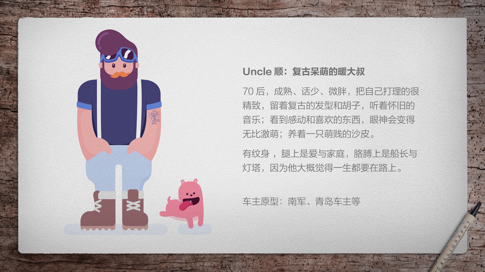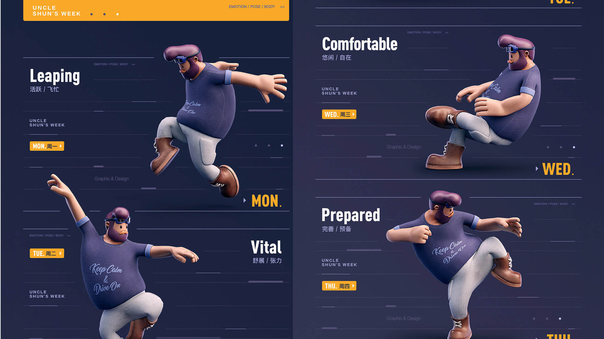

当然，除了共享出行的车主以外，平台上还有其它类型的车主以及乘客，用户形象的建立是一个逐渐丰富的过程。

**然后，我们为这个故事搭建了人物与座驾。**

每个人物的座驾，其实都是这个人物内心的一种展现。比如大叔的小车、女孩的大车等等。有冲突的设计，也会更有戏剧感。

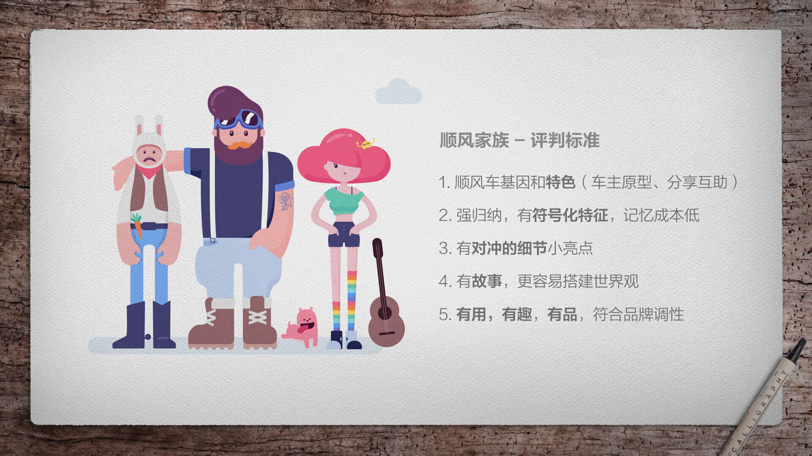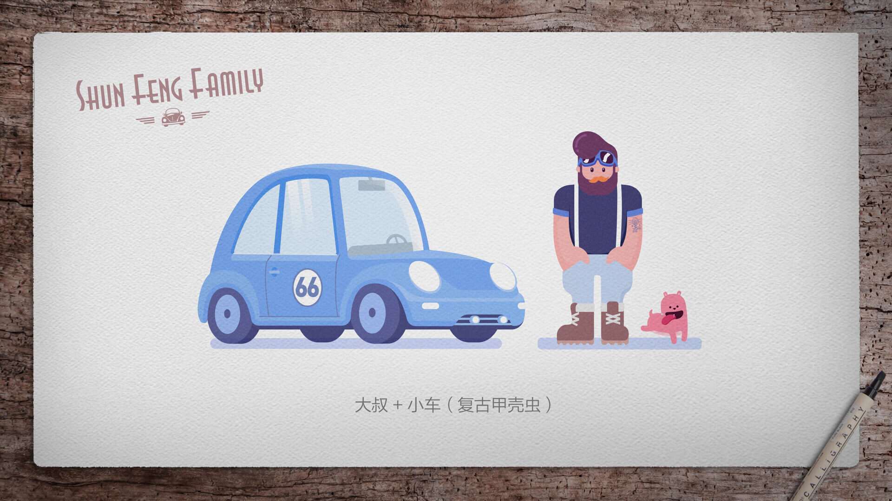

**接着，我们开始为这个世界的每个人物撰写剧本，塑造他们的性格与故事。**

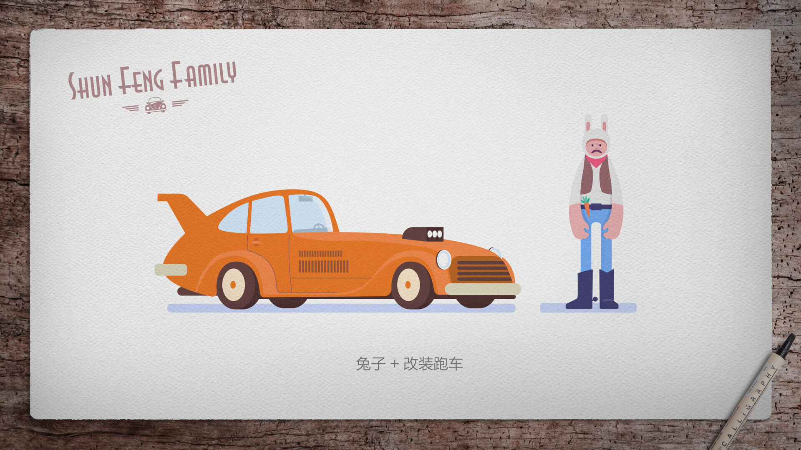

另外在剧本内，我们还融入进了顺风车业务最核心的场景。

对于共享出行的业务来说，最核心的场景还是**陌生人在车内的混搭**，这是顺风车产品最核心的用户体验。我们既要保证乘客和车主的安全，还要塑造乘客与乘客、乘客与车主之间的信任。同时，还要让大家不会感到尴尬。

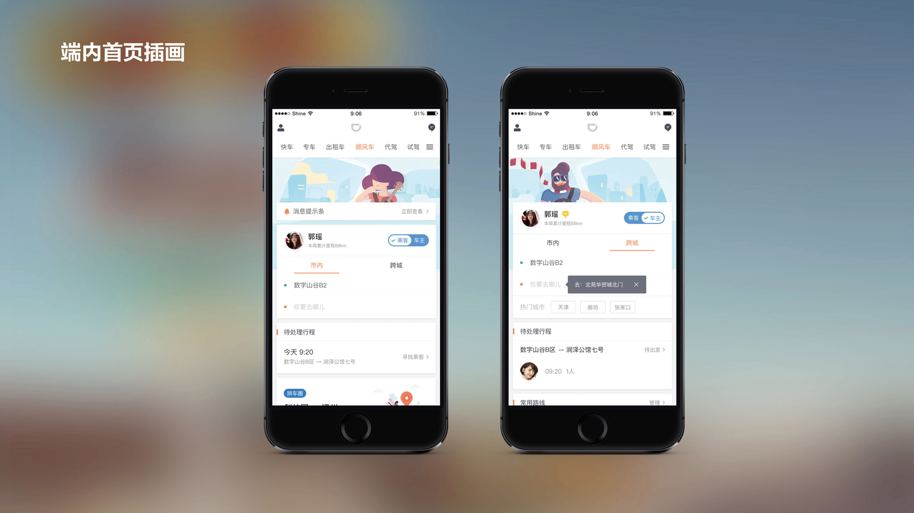

所以，我们就开始设计各种混搭人物的场景，并且把它们融入界面里。比如说，星战与彩虹姐、梵高与李白、天使艾米丽与“这个杀手不太冷”的玛蒂娜。我们在幻想，在这样混搭的场景里，都会发生怎样有趣的故事。

在做的时候我还在想，这大概是滴滴最非直男的界面了吧。但其实现在可以看到，滴滴的花小猪、喵喵节，风格也开始越来越活跃了，所以我还是很满足当时自己的这个判断。

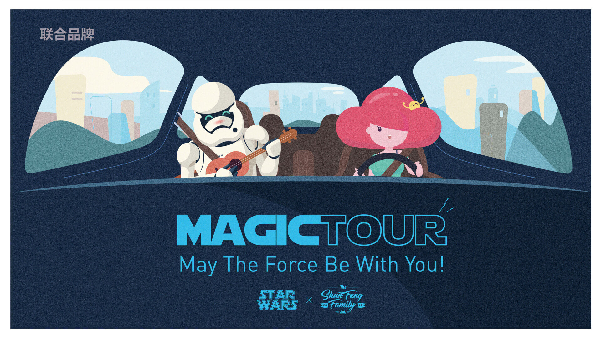

我们把共享出行的关键场景叫做Magic Tour。

但这还不够，我们还为这个世界写了一个独特的价值观，也就是当单人出行的时候，车是被人抱在怀里的，人物跑不开，而只有四个人在一起，车才能飞奔起来，以此突出顺风车业务中“分享”的概念。

那么现在，我们所塑造的世界就有了人物、关键场景和核心世界观。

### 第二步：在品牌的各个触点中应用与重复

那么，在有了以上基本的顺风车世界设定以后，它就成为了一粒种子，在整个滴滴产品业务的各个流程里逐渐伸展开来，从而让业务的每个细枝末节都具有自己独特的特性，但它们又生长在一个故事下。这样，我们就做到了既尊重各个业务的数据目标，又达成了产品体验的统一。

其实，以前这个共享出行业务有着各种非常多的营销活动，虽然它们的设计都很好看，但却没有一个统一的风格，并且世界观和价值观也不一样，这就是品牌交付的问题。于是我们这次就一下都统一了，而且表达也更加有趣。

另外，无论是营销物料，还是App端内的界面，我们都会有一个统一的风格，不会因为割裂而导致用户的沉浸体验断掉。

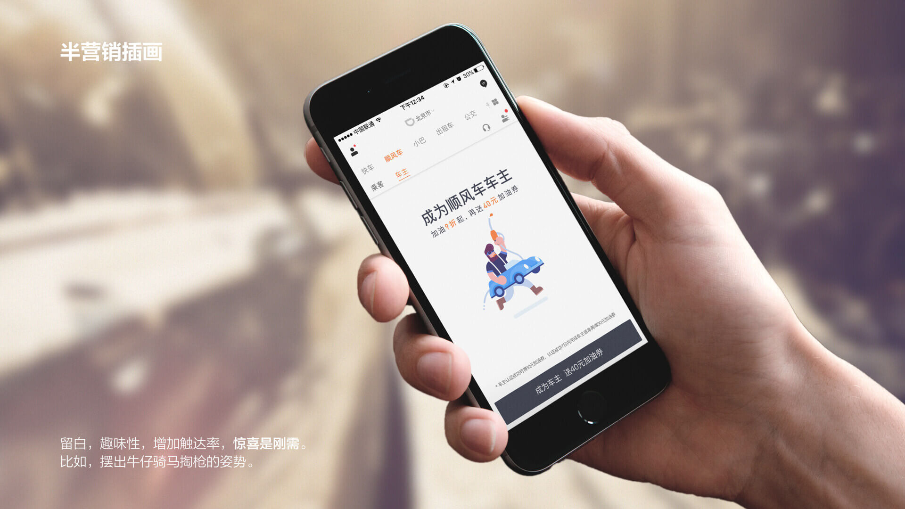

在界面的设计表达上，也从无聊的文字，变成了有趣的动画，让用户可以更生动地知道下一步该如何做。

除了界面设计的更新迭代以外，我们也尝试把这个有趣的世界应用到各个场景当中，以此塑造出行的文化传承感。

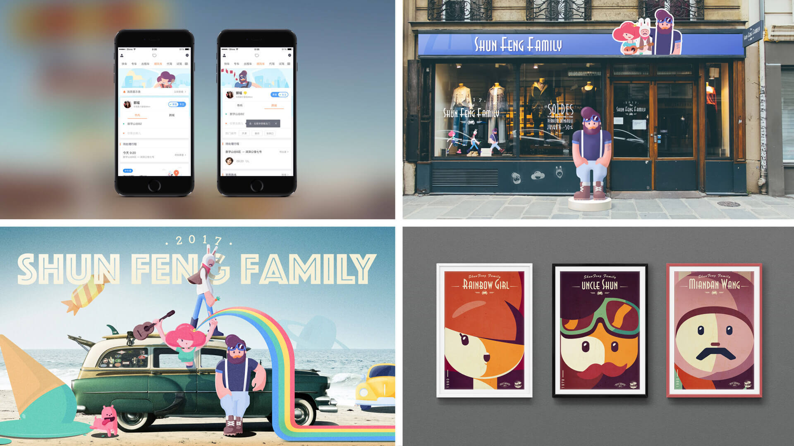

我们甚至还把车主喜欢的歌单，做成了唱片。

总而言之，我们努力让共享出行业务围绕着一个精神IP和故事来变得更加生动，让用户能够更好地理解业务平台的信息，然后和产品品牌成为一个共生的关系。

到后来，我们还开始制作各种动画短片，来宣传安全的攻略。

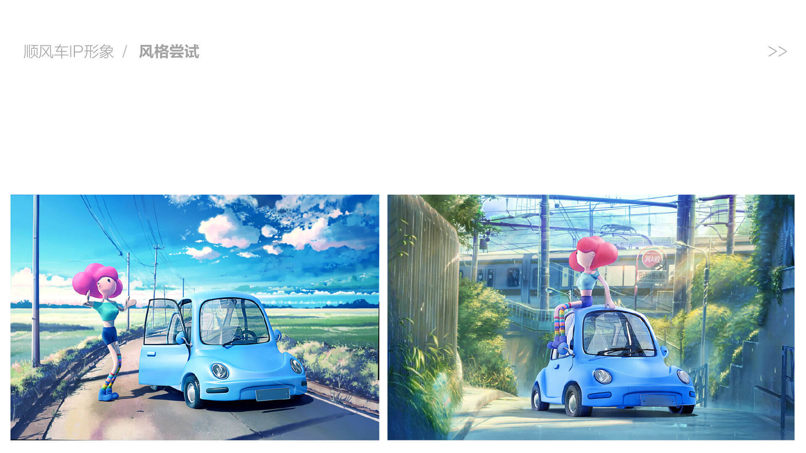

至此，我们就已经把IP释放在了整个滴滴出行的业务当中，同时根据用户的反馈，我们也开始修改每个细节，优化故事和表达。另外，我们也开始根据交易的数据反馈，来更生动地改进端内的体验和品牌的宣传。

### 第三步：构建故事和内容体系

人物、世界观、图形这些仅仅是搭建品牌IP的基本，更重要的是，我们能塑造平台的精神与视觉元素来表达用户的情感。

于是，我们就开始在订阅号里撰写不同车主的故事，以此引领车主们在平台上表达出好的行为和价值观。

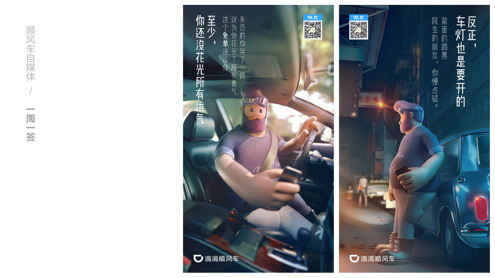

根据这一点，我们就裂变出了一个内容体系，包含了以下四个方面的内容：

* 安全内容；
* 车主故事；
* 省钱攻略；
* 互助案例。

这样，我们就有了关于顺风车业务的内容体系和传播素材，而这套IP，也延伸到了和用户在内容层面交流的状态，并逐渐得以发展和完善。

而所谓的搭建内容体系，就是要思考，你的内容，是否真的有用户需求场景，是否能给用户带来益处。我经常能看到，很多品牌在做内容的时候，总是在自嗨，他们的用户并没有需求场景，都是品牌在自说自话，这是不可取的。

## 课程小结

好，我们来总结一下今天所讲的内容。要想打造用户企业的品牌IP，你可以遵循以下三个步骤：

1.  理解业务，找到关键场景，为品牌搭建一个生活化的舞台和故事内核。
2.  基于故事和剧本元素，释放到产品和营销的各个角落里去。
3.  根据内核和用户场景，搭建用户需要的内容体系并进行传播。

今天的案例来自于我在顺风车做顾问时主导的一套设计，主要采用了动画的方式，串起了整个业务的故事。

虽然不同的业务有不同的表达方式，但其故事的串联以及内容体系的搭建是最重要的。正像我在[第17讲](https://time.geekbang.org/column/article/294411)中所说的，一个沉浸体验的关键，是要有完整的产品体验交付，不能让用户出戏。

我一直觉得，品牌的超级符号和业务之间不能割裂，而一个品牌的塑造，不仅仅是一句Slogan和一个Logo那么简单。我们要好好思考，如何体系化地把一个故事落实在自己的业务中，并让用户在使用的过程里，一次又一次地记住自己。

不过略显悲伤的是，顺风车这个业务在IP上线后不久，就出现了安全事件，当然这就是另外一个故事了，它涉及到运营策略和评判商业的标准制定的问题，这个我们以后有机会再谈。但剥离开安全事件，我仍然还是希望用这个案例来给你讲解清楚品牌IP化的概念，我并不希望有人会认为，做品牌就是去做声量、做符号、做传播，其实**品牌是一个将业务的灵魂逐渐外化的过程**，而这个灵魂，就是我在上一讲所说的，它是产品的文化。

说到这里，有一次我打开了顺风车的App，看到他们已经改进了这套IP，变得更加艺术化和稳健了，这是好的改变，我希望他们未来一切顺利。

## 一课一思

学完了这一讲，你觉得有办法将你所在业务的品牌和产品链接得更紧密吗？你会采取的方案是什么？欢迎在留言区分享你的见解。

如果觉得有收获，也欢迎把今天的内容分享给更多的朋友。感谢你的阅读，我们下一讲再见。