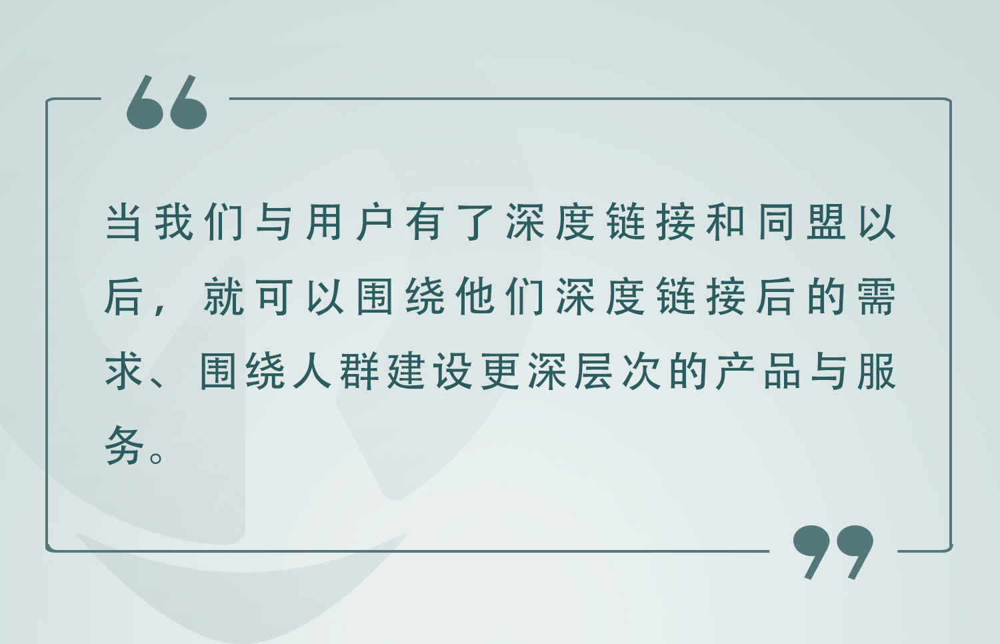

---
date: "2019-06-23"
---  
      
# 29 | 如何打造用户同盟？
你好，我是相辉。

上节课，我们了解了从产品体验到品牌传播的方法，其中我提到，我们需要从产品体验的场景出发，去研究用户的体验地图与情绪曲线，找到合适的时机来为用户提供超预期的“价值感”体验，从而引发用户的分享和传播。

所以这节课，我们就来讲讲如何与用户建立深度的联系。因为只有和用户同盟，才能够真正长期影响到用户的心智。未来，用户也是品牌的重要组成部分之一。

在课程的第二个模块，我给你介绍过用户企业的概念和研究方法。如果说会员制是和用户签订长期契约，是和用户做朋友，不追求单次的博弈。那么用户企业，就是在把用户当成企业发展的场景同盟。有一句话叫做：“用户是企业不花钱的员工”。这样理解用户，通常就会看到不一样的价值。

“把用户组织起来”，是我最近常在各个客户公司里听到的话。想来也是，现在流量已经如此珍贵，不把用户组织起来与企业达成同盟，那岂不是太浪费资源了。

不过，要想达成这一目的，让用户成为企业的同盟，和品牌共同创造产品传播的价值，我们还需要一些相应的运营策略设计，需要掌握一定的打造方法。毕竟如果方法不对，我们即使是为用户做了很多事情，也还是不能很好地把用户留在我们的产品场景里，从而也就无法实现企业发展、品牌传播与用户增长上的互惠互利。

<!-- [[[read_end]]] -->

那么接下来，我就根据我多年的经验总结，来带你了解下打造用户同盟的方法，以此加强产品和用户之间的链接深度。

## 第一，建立产品与用户协作的场景仪式

首先，我们需要知道，**每一个产品，都需要建立起一个能帮用户创造价值的场景仪式，即要让用户和产品能够自然而然地发生协作，同时还能有精神上的生活认可感**。

这个价值，可以是体验价值，可以是社区人脉价值，也可以是对用户有品牌价值，但它们都一定要围绕着产品，建立一个互惠互动的场景机制。只有这样，我们的品牌才能和用户形成稳定的触点，形成更深刻的信任和协作关系。

给你举个例子，蔚来汽车的Nio App中，就为用户建立了一个车主社群。在这个车主社群里，蔚来搭建了多个方面的内容引导，比如周边团购、日常生活、出行攻略、兴趣社团等社区内容主题，并且引导用户在App里去主动认识与自己兴趣相投的人，从而提升了用户粘性。

这样，用户每天在开车的同时，可以使用Nio App来满足自己大部分控制车辆和选择汽车服务的需求。同时，用户也能够在更多的与车相关的话题里，和Nio App产生互动。这样，蔚来就可以在这越来越多的触点里，收集到更多沉淀下来的用户数据、关系，从而形成与用户更深层次的关联。

也正是在这不断沉淀的过程里，用户也逐渐地参与了整个品牌社区的共建。比如说，蔚来汽车很多功能需求的确认，都是由用户投票完成的。整个品牌社区的发展方向，如汽车更新的功能和社区新增加的服务等，也都是由用户投票决策的。

因此，蔚来的车主用户也会从刚开始的一个新车主用户，慢慢地被各类活动所影响，成长为蔚来汽车的深度用户。

我们在设计产品的时候，不仅是要为用户交付一款功能性的产品，还需要给用户交付一种生活场景的解决方案。在这个解决方案里，必然就会有内容、活动、社区等场景的存在，它们能让用户和产品链接得更紧密，并可以满足用户对产品周边的各种需求，而用户和产品所发生的各种协作，都会成为这个产品的品牌，形成关键的一部分。

这里，可能有的人会说，蔚来汽车这个产品的客单价高，用户生命周期长，本来就有很大的空间可做。但其实不是的，任何一款产品，都可以深挖与用户的深度交互场景，因为每款产品实际上都能解决用户的某种/某类需求。

再给你举个例子。最近我们正在设计滴滴专车与用户链接的方案，我们为每个城市设计了邀请制的体验官，并且为体验官设计了一些特殊的权益。这个体验官的任务就是为改进专车的服务而提意见，并且也可以优先尝试专车的新功能。另外体验官也可以提案一些新的功能，并可以发起用户投票，一旦被采用，所有参与投票的用户都会收到一些回报。

因为这个体验官是邀请制的，用户可以邀请自己认可的朋友，也可以邀请在各类投票和活动中有贡献的用户，从而扩大了体验官的团队组织，并形成品牌的裂变和用户的裂变，逐渐形成用户群中的意见领袖。这样，我们就能让用户从一群只是和专车发生交易的人，逐渐变成一个社群组织，从而可以让用户和专车一起建设这个服务与社群。

这只是我们计划的第一步，当我们与用户有了深度链接和同盟以后，就可以围绕他们深度链接后的需求、围绕人群建设更深层次的产品与服务。

除了像蔚来、专车这样比较复杂的交易和生活产品之外，简单需求的功能产品，仍然可以创建用户同盟。比如，我曾经就帮助一个社区自动饮料机，设计过一个社群。当时客户的需求是想，可否用饮料机为用户提供健康饮料的服务？或者是提供治愈心情饮料的服务？

所以，我就根据不同的用户需求场景，开发了一个小程序，从周一到周五，用户可以登录自己的账户，在饮料机里选择相应的套餐。这样逐渐地，就可以在小程序里以健康饮料为主题，延展出一个健康饮品的社群。

所以总而言之，即使是简单的产品，我们仍然有可能创作出丰富的内容，并创造一个简单的社群，延展出组织用户的方法和场景。

那么现在，你就理解了建立用户同盟的第一个步骤，也就是要规划好用户在产品里的生活场景和链接仪式，要确定好用户可以和产品发生怎样的互动，以及确认用户什么样的行为可以和我们共建产品和品牌。

## 第二，建立产品与用户的利益共享机制

同盟二字，就意味着双方在一起是有着共同利益的。所以很明确的是，**如果我们要建立用户同盟，光有场景是不够的，还要用机制来凝结用户与企业之间的协作。**

我还是拿蔚来汽车举个例子。

蔚来的Nio App中，会给每个用户一个蔚来值，用来判定用户对社区的贡献，将用户进行分层，为用户创造出一个努力的阶梯，另外也通过奖励蔚来值的权益，来对用户进行正向的引导。同时蔚来还有一套积分体系，来奖励用户进行一些类似打卡、回帖等在App上的正向行为。

所以，这个蔚来值就有点像从利益共享上，对用户同盟的一种保障。

蔚来值有两个关键的作用，一个是可以让用户拥有在社区内更大的话语权，比如投票权，蔚来值高的用户一票等于十票，这样在关键决策上，蔚来值高的用户就会对社群有更大的影响力。二个是蔚来值还可以让用户优先参与一些有趣的活动。虽然参与这些活动并没有现金奖励回馈，但蔚来值能够大大提高一个用户在社区内的地位，这就是一个用户身份的表达，它可以证明用户就是拥有特权的。

那么如何增加蔚来值呢？答案就是用户要做一些对社区有意义的事情。比如，用户邀请了很多朋友加入蔚来，贡献了优秀的内容，并积极参与社区活动，帮助了更多的朋友，等等。这些能让社区充满善意和好体验的行为，都会成为蔚来值增加的原因。

这里有个关键，就是我要定义好什么样的行为才是对社区有价值的，而这个价值应该回馈多少蔚来值，这是该设计的关键。

同样，在前面专车的案例中，我们也要根据用户的贡献，来设计出权益的分层，并且定义出什么样的体验官的行为，可以获得怎样的权益。同时，我们也要为体验官的不同贡献进行分层，要设计好，当一个体验官邀请新体验官时，TA的权益应该如何获得，TA都需要付出什么。因为每增加一个体验官，就等于新增加了一份权益成本。

所以说，**利益共享机制的底层是商业闭环的逻辑**，我们通过运营一个用户同盟获得的好处，是需要和成本结合才能长久做下去的。你要知道，成本不是无限的，这是一个需要核算的过程。

那么这里，我通常会采用这三种定义的方法：

* **定义贡献：**也就是用户可以为这个同盟社群贡献什么样的价值。
* **定义权益：**也就是用户贡献的价值，可以让TA获得什么样的权益。
* **定义成本：**也就是我们要换算出贡献价值和权益的对应关系，并核算出权益的成本，来确定维护这个社群体系所需要的成本总和。

也就是说，**用户和产品发生联系的场景设计 + 用户和产品之间的利益共享机制，就是搭建用户同盟的正确手段。**

我经常会看到，很多产品只是为用户返利，那个不叫用户同盟，它仍然算是一种利益贿赂。而只有我们真正地把产品和服务的场景与用户生活场景进行结合，同时让用户的贡献成为产品的贡献，当用户的贡献行为能够为自己换来权益的时候，这个同盟才有可能真正有理有面地实现，我们的品牌才会和用户建立深度的联系。

## 课程小结

今天，我给你介绍了打造用户同盟的两个关键手段，你需要明确并掌握它，然后灵活运用在自己的产品设计和运营策略当中：

* 第一，建立产品与用户协作的场景仪式，让用户在我们产品的场景里玩起来，让用户能够和产品产生更多的链接，为我们的产品和品牌做更多的共建。
* 第二，建立产品与用户的利益共享机制，让用户可以获得与企业进行互动的回报，从而成为利益层面的同盟。

当然，一个同盟还应该有精神方面的共同认知，但这往往是产品服务和用户在品牌方面的共识，在该模块的前几讲我已经给你介绍过了，就不再赘述。

另外我还想说的是，今天所讲的用户同盟的话题，如果再扩大一点，就是一套完整的会员体系的建设方法了，未来有机会我们再讲，那是一个更大的世界。

## 一课一思

请你思考一下，你所在的产品，可以如何规划与用户的同盟？欢迎给我留言，分享你的答案。

如果觉得有收获，也非常欢迎你把今天的内容分享给更多的朋友。感谢阅读，我们下一讲再见。