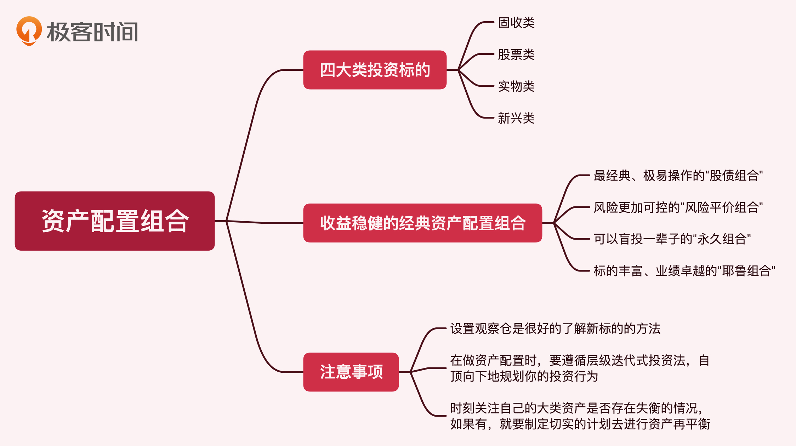
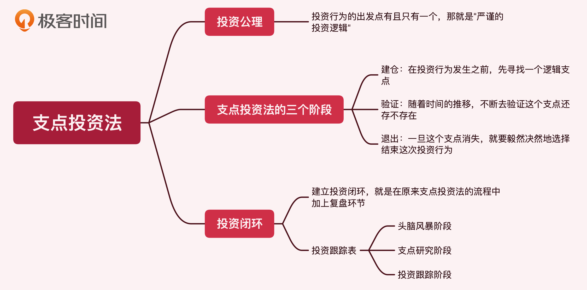
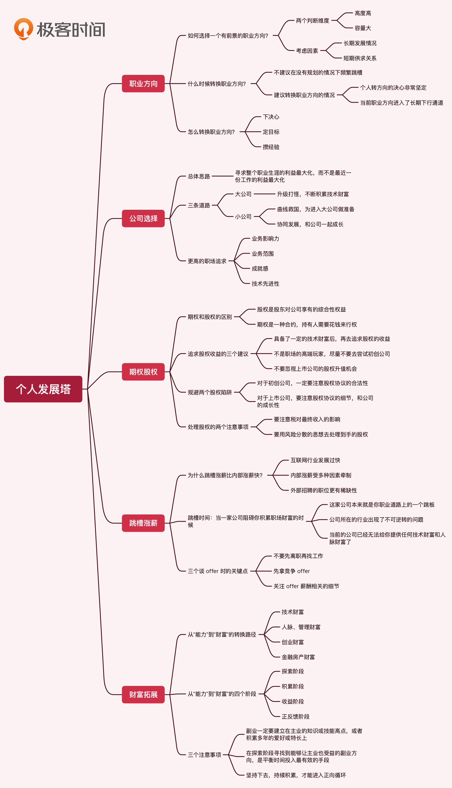
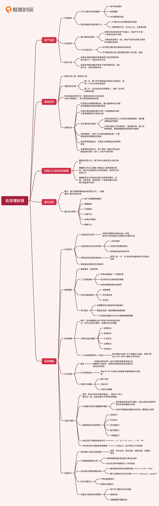

---
date: "2019-06-23"
---  
      
# 番外四｜知识总结：这门课的全部思维导图
你好，我是王喆。

我们这门课程已经接近尾声了，为了加深你的理解和记忆，也为了方便你回顾学习，我把这门课的核心知识点总结成了几张思维导图。你可以对照着这些图片，把这门课的内容从头到尾梳理一遍。回望来路，相信你会有更多新的体会和思考。  
  
  
  

<!-- [[[read_end]]] -->