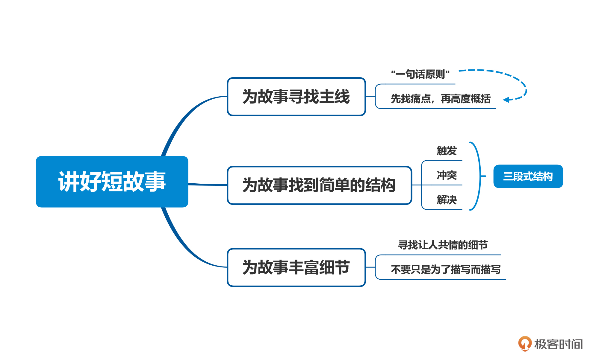

---
date: "2019-06-23"
---  
      
# 09 | 无中生有（上）：如何讲好短故事
你好，我是涵柏。

今天继续我们的故事旅程。在前面几节课里，我们从故事库、故事思维、遣词造句等多个方面介绍了编写故事的技巧，为我们接下来的应用打好基础。这节课我们将具体来聊聊怎么讲好短故事。

什么是短故事呢？

严格来说，短故事没有明确的定义，在我们这里短故事特指这样一种故事：

* 故事完整，但篇幅短，不超过五、六百字就能把这个故事讲清楚；
* 较短的篇幅中，包含了丰富的细节和情节冲突。

可能这样说还是有些抽象，我们从一首歌说起。我记得在有一期《中国新歌声》上，导师那英听到选手唱起《漂洋过海来看你》时，说这是她最喜欢的歌。

这首歌我个人也非常喜欢。我之所以喜欢，是因为我觉得这首歌的歌词是很好的短故事的样本。我们来看看其中的一段歌词。

> 为你我用了半年的积蓄 漂洋过海的来看你  
>    
> 为了这次相聚 我连见面时的呼吸 都曾反复练习  
>    
> 言语从来没能将我的情意 表达千万分之一  
>    
> 为了这个遗憾 我在夜里想了又想不肯睡去  
>    
> 记忆它总是慢慢的累积 在我心中无法抹去  
>    
> 为了你的承诺 我在最绝望的时候 都忍着不哭泣  
>    
> 陌生的城市啊 熟悉的角落里 也曾彼此安慰  
>    
> 也曾相拥叹息 不管将会面对 什么样的结局  
>    
> 在漫天风沙里 望着你远去 我竟悲伤得不能自己  
>    
> 多盼望送君千里 直到山穷水尽 一生和你相依

## 如何设计一个好的短故事

<!-- [[[read_end]]] -->

这首歌背后是一个真实的故事：演唱者娃娃喜欢上了一位北京人，两人常在电话里互诉衷肠。80年代，海峡两岸尚未互通，娃娃申请了半年才获得批准来到北京。到了北京后，她才知道男方已经有了家室，这段苦恋最终以分手告终。后来，娃娃把这个故事讲给了李宗盛，李宗盛写下了这首歌，传唱至今。

我们可以从这首歌中学到哪些技巧呢？我们简单分析下。

首先这个故事相对完整，有一条主线。如果用一句话概括上面这个故事，就是歌词中的“我”漂洋过海见到了“你”，最终却和“你”分开。

其次，这个故事有个简单的结构，并且结构里是有冲突的。歌词里的“我”终于漂洋过海和心上人见面了，一般故事里的结局是什么呢？是互相拥抱接吻，喜极而泣。但这个故事的结局是什么呢？“在漫天风沙里望着你远去”。再说得明白点，本来是主角去对方的城市看心上人，却成了送走对方。这种爱而不得的结局，正是这个短故事中的冲突所在。

最后，为了让这个故事主线更为饱满，作词者选了很多有意思的细节。比如“花了半年的积蓄”，为了见面“连呼吸都反复练习”“我在夜里想了又想，不肯睡去”。短短几个细节，把一个等待心上人的人物形象马上就给刻画出来了。

多说一句，还记得在[第三节课](https://time.geekbang.org/column/article/390778)里我们讲到的故事思维的三步法吗？从这个短故事的设计中，同样能够清晰看到三步法的影子。如果你记不清了，不妨再回头复习一下。

通过这样的分析不难发现，李宗盛确实是一个拥有故事思维的作词者。他通过感情丰富的细节与巧妙地故事冲突，为这首歌搭建了一个很好的短故事。这也是这首歌历久不衰、很多人翻唱的原因吧。接下来，我们就根据对这首歌的分析，来聊聊怎么设计一个好的短故事。

### 为故事找出一条主线

确立一条主线是我们设计一个短故事的第一步。

所谓主线，就是能够概括整篇故事主要脉络的内容。简单来说，就是即使我不听完整个故事，看过主线后我也能大致知道这篇故事的主要内容是什么。

比如亨利·詹姆斯小说《一位女士的画像》的主线，说的是一位贵妇人在剧院里为剧中人的悲惨命运啜泣不已，但她的马夫就在剧院外面冻得快要死去。有了这样的概括，你可能不知道里面的具体细节，但一定知道这部小说大概讲了一个什么样的故事。

那怎么确定主线呢？

方法很简单：用一句话来确定文章的主线，我们通常称之为“**一句话法则**”。

这个法则不是我发明的，它由美国著名作家罗伯特·麦基提出。他在自己的著作《故事》这本书中提到，“文章的真正主线不是一个词语，而是一个连贯的句子，**这个句子一定能够清晰地概括整篇文章**。”

钱锺书先生有篇小说叫《围城》，里面很出名的一句话是这样的：“婚姻就像一座围城，城外的人想进去，城里的人想出来。”但这句话不能算是这部小说的主线，这部小说的主线是什么呢？一句话概括：从欧洲游学回来的方鸿渐在经历几段感情后和孙柔嘉结婚，但双方矛盾不断激化，最终闹翻，方鸿渐逐渐失去了生活的希望。

我们来看一个具体用“一句话法则”去确定主线的例子。

比如现在你的团队研发了一个针对大学生社交聊天类的App，你需要确定故事主线，为这个聊天类App设计一个短故事去打动你的老板，获得资金支持。

首先你要找到你想讲的故事中，最能打动受众的痛点。比如刚刚提到的《一位女士的画像》里，痛点是“**抽象的人代替了具体的人**”。又比如《叶公好龙》的故事里，痛点是“**抽象的龙代替了具体的龙**”。再比如《围城》里的痛点是“**婚姻**”，这些都是非常能够打动受众的痛点。

就这个社交聊天App的例子而言，我们可以尝试洞察出一些现象：

* 大学生在生活中常常呈现出一种无所事事的状态；
* 现在虽然有很多聊天类工具，但我们聊着聊着，很容易就觉得索然无味。

这两个现象都指向同一个痛点“无聊”。

一旦我们找到了这个痛点后，就可以把这个痛点和产品联系起来。比如我们可以去设计一个“某某App陪你无聊每一刻”的故事。这个故事可以用一句话来这样概括：一个大学生每天通过打游戏、看视频来打发无聊时间，却始终感到迷茫、痛苦，在经历一番变化后，他最终学会了直面这种“无聊”。

当然，对于“无聊”这个痛点来说，一句话的主线可以有很多种变化。你可以自己尝试一下，用一句话来概括出来你自己的故事主线。

总结来说，找主线就是**通过“一句话原则”，先找到痛点，再高度概括。**

### 为故事找到一个简单的结构

找到了主线以后，我们接着进行第二步，为故事找到一个简单的结构。

今天我们主要是聊如何讲短故事。既然是短故事，结构一定不会太复杂。具体怎么找到一个简单的结构呢？

我的诀窍很简单，通过三段式的经典结构搭建出骨架。这个方法，如果你接触过一点故事编写的技巧，应该是听过的。但用好三段式没有那么容易，里面的门道还有很多。不妨听听我的看法！

**三段式之所以经典，是因为它最接近于人类思考问题的方式，因此最容易被接受。**比如我们分析一个现象的原因，常常会有这样的感觉，说两个理由太少，说4个理由太多，3个理由“首先、其次、最后”刚刚好。

再比如我们的经典模式，是什么、为什么、怎么办，以及提出问题、分析问题、解决问题等等，都是三段式的。有科学研究表明，三段式符合大脑记忆的规律，刚好构成了完整的因果关系。

那么，我们说写作里面的三段式是什么呢？就是触发、冲突和解决。是不是觉得有点抽象？我逐一解释下，你就明白了。

所谓**触发**，就是导火索，就是这个故事因什么而起：

* 在《皇帝的新衣》里，触发是两位骗子见国王，说能制作出一件神奇的新衣；
* 在《丑小鸭》里，触发是丑小鸭常被排挤；
* 在《漂洋过海来看你》这首歌里，触发是我存了半年积蓄，终于可以跨洋来看你；
* 在刚刚讲的社交聊天App里，触发是做着打游戏这样看似轻松的事情，却仍然感受不到快乐。

再说**冲突**。所谓冲突，就是故事里隐藏的矛盾，它是一个故事中最具张力的部分。这种张力越大，越能吸引受众的关注。越是把某个现象、人物推向两难的境地，就越能揭示一个故事的本质。需要说明的是，故事中产生矛盾的地方不一定只有一个，你可以根据情景多设置几个。

还是以App的故事为例，我们在设计这个故事时，围绕着“为什么感觉不到快乐”这点，能想到的冲突主要有：

* 家里成员对他生活的诟病；
* 朋友对他的生活的指指点点；
* 自己内心的冲突。

每一个冲突都可以发生不同的故事，比如和父母吵架，比如自己觉得虚无，有过轻生的念头等等。

那我们最后的一点，**解决**就很好理解了。解决就是指故事里的人物遇到这种冲突后，经过一番挣扎，有了一个新的看法或者最终的结果。

比如歌曲《漂洋过海来看你》中的结果是“漫天风沙里，我送你远去”。再比如为App设计的这个故事里，我们的结果可以是：在经历一番挣扎后，这位天天消磨时光的朋友，明白了要让自己真正感到快乐，那就需要打破这种浑浑噩噩的状态。于是他在这款社交App上通过有效社交打开了自己的内心，从而和自己的家人、朋友和解，和自己和解。

通过对上面的讲述，相信你已经感受到了三段式结构的一些奥妙。我们再来剖析一个故事案例，来加深我们的理解。

一天，一个老头在火车上遇到一个卖啤酒的老板，老板说自己正在四处推销，但根本没效果。老头听完，说出了一个提高销量的秘密：把你的产品卖点提炼出来，做宣传。

这个老板反复强调：“我的啤酒没有任何卖点，和所有的啤酒都是一样的……”

老头说：“不可能，任何产品都有独特的卖点。”后来，老头去了解了这家啤酒厂的整个生产过程，看到在啤酒的制作过程中，工人们往酒瓶里吹入高温纯氧、用深井下四千英尺的纯净水生产啤酒。

老头非常惊讶地问这个老板：“你为什么不宣传这些事呢？告诉别人你的啤酒比别人的更纯？”老板说：“所有酿造啤酒的过程都是这样的。你太不懂啤酒了！”老头回答：“把这些写出来，绝对会让每个人都吓一跳。”

于是，这个老头信心满满地提出了一个卖点：每一瓶啤酒，在灌装之前，都要经过高温纯氧的吹制，才能保证口感的清冽。

老板听到后，觉得不行！因为所有的啤酒都是这么制作的，这是标准的生产工艺。拿这个做广告，太可笑了。老头非常生气：“咱们打赌，我出钱打广告，如果赚了钱，你把钱还我，要是到时候没赚钱，这广告算我白送。”

最终这个广告让这个品牌的啤酒销量，在短时间内从第五名跃到了第一名。

这个故事中的触发是什么呢？一个老头遇到了一个四处推销啤酒的老板。

冲突是什么呢？有这么3个：

* 老板四处推销，没效果；
* 老头想帮他，所以他让老板介绍下啤酒的卖点，但老板觉得没有；
* 老头实际考察以后，想到了一个卖点，但老板觉得很可笑，为此两个人还打了赌。

解决是老板赌输了，这个广告让这个品牌的啤酒销量在短时间内从第五名，跃到了第一名。

三段式的结构对于短故事来说非常好用，你可以自己再找几个小故事，试着用三段式结构做一下剖析。

### 为故事丰富细节

找到了故事主线和结构以后，第三步就是为故事丰富细节，让它变得有血有肉。

我们常说“魔鬼藏在细节里”，就足以说明细节的重要性。故事中那些妙趣横生的细节，毫无疑问能加深我们对这个故事的印象。比如我们谈到孔乙己的故事，我们就能记起他说过茴香豆的茴有四种写法；比如谈起祥林嫂，我们就能记起她逢人就诉说自己的不幸。

你可能会问了，怎么为故事找细节呢？

最基础的做法是寻找那些可以共情的细节。换句话说，就是你在设计故事人物、事件的时候，可以先代入到自己的身上，**问问自己，什么样的人物和事件会打动自己。**也就是我们之前一直在强调的，人性。

比如，你要讲一个孤独的父亲的故事。怎么体现他的孤独呢？那我们可以设计一个情节：这位父亲感冒了，无人照顾。

这时，你就想想自己感冒时的经历是怎样的，然后找到那些共情的元素。对于我来说，说到感冒，我可能就会想到“声音”这个元素。我在现实生活中，对感冒时的“声音”有过比较深的感触，那我就会在故事中用到这些细节。

我这个带有“声音”细节的故事是这样的：这位父亲不想打扰他的孩子，怕影响他的工作。但他太难受了，只好拿起了电话。在北京的孩子接通了电话，电话里传来父亲**虚弱、颤抖、非常无力的声音**。

不知道你对这个打电话的故事，有没有一定的感触呢？

我们再举个例子。比如我们要用一个故事去说服别人不要高空坠物，如果我只是告诉他，自己看到过一个花盆从15楼掉下来，砸在了一个人的脑袋上。你想想，这个人听到我这么说，内心肯定毫无波动，甚至可能会想笑。

那要怎么做才能够让别人体会到高空坠物的危害呢？把自己代入故事中，想想什么情况下自己会感到痛，然后用细节来完善这个故事。我丰富细节后的故事是这样的。

一个单身妈妈因为要养家，一直都在外面打工，她已经一年没有见过自己的孩子了。今天是大年三十，她终于可以回家抱抱自己的宝贝女儿了。

她提着一个芭比娃娃、一条白色的连衣裙，这都是孩子最喜欢的。家就在前面，她不自觉地加快了脚步，笑容一直挂在她的脸上。几秒之后，一个花盆从15楼落下，砸在了她的脑袋上，她倒下了，鲜血缓缓把芭比娃娃和那条白色连衣裙浸染成了红色。

同样是被砸的故事，只有这样的细节，才有可能让人记住这个故事。

在这里我需要特别说明的是，**是故事决定了这些细节的存在。**也就是说，讲故事的人设计细节的前提是，他确定这个故事能用到这些细节。假如只是为了描写而描写，那细节就会破坏故事的整体性，这样的细节注定都是败笔。

同样，我举个我经历的反面例子。有一次，我面试一个实习生，我问他，你能不能给我讲一个你最近遇到的最让你有感触的故事，他的讲述是这样的。

有一天，中午吃饭的时候，我遇到了一位白领，那位白领很漂亮，气质也不错。突然，我听到她在饭店和老板争执，嗓门声很大，好像是为了显出自己的气势，把眼睛也睁得特别圆，厉声问道：“为什么青椒炒肉里，肉这么少。”老板也很不服气说：“这肉不少啊。”她说：“就没有几块！”结果说着说着就哭了。

老板一下懵了，有些语无伦次：“咱们有话好好说，实在不行，我再让后厨给你炒一盘，不就好了？你别生气，别哭啊。”白领抹了抹眼泪：“我不是生气菜里肉少，我是突然想到，我都快30岁了，为什么还要为这几块钱的饭活得这么累？”听到她说了这句话，那一瞬间我就愣住了，内心咯噔了一下。

我们回过头来看这位实习生的讲述，有个最大的问题就是无用的细节很多。比如“白领很漂亮，气质也不错”，“嗓门声很大”，这些细节都没有为故事服务，是没有必要的。再比如“老板也很不服气地说”这句，完全不需要加很不服气这几个字。因为听众能够想象老板是不服气的，如果他服气也就不会争吵了。所以，这种为了描写而描写的细节，我们在讲故事时，应主动把它删去。

## 总结

好了，这节课我们就分享到这里，最后我们来总结下。

今天我给你分享了如何讲好短故事。首先，这节课里我们所说的短故事是我人为划分的。特指故事完整，但篇幅短（不超过五、六百字就能把这个故事讲清楚）的故事。并且这样的故事在较短的篇幅中，包含了丰富的细节和情节冲突。

怎么来设计一个短的故事呢？我们用了三步。

第一步，寻找主线，方法是“一句话法则”，**本质是找到能打动受众的痛点。**

第二步，为故事找到一个简单的结构，我给你推荐了常用的**触发-冲突-解决**的三段式结构：

* 触发就是导火索，指这个故事因什么而起；
* 冲突是一个故事中最具张力的部分，是故事中隐藏的矛盾。当然，故事中产生矛盾的地方不一定只有一个，你可以根据情景多设置几个；
* 解决就是指故事里的人物遇到这种冲突后，经过一番挣扎，有了一个新的看法或者最终的结果。

第三步，为故事丰富细节，让它变得有血有肉。**寻找细节最重要的方法就是要把自己代入到故事中，去寻找能让人共情的元素。**

但你要注意的是，决定细节的是故事。也就是说，讲故事的人这么设计的前提是，他确定这个故事里能用到这些细节。为了描写而描写的细节注定会是败笔。

希望你能够灵活运用这节课的短故事技巧，讲出一个直达受众痛点，让人共情的短故事。

## 作业

最后我来给你布置一下我们今天的作业。我给你提供一句话：“年少时不能遇到太惊艳的人。”请你根据我们今天学到的方法，围绕这句话设计一个短故事吧。