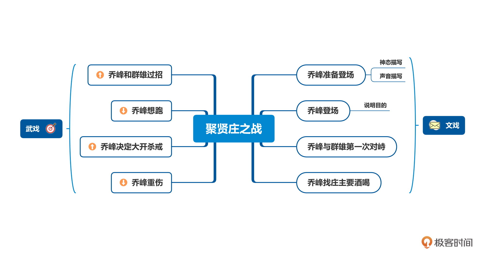

---
date: "2019-06-23"
---  
      
# 10 | 无中生有（下）：如何编排长故事
你好，我是涵柏。

今天继续我们的故事旅程。这节课，我们来说说怎么编排长故事。

和上节课一样，我们要先给长故事下一个定义。和短故事相比，长故事的字数一般都超过1000字，把它讲出来的时间超过5分钟。长故事和短故事相比，情节更多，结构也更为复杂。

这也就意味着，如果我们想要编排好一个长故事会更为困难。因为我们不仅要保证故事的流畅性，还要让故事能够持久地抓住听众，进入到我们的故事中。

如何才能保证长故事的流畅性和吸引力呢？我们以一个长故事为例，先了解其中技巧，然后我们再把这些技巧化为己用，就像天龙八部里段誉使用的北冥神功一样，把别人的内力吸收为自己的内力。

既然说到了天龙八部，我们接下来就来分析这部武侠小说里的一处情节吧。乔峰契丹人的身份被暴露以后，很多江湖豪杰在聚贤庄特意组织了一场武林大会，商量杀他的方法，以绝后患。此时，刚好阿朱被少林大力金刚掌所伤，只有薛神医能够救他。而薛神医此时正在武林大会上，乔峰为了救阿朱，带着她到了聚贤庄。两人的到来，注定了在聚贤庄将发生一场血战。

我们来看看金庸先生是怎么讲这个故事的。

我们首先要知道，金庸先生写聚贤庄的故事，主要目的有两个：

* 主人公乔峰的豪迈；
* 中原武林人士的偏见和狭隘。

<!-- [[[read_end]]] -->

所以，我们学习的时候，就重点看看他是如何针对这两点来编排故事情节的。

## 人物出场

我们先来看人物出场。

> 鲍千灵道：“乔峰那厮说要到聚贤庄来，参与英雄大宴。”他此言一出，登时群相耸动。大厅上众人本来各自在高谈阔论，喧哗嘈杂，突然之间，大家都静了下来。站得远远的人本来听不到鲍千灵的话，但忽然发觉谁都不说话了，自己说了一半的话也就戛然而止。霎时之间，大厅上鸦雀无声，后厅的闹酒声、走廊上的谈笑声，却远远传了过来。

金庸老爷子是怎么来铺垫乔峰出场的呢？声音描写。从最先的喧哗嘈杂到鸦雀无声，一动一静之间，就把乔峰的震慑力体现得淋漓尽致。注意了，在声音描写的同时，我们还能看到其中的层次感，先是讲大厅上的众人，再写站得远远的人，最后写后厅，从近到远，娓娓道来。

接着，乔峰就要来拜庄了。金庸老爷子又用了神态描写来渲染主人公的出场。

> 便在这乱成一团之中，一名管家匆匆进来，走到游骥身边，在他耳边低声说了一句话。游骥脸上变色，问了一句话。那管家手指门外，脸上充满惊骇和诧异的神色。游骥在薛神医的耳边说了一句话，薛神医的脸色也立时变了。游驹走到哥哥身边，游骥向他说了一句话，游驹也顿时变色。这般一个传两个，两个传四个，四个传八个，越传越快，顷刻之间，嘈杂喧哗的大厅中寂然无声。因为每个人都听到了四个字：“乔峰拜庄！”

只是听闻乔峰拜庄四个字，所有人的脸色立刻就变了。这得是一个什么样的人物，才能有如此大的震撼力。可以说，到这里，金庸老爷子的铺垫彻底完成，吊足了我们的胃口。我们心里不得不往下想，接下来还会发生什么呢？

我们先暂停下聚贤庄的剧情，跟着金庸学学人物出场的技巧。

我们要知道，人物是一个故事的灵魂（如果我们把动物、神仙也理解为人物的话），因为人物的出彩从而让我记住的故事比比皆是。相反，有些人讲的故事没有吸引力，也正是因为人物讲述得无聊，把一些本来有意思的人物埋没在无关紧要的信息中。

正因为是长故事，所以我们才有空间来打磨一个人物。那么人物出场是不是会有个总的原则呢？是的，你看金庸先生写乔峰的出场，是有独特的细节描述的。金庸先生会去描述声音特征、神态特征、空间特征等等，以确保读者能记住这个人物。

你可能会问了，选取细节要达到什么目的呢？答案很简单，就是要让受众清晰地感受到人物的登场带来了变化。比如乔峰的登场就让热闹的人群变得安静，就让大家脸都变了色。

我曾经看过保时捷的一个品牌故事，故事的开头是这样的。

一天，老师给学生们上课，其他孩子都在聚精会神地听着课，看着黑板，回答着老师的问题。而一个坐在窗边的小男孩，先是埋着头，随后眼睛望向了窗外，神情漠然。突然，他睁大了眼睛，头也跟着摇摆……

看了这个故事的开头，一个开了小差、对课堂内容不感兴趣的男孩形象，是不是已经在你脑海里建立了起来。你可能会急切地想知道，这个小男孩到底看到了什么，为什么他漠然的表情突然会发生变化。

同样，在这个故事中，因为小男孩的登场，大家认真听课的环境就有了变化。紧接着，这个小男孩也发生了变化，从他的神态细节描写中，我们知道又有新的事物要出现了。

## 结构推进

回到聚贤庄的故事，刚刚讲了人物的出场，接下来我们来看结构推进。

乔峰终于要登场了。金庸先生写这场大戏，用了层层推进的方式展开叙述，我们先讲故事，再解读。金庸先写乔峰来的目的。

> 乔峰将鞭子往座位上一搁，跃下车来，揭起骡车的帷幕，伸手将阿朱扶了出来，说道：“只因在下行事鲁莽，累得这个小姑娘中了别人的掌力，身受重伤。当今之世，除了薛神医外，无人再能医得，是以不揣冒昧，赶来请薛神医救命。”  
>    
> 群豪一见骡车，早就在疑神疑鬼，猜想其中藏着什么古怪，有的猜是毒药炸药，有的猜是毒蛇猛兽，更有的猜想是薛神医的父母妻儿，给乔峰捉了来作人质，却没一个料得到车中出来的，竟然是个十六七岁的小姑娘，而且是来求薛神医治伤，无不大为诧异。

再写，乔峰和群雄发生第一次对峙，因为薛神医不愿意救阿朱。

> 群雄听到这，纷纷拿出兵刃。大厅上密密麻麻的寒光耀眼，说不尽各种各样的长刀短剑，双斧单鞭。跟着又听得高处呐喊声大作，屋檐和屋角上露出不少人来，也都手执兵刃，把守着各处要津。  
>    
> 乔峰虽见过不少大阵大仗，但往常都是率领丐帮与人对敌，己方总也是人多势众，从不如这一次般孤身陷入重围，还携着一个身受重伤的少女，到底如何突围，半点计较也无，心中实也不禁惴惴。

此时，大战一触即发。但金庸先生并没有直接开始写大战，而是在武战之前，又写了一段文戏：乔峰找庄主要酒喝。

> 乔峰端起一碗酒来，说道：“这里众家英雄，多有乔峰往日旧交，今日既有见疑之意，咱们干杯绝交。哪一位朋友要杀乔某的，先来对饮一碗，从此而后，往日交情一笔勾销。我杀你不是忘恩，你杀我不算负义。天下英雄，俱为证见。”  
>    
> 众人一听，都是一凛，大厅上一时鸦雀无声。各人均想：“我如上前喝酒，势必中他暗算。他这劈空神拳击将出来，如何能够抵挡？”

乔峰喝了五十余碗酒，酒毕，武戏正式开始。

在武戏阶段，我们也可以看出明显的时间推进线。先是乔峰不肯伤害众人，所以只是把他们打退击倒。但是呢，参与英雄人数众多，如此打下去，他总有筋疲力尽的时刻，就想逃跑。

接着，一位人物瞧出乔峰想跑，马上大声叫众人缠住乔峰。

> “大家出力缠住他，这万恶不赦的狗杂种想要逃走！”乔峰酣斗之际，酒意上涌，怒气渐渐勃发，听得赵钱孙破口辱骂，不禁怒火不可抑制，喝道：“狗杂种第一个拿你来开杀戒。”

再接着，群雄们打不过乔峰，就一群人扑向阿朱。

> 乔峰眼看群雄不讲公道，竟群相欺侮阿朱这奄奄一息的弱女子，激发了高傲倔强之气，大声说道：“事到如今，他们也决不容你活了，咱们死在一起便是。”右手翻出，夺过了一柄长剑，刺削斩劈，向外冲去。他左手抱了阿朱，行动固然不便，又少了一只手使用，局面更是不利之极，但他早将生死置之度外，长剑狂舞乱劈。

然而，既要护住阿朱，还要保全自己，乔峰终究支持不住了。

> 乔峰自知重伤之余，再也无法杀出重围，当即端立不动。一霎时间，心中转过了无数念头：“我到底是契丹还是汉人？害死我父母和师父的那人是谁？我一生多行仁义，今天却如何无缘无故的伤害这许多英侠？我一意孤行的要救阿朱，却枉自送了性命，岂非愚不可及，为天下英雄所笑？”  
>    
> 眼见单正黝黑的脸面扭曲变形，两眼睁得大大的，挺刀向自己胸口直刺过来，乔峰心中悲愤难抑，斗然仰天大叫，声音直似猛兽狂吼。

到这里，第19章就结束了。后来，乔峰被一黑衣男子救出了聚贤庄。

故事讲到这，我们回过头来看看，从聚贤庄之战中我们能学到哪些技巧。

### 故事有起伏有快慢

首先，我们的长故事需要有起伏，有快慢。

我记得我高中看这段聚贤庄的故事时，我以为乔峰进了聚贤庄接着就要到武戏了，十分期待。突然，节奏慢了下来，金庸先生特别安排了一段文戏，而且这段文戏还安排得特别好：“哪一位朋友要杀乔某的，先来对饮一碗，从此而后，往日交情一笔勾销。我杀你不是忘恩，你杀我不算负义。天下英雄，俱为证见。”

读到这，乔峰的豪迈之情真是力透纸背。还记得吗？我们在[第八讲](https://time.geekbang.org/column/article/395154)中说到，我们可以通过句式的变化来变换节奏。

在长故事当中，突然插叙一段回忆、一段文戏，都是放慢节奏的好方式。此外，你可以把故事里的情节设置得就像音乐有节奏一样，问题出来了（动次），问题解决了（打次），问题又出来了（动次），问题又解决了（打次）。

我们还是来看例子，聚贤庄武戏正式开始后，金庸先生没有把武戏“一拍到底”，而是有不同的层次。先是乔峰和群雄过招，把他们击退打倒，这相当于故事中的“起”；但也不能一直这么打下去，乔峰想跑，这相当于故事中的“伏”。我们觉得乔峰武艺高强，定然可以顺利脱身，没想到，一个人站出来吼了句“乔峰这狗杂种想跑”，乔峰决定大开杀戒，这又相当于故事中的“起”。以此类推，间隔推进，最终达到高潮：乔峰自知身受重伤，站立不动，做好了死亡的准备。在高潮处，悬而未决，第19章就结束了。

### 为故事设置麻烦

那你可能会问了，怎么让故事有这样“动次打次”的节奏呢？方法很简单，打破常态，让人物置身于麻烦之中。著名导演希区柯克有句著名的话：“伟大的故事就是活生生的人生，只是把庸庸碌碌的部分给去除掉而已。”一个没有麻烦的故事场景，就是庸庸碌碌的部分。

这就来到了我们要谈的第二个技巧，故事要设置一个又一个的麻烦。如果我们文艺点说，那就是把最终的答案安全地存放好，让麻烦悬而未决。最好还能快慢得当，收放自如，制造一些迂回曲折，强化故事的张力。

我们回到上面那个没讲完的保时捷品牌故事，看看保时捷是怎么做的。

小男孩被窗外的什么吸引了？想必你也猜到了答案。是的，一辆保时捷911从窗外的林荫小道驶过。小男孩看得出神，以至于课桌上的笔掉在了地上，惊动了老师。老师问他，能告诉我们窗外有什么好玩的东西吗？小男孩站起来支支吾吾，涨红了脸，引来了同学们的哄堂大笑。

小男孩闷闷不乐地坐下，脑海里还是那辆保时捷的影子（麻烦1）。放学后，他背上书包，飞奔出校门，戴上头盔，骑上脚踏车，来到保时捷专卖店，想去看看那辆车（麻烦1解决了）。

他推开门，走入大厅，问：“这里有新款911吗？”销售大叔看到了小男孩来看车，有些疑惑（麻烦2），但是却以对待成年客户的方式接待了他：“有的就在这边”（麻烦2 解决了）。

小男孩围着车看了又看，摸了摸车身，很想看看里面（麻烦3）。“想进去试试吗？”大叔问。“当然！”小男孩打开了车门，坐进了驾驶座，摸了摸方向盘。（麻烦3解决了）

在车里，小男孩反复看了看内饰，眼神里尽是喜欢，可惜现在的自己买不起，他下了车（麻烦4）。“你有名片吗？”小男孩迟疑地问道。“有。”销售大叔面带笑容地掏出了名片，给了他。小男孩拿着名片看了看放进了包里，走出门外。在离开之前，他边戴上头盔，边对着销售大叔说：“那么差不多20年后再见吧。”接着，他骑着脚踏车离开了（麻烦4解决了）。

发现了吗？这个故事的整个过程，其实就是小男孩遇到麻烦解决麻烦的过程，一个麻烦递进出一个新的场景。我再举个例子：

* 一个人敲门；
* 屋内人开门请他进去；
* 他们一起坐到沙发上；
* 他们开始谈话。

如果你是这样来编排长故事的，那无疑是失败的，因为没有麻烦。这个时候就需要稍微改动下：

* 一个人敲门；
* 屋内的人开门，怎么是你？把他请了进来；
* 两个人各怀心思坐到沙发上；
* 他们开始谈话。

这样，我们就为故事里的人物制造了一个麻烦。

我们再回到保时捷的故事。小男孩离开了，20年后，他能买到车吗？故事没有给出答案，但给了一段解读：“关于保时捷有个很有趣的地方，你想拥有的刹那间、你首次拥有的刹那间，对于魂牵梦绕的人们来说，这两个瞬间要间隔十或二十年。”

这真是点睛之笔的解读，这就要说到我们的第三个技巧了。

### 故事要和观念融合

第三个技巧是故事要和观念要融合起来。

这一点，在讲故事中很容易被忽视。请你想想我们小时候听故事的经历，讲得好的人，一定不会一板一眼、照本宣科地讲故事，他一定在积极地处理故事中的观念，力求把它解读出来。他既是一个故事的叙述者，也是一个故事的解读者。这就要求我们讲故事的人，对故事得有充分的理解和掌控。

我们来看聚贤庄这场战役，乔峰和群雄对打时，用的不是降龙十八掌，而是太祖长拳。太祖长拳是宋朝开国之君赵匡胤创造的招式，而少林派的两位长老用的是达摩祖师创造的“罗汉拳”。于是，金庸先生特意写了下面一段对话。

> 众家英雄之中，原有不少大有见识的人物，不由得心想：“咱们对达摩老祖敬若神明，何以对契丹人却是恨之入骨，大家都是非我族类的胡人啊？嗯！这两种人当然大不相同。天竺人从不杀我中华同胞，契丹人却是暴虐狠毒。如此说来，也并非只要是胡人，就须一概该杀，其中也有善恶之别。那么契丹人中，是否也有好人呢？”

金庸先生为什么要在双方激战正酣时，多出这么一段描写呢？他其实就在解读故事，只不过他是借群雄之口，说出自己的观点：每一个族类的人都会有好人也有坏人，不可一概而论，不能简单地搞对立。

如果你看过罗振宇跨年演讲，一定会对他的演讲记忆犹新。学习了这堂课，你可以再去回顾下他的演讲内容，很容易发现他所讲的每个故事，都有解读。

比如2019-2020年“基本盘”的跨年演讲中，他讲到一个有关曾国藩的故事。

农村里，有个人出门看到在一条很窄的田埂上，俩人顶上了，谁也不让谁，谁也过不去。为什么不让呢？因为俩人都挑着很沉的担子，路太窄了，谁要让，谁就得从田埂上下去，站到水田里，沾一脚泥。

你作为一个旁观者，想上去劝，咋劝呢？你说，这位年纪大，你下去，让他先过。他会说，凭啥。你说，这位身上的担子重，你下去，让他先过。他还会说，凭啥。

你看，这不就顶死了吗？那在曾国藩的故事里，这个旁观者是怎么做的呢？

他走上前去说，来来来，我下到田里，你把担子交给我，我替你挑会儿，你这一侧身，不就过去了吗？

**你看，只要你的身份稍稍转换一点，从一个旁观者，变成一个置身其中的人，把自己放进去，是不是一个看似无解的事，就有了答案？**

**曾国藩管这种方法叫：躬身入局。**

**什么叫“做事的人”？不是置身事外，指点江山。而是躬身入局，把自己放进去，把自己变成解决问题的关键变量。**

注意看加粗的部分，就是罗振宇的解读了。为了突出这种解读，有一种常见的表达方式：提问+回答，随后换个说法，再反复。

比如，我现在要给你分享一个关于信仰的故事，然后解读。怎么解读呢？

提问：中国人没有信仰么？

回答：但你看夸父追日，精卫填海，中国人从来不臣服于压倒性的力量，明知不可为而为之。

换个说法，再反复：你看每到危急存亡时，我辈从来都是奋不顾身。

## 总结

长故事常用的技巧，到这里也分享完了。今天，我们换个方式，用一个故事来总结吧。

前面，我给你讲了保时捷的品牌故事，我还想说点题外的故事。

我听我朋友讲，小时候，他很喜欢奥特曼（**人物出场，用了保时捷的故事来为他衬托**），看着看着，就陷入到幻想中。他父母一度觉得他着魔了，不让他看，还把玩具给收了起来（**麻烦1**）。他就偷偷地看（**解决麻烦1**），想象着自己长大后，也是个英雄，是那个能够发射光波的人物，无所不能、无坚不摧，而且他希望能在二十年后实现这些梦想。

而后来长大了读了初中，他发现那些英雄都是假的。他有些失望，因为他发现自己成不了那个英雄了（**麻烦2**）。他脑海中时常闪现小时候自己模仿奥特曼的动作，现在想来真是傻透了。（**用回忆把故事节奏慢下来**）

他的高中老师知道了这件事，把他叫到了办公室，给他做了一个约定：你的数学成绩很不错，如果你能在下次考试的时候，帮你的同桌数学提高10分，那我就告诉你一个成为英雄的秘密。

他跟老师说，这很难，但照做了。不仅是因为他对如何成为英雄感兴趣，还有一层原因是觉得老师派了任务，同桌跟他也是好朋友，帮一帮未尝不可。结果，果然在下次考试的时候，他同桌的数学成绩比上次多了15分，而他自己的数学成绩比上次也提高了20分。

老师如约把他再次叫到了办公室，告诉他，人年轻的时候会有许多梦想，但很多梦想往往都很难达到。我希望你记着你的所有梦想，更重要的是要记住和自己小时候的约定，不管约定是否遥不可及。在那个二十年的约定里，你会变成很厉害很厉害的人，就像我和你做的这个约定一样。（**解决麻烦2，并且作出解读**）

其实，我们每个人都曾经是那个小孩，都有个二十年后的约定。还记得他吗？后来，你赴约了吗？（**再次重复解读，让故事和观念融合起来**）

好了，借着保时捷的品牌故事，我们又衍生出来了一个新的故事，并且把我们这节课提到的方法都用进去了。

## 作业

我们今天用了不小的篇幅讲了聚贤庄的故事。在天龙八部中还有一段武戏也很出名，那就是少室山之战。

根据我们今天学到的方法，希望你把少室山之战分成阶段，并选择这段故事中你记忆最深刻的片段，和我们分享一下这段故事里是如何有快有慢、如何设置麻烦，作者又是如何把自己的观念融入到故事中的。