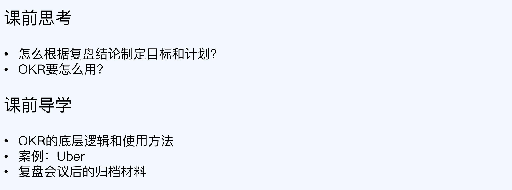
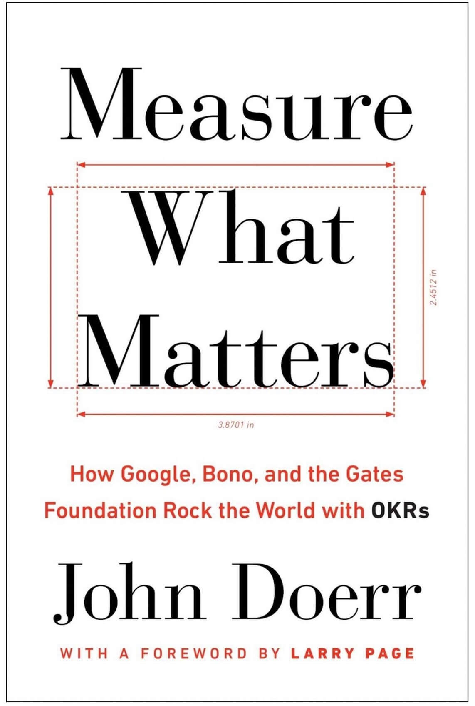
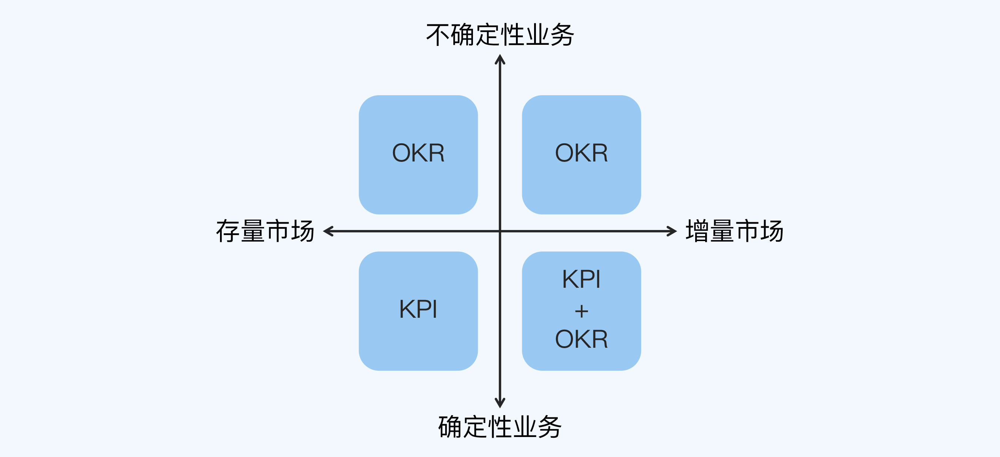
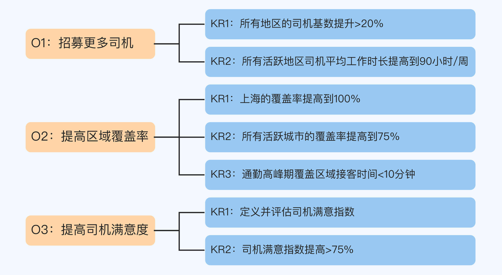
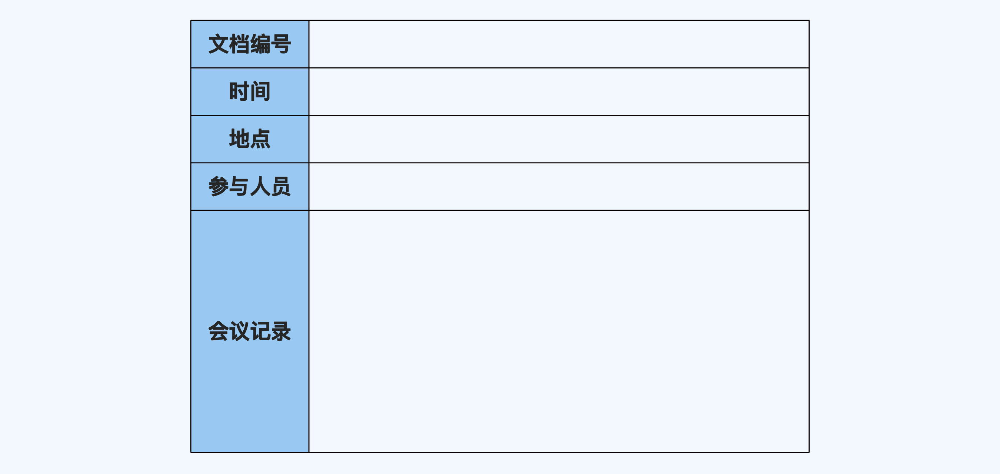
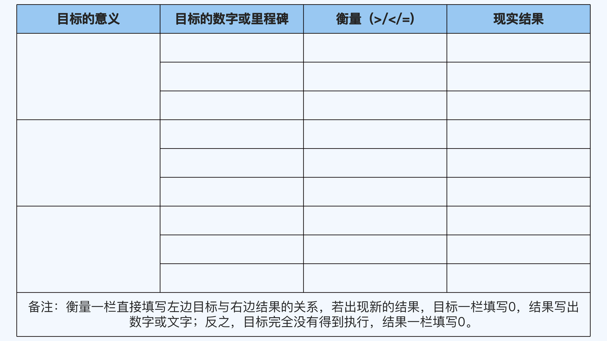
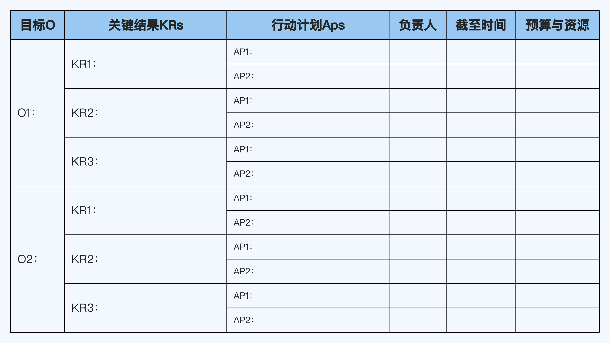
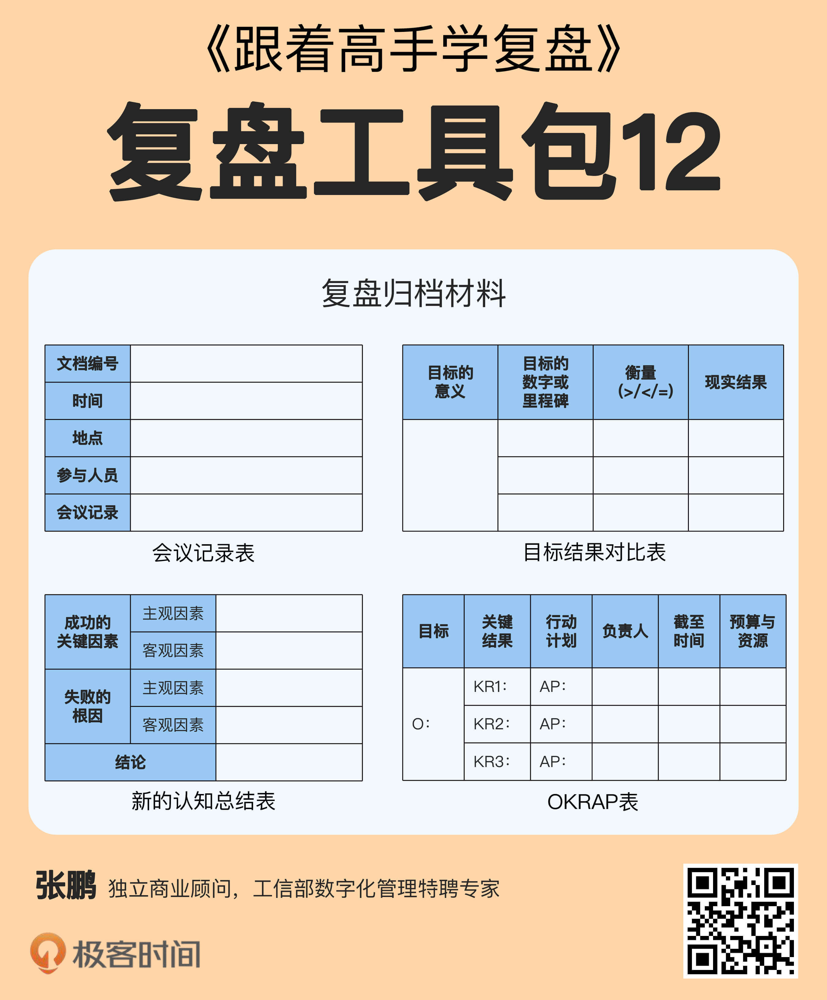

---
date: "2019-06-23"
---  
      
# 11 | OKR：怎样根据复盘结论制定计划？
你好，我是张鹏。

上一讲，我为你介绍了洞察规律的方法。洞察到规律，找准发力点，我们就形成了初步的复盘结论，接下来就到了复盘五步法的最后一步，制定计划，它正好对应CLAP模型的规划环节。

在上一讲提到的Uber复盘案例中，华东区域管理层通过因果循环图得出了这样的结论：为了满足**更多需求**，最关键的是**更多司机**和**更多区域覆盖**。

如果你是区域总监，你会怎么制定下一步的具体目标和计划呢？

* **更多司机**到底要招募多少司机？司机来了之后不干活怎么办？
* **更多区域覆盖**到底要覆盖哪些区域？是华东所有城市一起提升覆盖率，还是优先覆盖重点城市？不同的城市有没有不同的策略？
* 还有没有其他没想到的目标，或者说隐含的目标？

这些问题都是你要考虑的。毕竟光有一个粗略的方向是远远不够的，想要得出能够落地的目标和计划，你还需要更系统地思考，更细致地规划，这时候就要用到OKR了。  

## OKR

**OKR**的全称是Objectives \& Key Results，意思是**目标和关键结果**。作为应对VUCA时代不确定环境的目标管理工具，OKR近几年在中国的创业圈大火。

OKR最早是由Intel的前CEO安迪·格鲁夫提出的，并且在Intel取得了非常好的效果，这让当时还是Intel实习生的约翰·道尔非常着迷。

<!-- [[[read_end]]] -->

等到了1999年，约翰·道尔已经成为风投公司凯鹏华盈（KPMG）的董事会主席。在投资谷歌的时候，面对谷歌的两位25岁左右、没有什么企业管理经验的创始人拉里·佩奇和谢尔盖·布林，约翰·道尔把OKR引入到了谷歌，谷歌业务后来也呈现出指数级增长，让OKR的效果再次得到验证。

再后来，包括FaceBook、Twitter和YouTube在内的多个硅谷创业公司都陆续引入OKR作为管理工具。约翰·道尔还出了一本书_Measure What Matters_（《这就是OKR》），这本书是介绍OKR的开山之作，也是我个人认为迄今为止关于OKR写得最好的一本书。

我在决胜网担任HRVP的时候，有一个投资机构叫线性资本，其中的一个创始合伙人叫王淮，他是FaceBook的第一个华人研发经理，写过一本畅销书，叫《打造FaceBook》。

2015年，他来我司做高管访谈的时候告诉我：“你们公司的管理很适合用OKR，建议你去了解一下。”于是，我开启了对OKR的探索和实践之路。

当时国内关于OKR的书还非常少，于是我从与FaceBook和Google的员工访谈开始，详细地了解OKR的运作机制和文化背景，并且在工作中实践和总结。

后来，我在咨询顾问工作中，也帮助了很多创业企业甚至是成熟企业引进OKR，满足它们对高速增长和转型的需求。

在我看来，OKR的底层逻辑非常简单，只需要回答两个问题：

**O：我要去哪儿？**

**KRs：我怎么知道我正在去那儿的路上？**

很多公司最早使用OKR的部门或者岗位都和研发有关，因为传统的KPI很难量化研发人员的工作。作为程序员，你能说解决一个Bug的价值就一定比解决100个Bug的价值低吗？或者说作为诗人，写了两万首诗的人（比如乾隆皇帝）就一定比只有一首诗流传下来的人（比如《春江花月夜》的作者张若虚）文学成就更高吗？

但是如果你以为KPI无法考核的工作，只要全都甩给OKR就行了，那就太天真了。因为KPI和OKR都有各自的优势，有些问题其实KPI是可以解决的（甚至用KPI解决更合适），只是你不知道如何设计而已。

关于KPI和OKR的选择策略，我画了一张矩阵图来说明：

1.  存量市场的确定性业务，适合用KPI考核。
2.  不确定性的业务，适合用OKR管理。
3.  确定性业务要做出超级增量的，适合KPI和OKR一起使用。

另外，业务可能在不确定性和确定性之间转化，也可能在存量市场和增量市场之间转化。当环境发生变化时，原来的方式可能不再适合，所以KPI和OKR最好也能及时地动态转化。

总之，复盘是一个认知提升的过程，每一次提升都会带来巨大的改变。当你想要探索未知、期待做出增量的时候，OKR就会是你最好的选择。

OKR设定完成之后，需要做具体的执行计划，也就是AP（Action Plan），意思是行动计划。没有具体行动计划的目标和结果也是没有价值的，只有全部连通起来才有意义。

## 怎样使用OKR？

那么，怎么使用OKR呢？在用OKR制定目标和计划的时候，你会遇到三层挑战。

**第一层挑战是，从O到KR。**

O需要是鼓舞人心的，定性而非定量的（更关注目标的意义），并且降低与其他的O的耦合度，从而让团队可控，有时间限制的，符合SMART原则的（[第8讲](https://time.geekbang.org/column/article/344511)介绍过，KPI中的A是Attainable可达成的，而OKR中的A是Aspirational有野心的）。

KR需要是有挑战的，定量的，具体的，双向认同的。

O要能被KR支撑，它们之间要符合**因果关系**而非分解关系，KR之间要符合MECE原则。

举例来说，如果你在营销部门，你的OKR中的O是总销售额100万，那么KR绝对不能是把这100万分给A员工50万，B员工30万，C员工20万，因为这样他们只是知道一个数字，仍然不知道应该怎么做。

你可以应用这个公式：

**销售额 = 流量 × 转化率 × 客单价**

设定KR的思路是：

* 流量应该做到多少？
* 转化率达到多少？
* 平均客单价应该设定为多少？

**第二层挑战是，不同部门之间的OKR对齐。**

很多项目涉及部门之间的协同，比如研发与市场、生产与销售等。所以，部门之间需要充分对齐，并且建立协议机制，这样才能形成“1+1>2”的效果，否则很容易在回顾目标的时候扯皮，复盘的时候甩锅和背锅。

**终极挑战是，找到正确的O。**

“做正确的事”远比“正确地做事”要难得多，这是我做顾问的过程中体会最深的一点。上一讲介绍的**因果循环图**这个工具可以帮助我们尽量考虑周全，但最终能否找到正确的O，还是取决于你对业务、市场以及其他环境因素的理解。

现在我们来看一下Uber华东区域的管理层制定的OKR：

O1是“招募更多司机”，它拆解出来的KR1是“所有地区的司机基数提升20\%”，关注的是司机数量；KR2是“所有活跃地区的司机平均工作时长提高到90小时/周”，这说明光有司机数量还不够，还需要司机工作时间长，才能满足更多乘客乘车的需求。

O2是“提高更多覆盖率”，它拆解出来的KR1是“上海的覆盖率提升到100\%”，这是华东最重要的城市优先级最高的表达，是重点城市深度服务的要求；KR2是“所有活跃城市的覆盖率提高到75\%”，这是广度的要求；KR3“通勤高峰期，覆盖区域的接客时间小于10分钟”，这是满足缩短接客时间的需求。

O3是“提高司机满意度”，这一点并没有在业务分析的因果循环图中反映出来，但它也是一个深度业务洞察的体现：司机满意度不高，会导致乘客的服务满意度下降。之前很可能没有设计过这项指标，所以KR1是先“定义并评估司机满意度”，KR2是“提升司机满意度大于75\%”。

我们可以看到，每一项OKR中O和KR都有因果关系，如果KR达成，O就可以视为达成，并且KR之间都符合MECE原则——“完全穷尽，互相独立”，所以这是一个很棒的OKR。

至于Uber的Action Plan，因为还在保密期，我在这里就不展开详细讲了。

## 复盘归档

制定下一步的目标和计划之后，复盘会议就可以结束了。结束之后，复盘团队需要在第一时间对以下内容进行归档。

### 1\. 会议记录

这部分内容主要由复盘团队的**记录人**负责填写（分工详见[第5讲](https://time.geekbang.org/column/article/342447)），要求详实、客观和完整。  

### 2\. 目标和结果的比较

目标的意义是回答“**当初是为什么设立这个目标**”这个问题。  

### 3\. 新的认知

列出成功和失败的主观因素与客观因素。  

### 4\. 下一步的目标和计划

用表格形式整理OKRAP的内容。  
  
以上四个部分的内容，都需要备份到所属项目组的知识库中，分类归档。

## 小结

这一讲，我介绍了使用OKR制定目标和计划的方法，并且整理了复盘会议结束后需要归档的材料。现在，我们来回顾一下重点内容：

1.  KPI和OKR的选择策略是：存量市场的确定性业务，适合用KPI考核；不确定性的业务，适合用OKR管理；而对于确定性业务要做出超级增量的，适合KPI和OKR一起使用。
2.  OKR的三层挑战包括：从O到KR；不同部门之间的OKR对齐；找到正确的O。
3.  复盘归档材料包括：会议记录；目标和结果的比较；新的认知；下一步的目标和计划。

最后还想强调一点，OKR和复盘是应对VUCA时代的最佳拍档，我辅导过的创业公司中，甚至有一些只依靠这两种工具就在业内做到了非常靠前的位置。如果你有时间，建议认真读一读约翰·道尔的_Measure What Matters_（《这就是OKR》）。

## 思考题

这就是今天的全部内容，留一道思考题给你吧。

刚才因为商业保密的原因，我无法详细展开Uber华东区域制定的OKR的AP（Action Plan）。请你思考一下，如果你是负责人，会怎么设计呢？

欢迎把你的答案写在留言区，和我一起讨论。