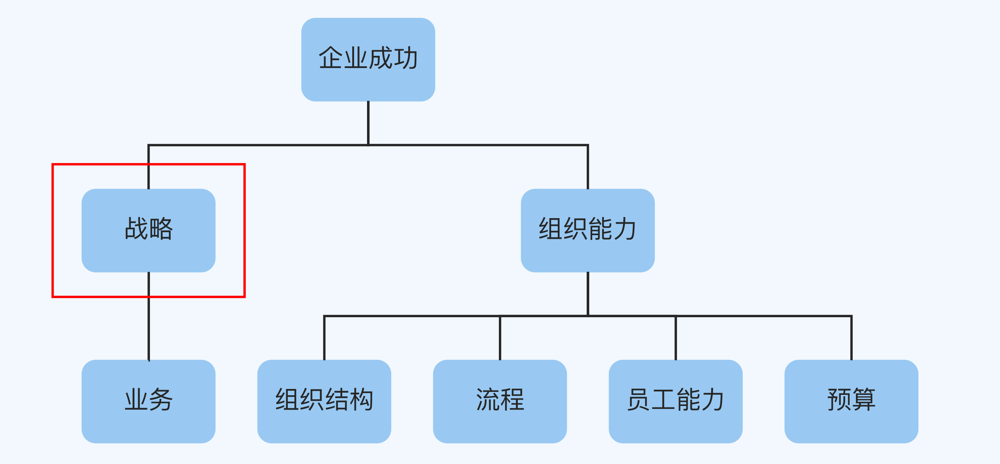

---
date: "2019-06-23"
---  
      
# 14 | 战略升级：5年增长100倍的跨境电商做对了什么？
你好，我是张鹏。

在实战案例的导学中，我分享了诊断企业问题的基本思路：首先看企业的战略和组织能力是否和企业的愿景匹配。所以业内会有这么一句话：战略定生死，组织能力定成败。

战略不光是方向和目标，还有一系列的行动计划，环环相扣。如果一开始的方向错了，或者时机和行动计划不匹配，企业很容易陷入困境。

很少有人一次创业就成功的，连续创业者一个很显著的共性是经得起折腾，还有超强的复盘学习能力。在这一讲，我会分享一个战略升级带来企业重生的案例，主角是一家连续创业的团队，接下来我就从它第一次辉煌的尾声说起。

## 案例背景：破产

Y公司是一家深圳的创业公司，他们的主营产品是投影仪，专注国内市场，主要的销售渠道是国内的电商平台，包括某东和某宝。

得益于深圳当地电子产品供应链的优势，他们的生意做得风生水起，2013年在国内投影仪市场处于前三名的位置。

这时候，有投资人找到创始团队说：“我看好你们的业务，想给你们投资。”

于是Y公司的高层开会讨论，采用了3C战略分析框架来分析：

1.  **Customer（客户）**：投影仪还没有全面地走进家庭，国内投影仪市场的主要客户是各类企业。就算还没有完全变成存量市场，增长也已经非常缓慢，并没有太多想象空间。
2.  **Company（自己公司）**：从核心技术、生产工艺以及性价比等各方面来看，自己都已经做到国内顶级厂商的水平，很难有更大的突破。
3.  **Competitor（竞争对手）**：主要的友商厂家某米和某果，在技术、质量控制、渠道、成本和团队等各个方面都没有绝对的领先优势。

<!-- [[[read_end]]] -->

Y公司的创始团队当时对商业的认知是：**做好产品、服务好客户就能赢得终极的胜利，不要被“融资”这一类虚头巴脑的事情给迷惑了心智。**所以他们的选择是，直接拒绝投资人。

接下来，你可能也猜得到，每一次认知和事实本质不同的时候，现实就会啪啪打脸。就在他们拒绝接受投资的时候，友商某果和某米欣然接受了投资，并且开始对Y公司进行降维打击：

首先，进行大规模采购，极大地降低了采购元器件的单位成本，从而取得了单位成本优势。

然后，在电商平台上大规模降价，把当时投影仪的单价直接从7000元以上拉到3000元以下。

这些动作依然没有引起Y公司高层的警觉。因为他们认为，“亏本占领市场”的策略在2C市场也许玩得转，但是在2B市场接近存量的情况下完全是个笑话，所以这种补贴式打法不可能长久。

如果对手看得见的动作让你笑话，那么看不见的动作可能就会要你的命。

某米和某果在补贴降价的同时，秘密招募了产品研发团队，针对个人和家庭市场陆续开发出1999元～4999元价位的30cm投影距离的新产品，其中某米的产品后来还拿到了德国“红点”设计大奖。

这一批产品的问世让传统的面向2B市场的投影仪厂商都面临灭顶之灾。当友商的卖价比自己的成本价格还要低，自己又没有时间和资源做转型的时候，Y公司就只有死路一条。

Y公司的一位创始人在接受我访谈的时候说：“当我们在电商平台上看到这些产品和价格之后，就彻底绝望了。”

这一次失败直接导致了Y公司的破产，创始人只能变卖所有的房产偿还债务。在送别最后一个员工的时候，一位创始人说：“对不起，是我们决策错误，才导致你丢掉工作。”之后他躲进卫生间，拧开水龙头，痛哭流涕。

但是，Y公司真的死了吗？

## 复盘详解

2015年春季，Y公司的创始团队对过去两年做了一个深度的复盘。

### 对比

Y公司2013年初的目标是守住国内市场的前三名，稳扎稳打，以质量和口碑赢得行业的认可，最终有机会能成为行业龙头，但结果却是：

第一，从**市场份额**上看，不但没有守住行业前三的位置，反而在不到两年的时间里彻底丢掉了原有的市场。

第二，从**产品**上看，一直固守在原有的企业客户市场，根本没有发现个人和家庭市场有这么大的需求，让两家友商用新的产品兵不血刃地在新的市场里做出了更大的蛋糕。

第三，从**速度**上看，对行业的变化反应太慢，直到对手用了一年的时间全面地占领市场份额和用户心智之后，才反应过来。

### 逻辑

战术上的勤奋，不能掩盖战略上的懒惰。

Y公司一直把注意力放在产品的设计、质量和成本控制等因素上，忽视了同行引入资本后的降维打击。我们用**波特五力图**来解析一下Y公司战略上的失误。

首先是**行业内**的竞争，在2013年～2014年，针对企业客户的投影仪市场已经趋向于饱和，大家在这个领域都没有特别大的突破。Y公司的高层这一点上并没有误判，**新的进入者**也没有产生。

但是，**替代者**却是两个原有的老对手。他们融资之后，首先改变了供应商的“（质）量-（成）本-价（格）”体系，简单地说，就是通过增加电子元器件的采购量，使得成本下降，在单位成本上取得绝对的竞争优势。

不过，这样做也会带来问题，因为原有的市场根本吃不下这么大的产量。Y公司也是基于这一点才没有做出任何反应。但是注意，这个假设是基于“市场不变”这个前提做出的。

最后，我们来看客户层面，竞争对手根本没有在原有的企业客户市场上纠缠，而是开辟了新的客户群体，个人和家庭用户。

针对这一需求，他们打破了“只有企业级客户才需要投影仪，因为家里的客厅一般不够大”这样的认知，开发出只需要30cm投影距离的新产品，并且还和互联网视频内容相结合，非常契合个人和家庭用户的需求。

这种开辟新市场的做法和供应商的规模低价结合起来，形成一个完美的增强循环，迅速地干掉了这个行业其他的玩家，形成了垄断。

### 认知

竞争对手多数时候是最好的老师。

**既然我们以前的基本盘业务是被竞争对手通过开辟新市场和低成本优势打败的，那么我们现在是不是也可以通过寻找另一个新市场来赢得下一场胜利呢？**——这是Y公司的核心团队（以下简称Y团队）做出的第一个假设。

竞争对手融资之后带来的降维打击让Y团队记忆深刻，于是他们又做出第二个假设：**不是缺钱的时候才需要融资，而是当你有了更多的资金，就可能改变行业竞争规则**。这也是Y团队在二次创业过程中特别在意的地方。

虽然Y团队在国内投影仪这一块彻底失败，甚至公司都破产清算了，但是他们并没有丢失再次创业的决心。

“已经到谷底了，也该反弹了吧。”这是另一个联合创始人在回顾那一次复盘的时候说过的话。

通过朋友的推荐以及对各种市场数据的对比分析，Y团队一致认为可以尝试跨境电商。在正式决定之前，他们通过SWOT分析对自身和行业做了一个基本分析：

**S强项**：

* 团队对消费类电子影像产品（不是专业级影像产品）整个研发生产及供应链都非常的熟悉。
* 对线上运营很熟悉。
* 经历过一次失败，核心团队没有散，背靠背的信任更强了。

**W弱点**：

* 对其他产品不熟悉。
* 对线下运营并不熟悉。
* 国内电商平台，做同类产品的机会窗口已经过去。

**O机会**：

* 跨境电商当时刚刚兴起，亚马逊上对中国的供应商有流量红利。
* 和国外的同类产品比较，性价比依然非常地突出。

**T风险：**

* 团队里并没有做过跨境电商的伙伴，属于“摸着石头过河”。
* 公司当时只有一个投影仪品类，单一品类是否能在亚马逊上站住脚，还没看到先例。

最终，大家决定开始试水跨境电商，并开始制定行动计划。

### 规划

根据前面的分析和洞察，Y团队判断出在亚马逊上做消费类影像产品是值得尝试的，他们最终采取了SO策略（优势+机会），实行增长型战略。

根据大家商议的结果，初步制定的计划如下：

O：在亚马逊平台上验证销售自产消费级影像产品的MVP。

KR1: 实现2000万的销售额。

KR2: 构建完整的跨境电商运营团队。

KR3: 主要的3款产品在亚马逊的细分品类里排名第一。

## 最终结果：新生

团队对产品系列的供应链以及价值链非常熟悉，核心团队也都是现成的，这一点在业内也是有共识的，只是缺乏资金和跨境电商的运营经验。

于是Y团队接受了国内某头部跨境电商大佬的战略投资，并以in-house的模式驻场创业。

第一年，他们踉踉跄跄地实现了自己2000万销售额目标，同时也打造了一套能够复制的运营流程和能够把产品排名Listing做到亚马逊站内第一的方法，并且积累了相关的资源。

在验证了第一年的MVP之后，他们后续的每一年都会对整个运营模型进行迭代优化升级。在接下来的不到5年的时间里，Y公司的业绩超过了20亿，成为了国内跨境电商业内的明星企业。

## 小结

这一讲我为你介绍了Y公司的案例。他们从一开始因为固守原有市场，在竞争对手融资之后的降维打击很久之后都没反应过来，被人干到破产；后来向对手学习，开辟海外新市场，5年内增长了100倍。他们的转折点显然来自痛定思痛的那次战略复盘，其中有几点非常值得借鉴：

1.  不要用固定思维看市场和产品，用波特五力模型可以帮助你更好的分析市场整体环境。
2.  SWOT模型是一个分析自身的好工具。
3.  增长的关键是对市场的深度洞察之后，在自身强项能力和市场的空白点中找到交集。
4.  战略是一个聚焦的过程，用优势与别人合作能够取得事半功倍的效果。

## 思考题

这就是一讲的全部内容了，最后留一道思考题给你。

回忆一下，你所属的公司，在过去的几年中，有没有发生过重大的转型，结合这一讲学习的内容，请你分析一下为什么会有这种变化；再根据目前的市场环境和行业趋势预测一下，接下来你们公司还有可能发生什么样的转变？

欢迎你把答案写在评论区，和我一起讨论。