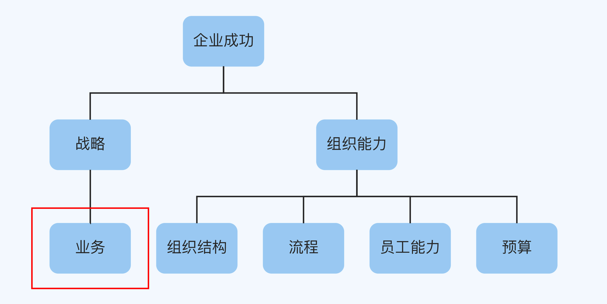
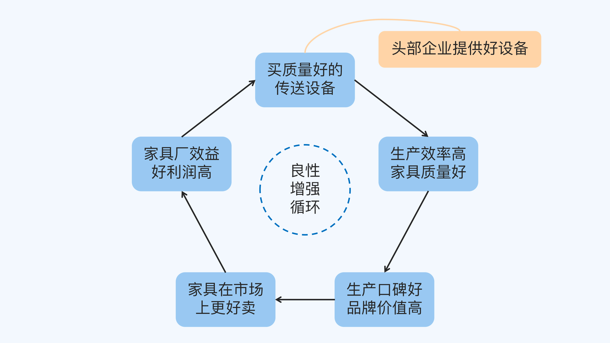
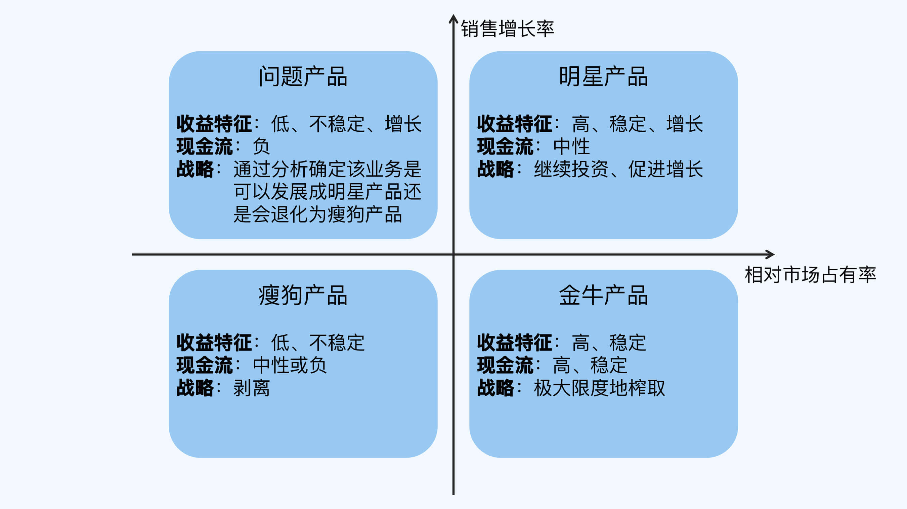

---
date: "2019-06-23"
---  
      
# 15 | 业务关键点：改进一个点业绩增长50%？
你好，我是张鹏！

上一讲我讲述了一家公司通过战略升级获得新生的案例。但是如果从战略上看不出有明显的问题，我们应该从哪里着手找到业务的增量空间呢？

战略改革属于巨大的**创新**，不过在原有的战略模式下进行微创新（或者说优化），可能也会带来意想不到的效果。

这一讲，我要为你分享的就是一个改进业务关键点，从而让业绩增长50\%的案例。

## 案例背景：增长停滞

F公司是一家做木工传送机械的公司，总部和生产基地位于佛山，市场上处在行业前三的位置。他们的终端客户是各大家具企业，包括顾家、欧派和索菲亚等。这些企业为了减少家具在内部运输时的损坏，提升运输效率，会用到包括辊筒、传送带和升降台等设备在内的自动化分拣传送系统，F公司就是生产这些设备的公司。

我在接手这个项目的时候，这家公司正面临着**连续三年几乎0增长**的困局。

在内部调研“为什么会出现这种情况？”的时候，我听到最多的回答是“我们产品的价格太高了，不好卖。”

因为价格太高所以不好卖，这似乎是每个行业最容易找到的答案，但是在一个专业的顾问看来，它很有可能只是一个借口。

## 前期调研

由于F公司并没有现成的数据资料供复盘使用，所以我不得不先花一些时间做前期的调研工作。

既然大家都觉得是因为价格高导致产品不好卖，那么我就从价格开始进行调研。请注意，虽然有可能最终问题（产品不好卖）的原因不一定是这个（价格高），但是任何商业问题只要找到一个合适的切入点，一般都能顺藤摸瓜地把整个价值链搞清楚。

<!-- [[[read_end]]] -->

价格到底高不高，我们自己说了不算，需要和全行业进行对比。所以，我把销售在市场上遇到的竞争对手的同类产品价格都调研了一遍。

我发现这个行业很特别，头部公司和小作坊的业绩单个对比，差不多有10倍的差距，但是中间却没有的腰部公司过渡。于是我把竞争对手按照MECE原则做了一个分类，如下图所示。

前期的调研到这里就差不多完成了。

## 复盘详解

F公司的问题是“因为产品价格高导致不好卖”，因此对比的参照物就不是自身的历史目标了，而是同行横向对比了（自身的结果与同行标杆作为目标对比）。另外，如果只对比价格，可能不能找出全部的问题，因此，我们必须用到更全面的用户决策框架。

### 对比

“好不好卖”是营销问题，我按照适合营销分析的4P理论框架对这个行业做了一个梳理：

1.  **价格（Price）**：在这个细分行业，几家头部企业包括F公司自身，产品的售价都不算低，小作坊主要是靠绝对的低价获取订单；
2.  **产品（Product）**：头部公司虽然价格高，但是质量、维保都有保障，而小作坊则是绝对的低价低质；
3.  **渠道客户（Place）**：头部公司的客户基本对应的都是品牌家具厂商，基本囊括了所有的品牌家具厂商，而小作坊的客户基本是不知名的小家具厂；
4.  **销售策略（Promotion）**：头部公司针对大客户以方案式组合产品销售为主，而小作坊是以直接卖单品的Listing销售方式为主。

另外，我在对业内厂家做生命周期的调研时发现，头部公司的存续期往往已经超过10年，而小作坊的生命周期普遍都不长，大多数熬不过3年。

### 逻辑

理论上，同类低价产品在市场上有绝对的竞争力，为什么这些小公司会很快死掉呢？那些大公司的产品价格都很高，为什么他们反而会存活很长时间呢？

为了搞清楚这个问题，我画了一个因果循环图：

通过因果循环图的对比，我们可以看出：

* **品牌家具厂**用了更好的设备，能够更高效地生产出质量更好的家具，从而在市场上取得更大的回报，所以更愿意采购质量好的家具，从而形成良性循环。
* **不知名家具厂**考虑成本比较多，采购了不太好的设备，可能会导致故障率高、坏损率高和规格不标准等问题，很难有核心竞争力，从而陷入恶性循环。

接着，我让F公司的复盘团队调出过往的CRM与合同档案进行统计，发现因为价格高的丢单数虽然比较多，但是总额并不高，在整个公司的订单总金额占比也不大；而且这些丢单都发生在一些没有经验的新手销售身上，跟单的对象都是一些不知名的家具厂。

分析到这里，所有人几乎都明白了，F公司的竞争对手并不是那些小作坊，高价也不是导致业绩增长停滞的“阿克琉斯之踵”。F公司和其他头部公司相比，市场占有率确实是有下降的，这才是真正需要关注的重点。

所以，F公司真正需要回答的问题是：**他们和其他头部公司有什么不同？**

面对同样的客户群体，这个行业的头部公司是通过定方案、买产品以及之后的一系列交付服务来体验价值的，我们对这个部分做了一个价值链分析：

我们把客户能感知到的部分，与撞单最多的头部公司M和小作坊做了逐项对比，并画出一张雷达图：

可以看出，F公司如果和M公司对比，质量、交付时间和售后方面的几乎没有区别，价格上甚至更有优势，它们**真正的差距在方案上**。

所以我们针对方案做了进一步的调研，发现：

* **F公司**自己的方案都是销售人员在做，连统一的格式都没有，同样的产品方案，报价也千差万别，方案质量差得不是一点半点。
* **M公司**有一套标准的方案生成流程，由专职的方案中心负责。

### 认知

对手总是最好的老师！F公司也开始成立了一个方案中心，专职负责做方案，方案的质量和速度果然有了极大的提升。

不过，光靠速度的提升和方案的标准化，就能把交付流程优化到极致吗？并没有！因为成立方案中心只是提升了**公司内部**的质量和效率，并没有让**整个业务链条**产生根本性的变革。

所以我们继续深挖。这一次，我们期待找出最好卖的（容易成交）、利润最高的业务，于是使用了波士顿矩阵来分析实际订单情况：

我们发现：

* **金牛产品**是 “10万左右的标准化单品”。
* **明星产品**是“单额过100万的智能化分拣装置”。
* **问题产品**是“单额50万的左右的标准化集成方案”。
* **瘦狗产品**是“单额低于50万的定制化集成方案”。

在应用波士顿矩阵的时候，通常最大的变数是**问题产品**。很明显，F公司之前一直忽视了这个点，而他们是有能力把50万的标准化集成方案做到更高层次的。

### 规划

根据以往客户和订单的数据分析，F公司最终把年目标定成增长50\%，主要的策略包括：

1.  主攻品牌家具商，重新梳理客户名单，留下客户名单池。
2.  砍掉了50万以下的定制集成方案。
3.  方案中心帮助销售梳理方案，同时根据市场需求打磨50万单额的标准化方案。
4.  未来保持品牌影响力，每年超过100万的订单只做5个左右，并且只针对行业标杆客户。

## 最终结果：破茧重生

这样一波操作下来，F公司取得了什么样的成效呢？

2020年，在受到新冠疫情影响导致60天无法开工的情况下，他们的营业额依然增长了50\%，利润增长接近100\%，结束了连续三年0增长的困境，又重新回到了指数型增长的状态。

对于未来几年，他们已经有了更大的战略构想。

## 小结

这一讲我为你介绍了F公司的案例。面对连续三年0增长的困境，大部分人的想法是“产品价格高所以不好卖”。我以产品价格作为切入点开展调研和分析，帮助F公司改进业务关键点，实现了大幅增长，具体过程包括：

1.  首先使用逻辑树来对行业玩家进行划分（头部和小作坊），明确真正的竞争对手。
2.  然后使用4P理论分析营销问题，对比找出F公司作为头部公司在产品营销中的优劣势。
3.  接着再用因果循环图对假设进行推导，找出增强循环，确定未来的发展方向。
4.  之后结合调研数据，使用雷达图（关系图）找出下一阶段需要改进的重点。
5.  最后使用波士顿矩阵图找出颗粒度更精细的发力点。

这些工具都是我在实操流程篇中提到的，希望这个案例帮助你理解，让你在优化业务的关键点时找到思路。

## 思考题

这就是这一讲的全部内容了，最后留一道思考题给你：

你能否用这一讲的方法和工具（4P理论、雷达图、波士顿矩阵等），就一个具体的案例分析自己公司的产品与竞争对手的差异？

欢迎你把答案写在留言区，和我一起讨论。